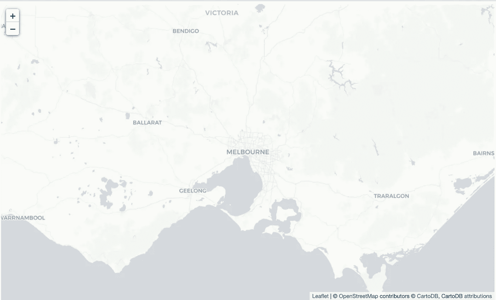

# 使用 leav 表示您的地理空间数据

> 原文：<https://towardsdatascience.com/represent-your-geospatial-data-using-folium-c2a0d8c35c5c?source=collection_archive---------24----------------------->

## 使用 python 可视化地图的过程


照片由[瓦伦丁·安托努奇](https://www.pexels.com/@valentinantonucci?utm_content=attributionCopyText&utm_medium=referral&utm_source=pexels)从[派克斯](https://www.pexels.com/photo/person-holding-compass-691637/?utm_content=attributionCopyText&utm_medium=referral&utm_source=pexels)拍摄

作为数据科学社区的一部分，地理空间数据是最重要的数据类型之一。这些应用程序非常简单，比如“我的外卖订单现在在哪里？”和“送货员的最佳路径是什么？”一样复杂

## 是什么把我带到了叶城？

我最近在研究一个涉及大量 gps 坐标的数据科学问题。显然，这是一个非常基本的问题——我如何在我的 jupyter 笔记本上的地图上表示这些坐标？虽然我们知道 [plotly](https://plotly.com/python/choropleth-maps/) 、 [geopy](https://geopy.readthedocs.io/en/stable/) 和[底图](https://basemaptutorial.readthedocs.io/en/latest/)完成了工作，但这是我第一次遇到[leaf](https://python-visualization.github.io/folium/)并决定试一试！

本文是一个关于使用 folium 表示数据的分步教程。

## 介绍

Folium 主要用于为浏览器生成交互式地图(在笔记本内或网站上)。它使用了 [leaflet.js](https://leafletjs.com/) ，这是一个用于交互式地图的 javascript 库。

> 用一行程序实现它:**用 Python 处理数据，然后通过 leav 在活页地图上可视化。**

***第一步:*** *在电脑上安装叶子，导入必要的包。*

```
!pip install foliumimport numpy as np
import pandas as pd
import matplotlib.pyplot as plt
from sklearn import preprocessing
import scipy## for geospatial
import folium
import geopy
```

我们将使用[来自太空的火:澳大利亚](https://www.kaggle.com/carlosparadis/fires-from-space-australia-and-new-zeland)数据集。

***第二步:*** *加载并检查数据集。*

```
df = pd.read_csv("fire_archive_M6_96619.csv")
```


***第三步:*** *找到坐标开始。*

我们可以从数据集本身选取一组坐标，也可以使用 geopy 来实现这一目的。在这里，我们正在谈论澳大利亚的野火，所以我从墨尔本开始参考。

```
city = "Melbourne"
# get location
locator = geopy.geocoders.Nominatim(user_agent="My app") 
city = locator.geocode(city)
location = [city.latitude, city.longitude]
print(city, "\n[lat, long]:", location)
```


***第四步:*** *在地图上绘图。*

在地图上绘制点就像盖房子一样。你奠定了基础(这是你的背景地图)，然后你在它的表面上添加点。

我们将首先奠定基础。

```
map_ = folium.Map(location=location, tiles="cartodbpositron",
                  zoom_start=8)
map_
```



你也可以通过参考[这里的](https://python-visualization.github.io/folium/modules.html)来玩 tileset 和 zoom。

现在我们在地图上标出这些点。我们将根据属性“类型”进行颜色编码，并根据火的“亮度”确定大小。所以让我们先把这些属性按顺序排好。

```
# create color column to correspond to type
colors = ["red","yellow","orange", "green"]
indices = sorted(list(df["type"].unique()))
df["color"] = df["type"].apply(lambda x: 
               colors[indices.index(x)])
## scaling the size
scaler = preprocessing.MinMaxScaler(feature_range=(3,15))
df["size"] = scaler.fit_transform(
               df['brightness'].values.reshape(-1,1)).reshape(-1)
```

我们最后用叶子在地图上添加点。

```
df.apply(lambda row: folium.CircleMarker(
           location=[row['latitude'],row['longitude']], 
           popup=row['type'],
           color=row["color"], fill=True,
           radius=row["size"]).add_to(map_), axis=1)
```


最后，我们向地图添加图例。我使用[这个](https://www.thetopsites.net/article/52981290.shtml)参考来添加一个图例。还有许多其他方法，但这是我发现的最简单的方法。

```
legend_html = """<div style="position:fixed; 
                    top:10px; right:10px; 
                    border:2px solid black; z-index:9999; 
                    font-size:14px;">&nbsp;<b>"""+color+""":</b><br>"""
for i in lst_elements:
     legend_html = legend_html+"""&nbsp;<i class="fa fa-circle 
     fa-1x" style="color:"""+lst_colors[lst_elements.index(i)]+"""">
     </i>&nbsp;"""+str(i)+"""<br>"""
legend_html = legend_html+"""</div>"""
map_.get_root().html.add_child(folium.Element(legend_html))#plot
map_
```


这是整段代码:

```
import numpy as np
import pandas as pd
import matplotlib.pyplot as plt
from sklearn import preprocessing
import scipy
## for geospatial
import folium
import geopydf = pd.read_csv("fire_archive_M6_96619.csv")city = "Melbourne"
# get location
locator = geopy.geocoders.Nominatim(user_agent="My app") 
city = locator.geocode(city)
location = [city.latitude, city.longitude]
print(city, "\n[lat, long]:", location)map_ = folium.Map(location=location, tiles="cartodbpositron",
                  zoom_start=8)# create color column to correspond to type
colors = ["red","yellow","orange", "green"]
indices = sorted(list(df["type"].unique()))
df["color"] = df["type"].apply(lambda x: 
               colors[indices.index(x)])
## scaling the size
scaler = preprocessing.MinMaxScaler(feature_range=(3,15))
df["size"] = scaler.fit_transform(
               df['brightness'].values.reshape(-1,1)).reshape(-1)df.apply(lambda row: folium.CircleMarker(
           location=[row['latitude'],row['longitude']], 
           popup=row['type'],
           color=row["color"], fill=True,
           radius=row["size"]).add_to(map_), axis=1)legend_html = """<div style="position:fixed; 
                    top:10px; right:10px; 
                    border:2px solid black; z-index:9999; 
                    font-size:14px;">&nbsp;<b>"""+color+""":</b>        <br>"""
for i in lst_elements:
     legend_html = legend_html+"""&nbsp;<i class="fa fa-circle 
     fa-1x" style="color:"""+lst_colors[lst_elements.index(i)]+"""">
     </i>&nbsp;"""+str(i)+"""<br>"""
legend_html = legend_html+"""</div>"""
map_.get_root().html.add_child(folium.Element(legend_html))
#plot
map_
```

也可以在我的 [Github](https://github.com/slavvy-coelho/Folium-wildifires) 上找到。希望这篇文章有所帮助。