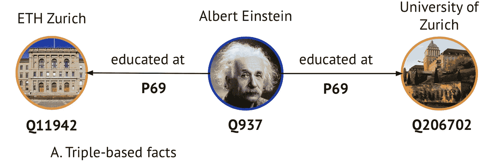

# RDF*和 LPG 知识图上的表示学习

> 原文：<https://towardsdatascience.com/representation-learning-on-rdf-and-lpg-knowledge-graphs-6a92f2660241?source=collection_archive---------10----------------------->

## 超越三元组的 GNNs

## 超关系公斤比三公斤编码更多的知识。我们采用了图 ML 的最新进展，并提出了一个 GNN 编码器和一个新的基准。


图片作者。

K 知识图(KGs)是现代自然语言处理和人工智能应用的基石——最近的工作包括[问答](https://arxiv.org/pdf/1907.09361)、[实体&关系链接](https://arxiv.org/pdf/2009.00106)、[语言建模](https://arxiv.org/abs/1911.06136)、[信息提取](https://github.com/diffbot/knowledge-net)，甚至[用强化学习播放文本 RPG](https://openreview.net/pdf?id=B1x6w0EtwH)。此外，知识管理已经在行业中被广泛采用，例如最近的知识图表会议(KGC)中的[系列作品](https://conference.knowledgegraph.tech/)

# 三胞胎大战世界

传统上，kg 被编码为 *<主语、谓语、宾语>* (RDF)三元组，许多公开可用的 kg，如 [DBpedia](https://wiki.dbpedia.org/) 和 [YAGO](https://www.mpi-inf.mpg.de/departments/databases-and-information-systems/research/yago-naga/yago) 最初遵循这种由表达逻辑形式支持的范式(还记得 DL 引用描述逻辑的时代吗？👵)和 RDF、OWL 之类的标准。



三重事实。爱因斯坦同时在两所大学上学吗？图片作者。

使用三元组，上面描述阿尔伯特·爱因斯坦上过哪些大学的例子可以编码为两个三元组:

```
*Albert Einstein, educated at, ETH Zurich
Albert Einstein, educated at, University of Zurich*
```

嗯，对于简单的应用程序来说，这看起来还不错,但事实证明我们的世界有点复杂，要把所有东西都放进三元组里。例如，两个三是不是意味着阿尔伯特·爱因斯坦同时在两个地方接受教育？或者他们授予他同样的学位？

事实上，爱因斯坦在苏黎世联邦理工学院获得了数学专业的学士学位，而在苏黎世大学获得了物理学专业的博士学位。

> 我们能有一种机制来更详细地表达事实吗？

**是的！**在 KG 世界中，至少有两种方法可以做到这一点——[RDF *图](https://arxiv.org/pdf/1406.3399.pdf)和[标签属性图(LPG)](https://en.wikipedia.org/wiki/Graph_database#Labeled-property_graph) 。它们都允许通过将辅助键-值(关系-实体)对附加到 KG 中的边来进一步实例化每个事实。并且这两者都已经得到了图形数据库市场上主要供应商的支持👍。

在 LPG 世界中，节点和边自然都可以有键值属性。 [Neo4j](https://neo4j.com/) 大概是 LPG 家族里最大牌的了。您可以使用(打开)密码查询 lpg。最近的[新冠肺炎 KG](https://covidgraph.org/) 可作为 Neo4j 转储。

RDF*最初由 Olaf Hartig 提出([他的博客](https://blog.liu.se/olafhartig/)是了解 RDF*和相关技术的一个很好的起点)，旨在缓解声名狼藉的 RDF 具体化机制的许多问题(查看 Frey 等人的[调查以全面了解具体化)，同时保留与 RDF 图相关的推理能力。在坚实的理论基础的支持下，RDF*提供了一些用更多细节来丰富三元组的方法。您可以使用 SPARQL *(SPARQL 的扩展，用于处理 RDF*)查询 RDF*图。](http://www.semantic-web-journal.net/system/files/swj1791.pdf) [Apache Jena](https://jena.apache.org/documentation/rdfstar/) 、 [RDF4J](https://rdf4j.org/documentation/programming/rdfstar/) 、 [N3.js](https://github.com/rdfjs/N3.js/) 、 [Blazegraph](https://wiki.blazegraph.com/wiki/index.php/Reification_Done_Right) 、 [AnzoGraph](https://docs.cambridgesemantics.com/anzograph/userdoc/lpgs.htm) 、 [Stardog](https://www.stardog.com/blog/property-graphs-meet-stardog/) 、 [GraphDB](http://graphdb.ontotext.com/documentation/9.2/free/devhub/rdf-sparql-star.html#id1) 支持 RDF*和 SPARQL*

我们在 RDF*语法中的例子可以是这样的:

```
*<< Albert_Einstein educated_at ETH_Zurich >> 
      academic_degree Bachelor ;
      academic_major Maths .
<< Albert_Einstein educated_at University_of_Zurich >>
      academic_degree Doctorate ;
      academic_major Physics.*
```

# 超关系图还是超图？

对于这些 kg，什么是合适的术语？直到 Rosso 等人在他们最近的 WWW'20 工作中建议使用“超关系图”之前，一直有一个小的词汇缺口。尽管如此，术语“超图”还是有一个常见的误用。我们也想提倡“超关系”图。🤝

主要区别在于对事实的表述。超图假设有一个(命名的)超边统一几个实体:

```
*education(Albert Einstein, ETH Zurich, Bachelor, Mathematics)
education(Albert Einstein, University of Zurich, Doctorate, Physics)*
```


每个超边由 4 个节点组成。注意，我们丢失了与学术专业和学术学位相关的谓词。图片作者。

看起来像 n 元关系，对吗？🤨我们这里有几个问题:

1.  我们丢失了分别与学士/博士和数学/物理相关的类型关系`academic_degree`和`academic_major`。相反，超边缘的类型是一种抽象(或者是一种相当奇怪的语义混合🤯)的`educated_at`、`academic_degree`和`academic_major`。如果一个事实还包含一个辅助谓词`academic_supervisor`呢？我们需要定义一个新的超边，比如说， *education1()* ，混合 4 那些随着谓词和限定词的数量呈指数级增长的关系。📈

2.此外，我们还失去了学位和专业的辅助特征，即它们旨在描述它们的*主*三元组。例如，学士和数学是辅助工作*阿尔伯特·爱因斯坦*和*苏黎世联邦理工学院*，因此，应该以这种方式对待。超边中的实体元组假定其元素同等重要。

也就是说，在接下来的部分中，我们将坚持使用**超关系**方法。

# 野外的超关系知识图

在 2020 年，大多数开放域知识群广泛使用超关系事实。 [Wikidata](https://www.wikidata.org/wiki/Wikidata:Main_Page) 及其 [Wikidata 语句模型](https://www.mediawiki.org/wiki/Wikibase/DataModel)是超关系 KG 的一个很好的例子。Wikidata 中的每个事实都是一个语句，包含一个主三元组和一组辅助限定符——实体关系对。使用 Wikidata 语句，我们的 Albert Einstein 示例可以像下面这样简单地建模:


超相关事实。图片作者。

在那些语句中，*(学术 _ 学位，学士)**(学术 _ 专业，数学)*是三重 *<阿尔伯特·爱因斯坦，学历 _at，苏黎世联邦理工学院>* 的限定词。

值得注意的是，Wikidata(通常是超关系范式)并不区分只在主三元组或限定符中使用的实体和谓词，即，

> 所有的谓词和实体都可以在三重术语或限定词中使用

(尽管在当前的 Wikidata 版本中，有些实体和关系只能在限定符中看到)。我们将在以下几节中使用该属性。

至于其他 kg，从 2018 年开始，DBpedia 的新版本包含类似于 Wikidata 中的具体化声明。YAGO 4 也采用了事实的 RDF*编码。🙌

Freebase 怎么样？🤔好吧，2020 年你可能不应该练习🧟‍♂️死灵术，因为免费基础不再被支持和更新。然而，Freebase 中的复合值类型(CVT)节点确实类似于三元组的具体化[但看起来更像 n 元关系]

# **图形表示学习**

> 我们在这里的任务是学习超关系图的表示。

对于表示，我们指的是实体(节点)和关系(类型化边)嵌入。然后，嵌入可以用于下游任务，如链接预测、节点分类、实体对齐，以及更多可以用于 NLP、CV 和其他人工智能领域的任务。🍀

图形表示学习(GRL)是发展最快的领域之一🚀在机器学习领域，有一些文章(Michael Bronstein 的一系列[帖子，【20】的评论(](https://towardsdatascience.com/@michael.bronstein) [mine](https://medium.com/@mgalkin/knowledge-graphs-iclr-2020-f555c8ef10e3) ，[Sergey’s](/top-trends-of-graph-machine-learning-in-2020-1194175351a3))和[neur IPS’19](https://medium.com/mlreview/machine-learning-on-graphs-neurips-2019-875eecd41069)的论文)、书籍(作者[、](https://www.cs.mcgill.ca/~wlh/grl_book/)、马[和唐](http://cse.msu.edu/~mayao4/dlg_book/))、课程( [CS224W](http://cs224w.stanford.edu/) ，[COMP 766](https://cs.mcgill.ca/~wlh/comp766/index.html)[😉)涵盖基础和高级主题。](https://cs.mcgill.ca/~wlh/comp766/index.html)

在编码器-解码器范例中，**编码器**通常是 GNN(图形神经网络)，而**解码器**是嵌入的函数，其返回与某个下游任务相关的值或向量，例如，实体成为给定的 *<主语、谓语>* 对的对象的概率。

# **三基 kg 有什么？**

挺多的！😍

**编码器**:多关系 GNN 编码器家族，如 R-GCN ( [Schlichtkrull 等人，ESWC 2018](https://arxiv.org/pdf/1703.06103.pdf) )和 CompGCN ( [Vashishth 等人，ICLR 2020](https://openreview.net/pdf?id=BylA_C4tPr) )，在消息传递框架内扩展了原有的[图卷积网络(GCN)](https://openreview.net/pdf?id=SJU4ayYgl) 算法。

**解码器**:实际上，传统的 KG 嵌入算法如 TransE、ConvE、RotatE 等都是用于链路预测任务的解码器的很好例子。最初，它们也可以被训练为直接端到端优化的仅解码器模型👉关于链路预测任务。

# **超关系 kg 有什么？**

嗯，没那么多🤔(截至 2020 年秋季)

**编码器**:？？？

**解码器**:铰链 [Rosso 等人](https://exascale.info/assets/pdf/rosso2020www.pdf)提出的基于 CNN 的端到端超关系图上链接预测模型。

嗯，我们无法应对 GNN 编码器部分中如此耀眼的深渊🕳，并在我们最近的 EMNLP'20 论文“超关系知识图的消息传递”中提议⭐️凝视⭐️，该论文与 [*普里扬什·特里维迪*](https://priyansh.page/) 、 [*高拉夫·马赫什瓦里*](https://sda.tech/people/gaurav-maheshwari/) 、 [*里卡多·乌斯贝克*](https://sda.tech/people/dr-ricardo-usbeck/) 和 [*延斯·莱曼*](http://jens-lehmann.org/) 一起撰写

> StarE 是一个多关系 GNN 编码器，它为超关系 kg 扩展了 CompGCN。

这个名字的灵感来自 RDF*😊StarE 的设计考虑了以下特点:


StarE 中聚合限定符的一个例子。图片作者。

*   关系的显式建模，包括限定关系；
*   限定词中的辅助实体和关系与主三元组中的实体和关系的分离；
*   然而，任何实体和任何关系仍然可以用在主三元组以及限定词中；
*   限定词顺序的排列不变性—它们不显示任何特定的顺序，可以自由地重新排列。也就是说，对于主三联 *< <阿尔伯特·爱因斯坦来说，受教育于，苏黎世联邦理工学院> >* 无论*(学术学位，学士)*是在*(学术专业，物理)*之前还是之后。

# **给爱好者一点数学知识👩‍🔬**

让我们追踪关系感知 GNN 编码器在其邻域聚合方案中的演变:


消息传递算法。图片作者。

在 StarE 中，出现在节点`u`和`v`之间的主三元关系`h_r`通过函数`gamma()`用限定符`h_q`的聚合向量来扩充，该函数可以是加权和、乘法、串联或任何其他二元函数(我们使用加权和)。

我们通过以下方式获得向量`h_q`:


也就是说，我们首先通过复合函数`phi_q()`将限定符关系和实体嵌入`h_{qr}`和`h_{qv}`分别汇集到单个向量中，复合函数`phi_q()`可以是来自 KG 嵌入族的评分函数，例如 RotatE。然后，我们应用一个排列不变的聚合函数(sum，尽管我们也探讨了乘法)将任意数量的限定符汇集成一个向量，并最终通过一个转换矩阵将其投影`W_q`。

由于所有的实体和关系通常可以在主三元组以及限定词中看到，`W_q`旨在学习实体和关系的限定词特定的表示。

我们仍然保留 CompGCN 组件:`phi_()`是一个类似于`phi_q()`的复合函数，但是现在它合并了一个具有丰富边表示的节点。`W_{\lambda}`是传入、传出和自循环关系的权重参数。

# **超关系 kg 的稀疏编码**

出于效率原因，gnn 在稀疏矩阵上操作。对于基于多关系三元组的 kg，以下示例为三元组

```
*Q937, P69, Q11942
Q937, P69, Q206702*
```

可以用首席运营官格式表示为一个`[2, num_edges]`张量，并为边缘类型增加一行

```
[Q937, Q937]
[Q11942, Q206702]
[P69, P69]
```

带有限定符的超关系事实可以写成如下形式:

```
*Q937, P69, Q206702, P812, Q413, P512, Q849697
s, r, o, qr1, qv1, qr2, qv2, …, qrN, qvN*
```

其中前三个条目总是表示“主”三元组，随后的对是没有特定顺序的限定符(记住 Wikidata 中的顺序不变性)

在首席运营官矩阵的每个“列”可能有任意数量的限定符的情况下，超关系 kg 的稀疏表示是什么？在论文中，我们提出以下编码:


超关系知识的稀疏编码。图片作者。

也就是说，我们有两个首席运营官矩阵:

1.  带有隐式列索引 *k* 的普通“三重”首席运营官
2.  形状`[3, num_qualifiers]`的“限定符”首席运营官，其中第一行包含“三元”首席运营官中各列的索引，第二行包含限定符关系，第三行包含限定符实体。索引行将一列限定符连接到主三元组。也就是说，共享相同索引 k 的“限定符”首席运营官中的列属于“三元”首席运营官矩阵中的相同的第 k 个三元组。这允许我们在内存中为 KG 中的限定符的数量准备 *O* (q ),并且总内存为*o*(| edges |+| qualifiers |)⚖.️

# **我们需要谈谈数据集**

我们简要地谈到了将超关系事实编码为一系列实体和关系。但是，是否已经有可靠的数据集来对这些千克进行实验了呢？传统上，KG 嵌入是在链接预测任务上评估的，而图 ML 任务包括节点分类、图分类、实体匹配等等。

到目前为止，只有两个链接预测数据集:由关等人提出的维基百科(wikipeople)——它是一个描述，嗯，人的维基数据的转储，以及由免费提供的 jf17k(T12)然而，我们发现了主要的缺点😞有了这两个人:

*   维基人有太多带有**文字**(年份)的限定符。将文字视为另一种实体是不可取的，因为数字是连续的值，应该以这种方式处理(嗯，这是 KG 嵌入文献中文字的一个普遍问题🤔).也就是说，在大多数情况下，这样的限定符被简单地丢弃了。这导致数据集只有 2%的事实有限定符，而 80%的事实只有一个限定符对:/
*   JF17K 有测试装置**泄漏**。事实上，作者自己也发现了很多冗余的三联体，不推荐在实验中使用。HINGE 最初更多的是一个 n 元数据集，它通过辅助谓词将其转换成一种超关系格式。我们进行了进一步的研究，发现超过 40%的测试语句共享与训练集中相同的 *(s，r，o)* 主三元组。也就是说，在主体/客体预测任务中，简单的三重试探法可以胜过🏆我们在论文中展示的所有以前的超关系方法。

由于这两个数据集都不太适合评估超关系方法，我们根据以下准则对 Wikidata 中的 WD50K 进行了采样:


图片作者。

*   保留类似 Wikidata 的限定符分布。在普通的 WD50K 中，大约 13%的语句有限定符(接近 Wikidata 中全部语句的 17%)
*   所有限定符都是实体关系对，没有文字
*   实体和关系可以在主三元组和限定词中看到
*   99%的语句最多有 6 个限定符对

为了进一步的实验，我们采样了 3 个额外的数据集:

*   WD50K (33) —大约 33%的语句有限定符
*   WD50K (66) —大约 66%的语句有限定符
*   WD50K (100) —所有语句都有限定符

自然，这些数据集比原来的 WD50K 小，具有更多限定符特有的实体和关系。

# **凝视链接预测**

在这一步，我们最终有了一个 StarE 编码器和合适的链路预测数据集用于实验。我们的主要研究问题是:

> 限定词有助于预测超关系事实的主语和宾语吗？


用于链路预测的 StarE +解码器。图片作者。

也就是说，给定主语、谓语和所有限定词，我们预测宾语，反之亦然。为此，我们将给定的事实线性化为如图所示的序列，并使用具有 avg 池和最终 FC 层的 2 层转换器作为解码器。

转换器还允许我们使用屏蔽的填充标记来输入不同长度的序列👺从自我关注的计算中。

为了进行比较，我们在同一任务中应用了仅解码器铰链和 2 层变压器，以测量 StarE 编码器是否带来任何好处。

事实证明的确如此。🎆


各种 WD50K 数据集上的主/客体预测精度。限定符越多，收益越大！图片作者。

我们观察🕵:

*   与只有解码器的方法相比，StarE 极大地提高了链路预测性能；
*   当数据集中有更多的限定符时，StarE 甚至更有效(性能差距更大)；
*   超关系方法确实有助于更好地预测给定限定符的主体和客体。

你需要多少限定词才能看到质量的提高？两个就够了😉


仅仅 2 个限定符就能带来明显的性能提升。图片作者。

我们的实验程序用特定的数字和交互式图表报告，这里用**权重&偏差**T4📈

所以外卖🔖致 KG 社区:

1.  寻求将描述性限定词分配给图中更多的三重事实——越多越好
2.  如果您指定了限定符，请添加 2 个或更多！

# **结论和资源**

*   超关系图比简单的三元组更接近现实，更详细地描述事实
*   RDF*和 LPG 提供了构建超关系知识库的方法
*   超关系图不同于超图
*   超关系 KGs 已经在使用了——无论是在开放领域 KGs 还是在工业领域
*   RDF*激励的 StarE——一种用于超关系 kg 的 GNN 编码器，可以与用于下游任务的解码器配对
*   与只有解码器的方法相比，StarE 改进了链路预测
*   WD50K 数据集系列更好地捕捉了超关系 kg 上的链接预测的挑战

您可以在以下网址找到更多信息:

**Our EMNLP'20 paper** : [消息传递为超关系知识图](https://arxiv.org/abs/2009.10847) (arxiv 预打印)
**代码** : [Github Repo](https://github.com/migalkin/StarE)
**数据集**:[Zenodo page](https://zenodo.org/record/4036498)
**权重&偏向 Repor** t: [此处](https://wandb.ai/lilbert/wikidata-embeddings/reports/Report-StarE--VmlldzoyNDQzNjk?accessToken=ei25xjzbyvv3d4k87lu3tdi0cruzmjo3qzt446kdl7wagnqdam60sdhrecvqrees)