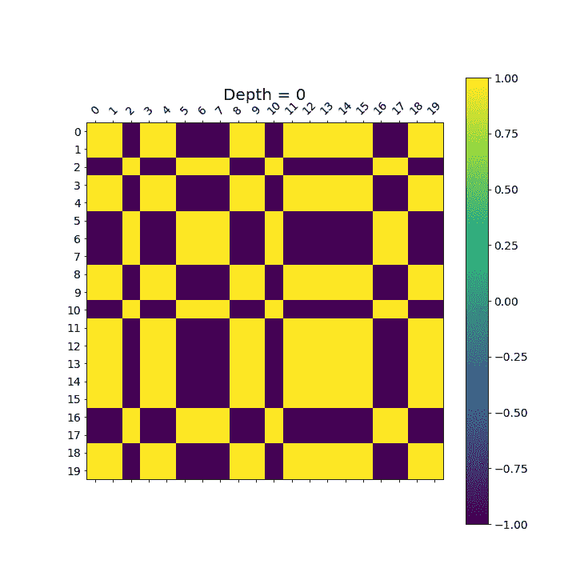
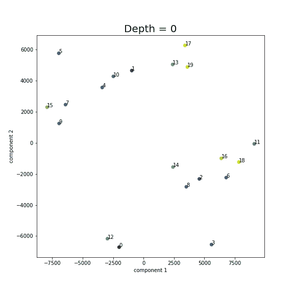
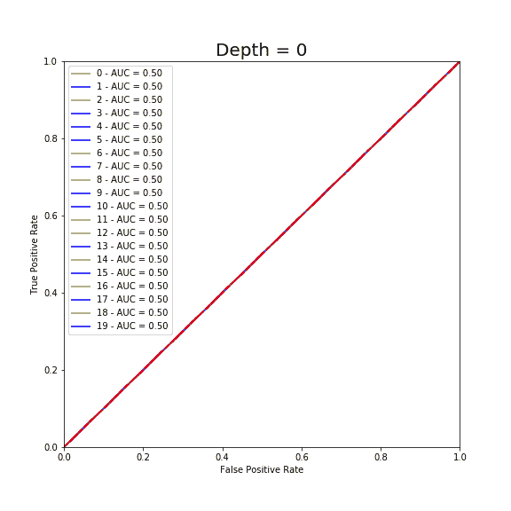

# 提高随机森林分类器的可解释性

> 原文：<https://towardsdatascience.com/representing-a-random-forest-with-few-decision-trees-11283e433dbb?source=collection_archive---------19----------------------->

## 如果随机森林中的底层树形成集群，我们可以从每个集群中提取一棵树来表示随机森林

照片由[帕特里克·福尔](https://unsplash.com/@patrickian4?utm_source=medium&utm_medium=referral)在 [Unsplash](https://unsplash.com?utm_source=medium&utm_medium=referral) 拍摄

对于数据科学家来说，可解释性通常与结果同样重要。面对可解释性与准确性的权衡，我们经常避免部署深度学习模型和复杂的集成。基于决策树的随机森林分类器就是这样一种强大且常用的方法。这个想法是通过平均它们的结果来减少几个噪声决策树的预测中的方差。在可解释性方面，大多数人将其置于常规机器学习模型和深度学习之间。许多人认为这是一个黑箱。

尽管被广泛使用，随机森林通常仅用特征重要性和邻近图来解释。这些可视化非常有用，但还不够。许多研究人员正试图确定使用决策树来表示随机森林的方法。一个有趣的方法是近似一个单一的决策树，如周和胡克[1]和温伯格[2]所解释的。

在这篇文章中，我提出了一个替代的和新颖的解决方案。我证明了随机森林中的底层决策树可以形成集群，这使我们能够从每个集群中提取代表性的决策树，并使用它们进行解释。

## 底层决策树会形成聚类吗？

对于这个分析，我使用了随机森林分类器的 Scikit-learn 实现，对于二进制分类问题，n_estimators = 20，max_depth = 10。该数据有 75，800 个观察值和 372 个特征[3]。

训练模型后，第一步是提取底层决策树，并在所有深度级别(0 到 10)对其进行后期修剪。随机森林的 Scikit-learn 实现允许使用。评估者 _。然而，我们需要为后期修剪编码，利用决策树的二叉树结构。这个过程产生了 11 X 20 = 220 个独立的决策树。

接下来，使用每个决策树预测测试集的输出概率，以获得预测概率的[220 X(测试集大小)]矩阵，并对该矩阵执行相关性分析、t-SNE 和层次聚类，以识别聚类。

1.  **关联**

下图描绘了每棵树在不同深度级别的预测之间的相关性。在低深度，随机森林中的树木往往是相似的，所以我们看到了高度的正相关。随着深度的增加，相关性降低，因为树在不同的特征上开始分裂。重要的是，我们看到的模式表明，在每一个深度水平的集群的潜在形成。

基础决策树预测中的相关性。轴代表树的 ID。

**2。t-SNE**

t-SNE 是一种非线性降维算法，对于可视化高维数据非常有用。下图显示了结果，其中每个数据点代表一个决策树，标签代表该树的 ID。结果还显示了在不同深度水平上的集群形成。

底层决策树预测的 t-SNE 表示。

**3。层次聚类**

最后，让我们来看看凝聚集群。相关分析和 t-SNE 映射可以给我们提供关于最佳聚类数的有用信息。在这个特殊的例子中，我选择了两个集群。对于高维矩阵来说，在二维中可视化分层聚类是不可能的。然而，由于这是一个二进制分类问题，我们可以通过在其接收器操作特性(ROC)曲线上对每棵树进行颜色编码聚类分配来可视化结果。下面的结果也验证了簇的形成。

聚类分配颜色编码的决策树 ROC 曲线

观察这三个图中的树 id，您可以观察到这三种方法的聚类是相当一致的，并且树停留在不同深度级别的相同聚类中。

# 结论

总的来说，我想从上面的分析中展示的关键思想是随机森林中的底层决策树可以展示集群。一旦我们对集群有了信心，最后一步是从每个集群中挑选一棵有代表性的未修剪的树，并将其呈现给客户。代表树可以是最靠近聚类中心的树，也可以是聚类中 AUC 最高的树。需要注意的是，修剪只是为了演示集群。最后一步，你只需要未修剪的树。

*[1]周逸尘和贾尔斯·胡克。2016.通过单树近似解释模型。arXiv 预印本 arXiv:1610.09036 (2016)。*

*[2] Weinberg AI，Last M .从用于快速大数据分类的决策树模型集合中选择代表性决策树。j 大数据。2019;6(1):23*

[3][https://www . ka ggle . com/c/Santander-customer-satisfaction/data](https://www.kaggle.com/c/santander-customer-satisfaction/data)