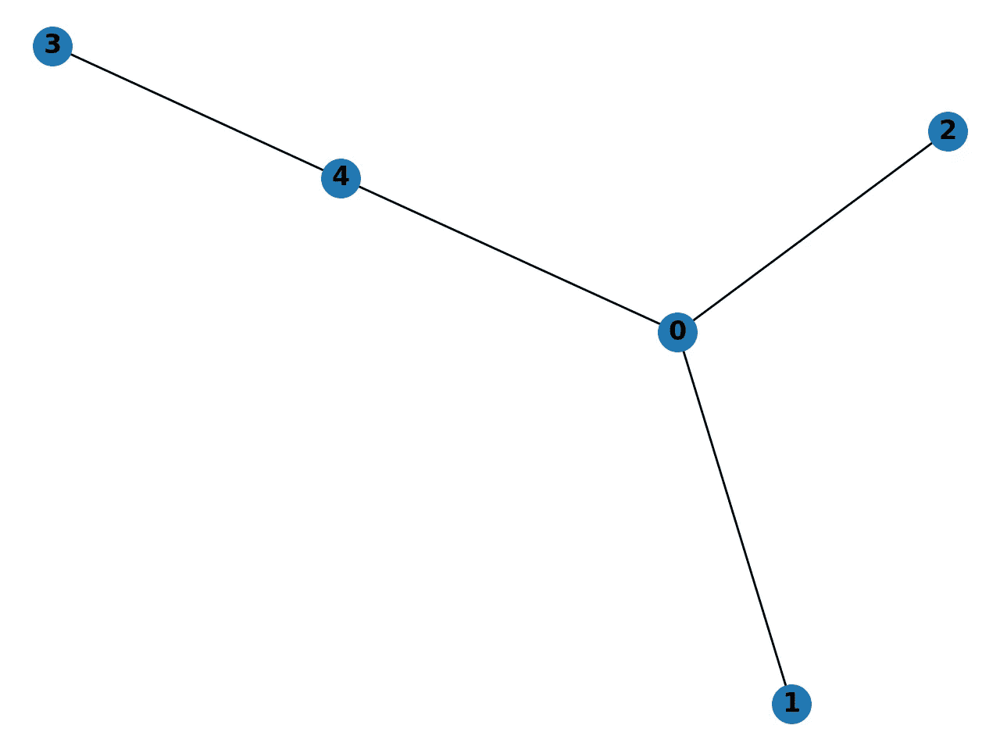

# 表示图形数据结构

> 原文：<https://towardsdatascience.com/representing-graph-data-structures-6e3c19ccd677?source=collection_archive---------18----------------------->

## [图表和数据科学](https://towardsdatascience.com/tagged/graphs-and-data-science)

## 真的都是边缘问题。

当你表示一个图结构 *G* 时，顶点 *V* 非常容易存储，因为它们是一个集合，可以直接这样表示。例如，对于 5 个顶点的图形:

```
V = {0,1,2,3,4}
```

当你开始存储边缘时，事情变得更有趣了。这里有三种常见的结构可用于表示和导航边集:

*   边缘列表
*   邻接矩阵
*   邻接表

我们将看一看一个简单的图形，并遍历它的每个表示。我们将根据其**空间复杂度**和**邻接复杂度来评估每一个。**

# 但是首先一些术语

*   一个**图** *G* ( *V* ， *E* )是由一组顶点( *V* )和一组边( *E* )定义的数据结构。
*   **顶点** ( *v* )或节点是一个不可分割的点，由下图中的字母组件表示
*   一条**边** ( *vu* )将顶点 *v* 和顶点 *u* 连接在一起。
*   顶点 *v* 的**度** *d* ( *v* )，就是连接到它的边数。
*   **空间复杂度**显示为***θ(G)*，表示需要多少内存来保存给定的图形**
*   ****邻接复杂度**用*表示 O(G)* 是找到一个给定顶点的所有邻接顶点所需要的时间 *v* 。**

# **边缘列表**

**给定带有顶点集的图 *G* :**

```
V = {0,1,2,3,4}
```

**现在让我们给 G 一些边，使它成为一个合适的图形:**

****

**图一。g，都长大了**

**G 的**边列表**是边的文字列表，其中每条边是它连接的顶点的列表，在这种情况下:**

```
E = [[0,1],[0,2],[0,4],[3,4]]
```

**赞成的意见**

*   **简单！**
*   **大 s **步距复杂度**of*θ(G)= | E |***

**骗局**

*   ****O(G)= | E |的邻接复杂度**。这里的 *|E|* 是一个很差的值。你必须查看每一个边缘，以便将它们全部排除。从某些方面来说，这是最糟糕的成绩。**

# **邻接矩阵**

**G 的**邻接矩阵**是每个 *v* 都有对应的列和行的方阵。如果两个顶点 v，u 共享一条边，那么在相应的位置有一个 1，否则是一个 0。**

****

**图二。三个不同 4 点图的邻接矩阵**

**对于我们的图来说，G 是:**

```
G = [[0,1,1,0,1],
     [1,0,0,0,0],
     [1,0,0,0,0],
     [0,0,0,0,1],
     [1,0,0,1,0]]
```

**赞成的意见**

*   **高度可解释性。即它是对称的，除非它是一个有向图，你可以在每个矩阵条目中整齐地存储边值。**
*   **体面的**邻接复杂度**的 *O(G) = |V|。*为了找到与 *v、*相邻的所有顶点，我们需要用邻接矩阵扫描它们的整行。**

**骗局**

*   **可怕的 s **步调复杂度*的***θ(G)= | V |。这里我们存储了长度为 2 的每个可能的顶点排列，包括每个与其自身配对的顶点。这是可能组合的最大顶点集的两倍多，( *|V| choose 2)***

# **邻接表**

**G 的**邻接表**是另一个链表。这一次，我们将为 g 中的每个 v 创建一个空列表，而不是列出每个单独的边。**

```
E = [[],[],[],[],[]]
```

**这里，每个列表元素的索引代表其对应的顶点。现在我们需要遍历并添加每个顶点的相邻邻居列表。**

****

**图三。又回来了！**

```
E = [[1,2,4],[0],[0],[4],[0,3]]
```

**虽然这是一个最简单的列表，但我也发现把它想象成一个字典很有帮助，其中每个顶点都是一个键。**

```
E = {0:[1,2,4], 
     1:[0], 
     2:[0], 
     3:[4], 
     4:[0,3]}
```

**优点:**

*   **就像一本字典！**
*   **S **步距复杂度**of*θ(G)= | V |+*2*| E |*我们有一个每个顶点的列表，这些列表总共将存储 2 个 *|E|* 元素，因为每个边将出现在两个顶点列表中。**
*   **极大的**邻接复杂度。**对于给定的顶点 *v* ， *O(G)* 等于*d*(*v*)v*的度数。当寻找所有相邻的邻居时，这实际上是这里的最佳可能值。***

# **最佳表示**

**选择最佳数据结构来表示给定的图 G 实际上取决于 G 中的边密度。这可以大致概括如下。**

*   **如果 *|E|≈|V|* ie 的边数与顶点数一样多，那么 G 被认为是稀疏的**并且邻接表是优选的。****
*   **如果 *|E|≈* ( *|V|选择 2)* ie 接近 G 中的最大边数，则认为**密集**，邻接矩阵优先。**

**边列表很少被使用，因为它们的邻接复杂度很低。**

## **来源**

*   **[时间和空间复杂度](https://www.hackerearth.com/practice/basic-programming/complexity-analysis/time-and-space-complexity/tutorial/)**
*   **[空间复杂度](https://courses.cs.northwestern.edu/311/html/space-complexity.html)**
*   **[表示图形](https://www.khanacademy.org/computing/computer-science/algorithms/graph-representation/a/representing-graphs)**
*   **[图形表示](https://www.hackerearth.com/practice/algorithms/graphs/graph-representation/tutorial/)**
*   **[邻接矩阵维基](https://en.wikipedia.org/wiki/Adjacency_matrix)**
*   **[邻接表维基](https://en.wikipedia.org/wiki/Adjacency_list)**
*   **[Wolfram 邻接矩阵](http://mathworld.wolfram.com/AdjacencyMatrix.html)**