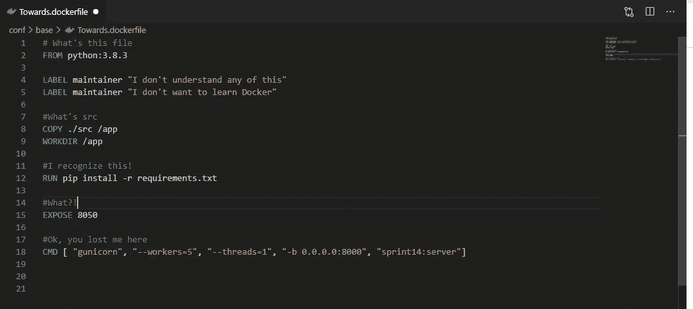
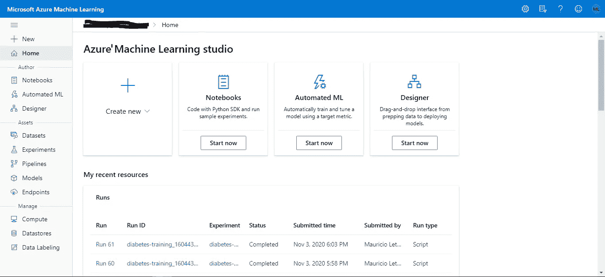
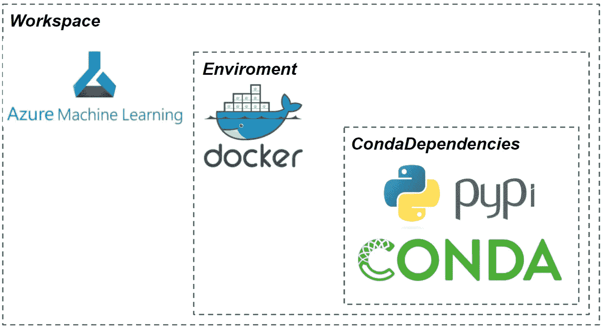
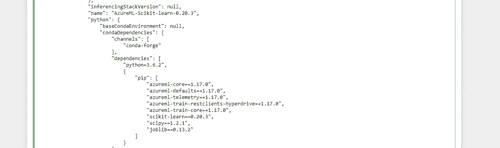
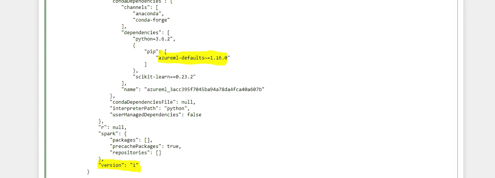

# Azure 机器学习的可复制环境

> 原文：<https://towardsdatascience.com/reproducible-environments-by-azure-machine-learning-34a74772c38b?source=collection_archive---------31----------------------->

## 甚至不知道如何创建 docker 文件

图片作者。

# 码头工人

几年前，Docker 开始流行起来。每个人都声称这个工具为他们节省了大量的时间。要解决构建、部署和管理应用程序的混乱过程，您唯一需要的就是 Docker。就像天堂一样。

但是…这样美好的事情可能是真的吗？事实证明一切都是真的。天堂的一小部分可能错误地落到了地球上？。可能是，也可能不是，但正因为如此，如今如果你被迫为可复制环境选择明星球员，你的答案肯定会以“D”开头，以“ocker”结尾。

# 机器学习的再现性

此外，你可能已经知道，在任何专业的机器学习项目中，可重复性都是必须的。问题是实现这一点并不总是一件容易的事情。

> 数据科学家喜欢在他们的本地机器上工作，学习 Docker 可能会分散他们的主要任务:pip 安装所有东西。

如果你是其中之一，我在这里不只是批评你。我带来了一个解决方案。开发 Azure 机器学习的人知道，制造可复制的 Python 环境是捕捉数据科学家的金矿。他们提供了一种解决方案来处理 Jupyter 笔记本电脑中的环境。

# Azure 机器学习

所以，万一你对 Azure 机器学习一无所知，我简单给你解释一下。Azure ML 是一个旨在将与机器学习生命周期相关的每个步骤集中在一个地方的地方:安全的工作空间、存储、模型管理、计算、模型再现性等等。

从我的 Azure ML 工作区捕获。图片作者。

在左侧栏中，您可以看到提供的各种选项。但这并不是对 Azure ML 的概述，所以我将直奔主题:可管理的环境。

在高层次上，启动 Azure 机器学习工作空间后，可以创建一个*环境*对象。您可以使用不同的选项来配置您的环境。尽管如此，大多数 commons 启用 Docker，分配 Conda 依赖项，以及您喜欢的 PyPi 包。

正如您在下图中所看到的，您可以在您的工作空间中创建一个托管 Docker 环境，以满足您的包需求。

图片作者。

作为 Azure 机器学习提供的标准服务，可以注册。这使我们有可能在没有一堆没人能理解的文件的情况下对我们的环境进行版本化。

有三种类型的环境可用:

1.  **策划环境**:这些是预安装包的[列表](https://docs.microsoft.com/en-us/azure/machine-learning/resource-curated-environments)。它们由缓存的 Docker 映像提供支持，减少了运行准备工作，实现了更快的部署。
2.  **系统管理的环境:**是 Azure 采用的默认环境。在这里你可以让 Conda 来处理你的依赖关系。如果您想要个性化的产品包，并且希望避免自己管理环境，这是最佳选择。
3.  **用户管理的环境**:在这里，您负责安装代码运行所需的软件包。这里唯一的 Azure 要求是你必须在你的 pip 依赖项之间列出 *azureml-defaults* 包。

但是足够的概念，一点动手不会伤害你。

# 使用 Azure ML

我们将会看到前两种环境类型的例子，因为它们对于没有太多知识的你来说更容易工作。

为了今天的工作，你可以在你的 Azure ML 工作空间中的“计算”选项中创建一个实例，或者只是设置你的本地[环境](https://docs.microsoft.com/en-us/azure/machine-learning/how-to-configure-environment)。万一你选择了第一种，而你不知道怎么做，我最近在下面的链接里做了一个教程:

 [## Azure 机器学习服务中的数据版本控制

### 读完这篇文章后，你会明白 Azure ML 是如何处理数据的，MLOps 是如何关联的，并学习如何通过…

towardsdatascience.com](/data-versioning-in-azure-machine-learning-service-acca44a3b3a1) 

# **策划环境**

让我们先尝试一个策划的环境。您可以使用以下代码检查 Azure 给出的选项。

> **注意**:如果你在本地使用它，确保有 JSON 配置文件。

运行代码后，您将看到许多环境可能性，每一个都有自己的包和依赖项。因此，您可以选择满足您要求的任何一个。

假设你喜欢这个环境*azure ml-Scikit-learn-0 . 20 . 3。*这里显示了代码和部分输出，只是为了让你检查包。

图片作者。

如你所见，环境已经为你准备好了，只要叫它的名字就行了！你甚至可以在不了解 pip 和 Conda 的情况下使用它。

# **系统管理的环境**

假设您没有在任何最后的列表中找到您的特殊包。或者您的软件包在那里，但是您需要使用的组合不可用。

对于系统管理的环境来说，这是一个完美的场景。您可以在这里指定您想要的 Conda 和 pip 依赖项。

首先，您应该为您的环境指定一个名称。然后，可以将 python 用户管理的依赖项设置为 False，最后，让 Docker 创建可重用的可缓存映像。

假设我们的项目需要 scikit-learn 0.23.2 版本。那么，我在哪里指定我的需求呢？嗯，上一个要点中引入的 CondaDepdencies 不仅仅是为了好玩。在那里你可以定义你的软件包的确切版本，并决定是 Conda 还是 pip 安装它们。

另一个功能是您可以存储环境变量。如果你正确使用它们，它会帮你解决一些头疼的问题。

设置好环境后，您可以将它注册到您的工作区，我们已经在最后一行代码中完成了。注册环境将使我们有机会检索我们想要的任何版本。现在想象一下，你忘了列出博鲁塔包裹。嗯，那没问题。您可以更新您的 pip_packages 列表并再次注册环境。

厉害！但是假设您的代码上周投入生产，没有 Boruta 包，您需要知道环境是如何配置的。又来了！很简单。正如您将在输出标题中看到的，您的第一个版本与您注册的版本完全相同。

图片作者。

难以置信！现在你的团队中的每个人都可以在不知道任何命令的情况下享受 Docker 获得的好处！

正如您所看到的，我们实际上并没有使用我们刚刚创建的环境。为什么？因为要理解如何训练我们的模型，我需要先解释一下什么是估计量。这已经足够复杂，可以再写一篇文章来解释估值器了。

# 后续步骤

如果你现在想训练你的模型，不要担心，下一篇文章很快就要来了，在那里你会明白估计器是如何工作的。

我真的希望你喜欢或发现这篇文章有用！如果你喜欢这个内容让我知道！我们可以更详细地回顾 Azure 机器学习服务的其他组件。

> 关于作者:我对数据科学、云基础设施、商业问题和写作充满热情。我最近获得了 DP-100 Azure 数据科学家助理认证，我喜欢一拿到就分享所有的知识。

如果你喜欢，请在[媒体](https://medium.com/@maletelier)和 [Linkedin](http://www.linkedin.com/in/maletelier) 上关注我。如果你想给我写信，我最近在推特上。我很乐意与你交谈！

如果你想多读一点，看看我最近的一些帖子:

 [## 想成为 Azure 数据科学家助理(DP-100)吗？让我们

### 读完本文后，您将对云认证和 DP-100 有更深刻的理解

towardsdatascience.com](/thinking-about-becoming-an-azure-data-scientist-associate-dp-100-lets-32f8766df21e)  [## 具有两个以上特征的聚类？尝试用这个来解释你的发现

### 使用 Plotly 的 line_polar 将向我们展示一种令人兴奋的聚类解释方法。此外，我们将看到…

towardsdatascience.com](/clustering-with-more-than-two-features-try-this-to-explain-your-findings-b053007d680a)