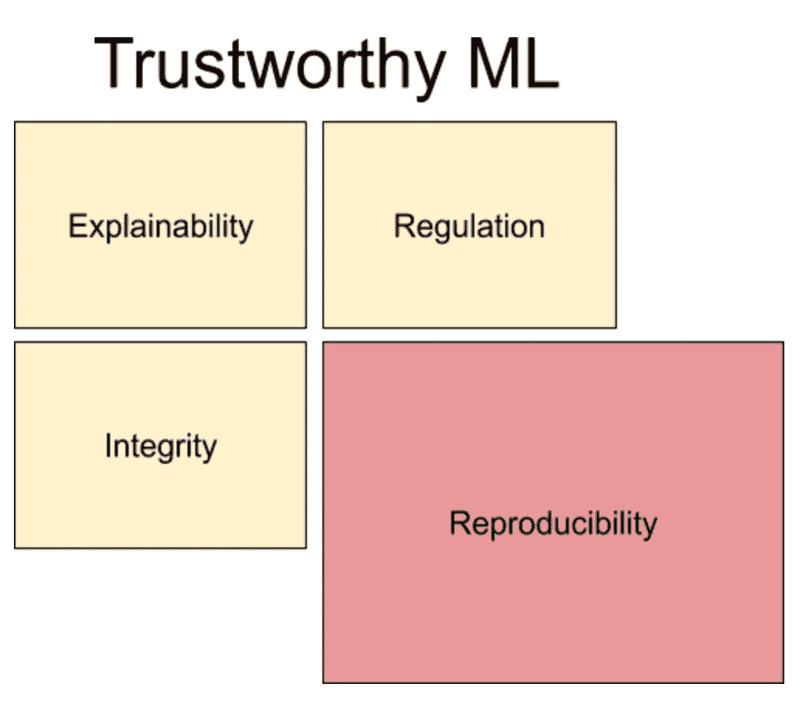

# 可再生机器学习

> 原文：<https://towardsdatascience.com/reproducible-machine-learning-cf1841606805?source=collection_archive---------19----------------------->

## 向开放和可访问的 ML 研究迈进了一步

图片来源: [geralt](https://pixabay.com/users/geralt-9301/) via [Pixabay](https://pixabay.com)

[NeurIPS](https://nips.cc) (神经信息处理系统)2019 年会议标志着他们年度再现性挑战的第三年，也是他们的计划委员会首次有再现性主席。

*那么，* [*机器学习*](https://www.mathworks.com/discovery/machine-learning.html) *中的再现性是什么？*

**再现性**是被重新创造或复制的能力。在机器学习中，再现性是指能够重新创建一个机器学习工作流，以达到与原始工作相同的结论。

*为什么这很重要？*

一个来自新研究的算法，如果没有可重复性，可能很难研究和实现。随着我们越来越依赖 ML 和 AI 系统进行决策，集成一个没有完全理解的模型可能会产生意想不到的后果。

成本和预算限制是受再现性影响的另一个方面。如果没有硬件、计算能力、训练数据和超参数调整等更细微的方面的细节，采用新算法可能会遇到巨大的成本和大量的研究工作，只会导致不确定的结果。

再现性，建立值得信赖的 ML 的一个因素(作者照片)

如何识别一个 ML 模型/研究是否符合重现性标准？

这篇文章探讨了研究论文中提出的两种建立再现性的方法:

## [**构建可复制的机器学习流水线**](https://arxiv.org/pdf/1810.04570.pdf) 提出了评估可复制的机器学习流水线的清单。

作者认为信息缺失是所有再现性问题的根本原因。丢失的信息可能是有意的(商业秘密)或无意的(未披露的假设)。他们专注于纠正阻碍再现性的非故意问题的方法。

影响再现性的因素和建议的解决方案总结如下:

[**训练数据**](https://hackernoon.com/what-is-training-data-really-adf0b97a116c) **:** 一个模型对不同的训练集产生不同的结果。解决这个问题的一个方法是采用一个记录训练数据变化的版本化系统。然而，对于大型数据集来说，这可能不切实际。使用记录了时间戳的数据是一种变通方法。另一种选择是定期保存数据散列，并记录计算方法。

[**特征**](https://www.datarobot.com/wiki/feature/) **:** 特征可以根据它们被选择和生成的方式产生不同的结果。应该对生成特征的步骤进行跟踪和版本控制。其他最佳实践包括:I)保持单个特性生成代码相互独立；ii)在对某个特性进行 bug 修复的情况下，创建一个新特性。

[**模型训练**](https://developers.google.com/machine-learning/crash-course/descending-into-ml/training-and-loss) **:** 记录模型如何被训练的细节将确保可重复的结果。特征变换、特征顺序、超参数和选择它们的方法、集成的结构都是需要维护的重要模型训练细节。

**软件环境:**所使用的软件版本和包也在复制原始 ML 模型中看到的结果中发挥作用。可能需要使用精确匹配的软件。因此，即使有软件更新，最好还是使用最初训练模型的版本。

## [**向量化可独立再现的机器学习研究迈出一步**](https://arxiv.org/pdf/1909.06674.pdf) 试图量化研究论文中可再现性的因素。

在这里，作者试图独立地复制(不使用原作者的代码)255 篇论文。他们记录研究论文的属性，并使用[统计假设检验](https://en.wikipedia.org/wiki/Statistical_hypothesis_testing)分析再现性和属性之间的相关性。

他们在每张纸上总共使用了 26 个属性。

明确的(不需要解释):*作者数量、是否有附录(或补充材料)、页数(包括参考文献，不包括任何附录)、参考文献数量、论文发表的年份、首次尝试实施的年份、地点类型(书籍、期刊、会议、研讨会、技术报告)，以及具体的发表地点(如 ICML neur IPS)。*

轻度主观:*表格数量、图表数量、等式数量、证明数量、指定的精确计算、指定的超参数、需要的计算、可用的数据、伪代码。*

主观:*概念化数字的数量，使用范例玩具问题，其他数字的数量，严谨性与经验性，论文可读性，算法难度，主要话题，看起来吓人。*

## 结果和重要关系

为了确定显著性，作者对数字特征使用非参数[Mann–Whitney U 检验](http://sphweb.bumc.bu.edu/otlt/mph-modules/bs/bs704_nonparametric/BS704_Nonparametric4.html)，对分类特征使用带[连续性校正的](https://www.statisticshowto.datasciencecentral.com/what-is-the-continuity-correction-factor/)[卡方检验](https://www.bmj.com/about-bmj/resources-readers/publications/statistics-square-one/8-chi-squared-tests)。

在 26 个属性中，有 10 个与再现性显著相关。

作者回答说，这些是*表格数量、方程、所需计算、伪代码、指定的超参数、可读性、严谨性与经验性、算法难度、主要主题。*

关于重要属性的信息越多，复制一篇论文就越容易。然而，*方程式数量*与再现性负相关。这看起来确实与直觉相反，作者提供了两种理论来解释原因: *1)拥有大量方程会使论文更难阅读，因此更难复制；2)拥有更多方程的论文对应着更复杂和困难的算法，自然更难复制。*

## 研究局限性

本研究的作者根据个人兴趣选择论文。主题不是随机挑选的，因此引入了[选择偏差](https://en.wikipedia.org/wiki/Selection_bias)。此外，研究结果应考虑到作者不是他们所选主题的专家。

第三，有许多主观属性是重要的，需要制定与主观因素相关的客观措施。例如——测量论文可读性或算法难度。

# 结论

第一项研究采用自下而上的方法，而第二项研究采用自上而下的方法。这两者共同提供了对复制机器学习管道和再现原始结果所必需的因素的洞察。从两种方法的结果来看，模型超参数和计算资源/软件环境是影响再现性的两个重要因素。

一般来说，通过文档和版本控制来记录构建模型的每个步骤是很重要的。毕竟，许多机器学习系统都是黑盒，考虑再现性使研究开放、可访问和可再现。