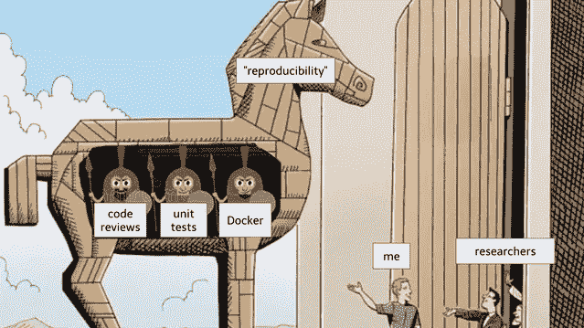
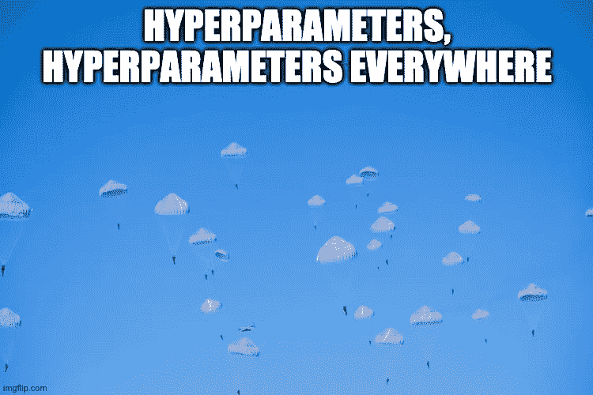
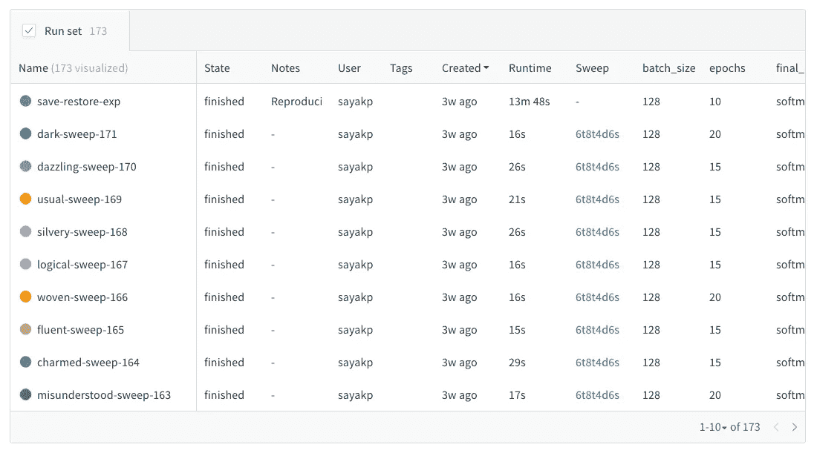
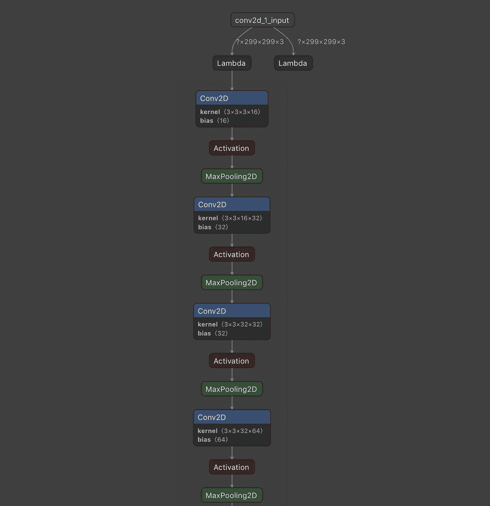
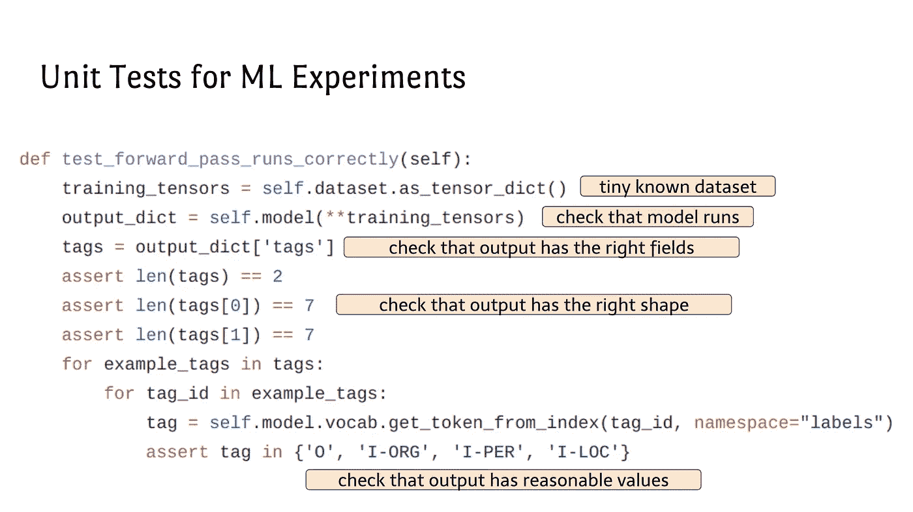
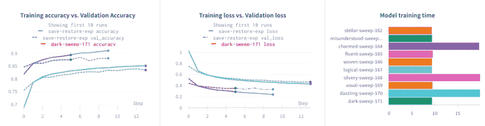

# 具有权重和偏差的可重复模型

> 原文：<https://towardsdatascience.com/reproducible-models-with-weights-biases-415776c4cbb7?source=collection_archive---------44----------------------->

## [生产中的机器学习](https://towardsdatascience.com/tagged/production-ml)

## 探索简单的技术，使您的 ML 实验尽可能具有可重复性。

**查看互动仪表盘** [**此处**](https://bit.ly/2Yh4oR9) **。**

机器学习中有不同层次的随机性。有时他们正在对数据集进行采样，而其他时候则是在机器学习模型(特别是神经网络)本身中。虽然随机性在模型训练中带来了许多优点，但它也引入了一些与可重复性有关的棘手问题。

> 代码在[这里](https://github.com/sayakpaul/Reproducibility-in-tf.keras-with-wandb)可用。

在这份报告中，我们将回顾一些有望使我们的机器学习实验更具可重复性的方法。在我们进入实质之前，我们将讨论确保我们的机器学习实验可重复的一些动机。

我们开始吧！

[来源](https://docs.google.com/presentation/d/1yHLPvPhUs2KGI5ZWo0sU-PKU3GimAk3iTsI38Z-B5Gw/edit#slide=id.g4e440241b9_0_27)

# 我们为什么要关心再现性？

为了开始这一节，我将借用 Joel Grus 的话 [***再现性作为工程最佳实践的载体***](https://docs.google.com/presentation/d/1yHLPvPhUs2KGI5ZWo0sU-PKU3GimAk3iTsI38Z-B5Gw/edit?usp=sharing) ***。***

Joel 提出了许多非常重要的观点，说明为什么 ML 中的再现性是必要的。这是其中一些-

*   再现性确保了正确性。如果社区里的研究员不能重现你声称的结果，那么你的实验设置可能有问题。
*   有了再现性，您就能在 ML 实验的不同方面获得一种稳健感。例如，数据集的代表性、模型在数据集的任何特定子集上的行为，等等。
*   你会希望能够运行你的 ML 模型，并且在将来仍然得到相同的结果。
*   其他人也希望能够做同样的事情。它为合作、基线评估和更新的实验提供了机会。

最重要的是(从乔尔的上述讲话中)

> 软件工程的最佳实践会让你成为更好的研究者。

老实说，虽然我知道可再现性，但只有在我看过乔尔的《甲板》之后，我才能真正理解对可再现性的迫切需求。

本报告的重点是开发可再现的模型，这反过来又解决了由不可再现性引起的大部分问题。

# 开发可复制的模型

在一份报告中满足所有的 ML 模型和框架并谈论可重复性几乎是不可能的。所以，我们只关注一对——神经网络和张量流。请注意，这些概念中的大部分仍然适用于其他框架。

在我们编写任何代码之前，我们需要确保我们的硬件/软件基础设施是统一的。当你在一个团队中工作时，这尤其有用。

## 涵盖的方法概述

*   统一的硬件和软件设置
*   随机种子+固定(初始)权重
*   可再生数据管道
*   超参数优化
*   保持理智的版本控制
*   确保正确性的测试
*   模型检查点及其他

# 地面设置和 CUDA-cuDNN

出于“可复制性”的考虑，我准备用以下配置为我的机器托管一台谷歌云平台 AI 平台笔记本——

*   `n1-standard-4vCPUs-15GB`
*   特斯拉 V100
*   预配置映像:TensorFlow 2.1(采用英特尔 MKL-DNN/MKL 和 CUDA 10.1)

遵循基础设施一致性的另一个非常重要的考虑是 cuDNN 和 CUDA 的行为(你不会想要在 CPU 上训练你的大型神经网络)。有许多有效的方法来计算神经网络中涉及的操作，并且它们并不总是每次都产生相同的结果，因为这些结果是近似的。

ML 库通常利用 CUDA 和 cuDNN 提供的这些高效的实现。在这样做的同时，它们引入了随机性(这些实现与上面提到的很接近)。另一个原因是 cuDNN 在运行时确定要使用的实现类型。因此，当使用 TensorFlow (2.1)和兼容的 NVIDIA-GPU 时，为了避免潜在的再现性危机，最好在代码中做任何其他事情之前做以下事情

这个实践来自于[张量流确定性存储库](https://github.com/NVIDIA/tensorflow-determinism)。感谢 Sebastian Raschka 的 [***L13 卷积神经网络介绍(第二部分)1/2***](https://www.youtube.com/watch?v=mZmyp0JjH6s) 讲座，CUDA 和 cuDNN 部分的灵感来源于此。请务必查看由 Duncan Riach[所做的](https://app.wandb.ai/sayakpaul/reproducible-ml/reports/twitter.com/DuncanARiach)[这一精彩演示](https://developer.download.nvidia.com/video/gputechconf/gtc/2019/presentation/s9911-determinism-in-deep-learning.pdf)，以了解更多关于深度学习中的**决定论**的知识。

我们现在可以关注代码的可再现性。

# 在代码级别对抗不可再现性

我将再次从上面提到的演讲中借用乔尔的一些观点，以及从我自己的经历中得到的一些发现。许多 ML 算法本质上是随机的，并且当算法中存在本质上不恒定的配置时，这种随机性的大部分被引入。例如，根据定义，我们初始化神经网络权重的方式应该是随机的。

## 随机种子+固定(初始)权重

这里有两个明显的解决方案-

*   修复随机数生成器种子，这样每次尝试生成随机数时，都会得到完全相同的结果。我建议对您在实验中使用的所有库(支持修复种子)都这样做。在 NumPy 和 TensorFlow 中，可以这样做-

还应该注意的是，这段代码应该放在代码的顶部，也就是说，在你开始任何实验之前。

*   另一个解决方案是在开始训练网络之前序列化网络的权重。这样，我们就可以访问网络的初始权重，并且每次训练网络时，我们都可以使用它们来帮助我们产生相同的结果(使用相同的配置)。

现在，当然，神经网络的其他部分也可能引入非确定性——丢弃层、采样层(还记得 VAEs 吗？)，潜在载体等等。他们引入的非决定论是好的，因为它通常有助于神经网络表现得更好。我们可以在这些层中多次运行我们的训练数据，并测量每个结果的平均偏差。如果没有任何问题，偏差不会很高。

# 对抗数据的不可再现性

很多随机性可以来自机器学习模型的更好的一半——数据！通常，在训练模型时，我们提供不同的训练和验证分割。这当然会导致每次不同的模型性能结果。一个更好的方法是在我们训练模型之前修复训练和验证分裂。

如果数据拆分的序列化很困难，那么我们仍然可以在每次拆分数据时提供种子参数。例如，当使用 scikit-Learn 的`train_test_split`方法时，我们可以指定`seed`参数。这里的想法是修复每次运行函数时会产生不同分裂的所有变量。

常见的例子包括-

*   洗牌训练例子。
*   使用像`glob`这样的库来读取文件，因为它不维护文件路径的顺序。

作为一般提示，在调整训练数据点时要非常小心。您不会希望单独打乱要素及其标注。当您执行数据扩充时，总会有一些随机性。在这种情况下，建议尽可能指定种子。

# 超参数，到处都是超参数！

基地形象来自[这里](https://unsplash.com/photos/JZmdtU8gh7k)

超参数仍然是神经网络的核心，超参数调整是一个非常复杂的过程。因此，当您使用相同的网络架构运行不同的实验，但使用不同的超参数配置时，可能很难跟踪这些配置中设置的值。

对于不同的网络架构，事情变得更加复杂，每个架构都有一组不同的超参数设置。这正是权重和偏见真正闪光的地方。无论您是在[运行超参数优化](http://bit.ly/2MKHR7K)还是只想将超参数配置存放在安全的地方，W & B 都能满足您的需求。

对于超参数调优，只需按照以下方式定义您想要测试的值，然后让 W&B [*将其清除*](https://docs.wandb.com/sweeps) (完整代码请参见[本笔记本](https://colab.research.google.com/drive/181GCGp36_75C2zm7WLxr9U2QjMXXoibt#scrollTo=qRZfyqFpaJ5m))

只需几行代码，我们就可以生成如下所示的扫描报告。

在此与此表[互动](https://app.wandb.ai/sayakpaul/reproducible-ml)

在指定了用于定义模型的超参数之后，您只需通过`config`字典(例如`config.epochs`)在代码中访问它们。这里有一个端到端的例子。即使您没有进行任何超参数调整，记录您的超参数值也是一个好的做法，您可以通过在调用`wandb.init()`时指定`config`参数来轻松记录它们的权重和偏差。参见[这里的](https://github.com/sayakpaul/Reproducibility-in-tf.keras-with-wandb/blob/master/Part_I.ipynb)示例(检查`config_defaults` 变量)。

# 保持理智的版本控制

想象一个场景，您修改了当前的数据输入管道，并且在这样做的时候，您意识到您在模型中引入了一个 bug。你想恢复到以前的版本，但你已经没有了。你可能会发现自己处于许多不同风格的类似的、潜在的灾难性情况中。

答案很简单——“对所有包含代码的东西使用版本控制系统！”

当你用 W&B 同步你的 ML 实验时，它获取最新 git 提交的 SHA，并给你一个来自 GitHub repo 的代码版本的链接。这里的见示例[。](https://app.wandb.ai/sayakpaul/reproducible-ml/runs/save-restore-exp/overview?workspace=user-sayakpaul)

在机器学习中，模型和*数据版本*同样重要。数据版本化比模型版本化要复杂得多。查看[此处](https://blog.floydhub.com/becoming-one-with-the-data/)以更好地编辑您的数据。

要进行模型版本控制，我们可以遵循一些简单的步骤:

*   经常检查模型，以便在需要时完全控制它们的状态
*   模型架构可以因为许多原因而改变。对于几乎所有的`tf.keras`型号，W & B 记录它们的架构，如下所示(可通过运行页面的**型号**选项卡获得):

人们可以在 Netron live 上预览他们的网络架构

# 确保正确性的测试

调试机器学习系统非常困难，这里[是](https://karpathy.github.io/2019/04/25/recipe/)的原因。那么，您如何确保您的模型没有错误呢？正如乔尔·格鲁什和杰瑞米·霍华德认为的那样——*确保这一点的最好方法是从一开始就不犯任何错误*。这就是编写好的测试可以真正帮助您确信您的模型正在以您期望的方式工作的地方。

乔尔，在上面提到的演讲中，为一个 ML 模型整理了一套通用的测试场景-

尽管测试用例会因场景而异，但上面的这些无疑给了您一个很好的起点。因此，长话短说，单元测试有助于确保模型的正确性，从而使它们更具可重复性。

# 模型检查点及其他

想象一下，在训练你的神经网络期间，对于一个特定的时期，网络表现出良好的泛化行为，而就在那个时期之后，它又开始发散。如果您可以设置检查点，在每个时期后保存网络快照，或者在一系列时期内保存网络的最佳快照，岂不是更好？

如果最好的模型中途崩溃或者你失去了重量，那就更糟了。好消息是 Weights and Biases 可以*自动*为你做到这一点——也就是说，它会自动将你的网络的最佳版本保存到该模型的 runs 页面。

目前对于`tf.keras`模型，W & B 可以以`.h5`格式序列化同步最好的模型。对于定制模型([不支持序列化为](https://www.tensorflow.org/guide/keras/save_and_serialize#part_ii_saving_and_loading_of_subclassed_models) `[.h5](https://www.tensorflow.org/guide/keras/save_and_serialize#part_ii_saving_and_loading_of_subclassed_models)` [格式](https://www.tensorflow.org/guide/keras/save_and_serialize#part_ii_saving_and_loading_of_subclassed_models))，您需要手动完成。你可以在本教程中看到。下面我将使用 W & B -设置模型检查点并保存

模型完成训练后，检查点文件将自动上传到相应的 W&B 运行页面。

这使得跨分布式团队的合作变得更加容易，因为您团队中的任何人都可以复制您的模型——他们可以访问权重和代码(因为 W&B 将您的 GitHub 提交与您的训练运行相链接)。

这里的每次运行(图例)指的是单独的实验，权重和偏差向您显示了与每次运行相关的性能指标

# 结论

本报告旨在提供一些简单但有用的方法，帮助您构建可重复的模型。这绝不是一份详尽的清单。我调查了一些[机器学习专家](https://developers.google.com/community/experts)关于他们对再现性的想法，以下是他们的回答:

*   尽可能分享公开数据集的结果。当这不可行时，包括一个公共可用的数据集，你的实验结果可以扩展到这个数据集。
*   在可能的情况下，分享在合理预算范围内可获得的计算水平上培训的结果。对于大多数人来说，使用 100 个 TPU v3–2028s 演示的结果不容易重现。

感谢 [Mat](https://twitter.com/mat_kelcey) 、 [Aakash](https://twitter.com/A_K_Nain) 和 [Souradip](https://www.linkedin.com/in/souradip-chakraborty/) 的贡献。作为 ML 从业者，除了 SOTA 结果之外，最大的再现性应该是我们的目标。

我很想知道你使用什么再现工具/方法。如果你对这份报告有任何反馈，请不要犹豫，发微博给我，地址是 [@RisingSayak](http://twitter.com/RisingSayak) 。