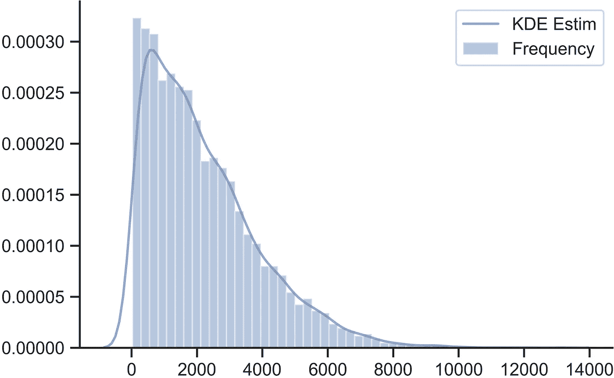
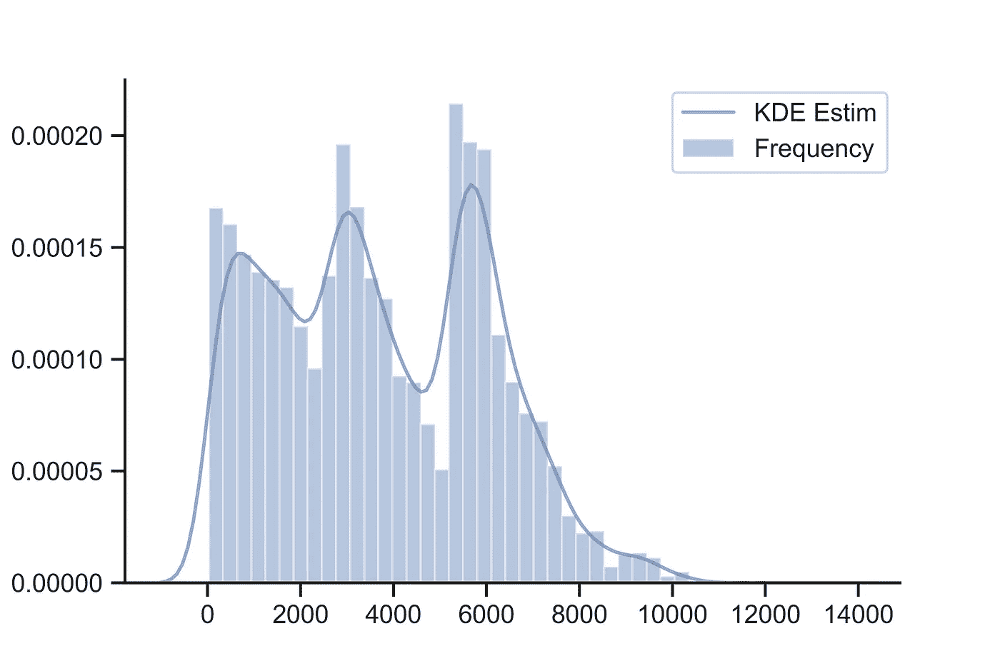
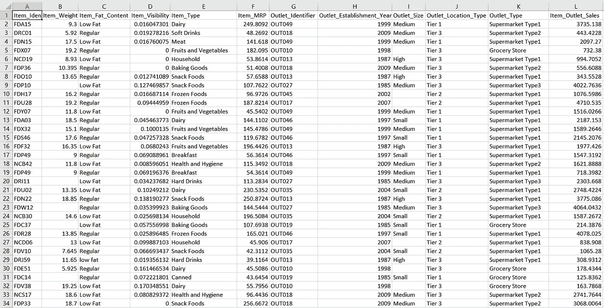

# 为回归任务重新利用传统的重采样技术

> 原文：<https://towardsdatascience.com/repurposing-traditional-resampling-techniques-for-regression-tasks-d1a9939dab5d?source=collection_archive---------48----------------------->

阿列克谢·耶什金在 [Unsplash](https://unsplash.com?utm_source=medium&utm_medium=referral) 上的照片

想象一下这样一个场景，你参加了一个涉及回归任务的数据科学竞赛，你发现目标变量是偏斜的。由于没有一个参与者能够在排行榜上获得较低的误差，您意识到训练数据是不平衡的，一些快速重新采样可以解决您的问题。但是等等！这不是一项分类任务，您无法从一套欠采样和过采样技术中进行选择。这是一项回归任务，尽管有一些重采样算法，但您的选择是有限的。如果我们可以简单地将所有基于分类任务的重采样方法重新用于回归任务，这不是很好吗？如果你的答案是肯定的，也应该是，那么你来对地方了！

# 短信

如果你只是想平衡你的回归数据，然后继续前进，那么[我们已经建立了一个 python 包，目前正在运行](https://pypi.org/project/reg-resampler/)。对于那些想了解这一想法背后的工作原理以及通过这种方法可以实现什么的人，请继续阅读。

# 这个想法

偏斜目标变量的 Seaborn 图

上图是来自 [AnalyticVidhya 的 Big Mart 销售预测挑战](https://datahack.analyticsvidhya.com/contest/practice-problem-big-mart-sales-iii/#About)的目标变量的直方图。其偏斜值为 1.1773，而真正的正态分布的偏斜值为 0。由于数据集的性质，目标变量不能小于零，这会导致正的偏斜值。

从图中可以清楚地看到，与其他箱相比，某些箱具有大量的样本。为了使用传统方法对数据进行重采样，我们需要类的存在。对于回归任务，可以通过**宁滨数据**来实现。例如，在这种情况下，我们可以说 0–3000 范围内的所有样本都属于第 0 类，3000–6000 属于第 1 类，依此类推。这将最终为我们提供伪的、不平衡的类，然后我们可以使用它们来执行欠采样和/或过采样。我们可以使用 pandas [cut 函数](https://pandas.pydata.org/pandas-docs/version/0.23.4/generated/pandas.cut.html)得到这些伪类。

这将每个样本放在一个类中

一旦样本被分配到它们各自的类，我们可以将整个数据集，包括连续的目标变量，连同生成的基于类的变量一起，传递给重采样包，例如 [**imblearn**](https://imbalanced-learn.readthedocs.io/en/stable/) 。

这会导致目标变量中出现新值的过采样示例。

使用自定义采样策略应用 SMOTE 后相同目标变量的 Seaborn 图。偏斜值现在已经减少到 **0.22**

# 一份申请

让我们看看这种再利用方法在现实世界中的表现。我们将使用如上所述的相同比赛的数据。AnalyticsVidhya 还为每个相应的提交提供了真实世界的排名，这有助于了解我们在现已冻结的排行榜上的位置。

资料截图

数据中有许多分类变量。我们将首先对这些特性中的每一个执行标签编码，填充任何缺失的值，并使用 lightgbm 进行快速的基线提交。

数据预处理

火车。预测。提交一份文件

这使我们在排行榜上排名前 2500，得分为 1194(越少越好)。考虑到有 35000 名参与者，这还不算太坏！现在，我们通过使用我们的 [***reg_resampler 包***](https://pypi.org/project/reg-resampler/) ，在数据集的过采样版本上重新训练我们的 lgbm 模型。我们使用来自 imblearn 的 SMOTE 作为我们的过采样器。

附注:我们还使用 KFold CV 进行了细微的参数调整，这里没有显示。如果你想了解如何使用我们的包以正确的方式执行交叉验证，那么我们在 GitHub 上为你准备了[几个教程。](https://github.com/atif-hassan/Regression_ReSampling/tree/master/tutorials)

重新训练。预测。提交一份文件

这使我们在排行榜上排名前 30(第 26 位)，得分为 1140！这是一个巨大的飞跃！！请注意，我们没有进行任何预处理，甚至没有为此进行任何特征工程。

还可以使用宁滨方法，通过将生成的箱用作回归任务的类，来执行分层 kfold 交叉验证。这让我比在 [MachineHack 的二手电子产品价格预测挑战赛](https://www.machinehack.com/course/used-electronics-price-prediction-weekend-hackathon-7/leaderboard)中简单的折叠更接近实际的排行榜，在那里[我最终排名第一](https://analyticsindiamag.com/meet-the-machinehack-champions-who-cracked-the-used-electronics-price-prediction-hackathon/)。

# 分析

我对性能提高背后原因的假设是，宁滨为我们提供了基于类别的数据视图，并通过生成具有不同预测值的新样本，帮助模型更好地对新样本进行概括。

# 最终消息

我希望你已经发现这是有用的。如果您有任何问题和/或批评，请随时联系我的 [Linkedin](https://www.linkedin.com/in/atif-hassan-1a8a45127/) 和 [Gmail](http://atif.hit.hassan@gmail.com) 账户。

reg_resampler 软件包是与才华横溢、能力出众的 [Venkata Sai Krithik](https://medium.com/@pvsaikrithik) 一起开发的。你也可以在 Linkedin 和 Gmail 上找到他。如果你使用这个包，那么请启动 GitHub 库。

[1]:托戈、路易斯、丽塔·里贝罗、伯恩哈德·普法林格和保拉·布兰科。"为回归而击打。"在*葡萄牙人工智能会议*中，第 378–389 页。施普林格，柏林，海德堡，2013。

> 谢谢大家！