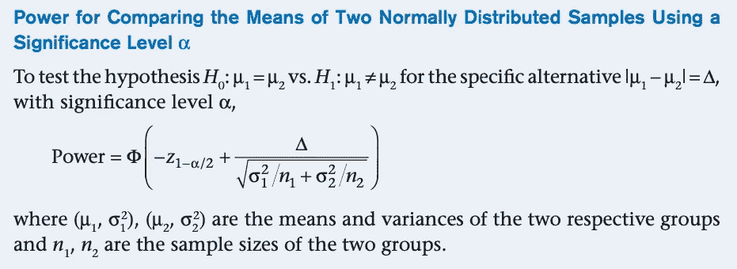
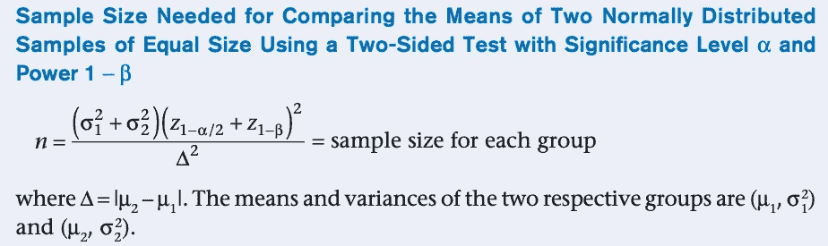
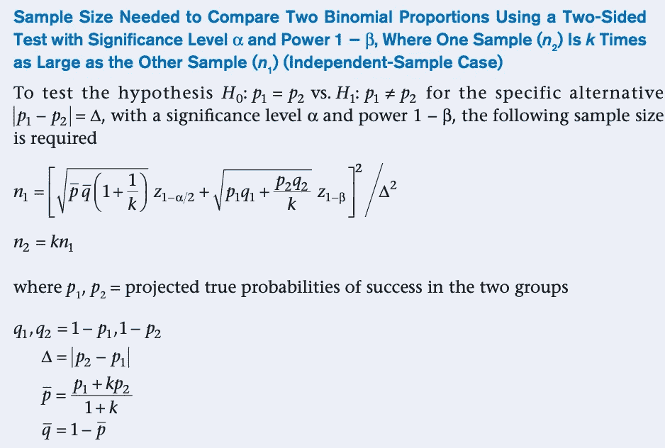

# A/B 测试所需的样本量

> 原文：<https://towardsdatascience.com/required-sample-size-for-a-b-testing-6f6608dd330a?source=collection_archive---------1----------------------->

本文描述了计算 A/B 测试所需最小样本量的一些流行方法。本文中描述的方法并没有什么新颖之处。然而，它将为初入该领域的数据科学家提供实用指南(严谨)。它还将帮助求职者在数据科学面试中脱颖而出。此外，这篇文章还揭示了一些流行的在线样本量计算器背后的数学原理。本文使用的公式来自*生物统计学基础(第 8 版)*。

# 为什么要计算所需的样本量？

在 A/B 测试中，我们通常感兴趣的是测试治疗组与对照组在某个成功指标(如转化率)上是否有显著差异。无效假设是没有显著差异。

当我们拒绝不应该拒绝的零假设时，第一类错误就发生了。一类错误率是一类错误发生的概率，也称为显著性水平或 alpha。α的常见值是 0.05。

当我们在应该拒绝零假设的时候没有拒绝零假设时，第二类错误就发生了。第二类错误率也称为β。

统计功效是测试在应该拒绝零假设时拒绝零假设的概率。基本上是 1 减去β。统计功效的常见值是 0.80(因此β是 0.20)。

为了获得有意义的结果，我们希望我们的测试有足够的统计能力。并且，样本大小影响统计功效。例如，在比较两个平均值时，可以使用下面的公式来计算统计功效。随着样本量的增加，统计功效增加。因此，为了使我们的测试具有理想的统计功效(通常为 0.80)，我们需要估计所需的最小样本量。

(摘自《生物统计学基础》)

接下来，我们将通过一个假设的例子来理解所需样本量的计算。

# 例如:电子商务网站的转换率

假设一个电子商务网站想要测试实现一个新功能(例如，布局或按钮)是否会显著提高转换率(购买次数除以会话/访问次数)。我们可以随机向 50%的用户展示新网页。然后，我们有一个测试组和一个控制组。一旦我们有了足够的数据点，我们就可以测试治疗组的转化率是否明显高于对照组(单侧测试)。无效假设是两组的转换率没有显著差异。

# 比较两个平均值的样本量

进行测试的一种方法是计算治疗组和对照组的每日转化率。由于某一天一组中的转化率代表的是单个数据点，所以样本量实际上就是天数。因此，我们将测试测试期间每组每日平均转换率之间的差异。

估计最小样本量公式如下:

(摘自《生物统计学基础》)

对于我们的示例，让我们假设过去 6 个月的平均每日转化率为 0.15，样本标准差为 0.05。随着新功能的推出，我们预计转化率会有 3%的绝对增长。因此，治疗组的转化率为 0.18。我们还假设两组样本的标准差相同。我们的参数如下。

*   mu1 = 0.15
*   mu2 = 0.18
*   σ1 =σ2 = 0.05

假设α= 0.05，β= 0.20(幂= 0.80)，应用该公式，所需的最小样本量为 35 天。这与来自这个[网络计算器](https://www.stat.ubc.ca/~rollin/stats/ssize/n2.html)的结果一致。

# 比较两个比例的样本量

双均值方法将每一天+组视为一个数据点。但是如果我们把重点放在个人用户和访问上呢？如果我们想知道测试需要多少次访问/会话呢？在这种情况下，一个组的转换率基本上是所有购买除以该组中的所有会话。如果每个会话是伯努利试验(转换或不转换)，每个组遵循二项式分布。为了测试治疗组和对照组之间转化率的差异，我们需要两个比例的测试。估计所需最小样本量的公式如下。

(摘自《生物统计学基础》)

假设五五分成，我们有以下参数:

*   p1 = 0.15
*   p2 = 0.18
*   k = 1

使用α= 0.05 和β= 0.20，应用该公式，所需的样本量为每组 1，892 个会话。这与来自这个[网络计算器](https://www.stat.ubc.ca/~rollin/stats/ssize/b2.html)的结果一致。这也接近使用[优化](https://www.optimizely.com/sample-size-calculator/)的样本量计算器计算转化率的结果。