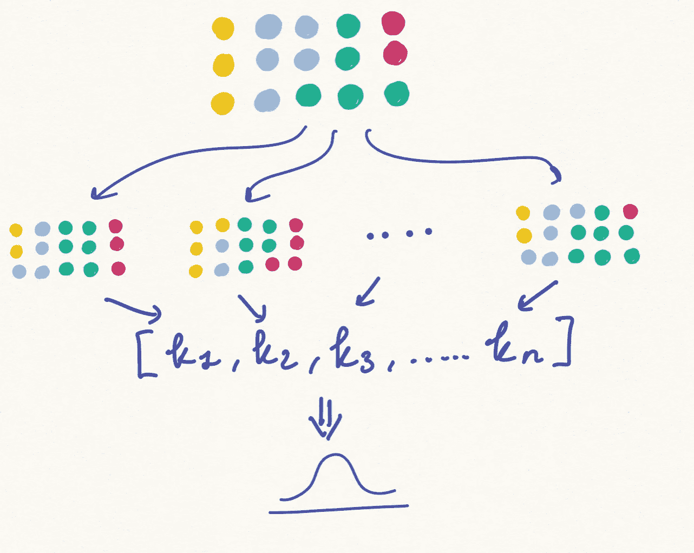
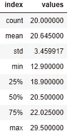
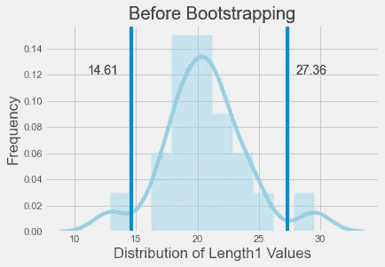
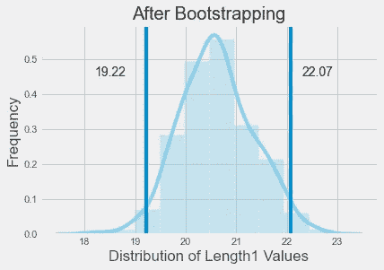
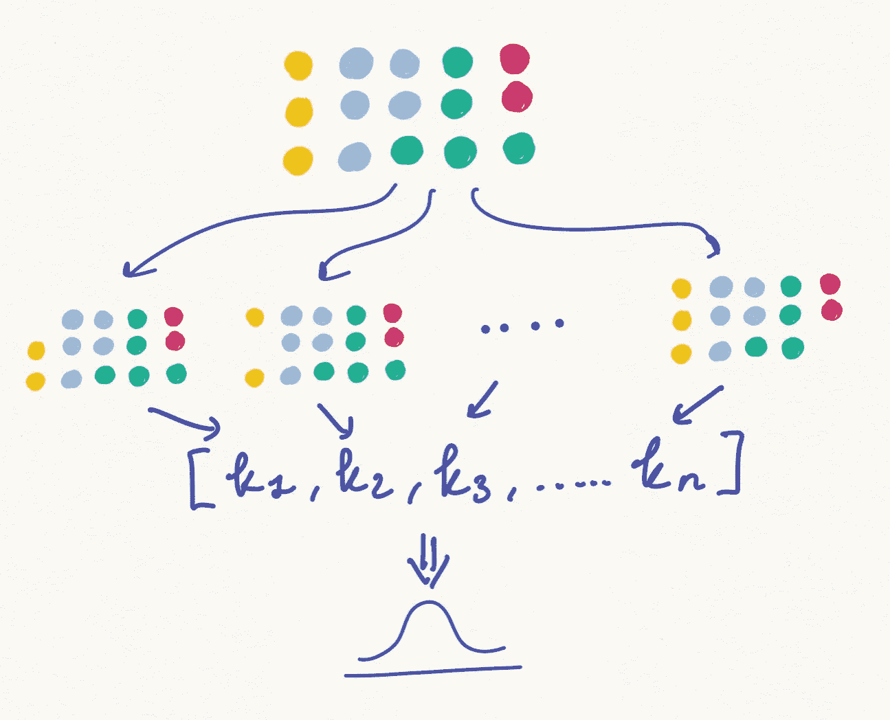
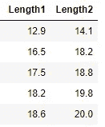
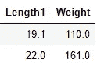

# 推理分析的重采样方法

> 原文：<https://towardsdatascience.com/resampling-methods-for-inference-analysis-e75fecfefcb2?source=collection_archive---------26----------------------->

## 当你有一个样本，但你想了解人口


[来源](https://www.pexels.com/photo/high-angle-photography-of-people-in-ground-950902/)

大多数时候，我们被要求得出对整个群体都有效的结论。但通常我们拥有的是来自样本的数据集，样本是我们收集数据的特定群体。

在理想世界中，样本是**随机选取的**和**代表**人群的子集。使用示例实际上有很多好处，比如实用性、成本效益、节省时间和可管理性。

尽管有这些优势，我们需要小心的是 [**采样误差**](https://en.wikipedia.org/wiki/Sampling_error) **！**🚨

抽样误差是总体参数和根据样本计算的统计值之间的差异(如总体平均值和样本平均值之间的差异)。因为样本是总体的子集，所以它们不包括总体的所有成员。因此，从样本计算的统计数据(如平均值、中值、标准差、分位数等)通常不同于真实的总体参数。

考虑到样本被确定为代表整个总体，样本和总体统计之间的差异被认为是**误差**。

为了克服采样误差，我们可以遵循以下重采样方法。

1.  拔靴带
2.  刀切重采样
3.  排列测试

在阅读本文的同时，我鼓励您查看我的 GitHub 上的 [Jupyter 笔记本](https://github.com/Idilismiguzel/data_analysis/blob/main/resampling-methods/Resampling-Methods.ipynb)以获得完整的分析和代码。

# 1.拔靴带

自举是一种从原始样本创建样本*并替换*的方法。由于使用替换 完成了 ***操作，每个数据点随后被选取的概率相等。我们可以引导 *n* 次(比如 1000 次)，计算并记录这 *n* 个样本中每一个的期望估计值(即平均值)。最后，我们可以找到期望估计值的分布。***



作者图片

📢bootstrapping 的一般使用案例是寻找置信区间的稳健估计、总体参数的标准误差，如平均值、中值、相关系数、回归系数等。

为了说明 Python 中的自举，我将使用来自 Kaggle 的[鱼市场数据集](https://www.kaggle.com/aungpyaeap/fish-market)。该数据集由鱼市场销售的 7 种常见的不同鱼类组成，我将重点关注“蟑螂”鱼。我还将选择“长度 1”作为属性。

```
data = pd.read_csv('./Fish.csv')
data = data.loc[data["Species"] == "Roach"]["Length1"]pd.DataFrame({'values': data.describe()}).reset_index()
```



如上所述，我们可以用`np.percentile(data, [2.5,97.5]).`的 95%置信区间`data.mean(),`计算样本均值

然而，通过从样本分布到总体分布，我们做了几个隐藏的假设，例如:“长度 1”值的分布是正态分布，置信区间是对称的。在大多数情况下，这些假设可能不正确。

```
mean = data.mean()
confidence_int = np.percentile(data, [2.5, 97.5])
```

> 样本均值= 20.65，95%置信区间= [14.61，27.36]



具有 95%置信区间的长度 1 值的分布

因此，我们应该使用 bootstrap 来寻找均值和置信区间。👇

```
mean_lengths, n = [], 1000for i in range(n):
    sample = np.random.choice(data["Length1"], 
                              replace=True, 
                              size=len(data))
    sample_mean = sample.mean()
    mean_lengths.append(sample_mean)

boot_mean = np.mean(mean_lengths)
boot_ci = np.percentile(mean_lengths, [2.5, 97.5])
```

> 自助平均值= 20.60，95%置信区间=[19.22±22.07]



具有 95%置信区间的自举样本均值的分布

# 2.刀切重采样

刀切重采样技术基于通过系统地 ***在原始数据集中留下一个观察值*** 来创建样本。我们应该计算每个样本的期望值，然后找出所有值的分布。

> 作为一个例子，如果给定一个大小为 *n* 的样本，那么重叠估计是通过合计每个 *(n-1)* 样本的估计统计量得到的。



作者图片

📢刀切重采样的一般用例是寻找方差和偏差。

```
mean_lengths, n = [], len(data)
index = np.arange(n)for i in range(n):
    jk_sample = data[index != i]
    mean_lengths.append(jk_sample.mean())mean_lengths_jk = np.mean(np.array(mean_lengths))
jk_variance = (n-1)*np.var(mean_lengths)
```

> 平均值的重叠估计= 20.64
> 方差的重叠估计= 0.59

# 3.排列测试

排列检验是一种统计显著性检验，它试图在不对数据做出强假设的情况下获得检验统计量的分布(在[零假设](https://en.wikipedia.org/wiki/Null_hypothesis)下)。

假设我们有两个样本，我们想测试这两个样本是否有不同的特征(即平均值)。我们可以计算两个样本的平均值，并决定它们是否不同。但是用这种方法分析没有统计学意义，因为我们没有整个人口的数据，只有其中的一部分。

相反，我们可以执行置换测试，其工作方式如下:

1.  将两个样本合并成一个数据集。
2.  混洗合并的数据集，并将其随机重新采样为 2 个数据集(大小与之前的样本相同)。
3.  计算测试统计数据(即平均值之间的差异)并记录数值。
4.  重复上述步骤 n 次(比如说 10000 次)。
5.  将原始检验统计量与记录值进行比较，如果原始检验统计量与置换记录吻合得很好，那么检验统计量确实没有不同，样本均值之间的差异仅是由于偶然因素造成的**。如果原始统计位于最大置换记录之外，则意味着两个样本之间存在**显著差异**。**

为了说明 Python 中的置换测试，我将再次使用 Kaggle 的[鱼市场数据集](https://www.kaggle.com/aungpyaeap/fish-market)。这一次，我将通过选择“长度 1”&“长度 2”属性来关注“蟑螂”鱼。

💬我将调查这两个值的平均值是否有显著差异，或者是由于偶然因素。



数据集中的前 5 行

```
data["Length1"].mean()
data["Length2"].mean()
```

> 长度平均值 1: 20.65
> 长度平均值 2: 22.27

我们正在研究两个样本均值(-1.62)之间的差异是偶然的还是统计上显著的。

```
--> Step 1: Combine datasets
sample1 = data["Length1"]
sample2 = data["Length2"]
data = np.concatenate([sample1, sample2])--> Step 2: Shuffle and randomly resample into 2 datasets
perm = np.array([np.random.permutation(len(sample1) + len(sample2)) for i in range(10000)])
permuted_1_db = data[perm[:, :len(sample1)]]
permuted_2_db = data[perm[:, len(sample1):]]--> Step 3: Calculate the test statistics
samples = np.mean(permuted_1_db, axis=1) - np.mean(permuted_2_db, axis=1)--> Step 4: Repeat it n times
Done in step 2 with for loop--> Step 5: Compare the original test stat with the recorded values
test_stat = np.mean(sample1) - np.mean(sample2)
p_val = 2*np.sum(samples >= np.abs(test_stat))/10000
print("p-value = {}".format(p_val))
```

> test_statistic = -1.62
> p 值= 0.15

p 值告诉我们，在 15%的情况下，我们应该期望在两个样本之间达到相似的平均差异。

如果你想了解更多关于排列检验和假设检验的知识，你也可以阅读我的文章[a/b 检验指南](/a-guide-to-a-b-testing-how-to-formulate-design-and-interpret-f820cc62e21a)(附 below)⚡

[](/a-guide-to-a-b-testing-how-to-formulate-design-and-interpret-f820cc62e21a) [## A/B 测试指南——如何制定、设计和解释

### 用 Python 实现

towardsdatascience.com](/a-guide-to-a-b-testing-how-to-formulate-design-and-interpret-f820cc62e21a) 

# **奖金**

如果您正在执行相关性分析以了解数据集中变量之间的关系有多强，那么分析中包括的一个好东西是**相关系数的自举置信区间**。

为了用 Python 展示，我将再次使用[鱼市场数据集](https://www.kaggle.com/aungpyaeap/fish-market)，通过选择“length 1”&“Weight”属性来关注“Roach”鱼。

💬我将研究这两种属性之间的关系。



数据中有代表性的两行

在用`data.corr()`引导之前，我们可以计算属性之间的相关系数。


看起来在我们的样本中,“长度 1”和“重量”之间有 90%的正相关。但是正如我们之前讨论的，这 90%代表了当前的样本，而不是整个人口。因此，我们可以计算 1000 次 bootstrapped 样本的 95%置信区间。

```
data_size, lw_corr = data.shape[0], []for i in range(1000):
    tmp_df = data.sample(n=data_size, replace=True)
    lw_corr.append(tmp_df["Weight"].corr(tmp_df["Length1"]))corr_ci = np.percentile(lw_corr, [2.5, 97.5])
```

> 相关系数置信区间:[0.77，0.98]

这意味着在 95%的自举样本中，“长度 1”和“重量”之间的相关系数保持在 0.77 和 0.98 之间。

# **总结**

在本文中，我们介绍了三种重采样方法来消除分析中的采样偏差问题。通过这样做，我们不仅可以提取关于总体参数的更精确的估计，而且可以量化我们估计中的不确定性，例如增加置信区间。利用我们今天拥有的计算能力，我们可以在几行代码中对初始样本进行多次重采样。

我希望你喜欢阅读这篇文章，并发现它对你的分析有用！

*如果你喜欢这篇文章，你可以* [***在这里阅读我的其他文章***](https://medium.com/@idilismiguzel)**和* [***关注我上媒***](http://medium.com/@idilismiguzel/follow)*如果有任何问题或建议，请告诉我。✨**

**喜欢这篇文章吗？ [**成为会员求更！**](https://idilismiguzel.medium.com/membership)**