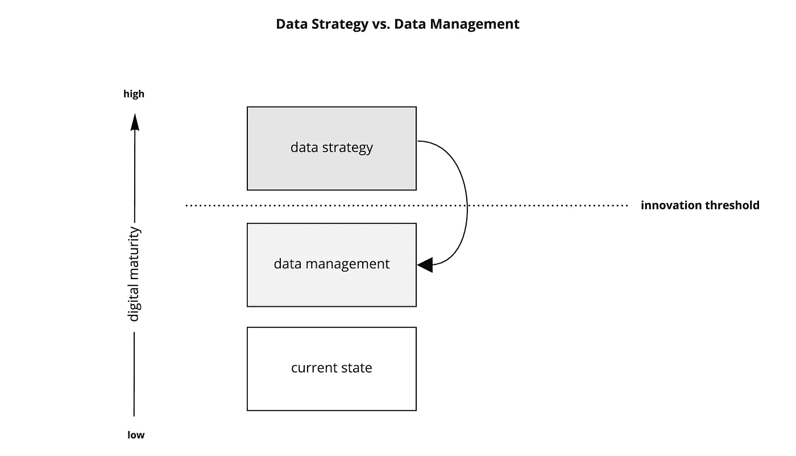
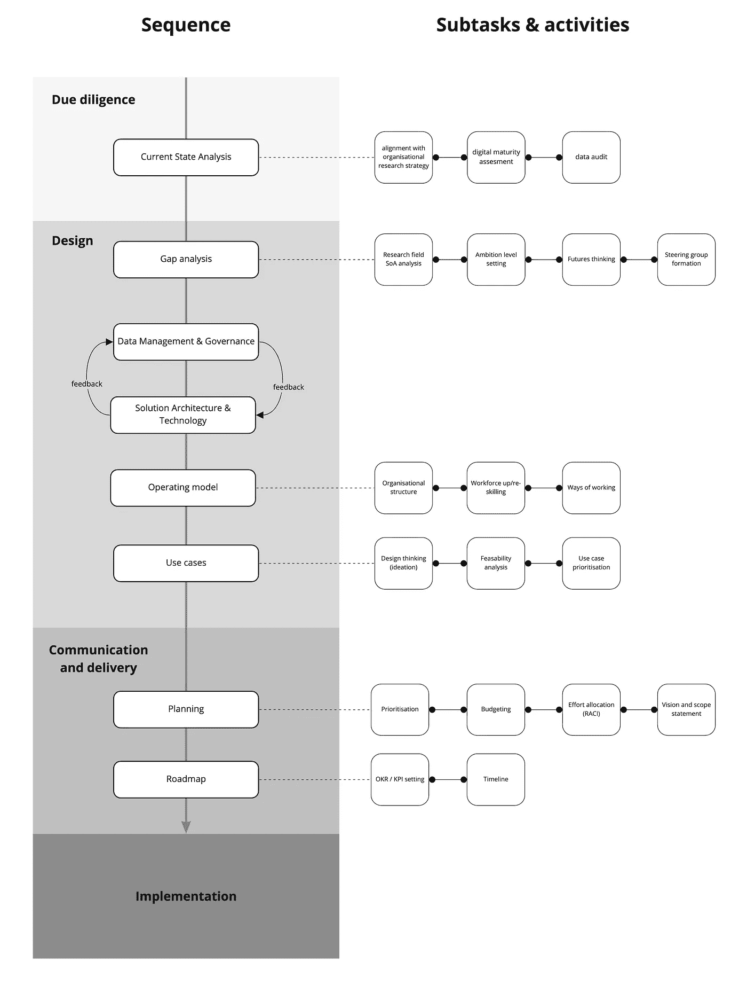
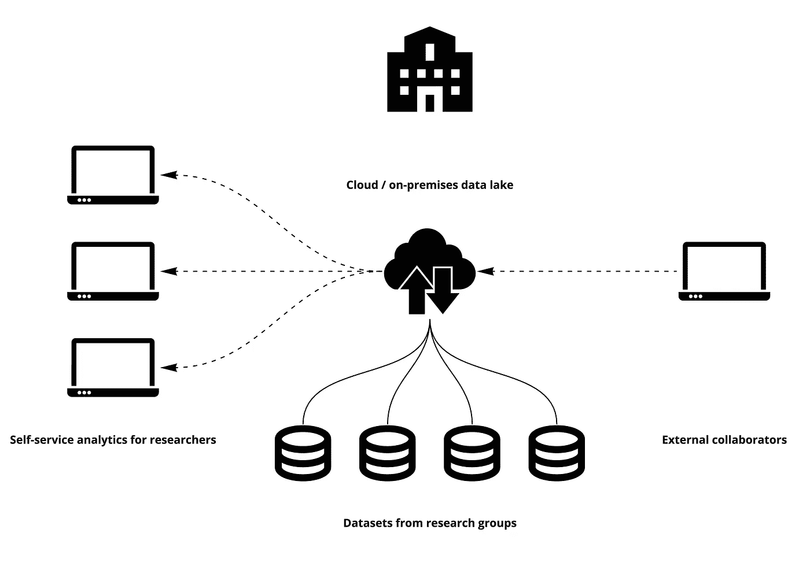
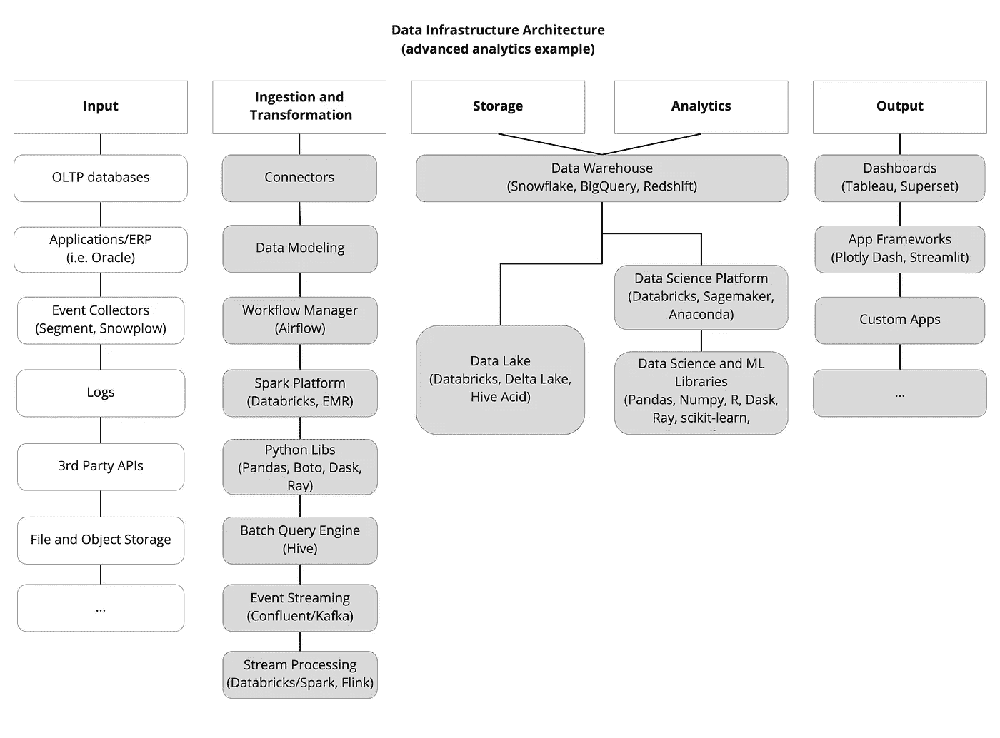
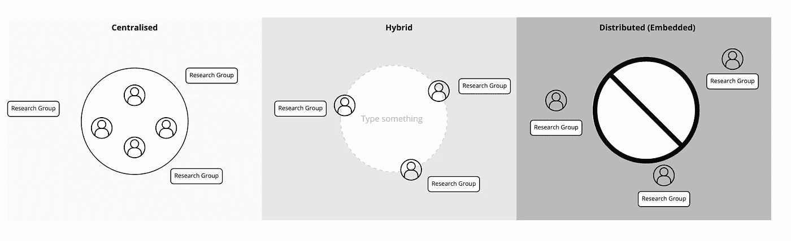

# 研究数据策略

> 原文：<https://towardsdatascience.com/research-data-strategy-2fd447f83719?source=collection_archive---------43----------------------->

## 框架和激励因素

科学已经进入了大数据时代。几乎任何研究领域都受益于大量实验数据的可用性。典型的例子包括但不限于生物信息学、天文学、粒子物理学和地质学。然而，数据领域的许多创新都发生在技术领域。谷歌和亚马逊等公司在机器学习和云计算等领域进行了大量投资。新的工作方式也有进步，比如精益和敏捷开发。即使在科技公司以外的行业领域，数据密集型技术的采用率也仍然很低。对于像这样的大规模组织，已经开发了“[数据策略](https://hbr.org/2020/05/your-organization-needs-a-proprietary-data-strategy)的概念。研究机构可以从中受益匪浅，本文旨在介绍其科学变种:“研究数据策略”(RDS)。

*TL；DR:跳到图 2 的数据策略框架。*

# 数据战略与数据管理

需要注意的第一个重要点是数据策略和数据管理之间的区别。管理研究数据并不是一个新问题，它已经存在了几十年。研究数据管理领域一直在解决这个问题；因此，澄清差异非常重要，如下图 1 所示:

图 1:数据策略和数据管理的区别(图片由作者提供)。

理解区别的诀窍就在于名称:数据管理更多的是关于“管理”组织的数据，而“策略”就是“策略”。创新就发生在这个层面。

我们可以将 RDS 定义为**，一个通过应用数据和分析来交付研究价值的框架**。

# 元素

在大型管理咨询公司(如麦肯锡(McKinsey)和波士顿咨询公司(BCG ))的领导下，已经做出了大量努力，以创建一个统一的结构来实现数据战略，但没有达成普遍共识。我提议的元素如下图 2 所示。

图 2:数据策略的元素(图片由作者提供)。

这在很大程度上取决于研究用例、资源限制和现有的计划。我们来看看主要的。

## 准备

成功的 RDS 对其成功有一些严格的要求:

1.  与整体研究战略保持一致
2.  利益相关者买入
3.  专门的战略所有权

这些都是说起来容易做起来难，但是有了它们，下游的一切都会变得容易得多。总结道格·兰尼的《信息经济学》一书背后的主要思想:

> 将您的数据视为真正的组织资产，而不仅仅是 IT 流程的副产品。

## 当前状态分析

要找到去哪里，我们需要知道我们在哪里。对于一个研究机构来说，这是通过对关键人物进行采访并记录调查结果来完成的。以下是一些常见的激励性问题(分为两类):

**数字成熟度评估**

*   当前有哪些与数据收集、存储和使用相关的计划？
*   谁是数据的生产者、所有者和消费者？
*   处理数据的人的技能水平如何？

**数据尽职调查**

*   当前的数据生成流程是什么？
*   数据质量如何？
*   在数据架构方面有好的实践吗？

进行这样的面试并不容易——它需要领域知识、沟通技巧和技术专长。

## 差距分析

有了 CSA 的结果，RDS 的下一个顺序要素是差距分析。在这里，战略设计者需要与组织中的关键决策者一起决定目标水平。这在很大程度上取决于组织的研究领域的状态和其他限制。差距分析结果是数据策略路线图部分的重要组成部分，也许是其最重要的交付成果。

## 数据管理和治理

在理想情况下，研究机构中的数据以类似于图 3 的方式进行管理:

图三。研究机构中的集中式数据管理(图片由作者提供)。

通常情况下，它会更加分散，形成孤岛。无论这是以隐藏在个人贡献者机器上的数据集的形式，还是关于数据安全性的混乱，问题经常存在。这部分数据策略在学术界研究得比较充分，我们就不多赘述了。

## 解决方案架构和技术

这个元素通常与数据管理捆绑在一起。尽管如此，由于它对下游高级分析用例至关重要，因此值得在 RDS 中单独关注。为了理解现代数据基础设施的复杂性，请看图 4:

图 4:示例数据架构(在[马特·博恩施泰因](https://a16z.com/author/matt-bornstein/)、[马丁·卡萨多](https://a16z.com/author/martin-casado/)和[李昕晢](https://a16z.com/author/jennifer-li/)、 [URL](https://a16z.com/2020/10/15/the-emerging-architectures-for-modern-data-infrastructure/) 之后修改，图片由作者提供)。

它有许多不同的方面，即使一个研究组织是从零开始，技术选择和需求收集也是非常困难的。RDS 通过仔细检查有什么(CSA 的一部分)和记录潜在的使用案例(下面讨论)来帮助指导这个过程。

## 运营模式

RDS 中更难做到的一部分是对组织的现有运营模式进行必要的更改。典型的步骤包括改变团队运作(图 5)，雇佣(或提升)首席数据官，以及通过数据研讨会提升技能。

图 5:不同的可能研究数据团队模型(图片由作者提供)。

## 用例识别

这是识别具体用例的步骤。它建立在其他元素之上，使其可用。在这里，研究领域的专家与数据策略设计人员密切合作，以确定要进行哪些项目，并为他们准备需求(在数据管理、架构和团队资源方面)。这可以通过从[设计思维](https://en.wikipedia.org/wiki/Design_thinking)中借用方法的互动工作坊来完成。

然后可以对这种会议的结果进行优先排序，例如，使用 2x2 影响-努力矩阵。

## 规划和路线图

RDS 的最终交付成果是计划和路线图。毫无疑问，设计一个数据策略是很难的(这通常是一个耗时耗力的过程，持续数月)，但这是工作的起点。RDS 可以以不同的形式交付，最常见的是业务变体；它包含在幻灯片和相关文档中。这些需要包含所有先前元素的结果，以及优先的后续步骤，以及时间计划和资源分配(在人员和预算方面)。有几种方法可以实现这一点，比如责任分配矩阵([【RACI】](https://en.wikipedia.org/wiki/Responsibility_assignment_matrix))。

# 结论

这篇博文只触及了如何设计研究数据策略的表面。这是一个正在积极开发的主题，并且随着时间的推移必将得到改进。重要的部分是要认识到，有一些策略胜过一点都没有，这是现代研究需要的高级分析用例的必备要求。

【https://osf.io/e6ycp/】**注:这篇帖子后面的纸是 OSF 上的预印本。**

## 资源

*   dalle mule l .和 T. H. Davenport。2017.“您的数据策略是什么？”哈佛商业评论 95(3):112–121。
*   兰妮，D. B. 2017。信息经济学:如何将信息货币化、管理和衡量为竞争优势的资产。劳特利奇。
*   休伊特，E. [技术战略模式](https://www.oreilly.com/library/view/technology-strategy-patterns/9781492040866/)(奥莱利媒体)
*   RDS 示例: [NIH 数据策略](https://datascience.nih.gov/sites/default/files/NIH_Strategic_Plan_for_Data_Science_Final_508.pdf)， [NASA 数据策略](https://files.meetup.com/19117935/NASA%20-%20Data-Strategy-2015-03-17-White-Paper-Small.pdf)