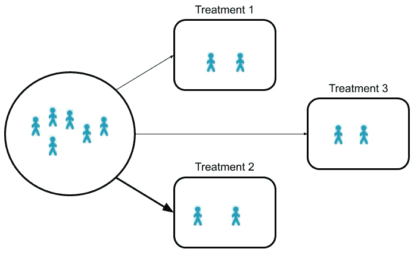

# 研究设计+统计测试

> 原文：<https://towardsdatascience.com/research-design-statistics-tests-17cbba5d3aed?source=collection_archive---------9----------------------->

## 调整研究设计和统计分析

图片由 [PIRO4D](https://pixabay.com/users/PIRO4D-2707530/?utm_source=link-attribution&utm_medium=referral&utm_campaign=image&utm_content=2037286) 来自 [Pixabay](https://pixabay.com/?utm_source=link-attribution&utm_medium=referral&utm_campaign=image&utm_content=2037286)

从我坐在本科“研究方法”课上盯着 SPSS 输出的第一天起，我就知道我找到了自己的使命。我仍然记得我的第一篇研究论文。看着我的完成的调查进来，勤奋地清理数据，祈祷有重大的结果。尽管我的成绩并不显著，但我知道我找到了激情。

尽管我全神贯注于这个话题，但我发现将研究设计与统计分析结合起来特别困难。随着术语的出现(即 t 检验、方差分析、效应大小、IV、方差分析、协方差分析、回归、R 等。)我变得更加困惑和沮丧。设计实验、分析和解释结果时使用的大量术语可能是一个令人生畏的现实。

尽管要完全描述每个研究设计的深度本质以及适当的统计模型，我们需要一本冗长的教科书，但我希望提供一个简明的摘要。下面是研究设计原则和用于分析数据的适当统计模型的高度概括。

# 变量

一个实验要被认为是真正的实验，需要一些操作。换句话说，我们需要强加给我们的研究参与者，并衡量这种强加的效果。这就是自变量和因变量发挥作用的地方。

*   **自变量(IV):** 被研究者主动操纵的变量。根据研究设计，我们可以有多个静脉注射，每个静脉注射可以有多个“水平”,参与者必须接受这些水平。比如，教学风格的类型是否影响学生的考试成绩？这项研究的唯一 IV 将是教学风格，它将有 3 个独特的水平(即。专制的、权威的、放任的)。
*   **因变量(DV):** 假设受 IV 影响的变量。这也是研究测量的变量，以确定静脉注射有什么影响，如果有的话。在我们的例子中，学生的考试成绩将是唯一的 DV。

# 测量标度

任何研究的基础都是数据的收集和分析。根据研究设计、假设和数据收集方法，我们可以有四种类型的定量数据。每一种衡量尺度都有不同的属性，这些属性决定了特定统计分析的使用。

## 分类变量

*   **名义的/分类的:**简单标记或分类的数据，没有顺序或可测量的意义。可以采用字符串和/或数字格式。(即。地点:芝加哥、旧金山、亚特兰大或性别:1，0)。
*   **有序**:有标签的测量数据，可以按顺序排列，但我们不能用数字区分每次测量之间的间隔。可以排序和分级的分类数据(即你的最高学历是什么？(A)低于 HS，(B) HS，(C)某些学院，(D)学士学位，(E)研究生学位)

## 连续变量或数值变量

*   **区间**:经过标记和排序的数字数据，其中类别之间的距离可以比较，但零的概念不存在，每个值之间的距离相等(即。李克特等级量表:非常同意=5，同意=4，中立=3，不同意=2，非常不同意=1)
*   **Ratio** :标记和排序的连续数据其中类别之间的距离可以比较，零的概念存在，可以包含负值(即。你多大了？10、22、23、50 等。)

# 组间与组内

*   组间设计将研究参与者分成不同的组或条件(即对照或一个治疗组)。在整个实验中，参与者只能属于一个组。每个参与者只接受静脉注射的一个级别。

*   组内设计将相同的研究参与者放入 IV 的所有水平。通常被称为“重复措施”设计。

# 参数与非参数

为实验选择合适的统计检验的主要参数是数据分布的形状。正态或高斯分布遵循一个钟形曲线，如下图所示。

钟形曲线

*   参数测试假设数据呈正态分布，并包含区间或比率数据。
*   非参数检验对数据的分布不做任何假设，并且包含序数或名义数据。
*   直方图和 QQ 图是可视化数据分布以确定正态性的好方法

# 参数测试

*   **皮尔逊 r 相关:**衡量两个变量之间的线性关系。静脉注射和静脉注射都必须成比例(即连续)。
*   **回归:**回归有两个主要目的。首先，它用于评估 DV 和一个或多个 iv 之间的关系强度。它可以通过帮助我们确定每个 IVs 对 DV 的影响程度来推断因果关系。预测值是它的第二个目的。根据 IVs 和 DVs 的类型以及数据的参数质量，有多种回归类型。线性回归用于预测连续变量(即工作表现)只有一个 IV。逻辑回归用于预测二元结果(即是/否)与多个静脉注射。多元回归用于预测连续的结果(即工作表现)与多个 iv(即智商测试成绩，性格测试成绩等。).
*   **单样本 t 检验:**将样本的平均值与已知或假设值(通常是已知总体平均值)进行比较，以确定它们是否有显著差异。
*   **独立样本 t 检验:** *组间设计。*比较两组独立研究参与者的平均 DV 分数，每组参与者仅暴露于静脉注射中的一个组/水平，而静脉注射仅具有 2 个组/水平。DV 是连续的。比如教学风格对学生考试成绩有什么影响。选择两组随机选择的学生。第一组由威权老师授课，第二组由权威老师授课。我们比较平均 DV(即测试分数)来确定它们是否显著不同。为了检验方差的均匀性，我们可以使用 Levene 检验。
*   **配对 t 检验:** *组内设计。*比较随机选择的受试者在静脉注射时暴露于两个组/水平的平均 DV 分数，静脉注射只有两个组/水平，且只有一个静脉注射。通常，使用前/后测试设计。有时也称为“从属样本 t 检验”。例如，在一个学期的课程中，相同的学生被两种类型的老师(权威型和独裁型)教过。将第一位教师所教材料的学生平均考试分数与第二位教师的平均考试分数进行比较。这种设计通常利用 DV 设计的治疗前/后测量。除了直方图和 QQ 图，夏皮罗维尔克检验也可用于确定正态性。
*   **单因素方差分析** : *组间设计。*比较随机选择的参与者的平均 DV 分数，每个参与者仅签署了 IV 中的一个组/级别。IV 有 2 个以上的组/级别，而我们只有一个 DV。例如，选择三组随机选择的学生。第一组由权威型教师授课，第二组由权威型教师授课，第三组由宽容型教师授课。单因素方差分析比较了所有三种教学风格的学生分数。通常称为“组间方差分析”。DV 是一个区间或比率(即连续)。单因素方差分析是一种综合检验，因为 p < 0.05 拒绝零假设，以确定组间存在显著差异。然而，为了确定差异的具体位置及其大小，我们进行了专门的测试(即图基，邓尼特)
*   **重复测量方差分析:** *组内设计。*比较参与者的平均 DV 分数，这些参与者都暴露于多于 2 组/水平的一个 IV，而我们只有一个 IV。例如，不是两个老师，我们现在有三个老师教所有的学生。重复测量方差分析是一个综合检验，因为 p < 0.05 拒绝零假设，以确定至少两组之间存在显著差异。Bonferroni 特别测试将确定差异所在。DV 是区间或比值(即连续)并测量 n 次，其中 n = IV 级条件的数量。
*   **双因素方差分析:** *组间设计。*比较随机选择的参与者的平均 DV 评分，这些参与者仅接受了一组/一个级别的静脉注射，而我们接受了不止一次静脉注射。三向方差分析有三个 iv。双向方差分析试图确定一个以上静脉对静脉的影响。这也是一个很好的测试来确定两个 iv 的相互作用是否会影响 DV。双向 ANOVA 的结果将分别定义每个 IV 和 DV 之间的主要效应，然后是 DV 上的交互效应。例如，我们随机选择了几组学生。我们的第一个 IV 是教师类型(即。专制的，权威的，放任的)我们的第二个 IV 是学生是否在白天或晚上被教导。这是一个 3x2=6 析因设计，因为我们有三种教师类型和两种教学时间条件。每个学生只被安排到六个条件中的一个条件下，比较平均测试分数以确定六个组之间是否有显著差异。
*   **单向方差分析:** *组间设计。*比较随机选择的参与者的多个平均 DV 分数，这些参与者仅暴露于静脉注射的一个组/水平。我们有一个静脉注射，但我们有两个或更多的静脉注射。例如，教学风格(专制、权威、放任)对学生成绩和旷课有什么影响？每个学生被分配到四年级的三个小组/级别中的一个，并对他们的考试成绩和旷课情况进行测量。教学风格是我们有三个级别的一个 IV，但我们有两个 dv，学生的分数和旷课。
*   **双向方差分析:** *组间设计*。比较随机选择的参与者的多个平均 DV 评分，这些参与者仅暴露于静脉注射的一个组/水平，我们有多个 DV。例如，教学风格(专制、权威、放任)和学习时间(白天或晚上)对学生成绩和旷课有什么影响？这是一个 3x2=6 的设计，因为我们在第一个 IV 上有三个组/级，在第二个 IV 上有两个组/级。在教学风格 IV 和学习时间 IV 之间，每个学生只接触六个组/级别中的一个，并测量他们的考试成绩和缺勤率。教学风格是 IV，学习时间是第二个 IV，我们有两个 dv，学生成绩和旷课。该试验还将确定所有 iv 和两个 dv 之间相互作用的影响。
*   **单向重复测量方差分析:** *组内设计。*比较暴露于超过 2 组/水平的 one IV 的参与者的多个平均 DV 评分，我们有多个 DV。每个学生都接触到教学风格 IV 中的所有三个组/级别，并测量他们的考试成绩和缺勤率。教学风格是 IV，我们有两个 dv，学生成绩和旷课。
*   **双向重复测量方差分析:** *组内设计。*每个学生都接触到所有 6 个组/级别(教学风格 IV 中的三个组/级别和研究时间 IV 中的两个组/级别),并测量他们的考试成绩和缺勤率。教学风格是第一个 IV，学习时间是我们的第二个 IV，我们有两个 dv，学生的分数和旷课。
*   **ANCOVA** :用于控制一个或多个变量对 DV 的影响。比如在控制年龄的情况下，教学风格对学生考试成绩有什么影响？换句话说，我们知道考试分数受到几十个甚至几百个变量的影响，但我们无法测试所有的变量。因此，我们对一些特定变量如教学风格形成假设，但如果我们想消除年龄对考试成绩的任何影响，我们使用 ANCOVA。为了消除年龄的影响，我们需要记录每个研究参与者的年龄。

# 非参数检验

*   **Spearman 秩相关:**两个变量之间单调关系的度量，可以是序数，也可以是比值。单调关系表示变量倾向于以相同或相反的方向移动，但不一定以相同的速率移动。
*   **曼-惠特尼检验:** *组间设计*和非参数版本的独立样本 t 检验。DV 要么是区间，要么是比值(即连续)。
*   **Wilcoxon 符号秩检验** : *组内设计*和非参数版本的相关样本 t 检验，有时称为“配对 t 检验”。DV 要么是区间，要么是比值(即连续)。
*   **Kruskal-Wallis 检验:** *组间设计*和非参数版本的单因素方差分析。DV 要么是序数要么是比率(即。连续)。Kruskal-Wallis 检验是一个综合检验，Mann-Whitney U 检验将有助于确定存在显著差异的地方。
*   **Friedman 检验:** *组内设计*和重复测量方差分析的非参数版本。为了确定差异存在于何处，我们必须对 IV 水平的所有独特组合进行 Wilcoxon 符号秩检验。
*   **卡方检验:** *组间设计。*使用两个分类变量之间的观察值的频率表来确定变量之间的关联。例如，我们希望确定数据科学家的性别与他们使用 python 还是 r 之间是否存在关联。使用 python 或 r 的男性和女性频率的交叉表)。如果“皮尔逊卡方”p 值小于 0.05，我们可以拒绝零假设，并得出结论:性别与使用 python 和 r 之间存在关联。用于评估分类变量之间的关联而非因果关系。

# 定量研究与定性研究

从最宏观的角度来看，我们有两个截然不同的研究类别；定量和定性。在这篇文章中，我们将把重点放在定量研究上，但是理解两者之间的区别是很重要的。

*   定量研究处理通过评估收集的数字数据，使用统计方法进行分析，以比较实验组和推论。 ***使用数字*** 确认/测试
*   定性研究遵循探索性方法，希望探索思想、理论和假设。其数据采用观察、一对一访谈、焦点小组、开放式调查项目、历史记录和案例研究(即主要是文字不是数字)。数据分析试图总结、分类和解释主题，而不是因果推理。 ***理解使用词语***

# 定量研究设计

一般来说，有 4 种类型的定量研究设计:

*   描述的
*   比较
*   准实验性的
*   实验的

# 描述性研究设计

*   描述性的或探索性的(即。数据挖掘)在本质上，描述性设计旨在根据频率、趋势、类别/比较和人口统计学来描述一种现象。它希望对*的内容、时间、地点和方式*有所了解，但提供的因果关系证据非常薄弱。为什么)。
*   研究者可以控制研究参与者的取样策略
*   不包含变量操作(即。自变量和因变量)

## 方法

*   描述性研究依赖于向参与者询问与研究主题相关的问题。
*   调查或问卷(李克特、频率、配对比较、星级评定、行为锚定评定)
*   观察收集的数字数据(即。多久，多少，什么日期，年龄，性别，体重等。)

## 分析

*   描述性统计，如计数、百分比、平均值/众数/中位数、标准差
*   使用图表和可视化来传达见解

## 样本研究问题:

*   在过去 2 年中，员工参与度发生了怎样的变化？
*   主动离职的主要原因是什么？
*   员工更喜欢培训 X 而不是培训 Y 吗？
*   高绩效者和低绩效者之间的平均工资差异是什么？
*   哪些招聘来源带来了高质量的候选人和大多数雇员？
*   在我们的服务人员中，脱离有多普遍？

# 比较研究设计

*   有时被称为“相关性”研究。
*   旨在定义两个或多个结构之间的统计关系。(即。一个变量的变化与其他变量的变化有什么关系？)
*   变量之间的关系在本质上是历史性的，因为它们可能在未来发生变化。
*   很像描述性设计，它也提供了趋势和模式。
*   虽然在提供因果证据方面强于描述性设计，但总体而言仍然较弱。
*   绝对没有直接变量操作(即。因变量和自变量)。

## 方法:

*   调查和问卷(李克特、频率、配对比较、星级评定、行为锚定评定)
*   观察收集的数字数据(即。多久，多少，什么日期，年龄，性别，体重等。)

## 分析:

*   相关性计算变量之间的关系。
*   相关性:正，负，零，曲线，多重相关性，部分相关性
*   皮尔逊相关:在连续的线性相关结构中使用最广泛的相关。
*   Spearman 等级和 Kendall Tau 等级相关性:类似于 Pearson 相关性，但对变量之间的非线性关系更稳健

## 样本研究问题:

*   工作绩效和认知能力有什么关系？
*   年轻员工辞职的可能性更大还是更小？
*   培训评估分数越高，工作表现越好吗？

# 准实验设计

*   通常被称为“自然实验”，因为它们是在自然环境中进行的。
*   它们通常涉及某种治疗(IV ),该治疗被假设为影响 DV。
*   自变量存在于研究设计中，但通常没有被研究者操纵。
*   研究者测量自变量对因变量的影响。
*   研究组和对照组的参与者都在场，但都是自然形成的，因此不存在随机分配。
*   研究组和对照组之间可能的差异引入了未知的混杂变量，这些变量可能会调节或调节结果。

## 方法:

*   非等效组设计:组间设计(即参与者仅被分配到一个研究组、实验或控制组)，其中参与者不被随机分配到这些组。
*   前测-后测设计:在治疗前测量因变量以获得基线，然后在治疗后再次测量以确定自变量对因变量的影响。时间量(即混杂变量)对我们的独立变量影响因变量的置信度有很大的影响。**历史**:测试前/后之间发生的事件；**成熟**:研究对象的自然成长/学习)。

## 分析:

*   使用哪种统计检验取决于研究的设计(静脉注射次数、静脉注射水平、静脉注射次数、组间或组内等)。
*   t 检验，方差分析，回归，相关性

## 样本研究问题:

*   患者保护与平价医疗法案的引入对员工缺勤有影响吗？
*   男性的离职率更高还是女性更高？

# 真实实验

*   有些人会说，我们永远无法真正确定因果关系，但真正的实验设计最接近于建立因果关系。
*   真实实验的主要区别在于将研究参与者随机分配到研究组。随机分配是建立平等参与者群体的最彻底的方式。这有助于我们对可能影响 DV 的可能混杂变量进行控制。
*   根据研究设计，一个真正的实验可以有多个 iv，所有 iv 都可以有多个水平。
*   根据研究设计，一个真实实验可以有多个 dv。
*   使用不接受实际治疗的参与者对照组。
*   根据学生的设计，会使用同盟者或假装成参与者的研究人员。

## 方法:

*   前测后测对照组设计:所有的研究参与者都被给予前测以建立 DV 的基线评分。实验将静脉注射/操纵强加给参与者。最后，进行后测试以确定静脉注射对静脉注射是否有任何影响。
*   仅后测对照组设计:类似于上述设计，但省略了前测。通过比较治疗组和对照组之间的 DV 评分来确定静脉注射对 DV 的影响程度。
*   所罗门四组设计:上述设计的组合。第一组参与者接受了前测/干预/后测。第二组进行前测和后测，但不进行干预。第三组接受干预和后测，但不接受前测。最后，第四组只接受后测。

## 分析:

*   使用哪种统计检验取决于研究的设计(静脉注射次数、静脉注射水平、静脉注射次数、组间或组内等)。
*   t 检验、方差分析、回归、相关性等。

# 样本研究问题:

*   各种级别的加薪是如何影响员工满意度的？
*   药物 X 能降低抑郁程度吗？

# 摘要

我们当然可以将这篇文章无限延伸，因为统计学和研究设计的领域相当广泛。我真的希望这是对统计分析和研究设计的有益总结。