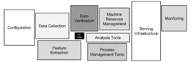
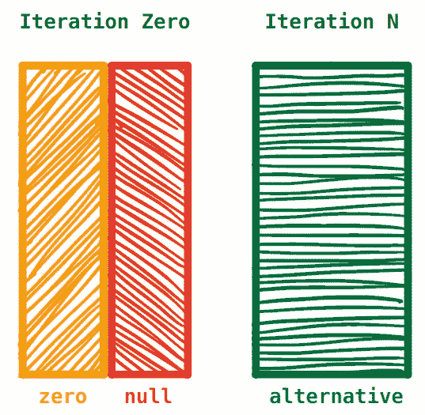
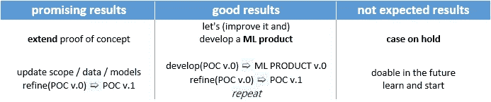

# 机器学习项目的研究指南

> 原文：<https://towardsdatascience.com/research-guidelines-for-machine-learning-projects-3a137c008277?source=collection_archive---------31----------------------->

## 有一个简单的目标，但有多种方法来实现它的重要性。

机器学习项目可以分两个阶段交付。第一阶段被称为**研究**，是关于回答这样一个问题:我们能从这堆数据中制造出一个机器学习模型来满足客户的需求吗？可交付成果是一个*概念验证*或一个*可行性研究*。第二阶段被命名为**开发**，它是关于承诺交付一个机器学习产品。这个阶段的可交付成果是一个机器学习产品。

在研究阶段，当项目资源有限且时间紧迫时，我认为有两个主要方面是相关的:首先是定义问题范围的重要性，其次是使用短迭代测试模型的重要性。

# 范围

这个阶段最困难的任务之一是确定你努力的范围。例如，考虑使用文件；您可以选择使用实时数据(与实时数据库连接)或直接从文件中读取数据。使用数据库意味着你需要访问基础设施，处理认证，以及依赖于公司可以延迟项目开始的事情；另一方面，您可以请求转储数据，并在第二天开始工作。

关于*范围界定练习*的好(坏)的一面是它缩小了你所有可能的行动。在某种程度上，这很好，因为您去掉了交付概念证明不必要的所有东西:

*   **关注单一问题。如果问题太大，把大问题分成许多小问题(各个击破)。例如，如果你的问题是全球性的，那么重新确定你的问题的范围，将其扩展到整个大陆，或者只关注一个国家。你也可以通过重新规划问题的时间跨度来降低复杂性(例如，关注特定的日期范围:去年、十年等等)。**
*   范围不是一成不变的，你应该*对它保持敏捷*。当你深入业务领域并获得更多处理数据的经验时，有时你会*转移*你的范围。这是我在研究中使用**看板**而不是 Scrum 的原因之一，因为它更灵活。
*   直到你有了零模型(解释如下)，你才知道你是否有足够的数据。但我要告诉你一个秘密:在机器学习中，你永远不会有*太多的数据*，但你*可能会有*有偏差或不具代表性的数据，这可能会给你的推论带来一些问题。如果你有太多的数据，你总是可以*缩减采样*你的数据集；但是如果你的样本太少，*上采样*(增强)技术可能会给你的数据集增加一些不必要的变化。总而言之，如果你有很多选择，那么选择最大的一个。
*   这个问题应该可以用一台计算机来解决。除非，如果你正在使用深度学习模型，那么你需要在计算机中添加一个或多个 GPU。您可以使用自己的机器，也可以使用客户端 VNET 中的虚拟机(当数据敏感时推荐使用)。如果您需要 spark 集群来转换您的数据，请再次考虑您的问题范围。
*   向客户传达验收标准。这一点是关于与客户协商什么将是项目的**可交付成果。**重点:这还不是一个 ML 产品，而是一个概念验证，例如，你真的需要一个[蓝绿部署](https://martinfowler.com/articles/cd4ml.html)？也许您更愿意使用`flask`将模型部署为 REST API？或者只是将模型的预测保存在一个 excel 文件中，以便以后由业务专家审查，这样做是否有效？
*   验收标准是您的积压工作(Jupyter 笔记本或 python 模块、docker 或本地部署、项目日志、模型工件、模型预测等)的驱动因素之一。最终，客户还应该解决**指标**和/或*条件标准*(如何评估您的解决方案的良好性)(在下一节中会有更多相关内容)。
*   这种关注应该提高简单性，因为它减少了时间和精力。研究阶段的目标应该是尽快找到 ML 产品可行性的答案。在决定范围和验收标准时，请记住这个问题。
*   *概念验证*不同于*一次性原型*。这个阶段投入的所有努力，都应该是未来产品的一部分。大多数情况下，数据科学家的经验不仅对重用学到的知识，而且对重用源代码和基础架构都有影响。机器学习工程师应该帮助解决这些问题(例如，实施最佳实践)。
*   如果还不够清楚的话，我在这一节重复了五次“专注”这个词(现在这是第六次)。现在有意义吗？

# 模型检验

免责声明:大多数人认为构建模型是 ML 项目中最复杂的部分。但事实并非如此。并不是因为很有可能你需要的 ML 算法已经在 sklearn、h2o 或者 pycaret 这样的库中实现了。我甚至不打算提及 autoML 技术或像 R 或 Julia 这样的语言中可用的 ML 库。

坚持基础；这些会解决你 90%的项目。一旦你理解了基础知识，你就可以大胆地使用更复杂的 ML/DL 算法。一旦你使用了算法，就更容易掌握它们的理论和基本原理，所以不要认为你需要完全理解它们才能使用它们。这是[杰瑞米·霍华德](https://twitter.com/jeremyphoward)在他们的[课程](https://course.fast.ai/)中使用的学习技巧，我认为对于像我这样的非博士来说，这是一个极好的学习方法。

那么，如果建立模型不是最难的部分，那是什么呢？ML 模型的其余部分，如特征工程、服务模型等。

[机器学习系统中隐藏的技术债务](https://papers.nips.cc/paper/5656-hidden-technical-debt-in-machine-learning-systems.pdf)

所有这些其他部分的大部分都超出了本文的范围(其中一些属于研究阶段之后的开发阶段)。

## 迭代方法

在你的模型的零迭代期间，我建议你尽快建立你的模型并收集它的预测。争取最快的胜利，例如:减少你的特征工程，只把非数值特征转换成数值特征，建立一个简单的模型。你想要得到的理想结果是，这个*零*模型预测优于随机选择或*汇总度量*(均值、中值等)数字，这是最基本的预测(不涉及机器学习，只是纯*算术*)。

PS:如果第一次尝试没有成功，不要沮丧。这只是漫长旅途的第一步。

模型检验

你在迭代 0 的前半部分获得的模型，我称之为*零模型*。在迭代 0 的另一半期间，您将通过更新训练数据集来构建更好的模型(例如，更积极地预处理数据*或优化您的模型*超参数*等)。我把第二个模型叫做*零模型*。*

在接下来的迭代中，您将构建*替代模型*，扮演空模型的对等物。这个过程类似于你做*假设检验*时，你弄清楚你是否在正确的轨道上相互比较模型。我的工作方式是，我尽量完成 ***至少*两次迭代**，测试两个不同的模型。但是俗话说“越多越好”，你只受你可支配时间的限制。

## 韵律学

根据您使用的 ML 模型，您将最终使用一个度量标准。例如，对于回归问题，可以使用 [RMSE](https://medium.com/usf-msds/choosing-the-right-metric-for-machine-learning-models-part-1-a99d7d7414e4) ，对于分类问题，可以使用[精度](https://medium.com/usf-msds/choosing-the-right-metric-for-evaluating-machine-learning-models-part-2-86d5649a5428)。此外，度量用于跟踪 ML 模型的进展，因此您可以测量数据/模型超参数的变化如何影响模型的预测。你的实验应该总是由度量驱动的。选择正确的指标和选择模型本身一样重要，你应该知道“天下没有免费的午餐”。你需要试验并检查什么对你的问题更有效。

大多数时候，涉众对 RMSE(或任何其他 ML 度量)一无所知；但是你有责任向他展示所选的指标与业务目标一致。在这种情况下，您有两个选择:a)如前所述，解释 ML 指标的含义并证明其重要性，或者 b)开发一个平行的业务指标。业务指标是以*业务领域*单位表示的指标。例如，在网上服装店的推荐者的情况下，业务指标可以评估模型推荐与被推荐人性别相同的产品的情况。业务度量更容易被涉众理解，最终，它将成为你的模型的重要驱动力。

每次迭代/实验都需要被记录。您需要记录的最低限度是您的培训结果:结果指标。为此，Jupyter 笔记本可以作为一个简单的日志。从那里，您可以使用更优雅的解决方案，这将允许您不仅跟踪指标，而且跟踪用于训练或生成的模型的数据(以及用于获得它的超参数): [mlFlow](https://mlflow.org/) ，[weights&bias](https://www.wandb.com/)，…

**研究阶段**有三个成果:

研究阶段成果

在有希望的结果，但不足以满足条件标准的情况下，最好的选择是扩展概念证明；为了改善您的模型结果，您可以尝试更改数据预处理和/或机器学习模型。最好的结果是，模型满足条件标准，从而进入开发阶段；在这种情况下，最好的做法是开发与概念验证相分离的实际产品，同时改进当前的概念验证。当当前模型不满足条件标准时(例如，缺少数据，或者缺少更好的机器学习算法来对问题建模)，您可以暂停案例，直到案例的上下文发生变化。

如果你对这类问题感兴趣，我向你推荐这本书:[管理机器学习项目](https://d1.awsstatic.com/whitepapers/aws-managing-ml-projects.pdf)，来自[亚马逊的机器学习大学](https://www.amazon.science/latest-news/machine-learning-course-free-online-from-amazon-machine-learning-university?es_id=8aea00348c)。

下一篇帖子将更具技术性，我将深入研究我在研究阶段使用的一些工具和技术。敬请关注。