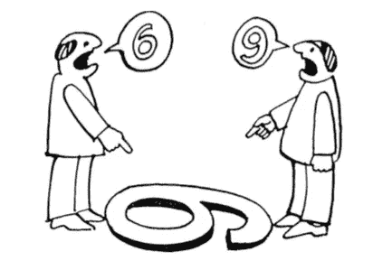
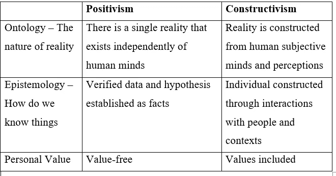

# 发展背景下的研究:研究人员观察世界的视角

> 原文：<https://towardsdatascience.com/research-in-a-development-context-the-lens-through-which-researchers-view-the-world-838c9b03dcaf?source=collection_archive---------50----------------------->

## 实证主义和建构主义。

图片[由 Pixel2013](https://pixabay.com/users/pixel2013-2364555/) 到 [Pixabay](https://pixabay.com/photos/viewpoint-telescope-distant-3593304/)

我从来没有真正理解过研究范式的概念，以及它对做研究有多重要(当我试图理解这一点时，我真的很紧张)，直到我不得不为我的硕士后研究做一个与这个术语相关的作业。我希望这篇文章可以帮助你们中的一些人。

# **作为一套基本信念的研究范式**

你是否曾为制定一份研究计划而苦苦挣扎？理解你自己的信念是发展研究方法的第一步。为什么？因为它将指导你的研究设计，决定你如何收集数据，并影响你解释研究结果的方式。

从这个意义上说，理解研究范式的概念是至关重要的，研究范式被定义为“一套基本信念[……]提出了一种世界观，并规定了[……]世界的性质”(Guba & Lincoln，1994，第 107 页)。用简单的语言来说，我们可以将**范式描述为一个概念透镜，通过它我们可以观察世界并指导我们如何解决问题。**范式基于三个哲学假设/组成部分，包括本体论、认识论和方法论。在本文中，我将着重解释两种主要研究范式的本体论和认识论假设，包括实证主义和建构主义。

得到💬任何数据科学或编程问题的 GPT 式答案。为成千上万的人生成摘要和学习笔记📚只需一次点击即可获得学习资源。👉

 [## 面向数据科学家和开发人员的免费学习资源。精选的博客、教程、书籍和…

### 机器学习和人工智能工程师的培训课程、黑客马拉松、活动和工作

aigents.co](https://aigents.co/learn) 

# **本体作为现实的本质**

Guba 和 Lincoln (1994)认为，本体论哲学是指关于现实的信念，这涉及到关于现实本质的**问题。**

实证主义在本体论上被假定为“天真的现实主义”，这意味着**存在一个独立于人类思维并受宇宙法则支配的现实，等待被发现** (Guba & Lincoln，1994)。换句话说，现实既不是我们头脑中的东西，也不受制于我们的经验。研究的作用是通过数据和科学来揭示这一真相。实证主义者声称，一件事可以是真实的，不管背景、文化和研究者的观点如何。另一方面，后实证主义理论确认了现实的存在和可观察性，但在给本体论贴标签方面迈出了一大步，这就是“批判实在论”(Sumner and Tribe，2004)。具体来说，后实证主义者认为存在一个现存的现实，然而作为人类，研究者的智力是有限的，这使得他无法完全和完美地理解现实。因此，观测结果可能会有误差，而事实是可以修改的。

从不同的角度看问题。[来源](https://www.pinterest.com/pin/370561875567144715/?nic_v1=1aYQDRSK5y5PnvTxGF0aN9w5GSe8C8KvY4omwd9YLBz5sF94kaVi2GtgiERFTzxaZm)

建构主义的本体论哲学与实证主义相去甚远。本体论被贴上了“相对主义”的标签，它假定不存在超越和独立于人类经验的单一现实。**现实是由人类的主观思想和感知构建而成的**。单独构建，可以有多种真理，而且同样有效。因此，研究者在研究过程中必须意识到不同的背景、文化和他们的个人价值观。前几天，我从我的一次演讲中听到了一句名言。它说“你是对的并不意味着我是错的。你只是没有从我的角度来看生活。”而且有时候对错的界限很细，没有上下文，很难说。

**以贫困的概念为例**。实证主义者声称贫困作为一个独立的现实存在，并被认为是基本需求的未能实现。与此同时，建构主义者认为客观贫困本身并不存在。人在一定背景下是贫穷的，只有通过背景和人之间的适当互动才能理解贫穷。实证主义和建构主义如何界定贫困的一个具体例子可以在这两项研究中找到:Dollar 和 Kraay (2002 年)进行的*增长对穷人有好处*(实证主义方法)和 Narayan (2002 年)实施的*穷人之声*(建构主义方法)。纳拉扬研究中使用的贫困定义是一个更广泛的贫困定义，包括非经济层面，包括安全、脆弱性和赋权。与此同时，Dollar 和 Kraay (2002)只研究了贫困的经济概念，或者说收入贫困。

> 人在一定背景下是贫穷的，只有通过背景和人之间的适当互动才能理解贫穷

# **作为知识本质的认识论**

“认识论”这个术语听起来确实很奇特，但是用简单的语言来说，认识论解决了这个问题**“我们如何认识事物？”，“我们如何认识现实？”**

如萨姆纳和部落(2004)所述，认识论是哲学的一个分支，关注知识的性质和范围。实证主义通过假设检验，将知识验证为可以通过可靠的数据和工具进行实证检验的事实。Posivitism 研究者构建假设并收集数据，通过可靠的设计，验证假设和知识。因此，实证主义的认识论观点被称为“二元论/客观论”。它再次在于相信人类的思想和物质是分开存在的，无论研究人员是谁，研究结果都保持不变。

相比之下，建构主义认为知识是主观的，因为它是社会建构的，并且依赖于心智(Creswell，2003)。建构主义的认识论被贴上“主观主义”的标签，并强调研究者的感知是解释他或她的经验的有用工具，因此也解释了真理。在这种情况下，理论从研究者的经验中浮现，被称为演绎推理。

也就是说，在上面提到的贫困例子中，实证主义认为，所有研究人员需要做的就是收集数据，比如说收入，并从中得出关于贫困状况的结论。然而，建构主义认为，贫困与收入和一个人划定的界限无关。它与人们对生活的感受以及驱动他们体验的因素有关。为了理解这一点，在调查过程中，研究人员需要与人互动，将自己置于环境中，了解文化，以理解贫困在社会环境中的真正含义。

# 个人价值的位置在哪里？

关于价值在探究过程中的作用，实证主义提倡无价值研究，这是其“主观主义”认识论立场的结果。价值观被视为混淆变量，会影响研究结果的主观性，因此在研究过程中没有地位。

建构主义的假设；相比之下，要特别强调研究人员给调查过程带来的价值。建构主义者将价值观视为形成研究成果的核心角色，特别是在社会研究中，因为在建构主义社区中，人们相信不同的研究者对世界的看法和体验是不同的。

Eyben (2014，第 164 页)建议，研究者应该有反思性实践，这鼓励他或她“对照观察来测试不同的解释模型”。然而，人们应该非常小心，因为反身性在某种意义上是棘手的，个人价值观和地位会对人们感知和选择感知事物的方式产生巨大影响。当进行研究时，这可能会导致偏见，因为研究人员可能会选择性地看待这个问题。他或她可能不会客观地解释事情，而是以一种支持他或她自己先前信念的方式来解释。

汇总表——作者插图

# **我在哪个信仰体系中定位自己？**

本体论和认识论立场的结合将使你对你如何看待现实和你理解知识的方式有一个整体的看法。一旦你确定了这一点，你将能够开发最适合你的信念的研究方法和设计，这将肯定有助于提高你的研究质量和一致性。

也就是说，我进行研究的方法符合后实证主义的假设。本体论的立场是迄今为止将我的研究方法与建构主义区分开来的最合乎逻辑的理由。本体论的概念在我心中提出了这个问题:作为研究者，我们是在创造现实还是在寻找现实？这是驱动我的研究方法的特殊点。在我看来，现实有待发现，研究人员的角色是通过基于良好数据和证据的科学获得真相。然而，在过去几年里，我也认识到，事情可能非常复杂，数据有时会掩盖复杂性。我仍在学习看到生活的灰色地带，而不是只看到事物的黑白。

感谢您的阅读！

# **参考文献**

Eyben，R. (2014 年)。*国际援助和创造一个更美好的世界。反身实践*(第 154-172 页)。伦敦&纽约:劳特利奇。

古巴和林肯(1994)。定性研究中的竞争范式。在 N.K. Denzin & Y.S .，Lincoln(编)，*《定性研究圣人手册》*(第 105-117 页)，千橡市，加州:圣人。

坎布尔和谢弗(2007 年)。认识论、规范理论和贫困分析:实践中 Q 平方的含义，*世界发展*， *35* (2)，183–196。

谢文思(2003 年)。《伦理问题》，载于:Scheyvens，R. & D. Nowak *《发展实地工作:实践指南》*。伦敦:鼠尾草。

萨姆纳和部落，M. (2004 年)。发展研究中认识论和方法论的本质:我们所说的严谨是什么意思？，会议论文发表于:DSA 年度会议，连接研究与政策，伦敦。

c .瓦格纳、b .卡乌利希和 m .加纳(编辑。).(2012).*做社会研究:全球背景*。纽约:麦格劳-希尔高等教育。

Youtube 视频[阿姆加德巴德维](https://www.youtube.com/channel/UCiHcz1gsAEap9G_MyyZfMdw):[https://www.youtube.com/watch?v=kf8wGvunyG8](https://www.youtube.com/watch?v=kf8wGvunyG8)