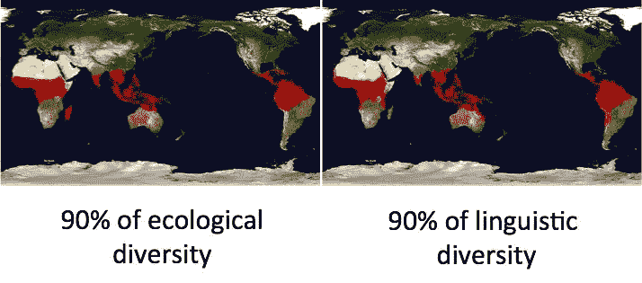
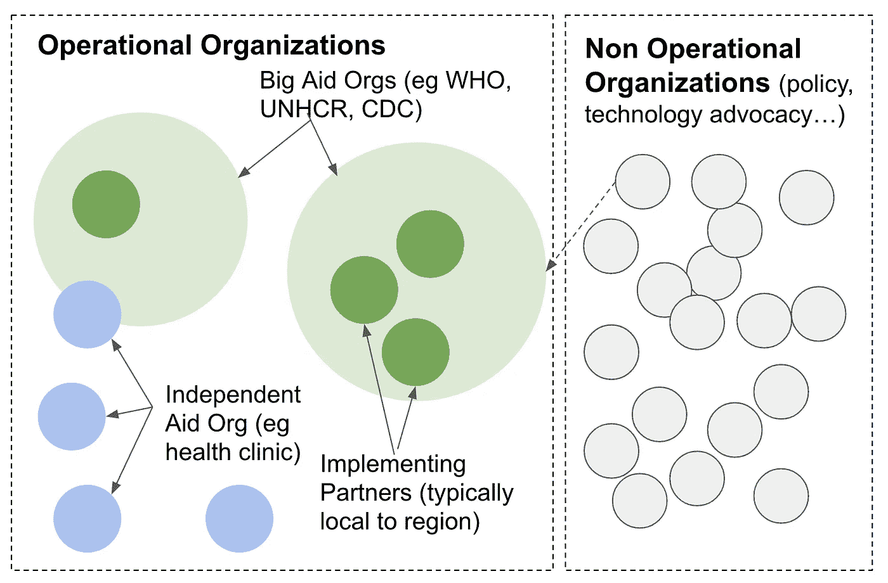

# 用于灾难响应的机器学习研究:什么构成一篇好论文？

> 原文：<https://towardsdatascience.com/research-on-machine-learning-for-disaster-response-b65f3e97c018?source=collection_archive---------33----------------------->

2021 年，一个主要的自然语言处理会议将首次有一个专门讨论灾难响应的轨道。也是第一个有这个赛道的机器学习或者语言学大会！计算语言学协会[欧洲分会第 16 次会议(EACL 2021)有一个关于“紧急情况和危机管理的 NLP 应用”的专题。](http://eacl2021.org)

我很高兴成为这条赛道的高级区域主席！我在机器学习和灾难应对领域工作了 20 年，我很高兴现在有更多的人在研究机器学习如何在最关键的时候帮助人们。

 [## EACL 2021

### 计算语言学协会欧洲分会第 16 届会议邀请提交…

2021.eacl.org](https://2021.eacl.org/calls/papers/) 

一篇关于机器学习用于灾难应对的论文的大部分内容应该与应用科学中的任何其他论文相同:可重复的方法，这些方法明确地推进了我们关于如何部署和评估机器学习技术的知识。

然而，灾害应对的某些方面使得科学的某些方面变得更加重要，还有一些方面是灾害应对所独有的。有些是从事医疗保健工作的研究人员所熟悉的，但有些来自国际发展。这里总结了本文中涉及的要点:

1.  大多数救灾工作是帮助受危机影响的社区自助。因此，增强受灾社区能力的工具是最有价值的，尤其是使用低资源语言的人。
2.  对于专业救灾人员来说，信息管理是一个比信息发现更大的问题。
3.  专注于灾难应对机器学习的论文不应该在科学上走捷径。
4.  研究实验室建立的论文推广系统在灾难应对中没有地位。
5.  在灾难期间不可能完全评估数据的敏感性，因此对正在发生的灾难的响应应该默认为私有数据实践。
6.  救灾经常被用来掩盖侵犯人权的行为，特别是在独裁政权下，因此应该拒绝来自独裁政权的可能侵犯人权的研究。
7.  研究人员不应该与非运营援助组织合作，应该知道如何发现运营和非运营组织之间的差异。
8.  英语社交媒体处理对于灾难响应者来说并不有趣或有用。
9.  忽略任何依赖发表在“ISCRAM”上的研究。
10.  应用“无害”原则来评估影响。

当我对每一个进行扩展时，我将分享我自己经验中的例子。

# 1.灾难应对主要是社区自助

对于任何大的灾难，我们根本没有资源来直接帮助大多数人。在森林火灾发生前，你自己为你的财产所做的准备可能会比专业消防员有时间提供的任何准备产生更大的影响。在疫情期间，你将直接负责社交距离和卫生。地震后，你的邻居比专业搜救队更有可能把你从倒塌的房子里拉出来。

支持这些社区的最重要方式是清晰的沟通。说低资源语言的人更有可能成为自然和人为灾难的受害者。因此，任何有助于将信息传递给不同语言群体的技术都将在灾难中帮助他们。事实上，我相信，我所做的帮助大公司用更多语言部署技术的工作，比我为联合国在难民营工作的时间更能对灾难应对产生影响。

世界上大部分的语言多样性和大部分的(陆地)生态多样性，包括病原体，都发生在同一个热带地区。当大多数疾病爆发首次被讨论时，它很可能是在一种低资源语言中。来源:[http://Robert Munro . com/research/unite _ for _ sight _ languages _ Munro . pdf](http://robertmunro.com/research/unite_for_sight_languages_munro.pdf)

因此，如果你正在改善机器翻译或搜索引擎和在线商店等设备和应用程序的语言支持，那么你已经在解决灾难应对中机器学习最重要的问题。它帮助救灾人员与受影响的社区沟通，并帮助社区在网上搜索合适的资源来帮助自己。

就像我在 Gretchen McCulloh 最近的 *Wired* 文章中分享的那样，“[新冠肺炎是历史上最大的翻译挑战](https://www.wired.com/story/covid-language-translation-problem/)”，我已经多次看到了这种错误的负面影响。比如，在埃博拉危机期间的塞拉利昂，一家国际通讯社在一个讲泰姆语的地区播放了曼德语公告，造成了不信任，因为曼德语被视为当时执政的政党的语言。因此，说泰姆尼语的人更有可能避开医疗诊所。

我与援助机构合作，得出了一个令人震惊的结论:每一个感染埃博拉病毒的人，就有十个人因为避开诊所而死于其他可预防的疾病。富裕国家的恐惧被当地媒体放大，对当地语言关注太少，导致的死亡人数比埃博拉病毒本身还多。

从积极的一面来看，做好这件事会产生很大的影响。例如，2010 年地震后，我招募并管理了 2000 名海地克里奥尔语使用者来翻译紧急信息。翻译人员的工作拯救了许多生命。它还支持用于灾害应对的机器学习研究，其数据用于 2011 年(WMT11)在[举行的机器翻译](http://www.statmt.org/wmt11/)共享任务研讨会，并作为现在广泛使用的[多语言灾害应对数据集](https://appen.com/datasets/combined-disaster-response-data/)的一部分。

任何专注于低资源语言的论文都可以证明它将有助于灾难应对，因为它可以成为基础技术的一部分，使受灾人口能够更容易地交流和获取信息和服务。

# 2.信息管理是专业救灾人员面临的最大问题。

灾难响应的大部分工作是后勤工作，大多数灾难响应专业人员通过电子表格和非结构化文档共享信息。灾难期间的分析和机器学习主要集中在预测下一个“热点”将在哪里，这是一个神话(来自太多电影)。这些用例是存在的，但是很少。

例如，负责规划饮用水分配的灾难响应领导可能会收到来自不同机构或地区的数百份报告，每份报告都包含估计总体需求所需的信息。需要从这些报告中可靠地提取信息。

因此，如果您可以开发机器学习系统，从电子表格和 PDF 文档中的半结构化表格和表单中提取信息，那么您正在解决支持灾难响应专业人员的最重要问题之一。

10 年前的一个很好的例子仍然适用，那就是由邝琛、Joseph M. Hellerstein 和 Tapan S. Parikh 撰写的“[设计自适应反馈以提高数据输入的准确性](https://dsf.berkeley.edu/papers/uist10-entry.pdf)”。该论文评估了机器学习辅助技术，以帮助专业数据录入员将来自乌干达农村诊所的患者数据数字化，从而支持大量刚果难民。

# 3.不要在科学上走捷径

你可能已经在《新冠肺炎新闻》上看到，传染病专家反对广泛使用未经适当测试的疫苗。如果人们记忆中最广泛的疫情病毒的疫苗可以等待科学，那么你的机器学习研究也可以。

# 4.来自研究实验室的系统演示论文在灾难响应研究中没有一席之地

丰田陆地巡洋舰在援助界已经是老生常谈了:它们是我在一些救援情况下见过的大多数车辆。

丰田陆地巡洋舰:用于预测性和可靠性。来源:[https://commons . wikimedia . org/wiki/File:World _ Food _ Programme _ land cruiser . jpg](https://commons.wikimedia.org/wiki/File:World_Food_Programme_Landcruiser.jpg)

陆地巡洋舰不一定是最完美的援助车辆，但它们是最可靠和可预测的。当他们*确实*有问题时，会有很多知道如何修理他们的人和很多合适的替换零件可用。

一个学术研究实验室能设计出更适合灾难应对的车辆吗？毫无疑问。这些车辆真的应该在紧急情况下部署吗？绝对不行。备件将很难获得，唯一的专家将是少数学者，他们将很快转向其他工作，无法帮助解决机械问题。因此，来自该实验室的科学可能会影响未来的发展，但他们不应该制造实际的车辆。

这同样适用于任何软件。软件原型可以为科学提供信息，并在非关键时期用于受控环境中，尤其是在有重要测试的人机交互(HCI)组件的情况下。然而，机器学习研究人员不具备创造可扩展技术的技能，也不具备在未来几年继续支持该软件的能力。援助机构没有工程能力采用一个学术系统，并通过大量的开发和测试使其可扩展和可靠。在学术演示中，作者声称他们的技术应该用于实际的关键数据，这是毫无用处的。

即使当我在斯坦福大学(可以说是最专注于行业的技术大学)时，当我需要作为灾难响应者快速开发工具时，我也不会与那里的同事一起工作。我与商业软件解决方案合作，因为可靠性比创新更重要，只有在回应之后，我才领导了关于机器学习如何改善未来回应的研究。

# 5.默认为私有数据惯例。

在正在发生的灾难中，不可能确定今天看起来不敏感的数据以后是否会变得敏感。所以，不要在灾难期间发布任何个人数据，包括已经开放的社交媒体。相反，等到受影响的人群不再有风险，然后让隐私专家来帮助决定什么可以共享，什么不可以共享。

即使对于被视为开放的数据，如果您在新的上下文中重新发布该数据，重新发布该数据也会变得敏感，并且聚合数据(包括机器学习模型)会变得比其单个数据点更敏感。

例如，在阿拉伯之春期间，我看到许多人在推特上谈论他们当地的情况:道路封锁、难民等。虽然它们是“公开”的推文，但这些推文显然是为少数几个追随者写的，他们没有意识到报道道路封闭也有助于描绘部队移动的画面。作为一个不应该做的例子，其中一些推文被复制到联合国控制的网站并重新发布，没有任何机制让原作者将它们从联合国网站上删除。中东和北非的许多参与者将联合国视为负面的外国影响(或入侵者)，因此发推文的人被视为合作者——他们不在乎这些人是否只想与少数追随者分享信息。

所以，你需要问自己:将数据或模型重新文本化，使其现在由我自己或我的组织发布，会有什么效果？

# 6.救灾往往被用来掩盖侵犯人权的行为

虽然在灾难发生后，犯罪率通常会整体下降，但少数掠食者和机会主义者会试图从混乱中获得优势。这一点在暴虐的政府中尤为明显，他们利用灾难作为掩护来识别和压制批评他们的人。

如果您是一名考虑研究个人信息(包括种族、宗教、性别或政治偏好)的评论家或研究人员，那么您应该考虑使用案例，以及它是否会被用于侵犯人权，尤其是被专制政权所利用。作为指导，看看经济学人智库(EIU)编制的民主指数:https://en.wikipedia.org/wiki/Democracy_Index。

他们将国家分为四类:完全民主、有缺陷的民主、混合政体和威权政体。这一点很重要，因为:*独立的研究机构不可能存在于独裁政权中*。

如果存在敏感的用例，比如识别在社交媒体上抱怨政府或表达政治偏好的人，那么这方面的研究就不能被信任。这种情况经常发生。在去年我在 KDD 的演讲中，我谈到了一些国家是如何利用最近的 COVID 疫情(SARS-CoV-1)作为识别异议者的掩护。

一个为独裁政权工作的研究人员并不独立于他们的政府，就像一个民主国家的公共机构的研究人员独立于他们的政府一样。研究人员的身份或国籍不是问题:他们的雇主或资助者才是问题所在。因此，机器学习会议的项目主席应该立即拒绝由独裁政权资助的具有人权影响的研究。那些研究人员没有防止负面用例的独立性，不管他们的个人意图是什么。

有很多用例可以帮助应对灾难，最重要的用例不需要敏感数据:对低资源语言的一般研究和从半结构化文档中提取信息。因此，没有什么可以阻止一个出生在威权体制下的研究人员，或者选择受雇于威权体制的研究人员，为灾难应对机器学习研究做出贡献。

请注意，民主指数高的国家仍然可以侵犯人权，所以这并没有给这些国家的研究一张通行证。EIU 的民主指数主要集中在国家内部因素上。对于任何国家来说，灰色地带的一个很好的例子就是军事。世界上的军队也是最大的灾难应对组织，因此这使得复杂的评估通常必须在个案的基础上进行调查。

有些情况是明确肯定的。例如，2012 年，我们中的一小群人(非军事救灾人员)参加了由海军研究生院主办的演习，在那里我们旨在发现更好的方法，在灾难发生后通过航空图像进行损失评估。我们与民用航空巡逻队(美国军方的一部分)合作，他们飞越灾难现场拍摄图像，并与联邦应急管理局(国土安全部的一部分)合作，后者利用这些图像进行损害评估，以帮助应对。仅仅几个月后[我们使用我们的新技术帮助应对飓风桑迪](https://www.giscorps.org/sandy_109/)。毫无疑问，这是完全积极的。

然而，就像我在 2010 年海地地震的事后报告中所说的，有一种令人不安的紧张局势，因为许多海地人将美国军队视为前占领者。在其他情况下，[喜欢与联合国儿童基金会合作支持西非的孕产妇健康](http://www.robertmunro.com/research/acm_dev_2015_idibon_unicef.pdf)，我们选择不与*任何*美国政府机构合作，因为这将被视为在帮助其他国家时缺乏独立性。因此，无论研究人员的雇主是谁，政府参与的伦理都需要在每篇论文的个案基础上加以考虑，尤其是当灾难和响应者来自多个不同的国家时。

# 7.不要与非运营援助组织合作

大多数向研究机构寻求帮助的国际发展组织实际上并没有从事灾难应对工作。为了给援助行业一个非常高层次的介绍，这里有一个图表显示了许多援助组织如何在灾难响应中工作:

援助组织结构的高级概述。少数在国家或国际一级提供援助的大型组织被称为“业务组织”，但大多数组织在实际救灾工作中使用当地的“执行伙伴”。一些地方援助组织可能是完全独立或联合独立的，并帮助更大的组织。“非运营型组织”是最小的，但可能会让人误以为它们很大，而且在运营。来源:[https://www . kdnugges . com/2020/04/5-ways-data-scientists-can-help-covid-19 . html](https://www.kdnuggets.com/2020/04/5-ways-data-scientists-can-help-covid-19.html)

如果有人请你帮忙，你怎么知道他们是否真的在回应？最好的帮助组织是在当地运作的组织。你当地的医院或难民食品配送中心需要帮助吗？从他们开始。

非运营组织通常规模较小，利用灾难作为筹资和宣传的机会。请注意，他们谈论的是与像世卫组织这样的大组织的“伙伴关系”，但没有一个地方说他们是“执行伙伴”。这通常是“实际上不是响应的一部分”的代码。如果他们联系你，很有可能你就是产品，他们会告诉潜在的资助者类似于“看，我们有来自一所著名大学的研究人员给灾难应对带来了创新。”

像联合国难民署，联合国儿童基金会，红十字会，无国界医生组织这些运营组织都有自己的技术创新团队，所以没有必要与非运营组织合作。非运营组织的激励措施与隐私并不一致，因为他们需要宣传来继续吸引资金。举个例子，看看一个不起作用的联合国组织是如何在 2011 年乌干达爆发埃博拉疫情后编辑我的视频采访的:他们编辑了我的声明，即需要更多的隐私，而不是说我们需要更少的隐私，这样他们就可以访问这些数据:

 [## 通过自然语言处理和众包追踪流行病

medium.com](https://medium.com/@robert.munro/tracking-epidemics-with-natural-language-processing-and-crowdsourcing-4df0bc37168c) 

如果没有行动援助机构或实施伙伴需要你的帮助，那么我建议研究灾难响应的基本构件，如支持低资源语言和从半结构化文档中提取信息。

就像名字中带有“民主”的国家往往不是民主国家一样，类似的经验法则也适用于名字中带有“灾难”的组织。运营组织以他们所帮助的人或他们所提供的服务命名:*无国界医生组织、世界卫生组织、联合国儿童基金会*等。如果一个组织的名称中有“危机”、“灾难”或“人道主义”的字眼，它可能不会做灾难应对:没有人想从一个名字会让他们想起自己的创伤的组织那里获得援助，这些组织的名字是为了最大限度地宣传和资助，而不是应对。

# 8.英语社交媒体处理对灾难响应者没有用

更广泛地说，在 NLP 中，我们知道我们的模型的纯英语结果很少告诉我们其他语言工作得如何。英语国家往往已经拥有资金最充足的灾难应对组织，因此这是英语的不相关性被放大的一个领域。

最佳实践是将社交媒体用作灾难应对组织与受危机影响的人群沟通的广播媒体，并且开放的社交媒体不应用作受灾难影响的人群的直接沟通渠道。这一结论是在上述利比亚事件后的灾难响应社区中得出的，是对 2010 年巴基斯坦洪水的响应，在那里公开讨论的援助营地受到恐怖分子的威胁，以及对海地响应的分析，其中发现尽管许多媒体文章称赞社交媒体，但开放的社交媒体不是响应中的重要因素。

英国和独裁政权之间也存在交叉问题。暴虐的政权经常针对被视为政治对手的知识分子。说英语通常标志着一个人受过更多的教育，并且是一个对国际听众说话的人。无力应对灾难会让一个政府看起来软弱无力，这尤其暴露了一个通过展示实力来领导的威权领导人。例如，2013 年台风“海燕”袭击菲律宾时，菲律宾少数批评政府应对措施的说英语的人被认为有遭到政府报复的危险。因此，我们认为将英语社交媒体数据作为灾难响应数据集的一部分发布是不道德的。

我的博士论文展示了将英语社交媒体传播应用到灾难中的其他领域是多么困难，这也在我的博士导师 Christopher Manning 与人合著的一篇论文中为国际发展社区做了总结。因此，没有理由忽视这一点，只进行英语研究，声称它有帮助。

如果这项研究是针对灾难应对者的*而不是*，而是旨在支持相关专业人士，那么就有更强有力的论据可以证明。例如，有一项有趣的研究是利用机器学习帮助心理健康专家理解在线论坛上对灾难的社会反应。然而，你不能在 Twitter 上直接编码人们的医疗保健信息。自 2018 年以来，对包括健康状况在内的敏感信息进行编码已被禁止，对于学者来说，这也违反了 ACM 的道德准则。

# 9.忽略任何依赖于“ISCRAM”研究的东西

每个科学子领域都有一个被拒绝的论文被一群伪匿名的研究人员接受的地方，这些研究人员接受彼此的工作。对于应用于灾难响应的机器学习工作，这是“危机响应和管理的信息系统”(ISCRAM，我们这些实际从事灾难响应工作的人发音为“I-SCAM”)。

2013 年，我写了一篇关于“顶级 NLP 会议”的文章，以灾难应对研究为例:

 [## 十大 NLP 会议

medium.com](https://medium.com/@robert.munro/the-top-10-nlp-conferences-f91eed97e950) 

在那篇文章中，我注意到 ISCRAM 发表了被主流 NLP 会议拒绝的垃圾科学文章。大约一年后，我发表的每一篇关于实际救灾工作的论文都在 ISCRAM 上被一个独裁政权的造纸厂剽窃为“模拟”，作为他们试图粉饰其系统的一部分，而这些系统实际上是为侵犯人权的使用案例而建造的。

仅仅依靠 ISCRAM 发表的研究的论文是不可信的，也不应该被主流科学机构接受。

# 10.评估影响时应用“无害”原则

医学和灾难响应界的“无害”原则应该应用于评估机器学习研究。如果被杀死的人本来不会死，组织不会部署一种杀死的人是它拯救的人的 50%的疫苗。对于大多数包含个人数据的用例来说也是如此，即使这些数据已经公开:*是否存在可以用来伤害那些本来不会受到伤害的人的用例？*

机器学习研究人员不应该认为他们的研究有*净*利益，他们可能没有资格评估，无论如何。如果研究中有一个明显的负面用例会对那些不会受到伤害的人产生负面影响，那么这篇论文应该基于伦理的理由被拒绝。

# 我应该如何开始研究用于灾难响应的机器学习？

如果你想在正在发生的灾难中提供帮助，而你又没有经验，记住人们在灾难中训练你的时间最少*。如果你最有价值的技能是数据清理或其他不会产生研究论文的技能，不要惊讶。如果你没有经过任何医学训练就去医院帮忙，如果他们把拖把和水桶放在你手里，你不应该抱怨。这同样适用于救灾。请参阅我最近的一篇文章，了解更多关于如何提供帮助以及应该避免什么的信息:[数据科学家可以帮助应对新冠肺炎的 5 种方式以及应该避免的 5 种行动](https://www.kdnuggets.com/2020/04/5-ways-data-scientists-can-help-covid-19.html)。*

*如果你没有经验，并且想做一些*可以*在科学场所发表的东西，考虑用例，比如支持低资源语言和从半结构化文本中提取信息。这些用例还可以帮助其他领域的影响，如医疗保健和环境。因此，潜在影响很大，但无意中造成伤害的可能性却小得多。*