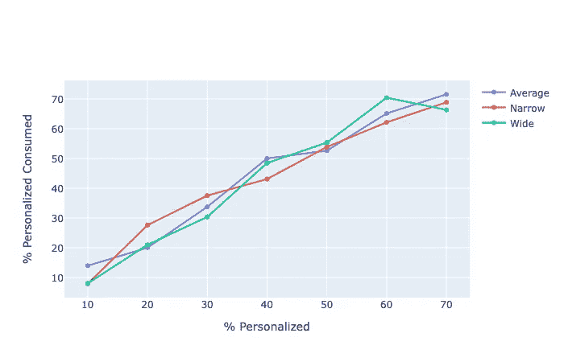
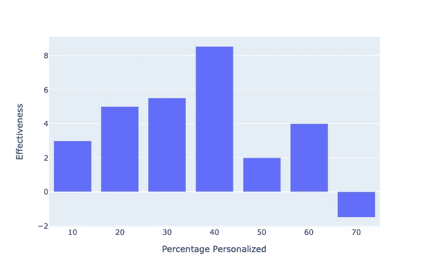

# 研究基于内容的新闻提要过滤

> 原文：<https://towardsdatascience.com/researching-content-based-filtering-for-news-feeds-17954b1865d7?source=collection_archive---------33----------------------->

## 使用分类算法探索个性化新闻源的效果


图由[麦迪森井上](https://www.pexels.com/@mdsnmdsnmdsn)对[像素](https://www.pexels.com) (2020)

*随着新闻消费变得越来越数字化，新闻平台不得不努力转移和保留他们的用户群。维持和增加任何数字平台的用户群的一个行之有效的方法是应用个性化技术。目前，新闻平台倾向于人工选择应该在首页推广的文章。这部分是因为他们一直是这样工作的，但也是因为他们根本没有意识到将个性化技术应用到他们的新闻提要的真实世界的影响。随着这些新闻提要成为他们与客户的主要交互方式，他们对尝试这项技术的犹豫是可以理解的。通过这项研究，我们旨在通过对基于内容的过滤对新闻提要的影响提供一些有价值的见解，消除这种犹豫。*

这个博客为我的学士论文提供了一个研究方向。它是与 [Max Knobbout](https://www.linkedin.com/in/max-knobbout-670354101/) 合作编写的，在 [Triple](https://wearetriple.com) 领导人工智能。

我们将解释技术概念，实验设置和最重要的结论。最初的研究是使用一个数据集完成的，该数据集包含来自荷兰一个地区新闻平台的文章。在技术分析中，我们将使用开源替代方案。

**目录**

*   [技术概念:分类建议](#b233)
*   [真实世界实验](#88bc)
*   [结论](#9c18)
*   [最后一句话](#81fc)

# 技术概念:作为分类的建议

在本节中，我们将解释如何将推荐相关新闻文章的问题视为一个分类问题。一般来说，有两类推荐算法:

*   **基于**的协同过滤:在这种向用户推荐商品的方式中，我们利用给定平台内所有用户与所有商品的交互来预测单个用户可能喜欢什么。例如，在决定你是否会喜欢一个特定的项目时，我们可以寻找有相似品味的用户，看看他们对那个项目的想法。
*   **基于内容的**:在基于内容的推荐中，我们仅使用项目的特性(特征)来确定您是否喜欢某个项目。我们不使用其他用户的互动。

协同过滤的优势在于，我们可以使用非常少的数据来为新用户创建相当准确的简档。然而，缺点是我们需要用户-项目交互数据。换句话说，协同过滤遭受所谓的“冷启动”问题。在这篇博客中，我们将探讨如何将推荐问题作为一个分类问题。这种方法是基于内容的，因此不会遇到冷启动问题。更具体地说，我们将创建一个数据集，并在一组预定义的文章上为*的每个*用户训练一个 ML 模型。这个模型能够预测每个用户对任何看不见的文章的评价。

在本节中，我们将解释并执行以下步骤来创建我们的分类建议框架:

1.  我们将为新闻文章集提取相关特征。
2.  从所有新闻文章的集合中，我们将提取一小部分训练文章。在我们的实验中，我们选择了 30 篇独特的文章。
3.  然后，这些文章被呈现给用户，用户选择“喜欢”或“不喜欢”(类似 Tinder 的滑动流)。然后，这被用作我们的监督分类问题的标记训练集。
4.  我们将使用这些文章来训练一个模型，该模型能够预测对未看到的文章的喜欢/不喜欢。为了演示我们所做的，我们将使用在 Kaggle 上找到的“所有新闻”数据集的子集，可以在这里下载:【https://www.kaggle.com/snapcrack/all-the-news

**1。特征提取**

我们方法中的第一个主要挑战是特征提取的问题。在自然语言处理领域，对大量文本建模的一种流行方法仍然是词袋(BoW)表示法。本质上，文本的 BoW 表示可以通过简单地计算文档中出现的所有单词来获得。然后，每个单词的计数被用作一个特征，允许我们将每个文档表示为某个 N 维空间中的一个向量(其中 N 是在*所有*新闻文章中找到的唯一单词的数量)。换句话说，我们失去了一些意义，因为我们不记得单词的顺序，但我们获得了将文章表示为数字向量的能力。有许多教科书和在线知识库更深入地解释了 BoW 模型。

一旦获得了文档的这种弓形向量，以某种相关的方式对它们进行加权通常是一个好主意，尤其是在 NLP 领域。这背后的直觉是，一些词比其他词更不相关，以描述一篇文章的主题。例如，像“the”、“a”和“an”这样的词是非常常见的词，但通常不传达任何意思。相反，一个在一些文档中很常见，但在其他文档中很少见的单词(例如像“Trump”这样的名字)通常会为文档传递很多含义。这一观察结果是 TF-IDF 加权方案的基础。总的想法如下:

1.  我们缩小整个数据集中常见的特征。这些词通常没有什么意义。
2.  我们放大了某些文档中常见的特征，但在整个数据集上却很少见。这些词通常传达很多意思。

一旦向量被我们的 TF-IDF 加权方案加权，我们仍然面临着一个主要的问题/挑战。这就是数据集中有太多要素的挑战。简单地创建一个 BoW 模型，并根据 TF-IDF 方案对它们进行加权，并删除一些罕见的特征，仍然可以为超过 5000 个维度的*的每篇新闻文章提供一个矢量表示。也就是说，如果我们要在仅 30 篇新闻文章上训练我们的分类模型，并且每篇新闻文章具有超过 5000 个特征，那么任何分类模型如何能够决定哪些特征是相关的，哪些是不相关的？每当特性的数量(5000 以上)接近或大于实例的数量(30)时，我们几乎不可避免地会使结果模型过拟合。为了避免这一点，我们将需要执行一些特征约简，在机器学习中通常称为降维问题。*

假设你没有任何机器学习的先验知识，你的任务是对输入空间进行一些相关的降维。也就是说，现在每篇新闻文章都被表示为一个长度大于 5000 的 TF-IDF 向量，我们希望将这个长度减少到某个较小的数字(比如说 16)，同时又不会损失太多这些文章内容的*含义*。也就是说，如果两篇文章是关于相似的主题，我们希望得到的向量靠得很近，如果文章是关于完全不同的主题，我们希望它们离得很远。

你会如何处理这样的问题？通过查看 TF-IDF 向量，您可能会得出这样的结论:一些术语经常在一些文档中一起出现，而另一些术语经常在不同的文档中出现。例如，“唐纳德”一词可能经常与“特朗普”一起出现，但在谈论“天气”时，这两个词可能都不常见。您可能会想到的想法是将一些高阶项(称为“组件”)建模为一些单个项的线性组合。例如，一个组件可以为诸如“唐纳德”、“特朗普”、“怀特”、“豪斯”等术语分配高权重。而另一个组件可以为诸如“天气”、“晴天”、“雨天”之类的术语分配高权重。

给定这些组件及其各自的权重，我们就可以将每篇文章表示为组件的某个向量。这是“奇异值分解”(SVD)背后的代数直觉(也有从更多几何角度对该技术的解释)。虽然我们还没有谈到这些组件是如何确定的，但为了获得技术背后的直觉，我们根本不需要这样做。

BoW 提取，与 TF-IDF 加权方案一起，然后使用 SVD 选择最佳组件来描述文章中的主题，通常一起被称为“潜在语义分析”(LSA)算法。关于这项技术的更多信息可以在维基百科的文章中找到:[https://en.wikipedia.org/wiki/Latent_semantic_analysis](https://en.wikipedia.org/wiki/Latent_semantic_analysis)

让我们用代码来执行这项任务！让我们首先下载 csv 文件并将其加载到 pandas 中。

然后，我们将使用 Python 中的 scikit-learn 来执行上述步骤。出于演示的目的，我们将创建一个管道，该管道由 TfidfVectorizerfollowed 后跟一个 TruncatedSVD 组成。TfidfVectorizer 结合了 BoW 表示(在 scikit-learn 中称为 CountVectorizer)和 TF-IDF 加权方案(在 scikit-learn 中称为 TfidfTransformer)。

作为 TF-IDF 步骤的一个超参数，我们给出了一组我们想要包含的停用词(从 nltk 库中获得)(只是为了安全起见)，并且我们告诉矢量器我们想要 0.5%的最小文档频率(min_df)。这意味着我们只对出现在所有文章中至少 0.5%的单词感兴趣，这使得我们可以排除超级罕见的单词或拼写错误。

TruncatedSVD 步骤创建了低维向量，其中每个维度(称为“分量”)是我们前面描述的这些项的线性组合。超参数 n_components 决定了我们想要保留多少这样的组件；我们保留的越多，我们保留的原始数据的信息就越多(注意:保留的信息量通常是通过计算“解释方差”来计算的)；原始数据集中存在的差异仍然可以用低维表示来解释)。在我们的代码示例中，我们*只*选择了 16 个组件。对于 LSA 来说，这个值特别低，我们肯定会丢失一些信息。然而，由于我们只想在 30 篇文章的基础上构建我们的推荐系统，并且我们不想过度适应这个模型，所以我们需要特征的数量很低。

```
(50000, 16)
```

从上面的输出可以看出，我们已经成功地将每篇文章转换成了一个 16 维的分量向量。验证这些组件代表什么通常不是一个坏主意。请记住，每个组件都是作为一个线性组合的条款计算的。通过检查这些项中的哪些项对于给定的分量具有高权重(数学上我们将这些权重称为“系数”)，我们可以了解这些分量代表什么。这些项的系数存储在变量`pipe.named_steps.svd.components_`中，因此通过检查这个矩阵，我们可以用自定义函数提取系数最高的项。

```
['trump', 'clinton', 'hillary', 'donald', 'campaign']
```

换句话说，第一部分(16 个部分中的)绝对是关于唐纳德·特朗普和希拉里·克林顿以及他们的竞选活动。让我们检查另一个:

```
['comey', 'fbi', 'house', 'investigation', 'white']
```

第七部分是关于解雇詹姆斯·科米。这意味着*大量重要的*新闻文章都是关于这个特定的话题。请注意，这都是为我们自动计算的，我们不需要设计任何功能。这就是无监督机器学习的力量！

## 2.提取 30 篇相关文章

所以我们成功地提取了我们新闻文章的相关特征。请记住，我们希望向每个用户呈现 30 篇独特的文章，以确定他们的口味。但是我们选择哪些文章呢？一般来说，我们希望选择 30 篇文章，它们很好地代表了整个数据集。换句话说，我们想要那种“覆盖”整个数据集的文章。如果我们有 30 篇非常接近数据集的文章，我们可以对用户的总体品味做出更好的估计。

为了做到这一点，我们可以执行以下两个步骤:

1.  首先，我们对 16 维 LSA 向量执行 K 均值聚类(其中 K=30)。这将在新闻文章居中的 16 维空间中计算 30 个点(称为“质心”)。
2.  对于每个质心，我们计算一个最佳匹配的文章。最佳匹配的物品是到质心的距离最低的物品。

然后将得到的 30 篇文章显示给用户，以便创建数据集。现在让我们来计算一下吧！

因此，结果是一个 30 长度的数组，其中在每个索引`i`处，文章`best_matching_articles[i]`到质心`i`的距离最小。相应的条款有:


图由 [Michel Wijkstra](https://www.linkedin.com/in/michel-wijkstra-0b3761113/) (2020)提供

## 3.创建训练集

我们现在向每个用户展示这 30 篇文章，用户必须选择`like`(向右滑动)或`dislike`(向左滑动)。我们将假设结果是一个 30 长度的列表。为了便于演示，可以按如下方式生成随机选择:

## 4.训练模型

我们现在准备用 30 篇最佳匹配文章的 16 维 LSA 向量的输入数据训练一个分类器，标签为`like`或`dislike`。换句话说，我们现在离开了无监督 ML 的区域，进入了有监督 ML 的区域。对于我们的模型，我们有许多选择，但是我们通常希望选择一个能够处理少量实例的模型。为此，我们选择最近邻分类模型。该模型所做的是，对于每个看不见的实例，查看哪些已知文章是最近的(称为“最近邻居”)。基于这些最近的邻居，分类器然后决定是否将未见过的文章评级为`like`或`dislike`。

例如，如果所有邻居都是`like`，显然我们也想将未看到的文章评级为`like`。这是最近邻分类法背后的直觉。让我们用代码来看看！

我们可以选择两个有趣的超参数来抵消过度拟合。参数`n_neighbors`告诉我们想要考虑多少个邻居来分类一个看不见的实例。很明显，如果我们把它做得很小(例如`1`)，我们很容易过度拟合，因为我们只对 1 个邻居做了决定，如果我们要看更多的邻居，这可能是一个“异常值”。例如，最近的邻居可能会说“喜欢”，但如果我们观察更多的邻居，我们会发现他们会说“不喜欢”。相反，如果我们使邻居的数量太高，我们可能会使分类器不足，因为我们只是简单地取所有邻居的平均值。

`distance`超参数告诉我们，邻居越近，它在决定我们是否想要对一篇看不见的文章进行喜欢/不喜欢评级时的权重就越大。

使用这个分类器，我们可以预测新闻文章的整个数据集的评级:

```
array(['dislike', 'like', 'like', ..., 'like', 'like', 'like'],
      dtype='<U7')
```

剩下的最后一个问题是:这个分类器*有多好*？验证这一点的一种方法是使用某种形式的交叉验证。由于实例数量非常少，交叉验证的一个好方法是使用“留一个”(LOO)交叉验证策略。在我们的例子中，这将在 29 篇文章上训练模型，并查看最后一篇文章是否被正确分类。每篇文章重复 30 次，这将为我们赢得一个分数(正确预测，也称为“准确性”)。因为我们没有用户的实际评级，所以我们不能在这里这样做，但是验证最终的模型总是一个好主意。在 scikit learn 中，LOO 是在`sklearn.model_selection.LeaveOneOut`中实现的。

# 真实世界实验

现在我们已经有了技术实现，我们可以进行实验了。实验包括两个阶段；在第一阶段，我们将收集关于回答者兴趣的信息来训练算法，在第二阶段，我们将使用训练好的算法来推荐文章。我们有 126 位受访者帮助我们。

**第一阶段:**

为了使用我们的算法推荐文章，我们首先需要有每个回答者的个人资料。这就是我们面临一个重要决定的地方:使用大量的数据点会提高档案的质量，但是在这个阶段花费太多时间可能会导致回答者失去兴趣。我们最终决定使用 30 篇文章。我们觉得这是模型质量和收集数据时间之间的一个很好的平衡。

> 在最初的研究中，确定每个回答者进行实验的时间不应超过 6 分钟。这是荷兰消费数字新闻的平均时间。

为了只用 30 篇文章创建最好的个人资料，我们需要一个尽可能多样化的选择。为此，我们利用 K-means 创建了 30 个聚类。从每个聚类中，我们选择离质心距离最小的文章。

选定的文章以刷卡的形式呈现给受访者，这是一个从 Tinder 等应用程序借鉴来的成熟概念。对于那些不熟悉这个概念的人来说，文章显示得就像一副扑克牌。回答者可以向左刷卡表示不喜欢这篇文章，向右刷卡表示喜欢。我们选择这种设计是因为它简单快捷。在浏览完所有 30 篇文章后，收集了必要的信息，第一阶段结束。

**第二阶段**

既然我们已经有了受访者的资料，我们可以开始收集行为数据。在这一阶段，受访者接触到 30 个新闻视图，包含不同数量的个性化文章。这个数量在 10%到 70%的个性化内容之间变化。每个回答者都被要求选择一篇他们想读的文章。对于每个提供的新闻综述，我们都存储了文章，无论它们是否是个性化的，以及回答者的选择。我们的结论是基于这些储存的数据。


左:第一阶段刷卡界面，右:第二阶段新闻反馈|图由 [Michel Wijkstra](https://www.linkedin.com/in/michel-wijkstra-0b3761113/) (2020)提供

# 结论

从收集的数据中，我们设法得出了一些有趣的结论。首先，我们应该注意到，我们根据受访者的兴趣“广度”将他们分成了 3 组。这导致了有狭隘、平均和广泛兴趣的回答者群体。分类是通过计算第一阶段喜欢的文章数量，并在每个第 33 百分位上划分集合来完成的。这项研究得出了两个有趣的结论，将在下面讨论。

**个性化内容的效率提高了 20%到 40%**

第一个有趣的发现是个性化内容的消费增加了 20%到 40%。兴趣较窄的一组显示出 20%到 30%的个性化改善，而兴趣一般和广泛的一组达到 40%。在图中，我们看到兴趣广泛的那组也有 60%左右的峰值，但我们无法发现为什么会出现这种效应。



个性化内容的消费|图由 [Michel Wijkstra](https://www.linkedin.com/in/michel-wijkstra-0b3761113/) (2020)

**个性化内容的有效性从 50%降低到 70%**

我们发现的第二个效应更出乎意料。在实验的开发过程中，普遍的期望是在某个时候只消费个性化的内容，而不接触所有非个性化的内容。然而，结果证明这是错误的。令我们惊讶的是，消费的个性化内容的数量从 50%开始下降，当我们达到 70%的个性化内容时，甚至下降到我们预期的基线以下。这似乎表明，当有太多个性化内容被推送到新闻提要时，某种过饱和开始出现。这最终似乎导致受访者寻求多样化，将个性化内容的消费降至基线以下。效果显示如下。

> 计算有效性的方法是最初研究的一部分，但超出了这篇博文的范围。



每个个性化级别的有效性|图由 [Michel Wijkstra](https://www.linkedin.com/in/michel-wijkstra-0b3761113/) 提供(2020)

# 一锤定音

我们的结论表明，有限的个性化将有利于您的网站。如果你是新闻平台的一员，我们希望这篇文章能启发你给个性化一个机会。如果你决定实现它，我们很想知道你的结果！

否则，我们希望你已经学到了一些东西，并享受阅读。如果您有任何问题，请随时联系[麦克斯](https://www.linkedin.com/in/max-knobbout-670354101/)或[本人。](https://www.linkedin.com/in/michel-wijkstra-0b3761113/)