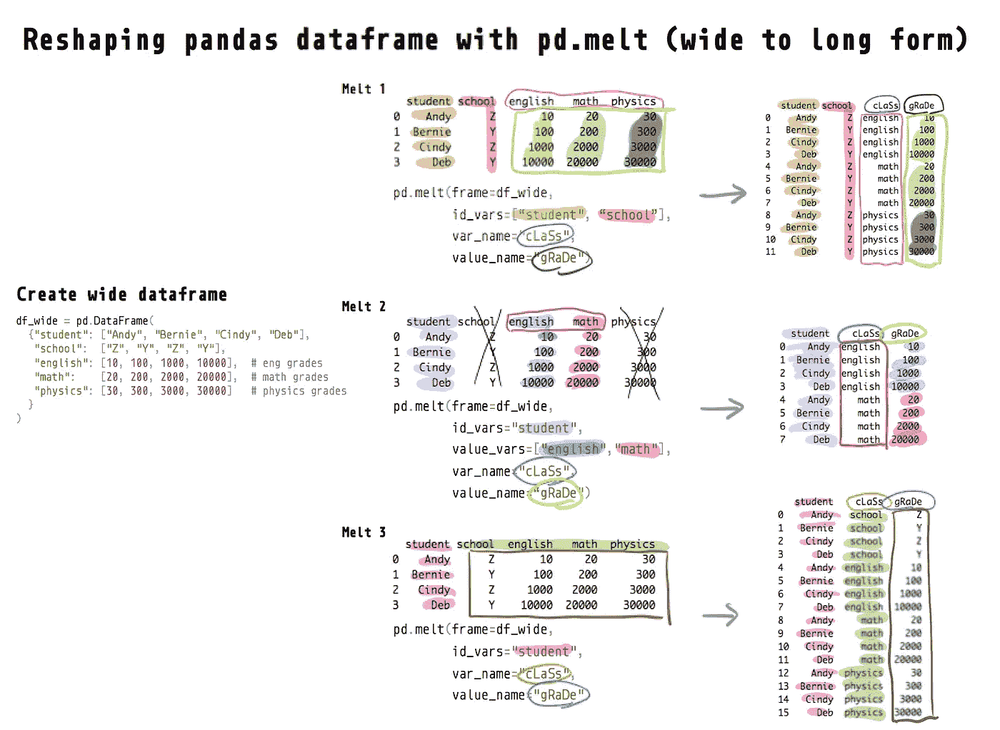
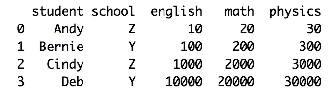
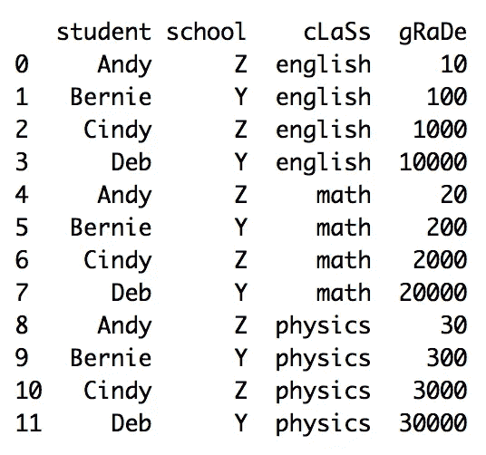
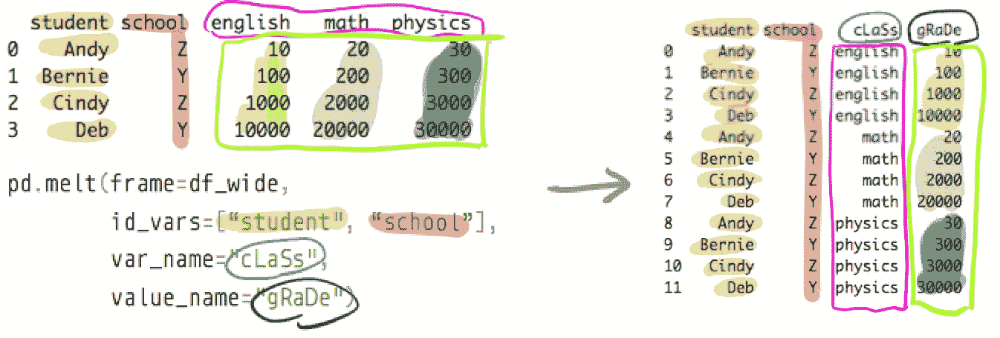
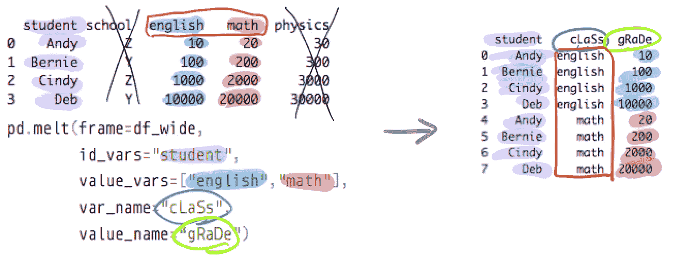
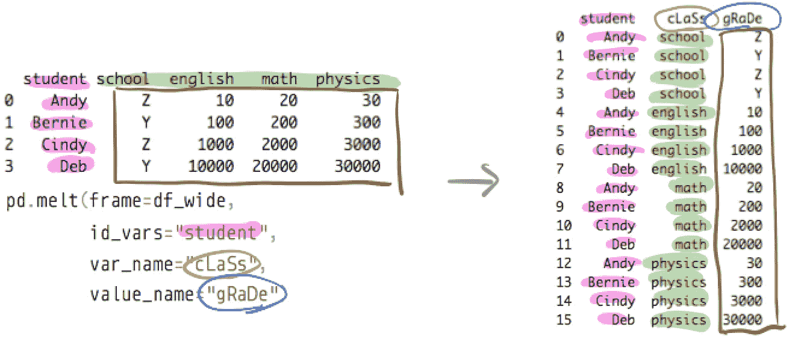

# 使用 Python 中的 melt 重塑熊猫数据框—教程和可视化

> 原文：<https://towardsdatascience.com/reshape-pandas-dataframe-with-melt-in-python-tutorial-and-visualization-29ec1450bb02?source=collection_archive---------3----------------------->

## PYTHON 熊猫数据帧重塑

## 使用 pd.melt 将宽转换为长



如何在 Python 中使用 pd.melt()将 pandas 数据帧由宽变长(此处运行代码)

有许多不同的方法可以将熊猫的数据帧从宽 T7 变成长 T8。但是`melt()`方法是最灵活的，并且可能是你一旦学好就需要使用的唯一方法，就像你只需要学习一种[方法](/reshape-pandas-dataframe-with-pivot-table-in-python-tutorial-and-visualization-2248c2012a31) `[pivot_table()](/reshape-pandas-dataframe-with-pivot-table-in-python-tutorial-and-visualization-2248c2012a31)`就可以从**长到宽进行整形(**见下面我的另一篇文章)。

[](/reshape-pandas-dataframe-with-pivot-table-in-python-tutorial-and-visualization-2248c2012a31) [## 用 Python 中的 pivot_table 重塑熊猫数据框—教程和可视化

### 使用 pd.pivot_table 将 long 转换为 wide

towardsdatascience.com](/reshape-pandas-dataframe-with-pivot-table-in-python-tutorial-and-visualization-2248c2012a31) 

本教程将带你通过使用与熊猫数据帧相关的`pd.melt()`或`melt`方法来重塑数据帧。在像 R 这样的其他语言中，melt 也被称为 gather。另外，R 也有一个`melt`函数，以同样的方式工作。

[](/reshape-r-dataframes-wide-to-long-with-melt-tutorial-and-visualization-ddf130cd9299) [## 利用熔体重塑宽到长的 R 数据帧——教程和可视化

### 你唯一需要的函数和教程

towardsdatascience.com](/reshape-r-dataframes-wide-to-long-with-melt-tutorial-and-visualization-ddf130cd9299) 

我强烈建议您在阅读本文时尝试一下 Python 中的代码。打开我的 [**DeepNote 笔记本**](https://beta.deepnote.com/project/d1350ad6-bcb4-4c3d-857b-c29d01b8a803) (你只能运行但不能编辑这个笔记本)，边看这篇文章边运行单元格。

另外，你可能想看看官方的熊猫文档和我的 numpy 重塑教程:

[](/reshaping-numpy-arrays-in-python-a-step-by-step-pictorial-tutorial-aed5f471cf0b) [## 在 Python 中重塑 numpy 数组—一步一步的图形教程

### 本教程和备忘单提供了可视化效果，帮助您理解 numpy 如何重塑数组。

towardsdatascience.com](/reshaping-numpy-arrays-in-python-a-step-by-step-pictorial-tutorial-aed5f471cf0b) 

# 宽与长数据帧

如果我们观察一个**宽的**数据帧并将其与一个长的数据帧进行比较，就很容易理解它是什么或者看起来是什么样子。



可以使用 pd.melt()(运行代码[此处](https://beta.deepnote.com/project/d1350ad6-bcb4-4c3d-857b-c29d01b8a803#%2Fmelt.ipynb))来熔化/堆叠宽熊猫数据帧

下面是相应的数据帧(具有相同的信息),但以**长**的形式:



可以使用 pd.pivot_table()来“解除”Long pandas 数据帧(本文未涉及)

在开始我们的`pd.melt`教程之前，让我们用`pd.DataFrame`用 Python 重新创建上面的宽数据帧。

```
import pandas as pd# create wide dataframe
df_wide = pd.DataFrame(
  {"student": ["Andy", "Bernie", "Cindy", "Deb"],
   "school":  ["Z", "Y", "Z", "Y"],
   "english": [10, 100, 1000, 10000],  # eng grades
   "math":    [20, 200, 2000, 20000],  # math grades
   "physics": [30, 300, 3000, 30000]   # physics grades
  }
)
```

# 熔体实施例 1

我们通过`id_vars`指定标识符列来融合数据帧。“剩余的”非标识符列(英语、数学、物理)将被融合或堆叠成一列。

将创建一个新的指示器列(包含值英语、数学、物理)，我们可以通过`var_name`重命名这个新列(类)。我们也可以通过`value_name`重命名包含所有实际成绩的列(gRaDe)。

```
print(df_wide)
> student school  english   math  physics
     Andy      Z       10     20       30
   Bernie      Y      100    200      300
    Cindy      Z     1000   2000     3000
      Deb      Y    10000  20000    30000df_wide.melt(id_vars=["student", "school"],
             var_name="cLaSs",  # rename
             value_name="gRaDe")  # rename>  student school    cLaSs  gRaDe
0     Andy      Z  english     10
1   Bernie      Y  english    100
2    Cindy      Z  english   1000
3      Deb      Y  english  10000
4     Andy      Z     math     20
5   Bernie      Y     math    200
6    Cindy      Z     math   2000
7      Deb      Y     math  20000
8     Andy      Z  physics     30
9   Bernie      Y  physics    300
10   Cindy      Z  physics   3000
11     Deb      Y  physics  30000
```



从宽到长:新的指示器列“等级”+熔化/堆积值“等级”列(运行代码[此处为](https://beta.deepnote.com/project/d1350ad6-bcb4-4c3d-857b-c29d01b8a803#%2Fmelt.ipynb))

# 熔体实施例 2

你可以用`value_vars`来指定你想把哪些列融掉或者堆到列里(这里我们排除了物理列，所以`value_vars=["english", "math"]`)。我们也从`id_vars`中删除了学校一栏。

```
print(df_wide)
> student school  english   math  physics
     Andy      Z       10     20       30
   Bernie      Y      100    200      300
    Cindy      Z     1000   2000     3000
      Deb      Y    10000  20000    30000df_wide.melt(id_vars="student", 
             value_vars=["english", "math"], 
             var_name="cLaSs",  # rename
             value_name="gRaDe")  # rename> student    cLaSs  gRaDe
0    Andy  english     10
1  Bernie  english    100
2   Cindy  english   1000
3     Deb  english  10000
4    Andy     math     20
5  Bernie     math    200
6   Cindy     math   2000
7     Deb     math  2000
```



宽到长:原栏目学校和物理已被删除(运行代码[此处](https://beta.deepnote.com/project/d1350ad6-bcb4-4c3d-857b-c29d01b8a803#%2Fmelt.ipynb))

# 熔体实施例 3

最后，让我们看看如果我们只指定学生列作为标识符列(`id_vars="student"`)而不指定您想要通过`value_vars`堆叠哪些列会发生什么。因此，所有非标识符列(学校、英语、数学、物理)将被堆叠到一列中。

产生的长数据帧看起来是错误的，因为现在 cLaSs 和 gRaDe 列包含了不应该在那里的值。这里的重点是向你展示`pd.melt`是如何工作的。

```
print(df_wide)
> student school  english   math  physics
     Andy      Z       10     20       30
   Bernie      Y      100    200      300
    Cindy      Z     1000   2000     3000
      Deb      Y    10000  20000    30000df_wide.melt(id_vars="student",
             var_name="cLaSs",  # rename
             value_name="gRaDe")  # rename>  student    cLaSs  gRaDe
0     Andy   school      Z
1   Bernie   school      Y
2    Cindy   school      Z
3      Deb   school      Y
4     Andy  english     10
5   Bernie  english    100
6    Cindy  english   1000
7      Deb  english  10000
8     Andy     math     20
9   Bernie     math    200
10   Cindy     math   2000
11     Deb     math  20000
12    Andy  physics     30
13  Bernie  physics    300
14   Cindy  physics   3000
15     Deb  physics  30000
```



宽到长:学校列不是标识符列(运行代码[此处为](https://beta.deepnote.com/project/d1350ad6-bcb4-4c3d-857b-c29d01b8a803#%2Fmelt.ipynb))

# 结束语

我希望现在你对`pd.melt`如何重塑数据帧有了更好的理解。期待大家的想法和评论。

如果你觉得这篇文章有用，请关注我并访问[我的网站](http://hausetutorials.netlify.com/)获取更多数据科学教程和我的其他文章:

[](/two-simple-ways-to-loop-more-effectively-in-python-886526008a70) [## 在 Python 中更有效地循环的两种简单方法

### 使用枚举和压缩编写更好的 Python 循环

towardsdatascience.com](/two-simple-ways-to-loop-more-effectively-in-python-886526008a70) [](https://medium.com/better-programming/4-keyboard-shortcuts-to-edit-text-efficiently-and-improve-productivity-66894c8d51b8) [## 4 个键盘快捷键，可高效编辑文本并提高工作效率

### 高效地在文本中导航和移动光标

medium.com](https://medium.com/better-programming/4-keyboard-shortcuts-to-edit-text-efficiently-and-improve-productivity-66894c8d51b8) [](/real-or-spurious-correlations-attractive-people-you-date-are-nastier-fa44a30a9452) [## 真实或虚假的关联:你约会的有魅力的人更令人讨厌

### 使用 Python 模拟数据、测试直觉并提高数据科学技能

towardsdatascience.com](/real-or-spurious-correlations-attractive-people-you-date-are-nastier-fa44a30a9452) [](https://medium.com/better-programming/code-and-develop-more-productively-with-terminal-multiplexer-tmux-eeac8763d273) [## 使用终端多路复用器 tmux 提高编码和开发效率

### 简单的 tmux 命令来提高您的生产力

medium.com](https://medium.com/better-programming/code-and-develop-more-productively-with-terminal-multiplexer-tmux-eeac8763d273) [](/free-online-data-science-courses-during-covid-19-crisis-764720084a2) [## 新冠肺炎危机期间的免费在线数据科学课程

### 像 Udacity、Codecademy 和 Dataquest 这样的平台现在免费提供课程

towardsdatascience.com](/free-online-data-science-courses-during-covid-19-crisis-764720084a2) 

*更多帖子，* [*订阅我的邮件列表*](https://hauselin.ck.page/587b46fb05) *。*