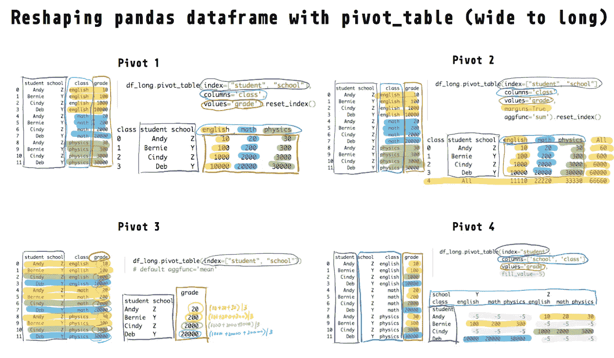
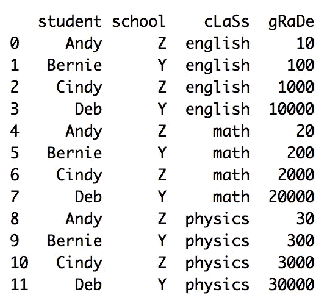
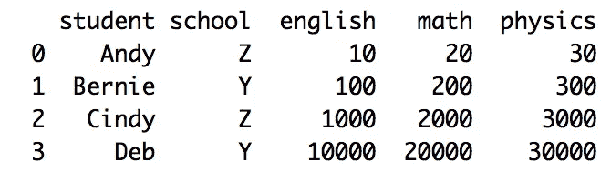
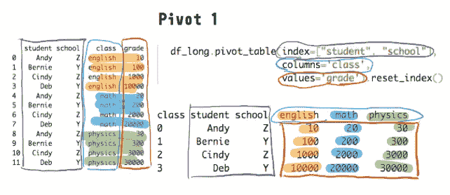
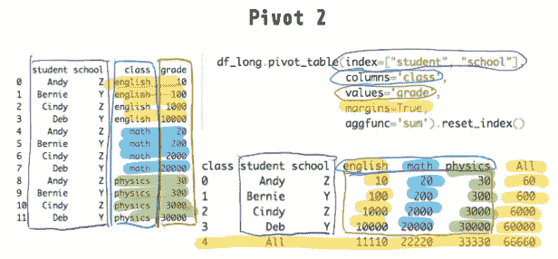
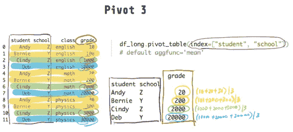
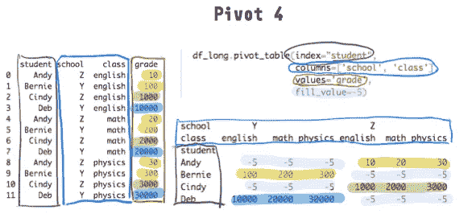

# 用 Python 中的 pivot_table 重塑熊猫数据框—教程和可视化

> 原文：<https://towardsdatascience.com/reshape-pandas-dataframe-with-pivot-table-in-python-tutorial-and-visualization-2248c2012a31?source=collection_archive---------13----------------------->

## PYTHON 熊猫数据帧重塑

## 使用 pd.pivot_table 将 long 转换为 wide



如何在 Python 中使用 pd.pivot_table()将 pandas 数据帧由长变宽(此处运行代码)

有许多不同的方法可以将熊猫的数据框从长的变成宽的。但是`pivot_table()`方法是最灵活的，并且可能是你一旦学好就需要使用的唯一方法，就像你只需要学习一种[方法](/reshape-pandas-dataframe-with-melt-in-python-tutorial-and-visualization-29ec1450bb02) `[melt](/reshape-pandas-dataframe-with-melt-in-python-tutorial-and-visualization-29ec1450bb02)`就可以从**宽到长进行整形(下面的**见我的另一篇文章)。

[](/reshape-pandas-dataframe-with-melt-in-python-tutorial-and-visualization-29ec1450bb02) [## 使用 Python 中的 melt 重塑熊猫数据框—教程和可视化

### 想象一下 pd.melt 是如何将熊猫数据帧从宽到长进行整形的

towardsdatascience.com](/reshape-pandas-dataframe-with-melt-in-python-tutorial-and-visualization-29ec1450bb02) 

本教程将带你通过使用与熊猫数据帧相关的`pd.pivot_table`或`pivot_table`方法来重塑数据帧。在 R 等其他语言中，pivot 也被称为 spread 或 dcast。

我强烈建议您在阅读本文时尝试一下 Python 中的代码。尝试在我的共享 [**DeepNote 笔记本**](https://beta.deepnote.com/project/d1350ad6-bcb4-4c3d-857b-c29d01b8a803#%2Fpivot_table.ipynb) 上运行本教程(只能运行不能编辑本笔记本)。

此外，你可能会感兴趣的类似教程，描述了与`pd.melt`和我的 numpy 整形教程相反(从宽到长的整形)。

[](/reshaping-numpy-arrays-in-python-a-step-by-step-pictorial-tutorial-aed5f471cf0b) [## 在 Python 中重塑 numpy 数组—一步一步的图形教程

### 可视化 numpy 如何重塑数组

towardsdatascience.com](/reshaping-numpy-arrays-in-python-a-step-by-step-pictorial-tutorial-aed5f471cf0b) 

# 长与宽数据帧

如果我们观察一个**长**数据帧并将其与宽数据帧进行比较，就很容易理解长**数据帧是什么或看起来像什么。**



可以使用 pd.pivot_table()(运行代码[此处](https://beta.deepnote.com/project/d1350ad6-bcb4-4c3d-857b-c29d01b8a803#%2Fpivot_table.ipynb))旋转或“取消融化”Long pandas 数据框架

下面是相应的数据帧(具有相同的信息),但采用**宽**形式:



可使用 [pd.melt()](/reshape-pandas-dataframe-with-melt-in-python-tutorial-and-visualization-29ec1450bb02) 熔化/堆叠宽熊猫数据帧

在开始我们的`pd.pivot_table`教程之前，让我们用`pd.DataFrame`用 Python 重新创建上面的宽数据帧。请记住，您也可以[跟随我的共享笔记本](https://beta.deepnote.com/project/d1350ad6-bcb4-4c3d-857b-c29d01b8a803#%2Fpivot_table.ipynb)。

```
df_long = pd.DataFrame({
        "student":
            ["Andy", "Bernie", "Cindy", "Deb",
             "Andy", "Bernie", "Cindy", "Deb",
             "Andy", "Bernie", "Cindy", "Deb"],
        "school":
            ["Z", "Y", "Z", "Y",
             "Z", "Y", "Z", "Y",
             "Z", "Y", "Z", "Y"],
        "class":
            ["english", "english", "english", "english",
             "math", "math", "math", "math",
             "physics", "physics", "physics", "physics"],
        "grade":
            [10, 100, 1000, 10000,
             20, 200, 2000, 20000,
             30, 300, 3000, 30000]
})
```

# 示例 1

我们经常希望保持标识符列不变(`index=["student", "school"]`)，但是基于另一列(`columns="class"`)旋转或“拆分”一列的值(`values="grade"`)。比较下面的原始数据框架和旋转数据框架，你就会明白这意味着什么。

```
df_long.pivot_table(index=["student", "school"], 
                    columns='class', 
                    values='grade')
```



长到宽:等级中的值被分割/旋转到三个独立的列中(运行代码[此处为](https://beta.deepnote.com/project/d1350ad6-bcb4-4c3d-857b-c29d01b8a803#%2Fpivot_table.ipynb))

class 列中的每个唯一值将成为 pivoted/wide 数据框架中的一个新列(英语、数学、物理)。我们还可以为`columns`参数提供一个**列表**。

要消除多重索引，请使用`reset_index()`。

# 示例 2

您还可以通过指定`margins=True`(默认为`False`)来聚合每个结果行和列。

```
df_long.pivot_table(index=["student", "school"], 
                    columns='class', 
                    values='grade',
                    margins=True,  # add margins
                    aggfunc='sum')  # sum margins (rows/columns)
```

在这里，我们通过`aggfunc='sum'`(默认`'mean'`)计算总和来进行聚合。



长到宽:包括边距(运行代码[此处](https://beta.deepnote.com/project/d1350ad6-bcb4-4c3d-857b-c29d01b8a803#%2Fpivot_table.ipynb))

您可以使用许多其他聚合函数(例如，`'median'` `'sum'` `'max'`)。您也可以将多个功能指定为一个列表(如`aggfunc=['mean', 'sum']`)。

# 示例 3

如果我们不通过`columns`、**指定任何列，所有剩余的**非标识符**数字**列(在此数据框架中只有等级)将被旋转(从长到宽)。

```
df_long.pivot_table(index=["student", "school"])
```



Long to wide:所有非标识符数字列都被旋转(运行代码[此处为](https://beta.deepnote.com/project/d1350ad6-bcb4-4c3d-857b-c29d01b8a803#%2Fpivot_table.ipynb))

在原始 long 数据中，每个学生有**四个**成绩(英语、数学、物理)，然而在上面的`pivot_table`示例中，每个学生在旋转后只有**一个**成绩。

为什么以及如何工作？如果你还记得上面的例子，缺省值是`aggfunc='mean'`。因此，该函数所做的是将数据按学生和学校分组(通过`index=["student", "school"]`，并计算每组的平均值。

如果您使用与 pandas 数据帧相关的`groupby`方法，您将得到与上面相同的结果。

```
df_long.groupby(['student', 'school']).mean().reset_index() student school  grade
0    Andy      Z     20
1  Bernie      Y    200
2   Cindy      Z   2000
3     Deb      Y  20000
```

如果你改变默认的聚合函数(如`aggfunc='max'`，你会得到不同的结果。下面的例子向您展示了如何指定不同的聚合函数，也向您展示了如何使用`groupby`来执行相同的透视。

请注意，您还会看到与每个“最大”和“第一”值相关联的类。

```
df_long.pivot_table(index=["student", "school"], 
                    aggfunc=['max', 'first'])# groupby equivalent
# df_long.groupby(["student", "school"]).agg(['max', 'first']) max           first       
                  class  grade    class  grade
student school                                
Andy    Z       physics     30  english     10
Bernie  Y       physics    300  english    100
Cindy   Z       physics   3000  english   1000
Deb     Y       physics  30000  english  10000
```

# 实例 4

最后一个示例向您展示了透视多个列(`columns=['school', 'class']`)时会发生什么，您还可以通过用另一个值替换`NaN`值来处理透视后丢失的值(在下面的示例中为-5)。

```
df_long.pivot_table(index="student", 
                    columns=['school', 'class'], 
                    values='grade', 
                    fill_value=-5)  # replace NaN with -5
```



长到宽:缺失值替换为-5(默认 NaN)(运行代码[此处为](https://beta.deepnote.com/project/d1350ad6-bcb4-4c3d-857b-c29d01b8a803#%2Fpivot_table.ipynb))

`NaN`值是预期值，因为每个学生只属于一所学校(Y 或 Z)。例如，Andy 在学校 Z，因此在 Y 列中没有成绩。

# 结束语

我希望现在你对`pd.pivot_table`如何重塑数据帧有了更好的理解。期待大家的想法和评论。

如果你觉得这篇文章有用，请关注我并访问[我的网站](http://hausetutorials.netlify.com/)获取更多数据科学教程和我的其他文章:

[](/reshape-pandas-dataframe-with-melt-in-python-tutorial-and-visualization-29ec1450bb02) [## 使用 Python 中的 melt 重塑熊猫数据框—教程和可视化

### 想象一下 pd.melt 是如何将熊猫数据帧从宽到长进行整形的

towardsdatascience.com](/reshape-pandas-dataframe-with-melt-in-python-tutorial-and-visualization-29ec1450bb02) [](/two-simple-ways-to-loop-more-effectively-in-python-886526008a70) [## 在 Python 中更有效地循环的两种简单方法

### 使用枚举和压缩编写更好的 Python 循环

towardsdatascience.com](/two-simple-ways-to-loop-more-effectively-in-python-886526008a70) [](https://medium.com/better-programming/4-keyboard-shortcuts-to-edit-text-efficiently-and-improve-productivity-66894c8d51b8) [## 4 个键盘快捷键，可高效编辑文本并提高工作效率

### 高效地在文本中导航和移动光标

medium.com](https://medium.com/better-programming/4-keyboard-shortcuts-to-edit-text-efficiently-and-improve-productivity-66894c8d51b8) [](/real-or-spurious-correlations-attractive-people-you-date-are-nastier-fa44a30a9452) [## 真实或虚假的关联:你约会的有魅力的人更令人讨厌

### 使用 Python 模拟数据、测试直觉并提高数据科学技能

towardsdatascience.com](/real-or-spurious-correlations-attractive-people-you-date-are-nastier-fa44a30a9452) [](https://medium.com/better-programming/code-and-develop-more-productively-with-terminal-multiplexer-tmux-eeac8763d273) [## 使用终端多路复用器 tmux 提高编码和开发效率

### 简单的 tmux 命令来提高您的生产力

medium.com](https://medium.com/better-programming/code-and-develop-more-productively-with-terminal-multiplexer-tmux-eeac8763d273) 

*更多帖子，* [*订阅我的邮件列表*](https://hauselin.ck.page/587b46fb05) *。*