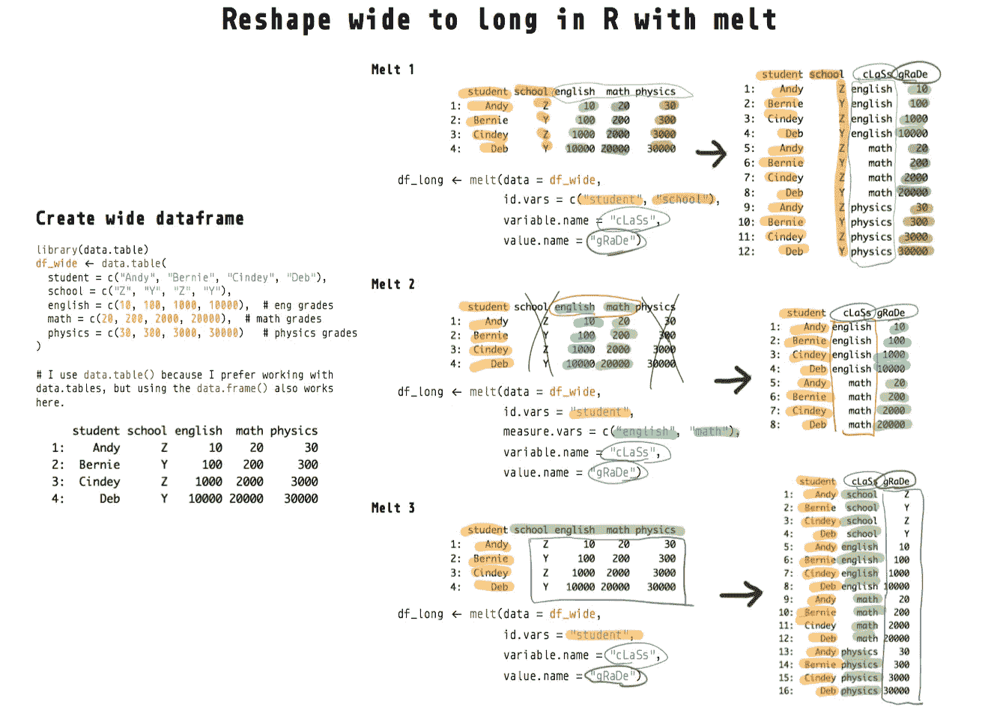
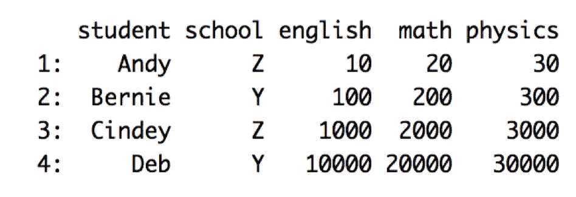
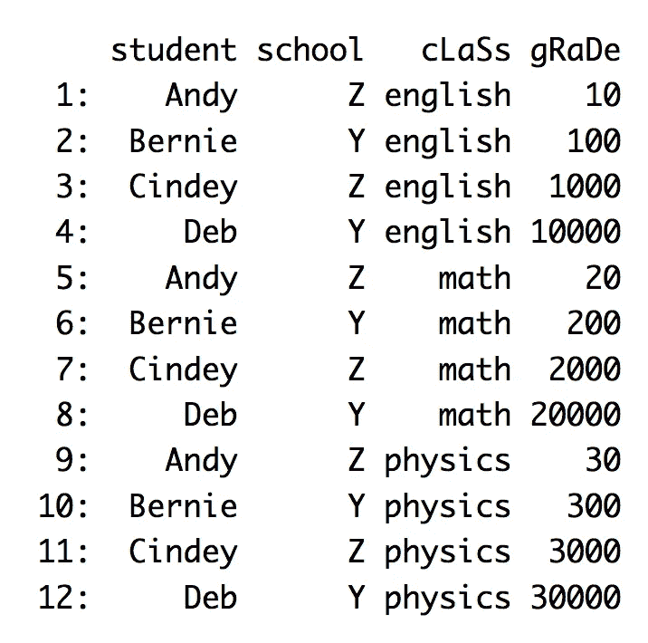
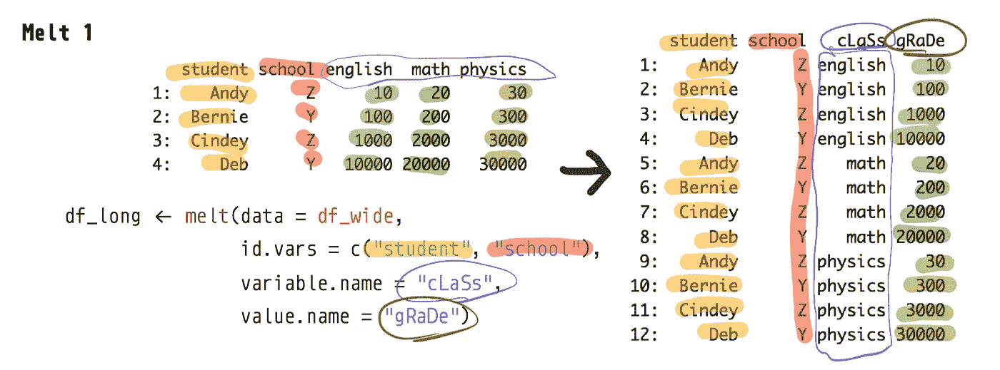
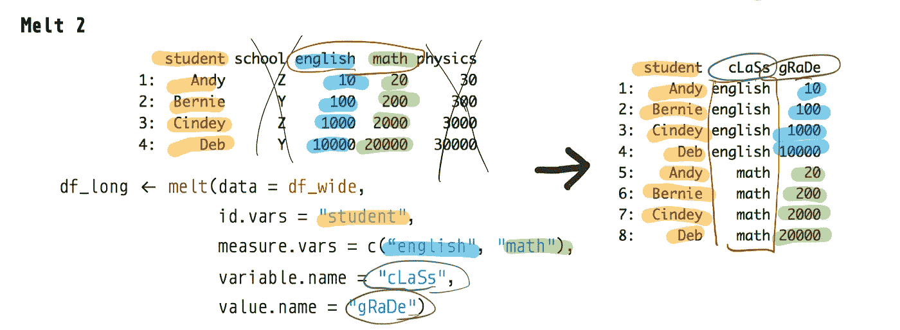
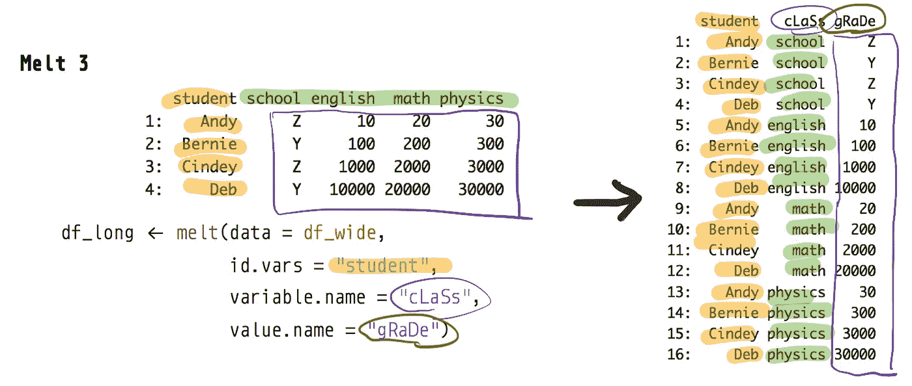

# 利用熔体重塑宽到长的 R 数据帧——教程和可视化

> 原文：<https://towardsdatascience.com/reshape-r-dataframes-wide-to-long-with-melt-tutorial-and-visualization-ddf130cd9299?source=collection_archive---------10----------------------->

## 你唯一需要的函数和教程



R 中的 melt()如何工作的总结

在 R 语言中，如何将一个数据帧从宽格式变成长格式？`melt()`函数如何重塑 R 中的数据帧？本教程将引导您使用 r 中的`melt`函数重塑数据帧。

如果你正在用 Python 重塑数据帧或数组，看看我下面的教程。

[](/reshape-pandas-dataframe-with-melt-in-python-tutorial-and-visualization-29ec1450bb02) [## 使用 Python 中的 melt 重塑熊猫数据框—教程和可视化

### 想象一下 pd.melt 是如何将熊猫数据帧从宽到长进行整形的

towardsdatascience.com](/reshape-pandas-dataframe-with-melt-in-python-tutorial-and-visualization-29ec1450bb02) [](/reshape-pandas-dataframe-with-pivot-table-in-python-tutorial-and-visualization-2248c2012a31) [## 用 Python 中的 pivot_table 重塑熊猫数据框—教程和可视化

### 使用 pd.pivot_table 将 long 转换为 wide

towardsdatascience.com](/reshape-pandas-dataframe-with-pivot-table-in-python-tutorial-and-visualization-2248c2012a31) [](/reshaping-numpy-arrays-in-python-a-step-by-step-pictorial-tutorial-aed5f471cf0b) [## 在 Python 中重塑 numpy 数组—一步一步的图形教程

### 本教程和备忘单提供了可视化效果，帮助您理解 numpy 如何重塑数组。

towardsdatascience.com](/reshaping-numpy-arrays-in-python-a-step-by-step-pictorial-tutorial-aed5f471cf0b) 

# 为什么融而不融其他功能？

这种从宽到长的转换的常用术语是熔化、旋转、逆旋转、聚集、堆叠和整形。已经编写了许多函数来将数据从宽格式转换为长格式，来自`data.table`库的`melt()`是最好的。参见`melt()`文档[此处](https://cran.r-project.org/web/packages/data.table/vignettes/datatable-reshape.html)。为什么？

*   Python 的 [pandas](https://pandas.pydata.org/pandas-docs/stable/reference/api/pandas.melt.html) 库也有类似的`melt`函数/方法，以同样的方式工作(参见我的 pandas melt 教程[这里](/reshape-pandas-dataframe-with-melt-in-python-tutorial-and-visualization-29ec1450bb02))
*   独自一人通常足以完成你所有的从宽到长的转换；你不必学习`pivot_longer`或`gather`
*   像`gather`和`pivot_longer`这样的其他函数通常只是`melt()`或`reshape()`的包装函数——这些其他函数简化了`melt`，通常不能处理更复杂的转换。
*   `melt`比其他函数更强大，但并不复杂。
*   `data.table`包对`melt`的实现，非常强大——比重塑库的`melt`功能高效强大得多。来自[文档](https://cran.r-project.org/web/packages/data.table/vignettes/datatable-reshape.html):

> *数据表的 melt 和 dcast 函数分别用于宽到长和长到宽的整形；这些实施是专门针对大内存数据(例如 10Gb)而设计的。*

**提醒:**我们使用的是来自`data.table`库的`melt`，而不是`reshape`库！将两个库中的`melt`函数文档进行比较，找出差异:`?data.table::melt`和`?reshape::melt`

# 宽与长数据帧

如果我们观察一个**宽的**数据帧并将其与一个长的数据帧进行比较，就很容易理解它是什么或看起来像什么。



下面是相应的数据帧(具有相同的信息),但是是以**长**的形式:



在我们开始我们的`melt`教程之前，让我们重新创建上面的宽数据框架。

```
df_wide <- data.table(
  student = c("Andy", "Bernie", "Cindey", "Deb"),
  school = c("Z", "Y", "Z", "Y"),
  english = c(10, 100, 1000, 10000),  # eng grades
  math = c(20, 200, 2000, 20000),  # math grades
  physics = c(30, 300, 3000, 30000)   # physics grades
)df_wide  
   student school english  math physics
1:    Andy      Z      10    20      30
2:  Bernie      Y     100   200     300
3:  Cindey      Z    1000  2000    3000
4:     Deb      Y   10000 20000   30000
```

注意，我喜欢用`data.table`而不是`data.frame`，因为`data.table`对象更强大。如果您的数据不是 data.table(通过在您的控制台中运行`class(your_dataframe)`来检查)，我强烈建议您将其转换为`data.table`。

```
class(df_wide) # data.table and data.frame
[1] "data.table" "data.frame"
```

只需加载`data.table`库，并使用`data.table`库中的`setDT`函数将任何`data.frame`转换为`data.table`。

```
setDT(df_wide) # no reassignment required! 
```

# 熔体实施例 1

我们通过`id.vars`来指定标识符列。“剩余的”非标识符列(英语、数学、物理)将被融合或堆叠成一列。

将创建一个新的指示器列(包含英语、数学、物理值)，我们可以通过`variable.name`重命名这个新列(类)。我们也可以通过`value.name`重命名包含所有实际成绩的列(gRaDe)。

```
df_long <- melt(data = df_wide, 
                id.vars = c("student", "school"),
                variable.name = "cLaSs",
                value.name = "gRaDe")
df_long
    student school   cLaSs gRaDe
 1:    Andy      Z english    10
 2:  Bernie      Y english   100
 3:  Cindey      Z english  1000
 4:     Deb      Y english 10000
 5:    Andy      Z    math    20
 6:  Bernie      Y    math   200
 7:  Cindey      Z    math  2000
 8:     Deb      Y    math 20000
 9:    Andy      Z physics    30
10:  Bernie      Y physics   300
11:  Cindey      Z physics  3000
12:     Deb      Y physics 30000
```



# 熔体实施例 2

你可以用`measure.vars`来指定你想把哪些列融掉或者堆到 column 里(这里我们排除了 physics 列，所以`measure.vars = c("english", "math")`)。我们也放弃了`id.vars`的学校专栏。

```
df_long <- melt(data = df_wide, 
                id.vars = "student",
                measure.vars = c("english", "math"),
                variable.name = "cLaSs",
                value.name = "gRaDe")
df_long
   student   cLaSs gRaDe
1:    Andy english    10
2:  Bernie english   100
3:  Cindey english  1000
4:     Deb english 10000
5:    Andy    math    20
6:  Bernie    math   200
7:  Cindey    math  2000
8:     Deb    math 20000
```



从宽到长:原来的学校和物理专栏被删除

# 熔体实施例 3

最后，让我们看看如果我们只指定 student 列作为标识符列(`id.vars = "student"`)而不指定要通过`measure.vars`堆叠哪些列会发生什么。因此，所有非标识符列(学校、英语、数学、物理)将被堆叠到一列中。

产生的长数据帧看起来是错误的，因为现在 cLaSs 和 gRaDe 列包含了不应该在那里的值。这里的重点是向你展示`melt`是如何工作的。

```
df_long <- melt(data = df_wide,
                id.vars = "student",
                variable.name = "cLaSs",
                value.name = "gRaDe")
df_long
    student   cLaSs gRaDe
 1:    Andy  school     Z
 2:  Bernie  school     Y
 3:  Cindey  school     Z
 4:     Deb  school     Y
 5:    Andy english    10
 6:  Bernie english   100
 7:  Cindey english  1000
 8:     Deb english 10000
 9:    Andy    math    20
10:  Bernie    math   200
11:  Cindey    math  2000
12:     Deb    math 20000
13:    Andy physics    30
14:  Bernie physics   300
15:  Cindey physics  3000
16:     Deb physics 30000
```

这个表看起来是错误的，因为`df_wide`中的`school`列不属于— `school`应该是另一个标识符列(参见上面的 Melt 1)。melt 函数还返回了一条警告消息，告诉您您的列(`gRaDe`)有不同类型的值(即字符型和数值型)。



宽到长:学校列不是标识符列

# 结束语

我希望现在您对`melt`如何执行宽到长转换有了更好的理解。期待大家的想法和评论。

如果你觉得这篇文章有用，请关注我并访问[我的网站](http://hausetutorials.netlify.com/)获取更多数据科学教程和我的其他文章:

[](/new-python-library-for-statistical-tests-simpler-than-statsmodels-richer-than-scipy-stats-ff380d4673c0) [## 用于统计测试的新 Python 库—比 statsmodels 更简单，比 scipy.stats 更丰富

### 统计建模变得更简单

towardsdatascience.com](/new-python-library-for-statistical-tests-simpler-than-statsmodels-richer-than-scipy-stats-ff380d4673c0) [](/what-ive-learned-after-using-vim-15-days-straight-ceda7e773a6d) [## 连续 15 天使用 Vim 后，我学到了什么

### 从 Vim noob 到业余爱好者的旅程

towardsdatascience.com](/what-ive-learned-after-using-vim-15-days-straight-ceda7e773a6d) 

*更多帖子，* [*订阅我的邮件列表*](https://hauselin.ck.page/587b46fb05) *。*