# 用熊猫重塑数据

> 原文：<https://towardsdatascience.com/reshaping-data-with-pandas-19156e8b7af3?source=collection_archive---------14----------------------->

## Python 数据字节

## 它是数据化的！— Python 剧本

嘿，各位#皮托尼斯塔！在这里，我与一个专栏分享一些用 Python 处理数据的超酷技术。作为参考，我会在每篇文章的结尾通过 Azure 笔记本分享完整的一步一步的代码。

所以事不宜迟，让我们深入研究 Pandas 库中可用的数据整形功能！

我们将在这篇文章中使用的数据源是*样本超市*数据集。大多数人可能已经熟悉它了，因为它是 Tableau 中提供的默认数据源。你也可以从我的 Azure 笔记本上下载。

**数据集的形状**

首先，你可能会想:我所说的数据集的**形状**到底是什么？

> *数据集排列成行和列的方式称为数据的* ***形状*** *。*

首先，让我们使用 Python 将数据导入 Pandas 数据框。

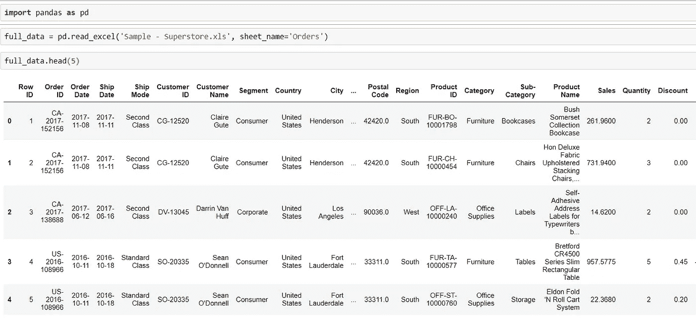

从样本-超市 Excel 文件导入到 Pandas 的数据

检查完整的数据集是否已经成功地从我们的数据源导入到 Pandas 数据框中，这是一个很好的做法。这可以通过检查行数和列数(即数据框的形状属性)来完成。

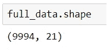

熊猫数据帧的形状特征

因此，我们已经成功地将 9994 行和 21 列按照 excel 表导入到我们的 Pandas 数据框中。

**数据形状——长数据还是宽数据？**

**垂直或长数据**中的每一行代表属于特定类别/实例的一个**观察值**,因此更容易用于分析目的，因为它本质上是粒状的。因此，我们可以推断我们的数据是垂直或长的形状。

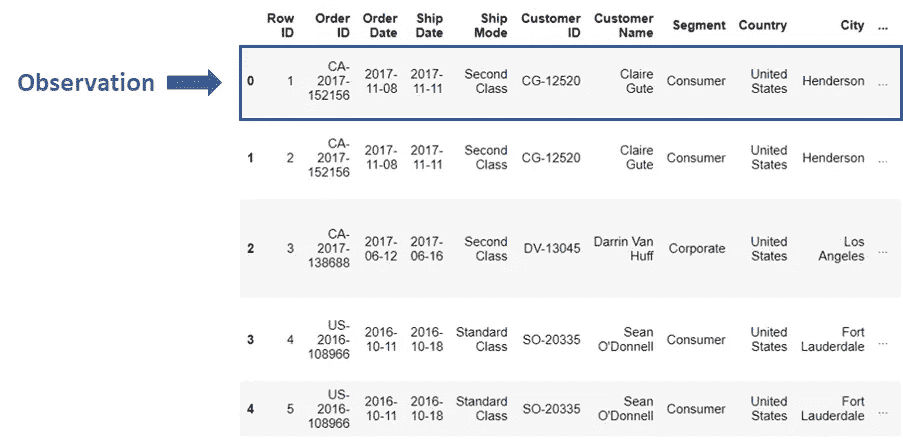

长数据中的观察值

每个**列**被认为是一个**变量**，具有多个不同的值，通过这些值，我们可以从我们的数据集中获得某些见解并准备报告。

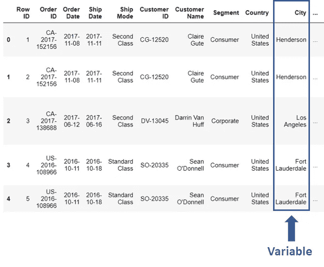

长数据中的变量

为了理解水平或宽范围的数据，让我们开始分析各种变量的数据，并改变数据的形状。

**透视表**

让我们首先通过创建一个数据透视表来缩短我们的数据框架，以便只保留几列来进行进一步的分析。

我创建了一个列列表，并创建了另一个更小的数据框，我们可以在其上重塑我们的数据并做进一步的分析。这是一种方便的技术，可以让我们专注于需要进一步分析的列，并防止不必要的处理负载。

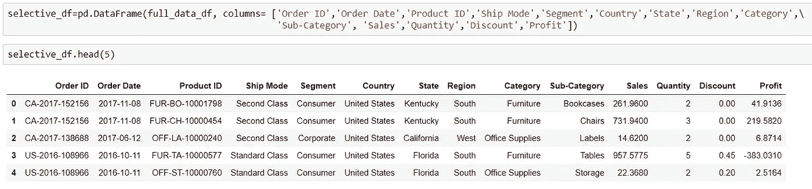

具有选定列的数据框架

**用例:**考虑一个用例，我们必须准备所有地区和部门的报告，汇总每个地区和部门的销售额、折扣、利润和数量。

我们可以像在 excel 中一样使用数据透视表来轻松地准备它。Pandas 库提供了一个 pivot_table()函数，该函数对现有的数据帧进行操作，并接受某些参数，通过这些参数进行聚合。我们来试试吧！

> 注意:默认情况下，数据透视表计算所有数值列的平均值。

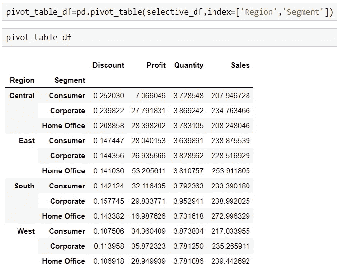

数据透视表

这里我们有一个简洁的数据透视表，正如我们的用例所需要的。现在让我们检查它的形状。

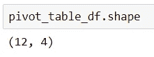

嗯，真奇怪，为什么只显示 4 列，而我们可以看到 6 列？！这是因为我们选择了两列 Region 和 Segment 作为数据透视表的索引，现在我们有了一个多级索引。要重置索引，我们可以使用 reset_index()函数。

> 注意: *inplace=True* 意味着我们将更新数据框本身，而不仅仅是检查我们想要的转换的输出。因此，仅当您确定要根据正在进行的变换更新数据框本身时，才使用它。

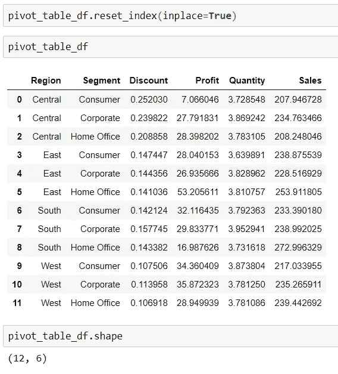

重置索引后的数据透视表

现在我们有了一个数据集，它不再在每一行都有单独的观察值，而是不同变量的集合。这是适用于报告或演示目的的水平或宽数据形状。

**用例:如果我想查看平均利润最高的地区和部门，该怎么办？**

在这种情况下可以使用 *sort_values()* 函数。

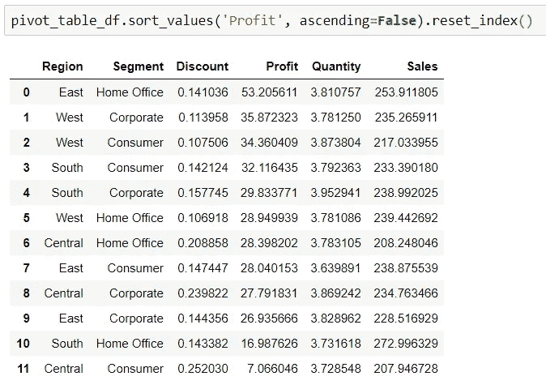

> 注意:我已经使用了 reset_index()。对于排序后的值，它将从 0 到 11 重新开始索引值，因此我们可以清楚地识别平均利润的排名。由于我没有使用 *inplace=True，*这个变化不会影响实际的数据帧。

如果需要，我们还可以通过将它们单独或作为列表传递给 *aggfunc* 选项来执行其他数学聚合，如 sum 或 size(出现的频率)。让我们试一试。

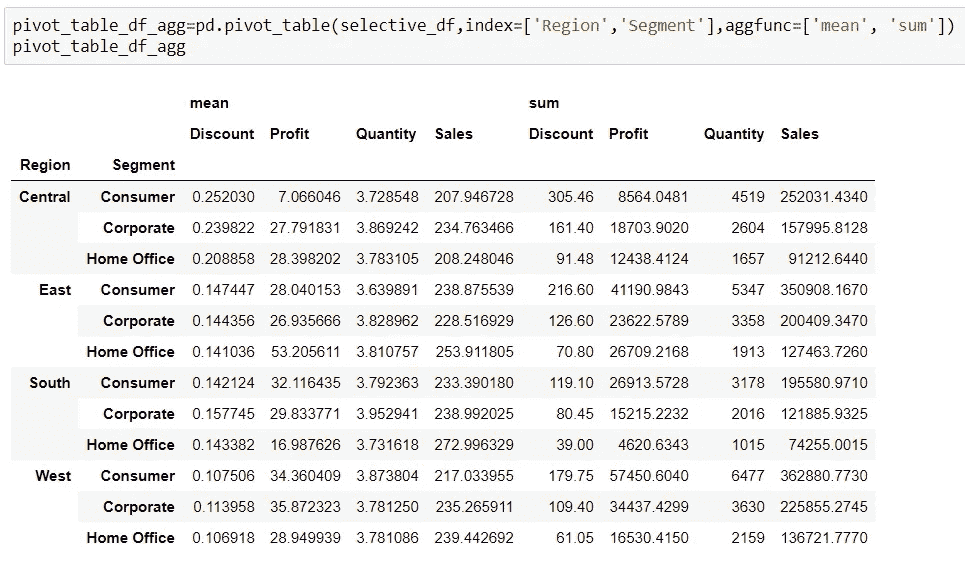

aggfunc 参数的使用

我们现在可以看到，它产生了一个多索引数据帧，每个数字列都有平均值*和总和*的计算。**

**融化**

**用例:**现在，如果我们有数据透视表形式的数据，但我们想将它重新整形为长数据形状，以便我们可以在其中执行一些分析，该怎么办？

熊猫融化功能随时为您服务！

让我们将之前创建的数据透视表重塑为长数据形状，每行代表一个观察值。

在 Melt 函数中，我们传递一个列表作为*标识符变量，即 id_vars* ，所有其他列都被视为*测量变量*，列在*变量*和*值*列下。也可以根据需要传递变量和值的自定义列名。

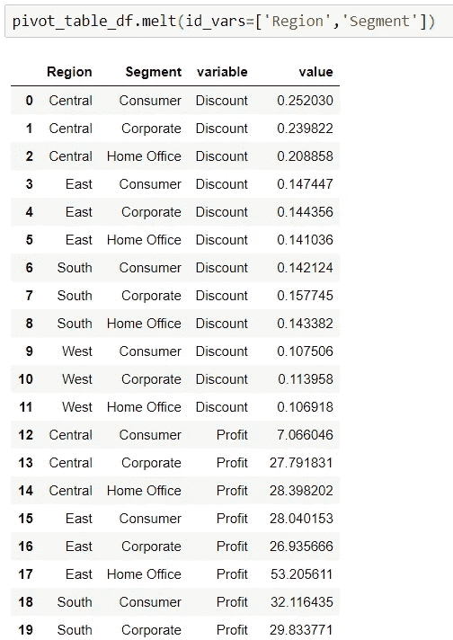

熔化并向下流动

维奥拉。我们取消了数据透视，或者将数据融合到数据透视表中。

**拆垛**

让我们再次考虑我们已经创建的带有区域和分段多级索引的数据透视表。

**用例:**如果我想在列级别查看每个细分市场的每个指标，即折扣、销售额、利润和数量，该怎么办？

Unstack 通过将行值从最内部的索引级别(即段到列)放置来帮助我们实现这一点。让我们看看它的实际效果。

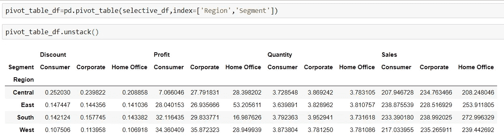

完美的叠放

这只是根据我们以更宽的格式呈现数据的要求来重塑数据的另一种方式。

**堆栈**

让我们再玩一会儿，使用 Unstack 的另一个自我，即堆栈功能！正如 Unstack 将最里面的索引行值移动到列中一样，stack 将最里面的列值移动到行中。让我们在未堆叠的数据框架上尝试一下。

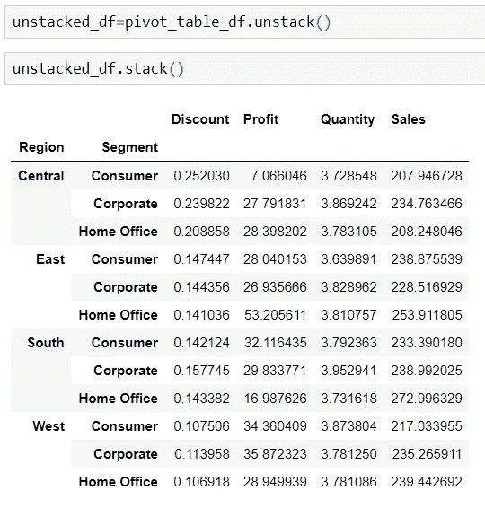

背叠！

> 注意:堆叠和拆分仅适用于多级索引数据框。

**枢轴**

最后，我们将使用 Pivot 函数，这是另一个方便的工具，可以将我们的数据从长到宽。它能够处理非数字列，并且它基本上做的是无聚集的旋转。

> **在调用 pivot 之前，我们需要确保我们的数据没有包含指定列的重复值的行，即一个索引/列对。另一方面，数据透视表函数能够处理重复值，因为默认情况下数值是聚合的。**

因为 Pivot 函数不能处理指定列的重复值，所以我将引用我们之前创建的 Pivot Table — pivot_table_df 来演示它的用法。

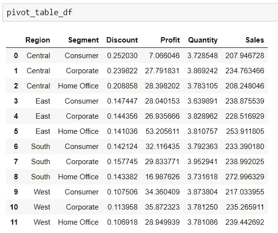

**用例:**考虑一个用例，我希望在报告中看到跨地区和部门的销售额，在另一个报告中看到跨地区和部门的利润。让我们使用 Pivot 函数从我们之前创建的数据透视表中导出它们。

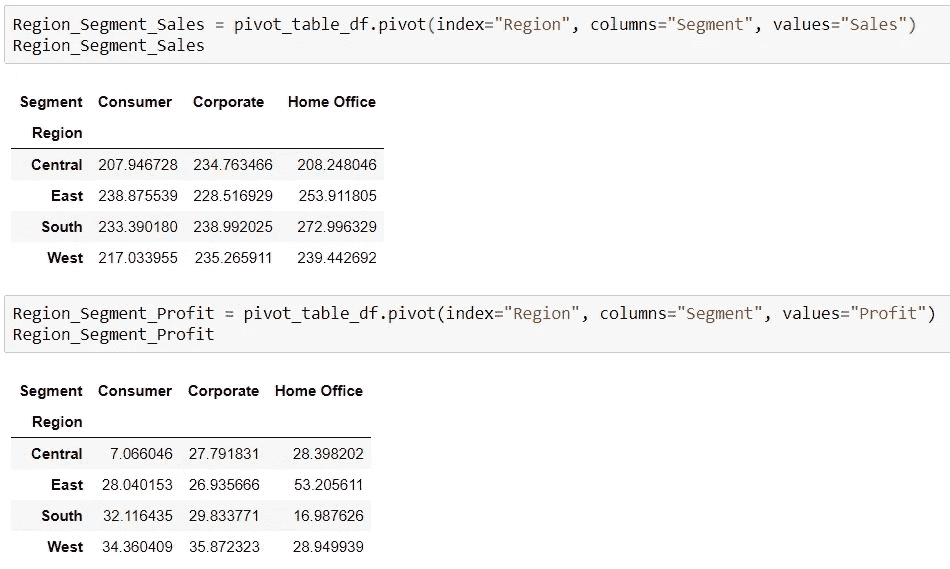

在这里，我们有两个报告，在广泛的形状使用枢纽功能，如所愿！

要了解更多，这里是 Pandas 文档页面的官方链接，用于重塑数据函数。

 [## 重塑和透视表- pandas 1.0.1 文档

### 数据通常以所谓的“堆栈”或“记录”格式存储:对于好奇的人来说，这是如何创建的:为了…

pandas.pydata.org](https://pandas.pydata.org/pandas-docs/stable/user_guide/reshaping.html) 

链接到我的 Azure 笔记本:[https://notebooks . Azure . com/pav neet-Singh/projects/shaping-data-with-python](https://notebooks.azure.com/pavneet-singh/projects/reshaping-data-with-python)

暂时就这样吧！请随意发挥周围的功能和快乐的重塑，直到下次！

《入门级程序员成功的 3P 战略》作者 pav neet Singh[https://towards data science . com/3p-Strategy-to-be-successful-for-entry-level-programmers-bbf 5 dbbcb 981](/3p-strategy-to-be-successful-for-entry-level-programmers-bbf5dbbcb981)

"让我们在画面中弹出这些过滤器！"作者帕夫尼特·辛格【https://link.medium.com/R4o2U6Fok4 

帕夫尼特·辛格[https://link.medium.com/zcBzu2Jok4](https://link.medium.com/zcBzu2Jok4)