# 重塑熊猫的数据框架

> 原文：<https://towardsdatascience.com/reshaping-dataframes-in-pandas-f6bfbb2c5b0f?source=collection_archive---------21----------------------->

用 python 重塑数据帧的终极指南

# 介绍

Pandas 无疑是 python 中使用最多的包之一。对于阅读本文的大多数人来说，这可能并不奇怪。许多人用熊猫来做不同种类的数据分析等等。但是，在某些情况下，我们可能希望以不同于最初提供的格式来重塑或可视化数据。这可能是由于各种原因。这可能是因为人们发现不同的表达方式更容易理解。这也可能是因为你想有一个特定的格式来运行你的代码。无论原因是什么，重塑数据框架可以被视为我们大多数人在作为数据科学家/分析师的旅程中所做的一项常见任务。本文将简要介绍一些有用的函数，这些函数可以用来重塑熊猫的数据帧。

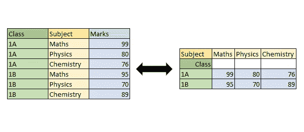

作者图片

我喜欢认为重塑函数有两种类型。第一类功能简单的改造现有的数据框架。例如，它们将列更改为行，将行更改为列。第二种类型的功能将聚合信息并对其进行重组。在大多数真实情况下，我们会使用第二种类型的函数，因为它可以根据需要让我们看到更高级别的汇总或聚合。

# 类型 1:没有聚集的重整

理想情况下，没有聚合的重组可以而且应该应用于存在唯一选择组合的数据。否则，他们很可能会对某些函数抛出错误。

为了解释没有聚集的重整，我们将首先声明一个数据框架。声明和数据框架如下:

使用这个数据框架，我们可以看到一些对改造/整形有用的功能。

## 在枢轴上转动

Pivot 方法通常用于创建数据的透视样式视图，用户可以在其中指定行(在 python 中称为索引)和列。这两个参数将为视图提供一个结构，而要填充的信息将来自用于创建 pivot 的数据。也可以使用 values 参数有选择地填充信息。现在让我们看一些例子来更好地理解它。

```
df.pivot(index='Date', columns='Class', values='Numbers')
```

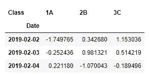

作者图片

正如我们从上面所看到的，一旦指定了索引、列、值，就形成了新的透视样式数据帧的结构，并相应地填充了索引、列对的组合所特有的信息。

请记住，建议始终填充索引和列参数，因为这将决定最终数据帧/视图的结构。让我们看看如果不声明 values 参数会发生什么。

```
df.pivot(index='Date', columns='Class')
```

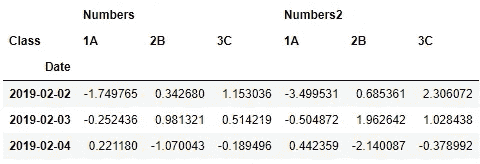

作者图片

如果我们不指定 values 参数，pandas 将创建所有各种可能的视图，同时将所有列名与上面指定的索引和列分开。因此，对于具有多个列的大型数据集，建议也指定 value 参数。

然而，使用上面的代码并稍微调整一下，还有另一种方法来提取关于一列的信息。这将是如下。

```
df.pivot(index='Date', columns='Class')['Numbers']
```

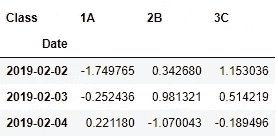

作者图片

如果我们提到上面给出的列名，而没有指定 values 参数，那么结果输出将是相同的。这样做的唯一缺点是需要更长的时间来执行。需要注意的是，列名声明类似于数据帧子集的语法。这是因为我们确实正在这样做。使用上面的代码，pandas 首先获得所有列的结果，然后使用括号中指定的列名，pandas 对数据帧进行子集化并显示出来。这也是为什么这个方法的执行时间比我们使用 values 参数的方法要长。

注意:使用 pivot 函数时，如果行*列的组合有多个条目，该函数将抛出一个错误，因为 pivot 不会进行任何类型的聚合。

## 熔化

Melt 是一个用于将列转换为行的函数。这意味着当用户希望将一列或多列信息放入行中时，这个函数非常有用。该函数将通过删除除 id_vars 参数中提到的列之外的所有其他列来创建两个新列，并在一列中显示列名，在另一列中显示其值。让我们看一个例子来更好地理解它。

```
df.melt(id_vars=['Date','Class'])
```

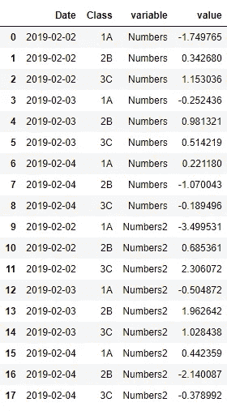

作者图片

在数据帧 df 中，我们有四列，其中在 id_vars 参数中提到了日期和类别。这将给我们留下列号和列号 2。正如我们在上面看到的，该函数创建了两个名为 variable 和 value 的新列，并用列名和 Date+class+列名组合的唯一值填充它们，同时删除列号和 Numbers2。

如果只有特定的列要以这种方式转换，而不是所有的列，那么参数 value_vars 将帮助我们实现这一点。

```
df.melt(id_vars=['Date','Class'], value_vars=['Numbers'])
```

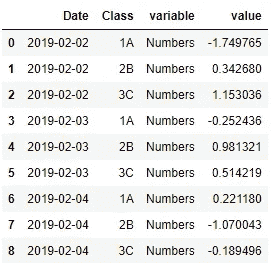

作者图片

正如我们所看到的，当 value_vars 参数中提到特定的列名时，只有该列的信息会根据需要进行融合。还有两个额外的参数 value_name 和 var_name，它们将通过参数中提到的字符串来重命名列 value 和 variable。让我们看一个例子来更好地理解这一点。

```
df.melt(id_vars=['Date','Class'], value_vars=['Numbers'], value_name="Numbers_Value", var_name="Num_Var")
```

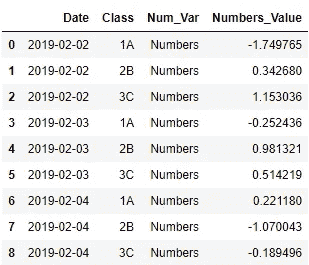

作者图片

正如我们所看到的，列被重命名为参数中指定的列。

## 堆叠和取消堆叠

Stack 和 Unstack 分别执行列到行和行到列的操作。这两个功能肯定是熊猫整形中较少使用的功能之一，因为人们会使用 pivot 来实现他们大多数时间想要的结果，因此不需要它。我们仍将研究它们，以了解它们是如何工作的，因为它们在一些特定的场景中可能是有用的。

stack 和 melt 之间的主要区别是 stack 需要将 id_vars 设置为 index，而不是必须单独将它们作为参数传递。让我们看一下 stack 来理解它做什么。

```
df.set_index(["Date","Class"]).stack()
```

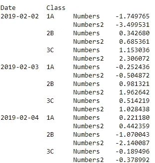

作者图片

正如我们所观察到的，它具有与 melt 相同的功能，将列转换为行。

另一方面，拆分与堆叠正好相反。它将行带到列，像堆栈一样，它需要索引才能按预期运行。

```
df.set_index(["Date","Class"]).stack().unstack()
```

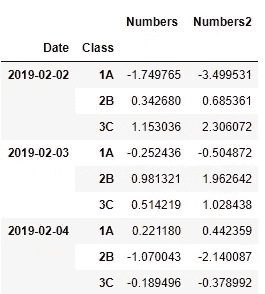

作者图片

正如我们所看到的，如果没有输入，unstack 基本上会撤消堆叠操作。当更改拆分括号内的数字输入时，输出会有所不同。如果你对这个话题感兴趣，这将是一个很好的话题。

# 类型 2:通过聚合进行改革

与类型 1 函数不同，类型 2 函数提供了信息的汇总视图。如果用户想要对数据进行某种类型的汇总，这将非常有用。我们将使用用于类型 1 函数的相同数据框架来研究类型 2 函数。

为了解释没有聚集的重整，我们将首先声明一个数据框架。声明和数据框架如下:

使用这个数据框架，我们可以看到一些对改造/整形有用的功能。

## 分组依据

Group by 是我使用最频繁的函数，超过了本文中提到的任何其他函数。这是因为，它使用起来非常直观，并且具有非常有用的参数，可以帮助用户查看不同列的不同聚合。让我们通过语句来研究一个简单的组。

```
df.groupby('Date')["Numbers"].mean()
```

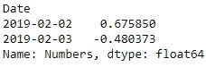

作者图片

在 group by 语句中，我们在第一个括号内指定需要对数据进行分组的一列或多列。这里，我们既可以给出一个单独的字符串，也可以给出与列名相关的字符串列表。下一个括号是指定要聚合的数据，最后我们调用聚合应该使用的方法。在上面的例子中，我们使用平均聚合来聚合日期的列数。

请注意，输出不是数据帧，而是看起来类似于熊猫系列。要将其转换为 dataframe，我们可以使用 reset_index 方法，或者也可以使用 group by 语句中可用的参数。我将使用后者。

```
df.groupby('Date', as_index=False)["Numbers"].mean()
```

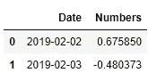

作者图片

如上图所示，as_index 参数可用于将 group by 的结果转换为 dataframe。

让我们再看一个例子，在这个例子中，我们使用一种方法对多个列进行聚合。

```
df.groupby(['Date','Class'], as_index=False)["Numbers"].mean()
```

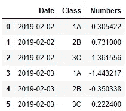

作者图片

正如我们在上面看到的，我们可以使用一个字符串列表(列名)在多个列上聚合多个列，而不是指定一个字符串(列名)。但是，我们也可以对不同的列使用不同的聚合函数。让我们看一下下面的例子，以了解如何做到这一点。

```
df.groupby(['Date'], as_index=False).aggregate({"Numbers":"sum", "Numbers2":"mean"})
```

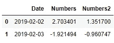

作者图片

在上图中，我们用 sum 函数聚合日期列上的数字列，同样，我们用 mean 函数聚合日期列上的数字 2 列。

## 数据透视表

数据透视表的功能与透视表相同。然而，pivot table 有一个额外的重要参数，它指定了我们将用来聚合数据的聚合函数。让我们看下面的例子来更好地理解它。

让我们从一个简单的数据透视表开始。

```
df.pivot_table(index="Date", columns="Class")
```

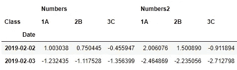

作者图片

注意，pivot table 的方法调用是 pivot_table，它不同于 pivot 的 pivot。如果未指定聚合函数，将使用默认函数 mean 来聚合信息。

```
df.pivot_table(index="Date", columns="Class", aggfunc="sum")
```

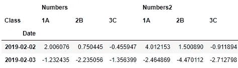

作者图片

但是，如果用户想要指定一个特定的函数，他们可以在参数 aggfunc 中这样做，如上图所示。

## 交叉表

本文中的最后一个函数是交叉表。默认情况下，该函数会给出两个不同列的值之间出现的次数或频率。让我们看一个例子。

```
pd.crosstab(df.Date, df.Class)
```

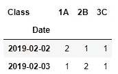

作者图片

上面的视图意味着在 1A 班级和 2019-02-02 日期的组合中有两个不同的条目可用。类似地，其他信息也可以被解释。

在代替出现频率的情况下，如果用户希望有一些其他的聚合函数，可以使用 aggfunc 参数。

```
pd.crosstab(df.Date, df.Class, values=df.Numbers, aggfunc='sum')
```

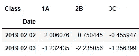

作者图片

```
pd.crosstab(df.Date, df.Class, values=df.Numbers, aggfunc='mean')
```

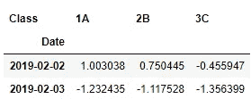

作者图片

上面的图片给人一种如何使用它的感觉。即使输出看起来与数据透视表相似，但实现的方式是不同的。但是人们更喜欢使用数据透视表而不是交叉表函数。

# 结论

我们已经在本文中看到了多个函数，并理解了各种参数及其用法。

总之，每个人都知道实践使人完美。这句话也适用于技术领域，对吗？为了让你更容易实践我们在本文中讨论的多个概念，我创建了一个 Jupiter 笔记本，你可以在这里下载。练习的好时光！！！


如果有任何疑问、建设性的批评和任何反馈，请随时联系我这里的。