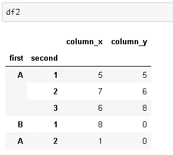

# 重塑熊猫数据框架

> 原文：<https://towardsdatascience.com/reshaping-pandas-dataframes-9812b3c1270e?source=collection_archive---------13----------------------->

## 熔化、堆叠和旋转功能

Pandas 是一个非常强大的 Python 数据分析库，可以加速项目的预处理步骤。Pandas 的核心数据结构是 **DataFrame** ，它以表格的形式表示数据，带有标记的行和列。在这篇文章中，我将尝试解释如何通过修改行列结构来重塑数据帧。


由[保罗·斯科鲁普斯卡斯](https://unsplash.com/@pawelskor?utm_source=unsplash&utm_medium=referral&utm_content=creditCopyText)在 [Unsplash](https://unsplash.com/s/photos/view?utm_source=unsplash&utm_medium=referral&utm_content=creditCopyText) 上拍摄

有多种方法可以重塑数据帧。我们可以选择最适合手头任务的一个。重塑数据帧的函数:

*   **融化**
*   **堆叠和拆分**
*   **枢轴**

一如既往，我们从进口熊猫开始:

```
import pandas as pd
import numpy as np
```

# **融化**

Melt 用于将宽数据帧转换为窄数据帧。我所说的宽是指具有大量列的数据帧。一些数据帧的结构是连续的测量值或变量用列来表示。在某些情况下，将这些列表示为行可能更适合我们的任务。

考虑以下数据帧:

```
df1 = pd.DataFrame({'city':['A','B','C'],
                   'day1':[22,25,28],
                   'day2':[10,14,13],
                   'day3':[25,22,26],
                   'day4':[18,15,17],
                   'day5':[12,14,18]})
```


我们有三个不同的城市，在不同的日子进行测量。我们决定用一列中的行来表示这些日子。还会有一列显示测量结果。我们可以通过使用**熔化**功能轻松实现这一点:

```
df1.melt(id_vars=['city'])
```


默认情况下，变量和值列的名称是给定的。我们可以使用 melt 函数的参数 **var_name** 和 **value_name** 来指定新的列名。如果我们按城市列对数据进行排序，效果会更好:

```
df1.melt(id_vars=['city'], var_name = 'date', value_name = 'temperature').sort_values(by='city').reset_index(drop=True)
```


# **堆叠和拆分**

堆栈函数增加了数据帧的索引级别。我所说的提高水平是指:

*   如果 dataframe 有一个简单的列索引，stack 返回一个系列，其索引由原始 dataframe 的行列对组成。
*   如果数据帧有多级索引，stack 增加索引级别。

用例子解释更好。考虑以下数据帧:


df1 有 3 行 6 列，具有简单的整数列索引。如果将 stack 函数应用于 df1，它将返回 3 x 6 = 18 行的序列。序列的索引将是[(0，'城市')，(0，'第 1 天')，…，(2，'第 5 天')]。


让我们也检查一下形状和指数:

```
df1.shape
(3,6)df1.stack().shape
(18,)df1.stack().index[0] #multilevel index
(0, 'city')
```

栈和非栈功能更常用于具有多级索引的数据帧。让我们创建一个具有多级索引的数据框架:

```
tuples = [('A',1),('A',2),('A',3),('B',1),('A',2)]index = pd.MultiIndex.from_tuples(tuples, names=['first','second'])df2 = pd.DataFrame(np.random.randint(10, size=(5,2)), 
                   index=index, columns=['column_x', 'column_y'])
```



如果我们对该数据帧应用堆栈功能，索引级别将会增加:

```
df_stacked = df2.stack().to_frame()
df_stacked
```


现在，列名(column_x 和 column_y)是多级索引的一部分。因此得到的数据帧有一列和一个 3 级多索引。

```
len(df_stacked.index.levels)
3len(df2.index.levels)
2
```


**拆垛**与**垛**正好相反。如果我们对堆叠的数据帧应用拆分，我们将得到原始的数据帧:


```
df_stacked.unstack().index
MultiIndex(levels=[['A', 'B'], [1, 2, 3]],
           codes=[[0, 0, 0, 1, 1], [0, 1, 2, 0, 1]],
           names=['first', 'second'])df2.index
MultiIndex(levels=[['A', 'B'], [1, 2, 3]],
           codes=[[0, 0, 0, 1, 1], [0, 1, 2, 0, 1]],
           names=['first', 'second'])
```


# **支点**

Pivot 函数也可以被认为是从不同的角度看待数据帧的一种方式。它通过允许以不同的格式表示数据来探索变量之间的关系。

考虑以下数据帧:


我们想看看城市名对的值是如何变化的。我们可以用城市名称和列的索引来创建这个数据帧的新表示。


如果城市名对不存在，则用 NaN 填充相应的单元格。

我们不必一次看到所有的值。可使用**值**参数过滤数据框中的值:


我认为熊猫的成功和流行来自于其多功能、强大且易于使用的操作和分析数据的功能。和熊猫一起完成一项任务几乎总是有多种方式。由于花在数据科学项目上的大部分时间都花在数据清理和预处理步骤上，所以非常鼓励学习 Pandas。

感谢阅读。如果您有任何反馈，请告诉我。