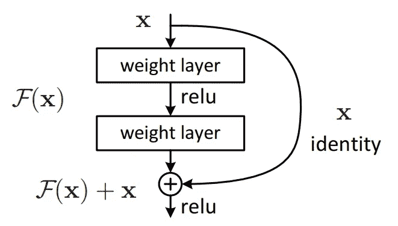
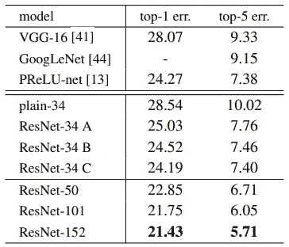
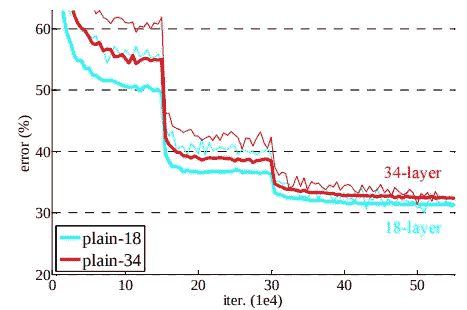
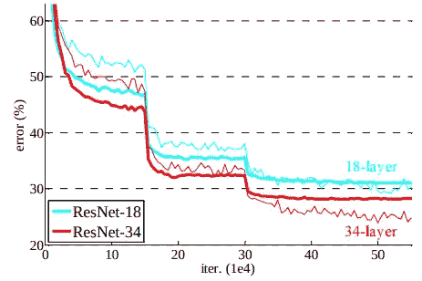
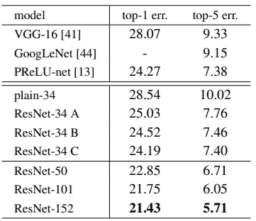
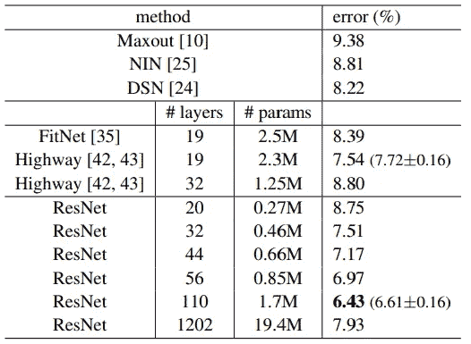

# ResNet:计算机视觉时代最流行的网络

> 原文：<https://towardsdatascience.com/resnet-the-most-popular-network-in-computer-vision-era-973df3e92809?source=collection_archive---------24----------------------->

## 计算机视觉工作者的必备知识

使用计算机算法对图像进行分类似乎很有挑战性。令人惊讶的是，最近在计算机视觉领域的一项研究取得了成功，在名为 ImageNet 的数据集上出现了 1.3%的前 5 名错误。2020 年，最先进的图像分类技术变成了由谷歌研究团队发布的 EfficientNet。然而，在很长一段时间内，名为 ResNet 的网络在图像分类领域表现出色。此外，许多研究人员使用 ResNet 作为他们的网络主干，以提高他们的性能。这篇文章将帮助你直观地理解什么是 ResNet 以及它是如何被激发的。

链接:[https://papers with code . com/sota/image-class ification-on-imagenet](https://paperswithcode.com/sota/image-classification-on-imagenet)

# 退化问题

深度神经网络在学习过程中遇到许多困难。计算机视觉研究人员提出了它们的解决方案，例如用批量标准化解决消失/爆炸梯度问题。(【https://arxiv.org/pdf/1502.03167.pdf】T4)ResNet 论文介绍了一个具有挑战性的问题，名为“**退化问题**”在阅读之前，我们先思考一下下面的问题。

> 层数越多，准确度越高？

在网络上添加图层会扩大输出的多样性，这似乎很直观。如果每个添加的图层都是身份映射，则新网络可以输出与原始网络相同的值。因此，训练有素的网络层数越多，分类精度越高，这是有说服力的。不幸的是，事实并非如此。

当您使用普通网络(在 ResNet 之前)估计精度时，**随着模型复杂性的增加，其精度会迅速下降**。这个问题是一个**退化问题**。这不是一个过度拟合的问题；然而，随着模型复杂性的增加，网络的性能下降。作者声称平面网络不适合近似身份映射；因此，添加层并不保证添加层的网络能够表达添加层之前网络的所有值。ResNet 的动机是**建立一个适合身份映射的网络。**

# 快捷连接

为了使身份映射适用于网络，作者使用了一个名为**的快捷连接**的方法。这种方法的主要直觉是与其学习函数 F(x)，不如学习函数 F(x) + x .学习一个恒等式映射更容易；由于层权重都调整为 0，它将产生一个身份映射，而不是零映射。此外，它是可区分的，因此端到端是可训练的。

快捷连接的另一个考虑是在恒等式中增加**投影**。由于快捷方式连接的层之间的尺寸可以不同，因此有三个考虑因素。a)在增加的尺寸上补零，B)投影快捷方式仅用于尺寸改变的部分，C)所有快捷方式都是投影。下表是对每种情况的估计。(ResNet-34 后面的 A、B 和 C 表示在 ResNet-34 中应用的 A)、B)和 C)

关注第二行框

结果显示**在身份上进行投射并不会严重影响绩效**。改变参数的数量使得与普通网络的比较更加困难。因此，作者简单地在网络中使用了身份映射。

# 整体主干

要参考网络的详细结构，请参考论文。

链接:【https://arxiv.org/pdf/1512.03385.pdf 

# 实验

他们比较了两个网络:普通网络和 ResNet。两个网络使用相同的层；然而，只有 ResNet 具有快捷连接。他们在两个数据集上进行了实验:ImageNet 和 CIFAR-10。下面的图表是实验的结果。

(细曲线表示训练错误，粗曲线表示验证错误)

ImageNet 上平面网络的性能

从图中可以看出，训练误差随着层数的增加而增加。这意味着**普通网络正遭受退化问题**。ResNet 怎么样？

ResNet 在 ImageNet 上的性能

***不再有退化问题*** 。随着层数的增加，它们的训练误差减小。

ImageNet 上的实验结果

作者在 ResNet 中添加了更多层，以制作更复杂的模型。正如所料，增加层数可以提高性能。当在 CIFAR-10 上进行实验时，这种趋势是相似的。

CIFAR-10 的实验结果

但是，我们可以观察到，在网络上使用 1202 层，性能会显著下降。论文认为这是由于过度拟合造成的。即使性能有显著下降，它仍然优于原始方法。

# 结论

ResNet 的动机是解决退化问题。通过直观的方法，他们设计了适合身份映射近似的网络。实验表明， **ResNet 很好地解决了退化问题，**然而，它对于极深的网络工作不佳。

我很感激对我的文章的任何反馈，对于任何讨论，欢迎你给我发电子邮件。如果有什么不对或者误解的地方，请告诉我。:)

**联系我:jeongyw12382@postech.ac.kr**

**进一步阅读**

D2 匹配解释:

[https://medium . com/forward-artificial-intelligence/D2-net-matching-problem-in-images-under-a extreme-appearance-changes-9f 059 f 33 a2 ef](https://medium.com/towards-artificial-intelligence/d2-net-matching-problem-among-images-under-an-extreme-appearance-changes-9f059f33a2ef)