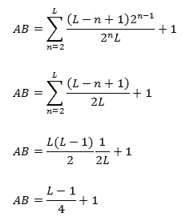

# 用冯·米塞斯的随机性公理解决圣彼得堡悖论

> 原文：<https://towardsdatascience.com/resolution-of-the-st-petersburg-paradox-using-von-mises-axiom-of-randomness-f9ee82ab1bce?source=collection_archive---------68----------------------->

[托马斯·沃尔特](https://pixabay.com/it/users/ThomasWolter-92511/?utm_source=link-attribution&utm_medium=referral&utm_campaign=image&utm_content=298029)在 [Pixabay](https://pixabay.com/it/?utm_source=link-attribution&utm_medium=referral&utm_campaign=image&utm_content=298029) 上的照片

*在这篇文章中，我们将提出一个全新的观点来解决博弈论中一个最重要的悖论。所用的方法源于对非遍历系统的研究。这种情况可能会造成结果之间的依赖性，而这种依赖性通常极难检测和量化，例如在金融领域。因此，从可能相关的数据中获得的预期增益具有难以确定的统计值，因此不能用于决策目的。因此，在这种情况下，必须找到在决策过程中使用的替代参数。解决方案开发通过利用关于系统的有用信息，将焦点从结果转移到以认知方式操作的策略能力。为了从数学的角度确定一个策略是否是认知的，我们使用冯米塞斯的随机性公理。基于这个公理，有用信息的知识因此产生不能随机复制的结果。在这种情况下，有用的信息可以被看作是接收者当前或未来决策过程的重要数据。总之，这个悖论中的无限行为可以被看作是一个能够使预期收益不能用于决策目的的因素。结果，我们被迫用不同的观点来面对这个问题。为了做到这一点，我们通过利用关于系统的有用信息，将焦点从结果转移到策略以认知方式操作的能力。最后，通过从这个新的角度来解决这个悖论，我们将证明一个趋向于无穷大的预期收益并不总是认知和非随机策略的结果。因此，这个结果引导我们定义了决策中的价值等级，其中认知方面，其统计结果是与随机行为的背离，被证明比预期收益更重要。*

## 介绍

圣彼得堡悖论是博弈论中最重要的悖论之一。用于求解的经典解决方案使用实现边际效用概念的特殊效用函数[1]、[2]、[3]。这种方法受到了强烈的批评，因为效用函数试图从数学的角度将社会学行为形式化，这就是为什么效用函数总是带有主观性的原因。此外，许多行为经济学研究[4]，[5]强调了人们的行为通常是非理性的。因此，解决这一矛盾仍然是一个公开的挑战，正如我们将看到的，寻找替代解决方案可能有助于我们改善战略评估期间的决策过程。

为了理解本文提出的解决圣彼得堡悖论的方法，我们必须首先解释这个方法的起源。开发这种方法是为了研究在非遍历系统上运行的策略。特别是，主要应用领域的特点是研究金融市场上的定量交易算法。非遍历条件可以使结果相互依赖。因此，在这种情况下，数据之间会产生依赖性，就像在金融领域一样，难以检测和量化。

为了向你解释这种情况在决策层面上可能产生的后果，我提出下面的例子:想想对一枚硬币的一百次投掷下一百次赌注，赢了一百次。在这种情况下，你将获得一百个彼此独立的胜利，这些胜利将与一个非常高的预期收益相关联。因此，你会得出正确的结论，即用来预测抛硬币的策略很可能是正确的。现在让我们改变开始的场景，假设我们在一次掷硬币中下 100 次相等的赌注，获得 100 次胜利。显然，由于赌注完全相互依赖，在这种情况下，它们不能用于计算预期收益。事实上，这基本上就像我们做了一个单一的赌注。现在让我们想象一下，作为第三个也是最后一个场景，你看不到抛硬币的人:如果我们赢了所有的 100 次，我们不知道他们是相互依赖还是相互独立。第三种情况产生了一个非常重要的决策问题，因为如果我认为结果是独立的，而它们不是，我就有高估策略的风险。这种错误的评估会导致我做出使用无用策略的非理性选择。在金融学中，结果的非独立性产生了一种叫做聚类的统计现象。这种统计特征决定了高收益组与低收益组的交替形成。换句话说，这意味着回报不是均匀分布的，而是趋向于聚集在一起。聚集现象在金融领域有着灾难性的影响，因为当你经历成功阶段时，你会被引导去考虑那些彼此独立的操作。这意味着从我们错误地认为是独立的数据中计算出来的预期收益被高估了，因此对策略的评估也将是不正确的。因此，这种行为会让我们面临意想不到的风险。关于这个话题，我们提出了一个悖论，我们称之为“职业交易者悖论”。这个名字来源于这样一个事实，即我们倾向于认为我们的操作总是独立的，因此当我们面对一系列赢的赌注时，我们倾向于高估所使用的策略。

总之，从可能不独立的数据中获得的预期增益不能用于决策目的，因为它具有难以确定的统计值。因此，从这个例子中我们了解到，在某些情况下，比如在非遍历系统中，预期增益不再是可靠的参数。因此，我们可以认为，其他情况可能存在，如在这种悖论的无限行为的情况下，预期收益是一个不能用于决策的数据。

我们开始理解，解决圣彼得堡悖论的问题可能源于考虑预期收益及其变体(效用函数)，作为评估战略的唯一可能的观点。所以，我们要问自己的问题是:有没有一个参数比预期增益更好？

我们对这个问题的回答是，从统计学的角度来看，如果一个策略通过利用系统中有用的信息以一种认知的方式运作，我们就能够理解。在这种情况下，有用的信息可以被看作是经过分析的数据，使其对接收者现在或将来的决策过程具有重要意义。为了从数学上确定一个策略是否是认知的，在刚才描述的意义上，我们利用了冯米塞斯的随机性公理。公理定义了必须有一个序列才能被认为是随机的统计特征。公理如下:“将一个序列定义为随机序列的基本要求在于，完全没有任何规则可以成功地应用于改进对下一个数的预测”。

这个公理的含义如下:当我们理解一个数字序列服从的一组规则时，我们可以获得结果，作为对序列的下一个数字的预测，随着预测次数的增加，随机再现的概率趋于零。

因此，用一种游戏策略获得的结果，实现了对提高我们获胜概率有用的信息，产生了不能随机再现的结果。基本上，与使用有用信息的认知策略相比，使用随机策略获得更好结果的概率随着预测次数的增加而趋于零。

这个公理实际上是一种统计方法，用于评估所获得的结果，而不考虑预期增益的绝对值。事实上，这种方法仅仅基于这样一个事实，即能够区分结果是通过随机策略获得的，还是通过执行系统服从的一组规则的认知策略获得的。

通过这种方式，我们在分析一类特殊的零和博弈的策略时获得了一个基本结果，在这类博弈中，参与者之间存在一种平衡。平衡意味着没有一个玩家相对于其他玩家有明显的优势。著名数学家丹尼尔·伯努利将这类特殊的游戏定义为:“数学上公平的机会游戏”。

这类博弈在博弈论中起着特别重要的作用，因为它代表了金融等各种利益领域中非常频繁的情况。

如果我们分析通过大量重复圣彼得堡悖论中描述的机会游戏所获得的结果，在下一段中，我们将证明通过使用随机策略，可以以接近 50%的概率获得更好的利润。在实践中，一个纯随机博弈策略的结果往往相对于从悖论中描述的策略中得出的预期理论收益对称分布。这一结果表明，每次输钱后的双倍下注策略没有利用任何有用的信息，因此它是一种完全非认知的游戏方法。因此，通过将认知方面作为一个用于决策的参数，并证明了在策略中的完全缺失，我们能够通过证明博弈方法的不合理性来解决悖论。

在本文中，我们想介绍认知方面，即通过利用关于系统的有用信息以非随机方式行动的意义，作为改进决策理论的基本要素。事实上，这个悖论有助于让我们理解，关于系统的有用信息的知识，能够增加我们的胜利概率，总是涉及预期收益的增加。然而，反之则不成立:一个趋于无穷大的预期收益并不意味着策略利用了关于系统的知识，因此是认知的而不是随机的。因此，就产生了一个价值层次，在这个层次上，对于决策来说，认知方面比预期收益更重要。

## 圣彼得堡悖论的解决

在这一段中，我们将通过证明每次输掉赌注后的双倍下注策略是一种非认知策略来解决圣彼得堡悖论，这种策略没有实施任何可用于提高成功概率的有用信息。

为了做到这一点，我们必须定义随机策略，我们将使用它来计算获得比悖论中定义的赌博方法更好结果的概率。事实上，如前一段所述，如果被评估的策略是实现有用信息的认知策略，这种概率应该趋于零。首先，我们定义一些参数，这些参数是表征我们的随机参考策略的基础。

我们需要的第一个参数是每次赌输后使用双倍下注策略得到的博弈的期望值 EV。假设掷骰次数等于 L，赢的概率为 50%，第一次下注的价值等于 1，我们有:

第二个参数是平均赌注 AB。通过进行价值为 Bn 的 L 次下注，我们得到:

已知第一次下注 B1 等于 1，并且在每次下注失败后加倍下注，并且当我们赢得下注时返回到值 1，我们有:

此时，随机游戏策略将被定义如下:给定等于 L 的翻转次数，将进行 AB 常数值的 L 次下注，随机选择每次下注是正面还是反面。要计算这种类型的策略与悖论的策略的期望值 EV 相比是否能获得更好的结果，只需使用二项式分布公式。

P =获胜的概率

K =获胜次数

L =投掷次数

通过使用二项式分布公式，给定 L 值，我们可以获得使用上述随机策略获得更好结果的概率。范围从 10 到 200 的 L 值的结果如图 1 所示。看这个图，我们看到概率是如何渐近地趋向于 50%的。因此，我们有 50%的机会得到更好或更坏的结果。基本上，悖论中描述的策略逐渐趋向于随机策略。因此，双倍下注策略结果证明是一种不执行有用信息来提高我们获胜可能性的策略。因此，使用认知方面作为评估方法已经证明了该策略的不合理性。

我们使用非常相似的方法，将被评估的策略与金融领域中的等效随机策略进行比较，以分析交易策略产生的结果[7]，[8]。

图 1:给定范围从 10 到 200 的 L 次投掷次数，用随机策略获得更好结果的概率。

## 结论

在本文中，我们使用圣彼得堡悖论来引入一个与战略的认知方面相关的参数，作为一个基本元素来帮助我们在预期收益被证明是一个不可靠参数的所有情况下做出决策。这种方法是通过研究非遍历系统开发的。在这种情况下，结果可能是非独立的，因此预期增益变成了具有难以确定的统计值的参数。因此，它不能用于决策，需要找到一个新的参数。选择的参数与策略以认知方式运行的能力相关(认知术语表示策略通过利用关于系统的有用信息以非随机方式运行的能力，能够使我们增加胜利的概率)。

为了从数学上确定一个策略是否是认知的，我们使用了冯·米塞斯的随机性公理。基于这个公理，实现关于系统的有用信息的策略产生不能随机再现的结果。因此，我们从总下注价值的角度比较了悖论策略和完全随机但等价的策略。从这个比较中，我们证明了随机策略得到更好的结果，随着投掷次数的增加，概率趋向于 50%。基本上，这个策略倾向于收敛到一个随机策略，而不是像我们从认知策略中预期的那样发散。事实上，如果一个策略在系统上实现了有用的信息，随机地

获得更好的结果趋向于零。这一结果表明，每次输掉赌注后的双倍下注策略不是利用关于系统的有用信息的认知策略，因此，通过将认知方面作为评估参数，我们已经解决了悖论。

总之，圣彼得堡悖论告诉我们，趋于无穷大的预期收益并不总是意味着认知和非随机策略的存在。因此，知识，意味着利用有用的信息，能够使我们增加胜利的概率，总是意味着预期收益的增加，但反之则不然；在缺乏系统知识的情况下，也可以获得趋于无穷大的期望增益。因此，从决策方面来看，我们可以创建一个价值等级，其中知识比预期收益更重要。事实上，在非遍历系统的情况下，胜利的期望可能难以估计，或者如果所开发的策略具有高度的过度拟合，则胜利的期望可能是无用的数据。在所有这些情况下，随机获得相同结果的概率的计算成为更可靠的参数，因为该数据仅受我们对系统的真实了解的影响，而不受噪声的影响。事实上，一个统计数据并不代表一个有用的信息，只有当它有可能证明它不是以随机的方式获得时，它才成为一个有用的信息。实际上，随机获得相同结果的概率必须非常低，才能认为该结果是有用的。

## 参考

[1]保罗·萨缪尔森，(1977 年 3 月)。《圣彼得堡悖论:被切割、剖析和历史描述》。经济文献杂志。美国经济协会。15 (1): 24–55.JSTOR 2722712。

[2]罗伯特·J·奥曼(1977 年 4 月)。“圣彼得堡悖论:对最近一些评论的讨论”。经济理论杂志。14 (2): 443–445.doi:10.1016/0022–0531(77)90143–0。

[3]罗伯特·马丁(2004 年)。“圣彼得堡悖论”。在爱德华·n·扎尔塔。斯坦福哲学百科全书(2004 年秋季版。).加州斯坦福:斯坦福大学。ISSN 1095–5054。检索于 2006 年 5 月 30 日。

[4]丹尼尔·卡内曼和阿莫斯·特沃斯基(1979)“前景理论:风险下的决策分析”，计量经济学，47(2)，263–291。

[5] Hersh Shefrin，(2002)“超越贪婪和恐惧:理解行为金融学和投资心理学”。牛津大学出版社。

[6]安德烈·贝尔东迪尼，《职业交易者的悖论》，(2018 年 11 月 20 日)。在 https://ssrn.com/abstract=3287968.的 SSRN 有售:

[7] Andrea Berdondini，“冯·米塞斯的随机性公理在关于由数字序列描述的非平稳系统的动力学的预测上的应用”(2019 年 1 月 21 日)。可在 https://ssrn.com/abstract=3319864[或 http://dx.doi.org/10.2139/ssrn.3319864.](https://ssrn.com/abstract=3319864)[的](http://dx.doi.org/10.2139/ssrn.3319864.)SSRN 买到

[8] Andrea Berdondini，“来自经济物理学的方法论描述作为财务战略的验证技术”，(2017 年 5 月 1 日)。在 https://ssrn.com/abstract=3184781\. SSRN 有售: