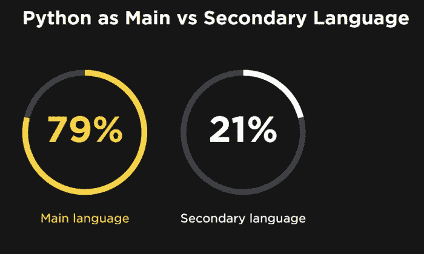
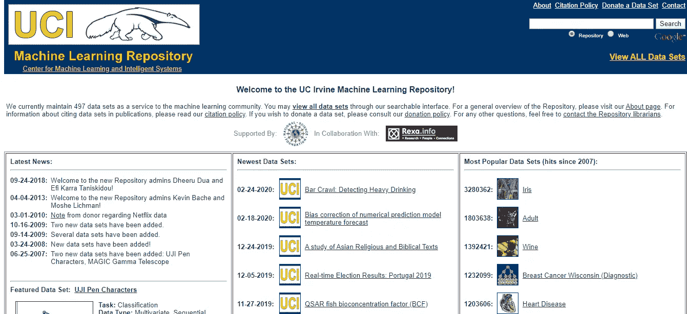
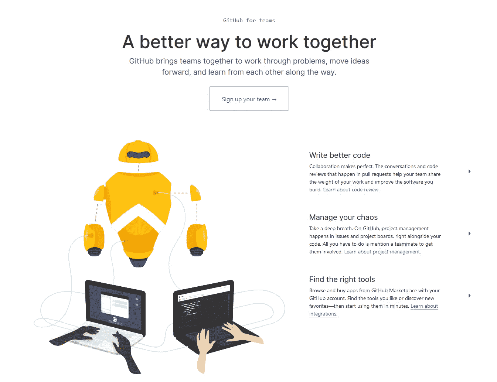

# 我希望在开始从事数据科学时就知道的资源

> 原文：<https://towardsdatascience.com/resources-i-wish-i-knew-when-i-started-out-with-data-science-9a8889654c36?source=collection_archive---------5----------------------->

蒂姆·莫斯霍尔德在 [Unsplash](https://unsplash.com?utm_source=medium&utm_medium=referral) 上的照片

## 面向严肃数据科学家的强大学习指南

数据科学可能会让人不知所措。有很多人会告诉你，为了成为一名数据科学家，你必须学习繁重的数学和计算机科学——统计学、微积分、线性代数、分布式计算、聚类等等。

很容易感觉自己像一只被车灯困住的羚羊——不知道从哪里开始。

我理解你的感受——不久前我也处于你的处境。

这篇文章是献给我作为数据科学初学者所希望拥有的资源的。我希望在这篇文章中分享我的经验将使你走上追求数据科学职业的正确道路，并使你的学习之旅更加愉快。

> 如果你想开始深度学习，这里有一个 1.5 小时的免费速成课程:

# 数据科学适合你吗？

照片由 [Isaac Smith](https://unsplash.com/@isaacmsmith?utm_source=medium&utm_medium=referral) 在 [Unsplash](https://unsplash.com?utm_source=medium&utm_medium=referral) 上拍摄

在你前进之前，你需要分析数据科学是否适合你。数据科学很性感——薪水很高，随之而来的是巨大的声望。

问问你自己:这是你转向数据科学的原因吗？

如果是，**马上转回来！数据科学不适合你。**

数据科学的问题是，即使你对它充满热情，你也不能强迫自己热爱这个过程。如果你不喜欢数据科学带来的感觉，那么从长远来看，你很难保持动力。

## 我给你的建议是:做你的研究

在你下定决心之前，研究，研究，研究！

观看视频，阅读关于数据科学家日常生活的文章。

[数据科学家的一天](https://www.youtube.com/watch?v=Ck0ozfJV9-g) —霍马理工大学

[数据科学:现实与期望](https://www.youtube.com/watch?v=8LucP1wiX1g) —马特·特兰

开始的时候，做一点调查，会对你做出正确的选择大有帮助。

PS:这是玛丽维尔大学的一份方便的数据科学职业指南，你可以用它来衡量你的兴趣！

# 强大的学习途径

[拉杜·马尔库苏](https://unsplash.com/@radu_marcusu?utm_source=medium&utm_medium=referral)在 [Unsplash](https://unsplash.com?utm_source=medium&utm_medium=referral) 上的照片

如果你正在读这篇文章，你可能已经决定继续从事数据科学。恭喜你！

> 学习数据科学是巨大的。吃大象的唯一方法是一次咬一口。

这与任何其他具有挑战性的任务没有太大的不同。取决于你从哪里开始，你可能需要吃更多的东西，但是这并没有什么魔力；没有捷径。只是一次吃一口。

下面的学习路径包括两个主要部分——数学和技能。从数学开始是个好主意，这样你就可以判断数据科学是否适合你。对于一些人来说，数学可能令人望而生畏，因为数据科学主要使用许多数学概念。一开始就认识到这一点，可以避免你以后后悔。

总而言之，

> **从数学开始**

# 第一部分:数学

3 数据科学中最重要的主题是线性代数、微积分和统计学。但是对于大多数任务，您可以只使用统计数据。即便如此，我还是在这三个概念下链接了有用的资源，如果你想了解更多的话。

## 线性代数

线性代数在数据科学中(几乎)无处不在。在大多数计算中，你的计算机会用到大量的线性代数。在神经网络中，网络的表示和处理使用线性代数。很难想象有哪个模型不是用这个数学分支实现的。

但是这看起来很重要，在大多数情况下，你*不会*在你的数据集中应用矩阵变换的手写代码。你真正需要的是对其核心原则的良好直觉。

 [## 线性代数|可汗学院

### 如果您看到此消息，这意味着我们在网站上加载外部资源时遇到了问题。如果你是…

www.khanacademy.org](https://www.khanacademy.org/math/linear-algebra) 

如果你想学习线性代数的理论并在代码中应用这些理论，请使用下面的资源:

 [## 精通线性代数:从理论到实现

### 线性代数也许是计算科学中最重要的数学分支，包括机器…

www.udemy.com](https://www.udemy.com/course/linear-algebra-theory-and-implementation/) 

## 结石

像线性代数一样，微积分也在数据科学中发挥着重要作用，特别是在机器学习中使用的算法。同样，和前者一样，你*不需要*成为微积分大师才能掌握数据科学。你需要的是理解它的核心原则，以及这些原则如何影响你的模型。

 [## 机器学习线性代数的第一步

### 从国家研究型大学高等经济学院学习机器学习线性代数的第一步…

www.coursera.org](https://www.coursera.org/learn/first-steps-in-linear-algebra-for-machine-learning) 

## 统计与概率

统计和概率是一个**你真的不得不学习的话题。**这将占用你大量的时间，但好消息是这些概念并没有那么难，所以你没有理由不掌握这个主题。

 [## 统计和概率|可汗学院

### 如果您看到此消息，这意味着我们在网站上加载外部资源时遇到了问题。如果你是…

www.khanacademy.org](https://www.khanacademy.org/math/statistics-probability) 

## 数学中的其他主题

作为一名初学数据的科学家，你可能不会在日常生活中用到这些话题，但如果你想提高自己的水平，它们会特别有用。

1.  **图论**

> “图论是对**关系**的研究。给定一组节点——可以用来抽象从城市到计算机数据的任何东西——图论以非常深入的方式研究它们之间的关系，并为许多安排、联网、优化、匹配和操作问题提供答案。它的力量在于能够用来抽象出如此大量的实际问题。”— [弗兰克·汉纳里](https://apps.dtic.mil/dtic/tr/fulltext/u2/705364.pdf)

如果您希望为物流公司建立优化路线的模型，或者建立欺诈检测系统，基于图的方法有时会优于其他解决方案。

 [## 图论入门| Coursera

### 我们邀请你进入图论的迷人旅程-一个连接绘画的优雅和…

www.coursera.org](https://www.coursera.org/learn/graphs) 

**2。离散数学**

离散数学是数学的一个分支，它研究的对象只能具有不同的、分离的值。离散对象通常可以用整数来描述，而连续对象则需要实数。

一旦你开始在机器上使用数学，你就进入了离散数学的世界，在这个世界里，每个数字只能用有限的“比特”来表示。

 [## 什么是离散数学？

### 连续数学与离散数学数学世界可以大致分为两个领域:连续数学和离散数学

cse.buffalo.edu](https://cse.buffalo.edu/~rapaport/191/S09/whatisdiscmath.html)  [## 计算机科学离散数学导论| Coursera

### 为你的 IT 职业打下基础。掌握驱动我们生活的数学，为你的软件工程师或…

www.coursera.org](https://www.coursera.org/specializations/discrete-mathematics) 

如果你害怕数学，无视数学方程，你就不会有作为数据科学家的乐趣。然而，如果你愿意花时间来提高你对概率和统计的熟悉程度，并学习微积分和线性代数的基本原理，数学不应该成为你成为专业数据科学家的障碍。

PS:数学真的很有趣。随着你对数学的深入研究，你也将分享数据科学家对数学无拘无束的热情。

# 第 2 部分:技术技能

现在到下一个/稍微更有趣的部分。[每天产生 2.5 艾字节的数据](https://www.socialmediatoday.com/news/how-much-data-is-generated-every-minute-infographic-1/525692/)**(1 艾字节= 10 ⁸字节)，如果不使用计算机来分析这些数据的一小部分(称为“大数据”)，那将是荒谬的。**

****“数据科学需要多少编程，尤其是统计分析和机器学习？”****

**很多。实际上，大多数数据科学工作都需要您编写代码，原因如上所述，还因为大多数公司都需要一些数据清理、实施和产品化，以及使算法适应他们自己的特定目的。如果你不能将自己的解决方案应用到产品中，那么你就不是一个有用的员工。([来源](https://www.quora.com/How-much-programming-is-required-in-data-science-particularly-statistical-analysis-and-machine-learning-Should-a-data-scientist-care-more-about-analysis-interpretation-mathematics-rather-than-programming-What%E2%80%99s-wrong-in-using-a-GUI-based-tool))**

## **计算机编程语言**

**Python 是迄今为止世界上在数据科学中使用最广泛的编程语言。在 JetBrains 2016 年的调查中，几乎五分之四的开发人员表示 Python 是他们的主要语言。**

****

**[来源](https://opensource.com/article/18/5/numbers-python-community-trends)**

**我建议你专注于 Python，同时也花一点时间在 [R](https://www.r-project.org/) 上。**

** [## 学习 Python——Python 的搭便车指南

### Learnpython.org 是介绍 Python 的一种简单而不吓人的方式。该网站采用了相同的方法…

docs.python-guide.org](https://docs.python-guide.org/intro/learning/)  [## 面向所有人的编程(Python 入门)| Coursera

### 从密歇根大学学习面向所有人的编程(Python 入门)。本课程旨在教授…

www.coursera.org](https://www.coursera.org/learn/python)  [## 学习 Python 3 | Codecademy

### 学习世界上最流行的编程语言的最新和最棒的版本！

www.codecademy.com](https://www.codecademy.com/learn/learn-python-3) 

## 稀有

Python 将满足您的大多数数据科学项目，但是要真正被称为全面的数据科学家，您的工具包中需要有 R。在 R ***和*** Python 中不一定要成为宗师。选择一个，学习另一个的基本原理。

 [## R 教程-学习 R 编程

### 权威指南 R 是一种编程语言和环境，通常用于统计计算、数据分析…

www.datamentor.io](https://www.datamentor.io/r-programming/) 

## 使用 Python 进行数据分析(Numpy、Pandas 和 Matplotlib)

如果你专门为了数据科学而学习 Python，你需要知道如何分析数据，特别是如何加载、操作和可视化数据。

 [## Python Numpy 教程(有 Jupyter 和 Colab)

### 本教程最初由贾斯廷·约翰逊提供。我们将使用 Python 编程语言进行所有…

cs231n.github.io](https://cs231n.github.io/python-numpy-tutorial/) 

## 用 Python 进行机器学习

机器学习算法是数据科学的核心。投入一些时间来掌握它们的理论和应用。

 [## amueller/introduction _ to _ ml _ with _ python

### 这个库包含了 Andreas 即将出版的书《Python 机器学习入门》的代码…

github.com](https://github.com/amueller/introduction_to_ml_with_python)  [## 机器学习速成班|谷歌开发者

### 学习和应用基本的机器学习概念的速成课程，获得现实世界的经验与…

developers.google.com](https://developers.google.com/machine-learning/crash-course) 

## 结构化查询语言

SQL，或者结构化查询语言，对于数据科学家来说是极其重要的。数据建模的一个基本过程是首先提取数据。这通常会涉及到对数据库运行 SQL 查询。

 [## 想学 SQL？这是你需要的一切

### 面向专业开发人员的一站式 SQL 备忘单

medium.com](https://medium.com/swlh/want-to-learn-sql-heres-everything-you-need-baffadc89291)  [## SQL 备忘单(2020)| websitesetup.org

### 在本指南中，您将找到一个有用的备忘单，它记录了一些更常用的 SQL 元素，甚至…

websitesetup.org](https://websitesetup.org/sql-cheat-sheet/) 

## 生产系统

如果你在工作，你将利用公司的计算资源来提取、转换和分析数据。使用单台机器来执行这些任务是不够的。

值得花时间专门了解这些工具，因为它们在当今的行业中被广泛使用。

SQL 是当今使用的工具之一。像[亚马逊网络服务(AWS)](http://aws.amazon.com) 、[谷歌云](http://cloud.google.com)和[微软 Azure](http://azure.microsoft.com) 这样的云计算平台被大量企业广泛使用。

另一个有用的技能是 [**版本控制**](https://git-scm.com/book/en/v2/Getting-Started-About-Version-Control) 。

# 获得实践经验

遵循我上面提到的资源只会给你带来一半的好处。为了应用你刚刚学到的知识，你需要通过**练习**来应用这些知识！

要真正掌握这些概念，您需要在一些项目中使用这些技巧，这些项目非常类似于现实世界中的应用程序。你将会遇到问题——这是不可避免的——去处理诸如错误的数据，并在数据科学方面发展真正深厚的专业知识。

这里有几个好地方，你可以从那里获得这种实践经验(免费):

## 卡格尔

机器学习竞赛服务于许多目的。它们是解决问题和集思广益的渠道。 [Kaggle](http://kaggle.com) 是最知名的数据科学平台之一。这是应用你新学到的技能的好方法。

这里列出了 10 个数据科学竞赛，供您磨练技能:

 [## 10 场数据科学竞赛让你磨练 2020 年的技能

### 这里有一个网站列表，供您练习数据科学技能，参加在线黑客马拉松和…

towardsdatascience.com](/10-data-science-competitions-for-you-to-hone-your-skills-for-2020-32d87ee19cc9) 

## UCI 机器学习知识库

[UCI 机器学习库](https://archive.ics.uci.edu/ml/index.php)是一个公共可用数据集的大型来源，你可以用它来组合你自己的数据项目。

值得注意的是，在 Github 上公开存储你的项目是一个好主意，因为这可以创建一个展示你的技能的作品集，用于未来的工作申请。

UCI ML 知识库

## 为开源做贡献

一个可以考虑的好选择是为开源项目做贡献。有许多 Python 项目依靠开发者社区来维护。Github 是一个很好的起点。

Numfocus 是这类项目的一个很好的例子。

[Github](http://github.com)

# 结束语

[哈雷戴维森](https://unsplash.com/@harleydavidson?utm_source=medium&utm_medium=referral)在 [Unsplash](https://unsplash.com?utm_source=medium&utm_medium=referral) 上的照片

在的这篇文章中，我描述了一条学习路径，它将引导你踏上数据科学之旅。

黄金法则，

> 比一般的数学家更擅长编程。
> 
> 比一般程序员更擅长数学

数据科学是多个领域的混合体。你不应该只在一件事上努力做到最好，而是在每件事上都做得足够好。

> **牢记大局。**

我想指出的是，如果你不愿意投入时间，这些资源**不会为你工作。数据科学是一场马拉松，而不是短跑。前面还有很长的路要走。如果你遵循这条道路，你进入数据科学的道路将会更加顺畅，而不是更加容易，你将会在数据科学的道路上继续你的职业生涯。**

快乐学习！

直到下一次…**