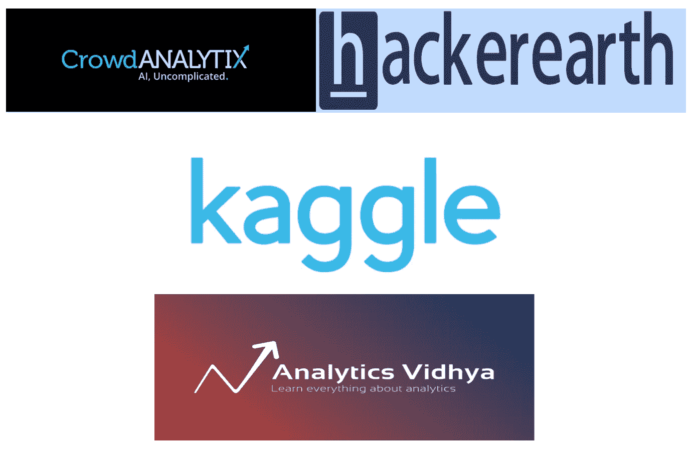
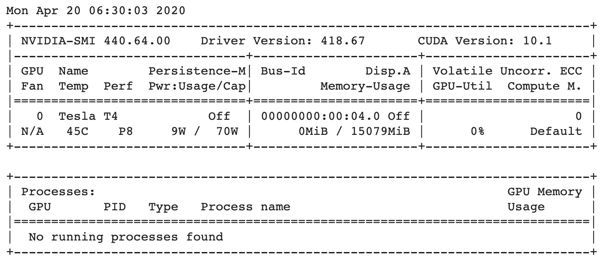

# 开始数据科学之旅的资源

> 原文：<https://towardsdatascience.com/resources-to-start-your-journey-in-data-science-bf960a8d928c?source=collection_archive---------38----------------------->

## 开启数据科学之旅的全面资源列表

图片来源: [Pixabay](https://pixabay.com/photos/way-path-outdoor-landscape-nature-918900)

> **互联网上与数据科学相关的内容如此之多，以至于对于任何打算开始这一领域之旅的人来说，在学习内容上做出正确的选择都变得有点困难。**
> 
> **根据我过去 5 年在这一领域的经验，以及我的数据科学家朋友&同事的建议，我列出了我在 2016 年开始旅程时开始参考的资源。**

**博文议程:**

*   数据科学基础
*   机器学习和深度学习的资源
*   通过参加数据科学竞赛和黑客马拉松来学习。
*   获得免费的 GPU 计算！(新增)
*   在线硕士课程的详细信息。
*   最后的想法。

# 数据科学基础

由 [Mirko Blicke](https://unsplash.com/@mirkoblicke) 拍摄的图像，在[取消绘制](https://unsplash.com/photos/V_y81v_lI4k)

> “你不可能在薄弱的基础上建造一座伟大的建筑。如果你要有一个强大的上层建筑，你必须有一个坚实的基础。

以上引用适用于任何领域。我已经列出了几门课程，并指向了下面的 YouTube 频道，这些频道将帮助任何人从事数据科学的基础方面的工作。

**帕德海四分之一实验室**

> PadhAI 是 IIT 马德拉斯的初创公司“四分之一实验室”(One-Fourth Labs)的一项举措，该公司致力于为印度提供负担得起的高质量在线课程，为印度进入人工智能时代做好准备。数据科学基础课程在他们的网站上，内容涵盖了 Python 编程、统计学、概率和 T21 的基础知识。如果你是学生，你可以通过提供有效的身份证来获得折扣！

 [## IIT 马德拉斯学院的帕德海数据科学在线课程

### 在线报名参加 PadhAI 的数据科学课程，加速您作为数据科学家的职业生涯。接受 IIT·马德拉斯的训练…

padhai.onefourthlabs.in](https://padhai.onefourthlabs.in/courses/data-science) 

## **3 蓝色 1 棕色**

> 3Blue1Brown 是格兰特·桑德森创建的 YouTube 数学频道。该频道提供了许多高级数学概念的惊人的视觉视角。下面我列出了**线性代数&微积分** YouTube 播放列表的链接，这些链接在开始学习不同的机器学习算法之前非常重要。

链接到线性代数播放列表。

链接到微积分播放列表

【Coursera 的机器学习数学

> 机器学习专业的数学来自**伦敦帝国学院**，由 3 门课程组成**多元微积分、线性代数和降维** : PCA，每周有测验，也有少量编码作业。Coursera 的优势在于，你可以随时旁听课程，免费获取课程内容。如果你是一名学生，你可以提供有效的理由申请经济援助，并获得课程内容，包括测验，作业和免费获得证书。

 [## 机器学习数学| Coursera

### 从伦敦帝国理工学院学习机器学习的数学。对于很多机器方面的高级课程…

www.coursera.org](https://www.coursera.org/specializations/mathematics-machine-learning) 

# 机器学习和深度学习的资源

**计算机科学家、Coursera 顶级讲师 Andrew NG 教授的机器学习和深度学习课程。**

> 这两门课程都非常有名，都涉及每周的测验和编码作业。对于机器学习课程，作业在 Octave/Matlab 中(语法非常类似于 python 中的 NumPy 库)，对于深度学习课程，作业在 TensorFlow 中。

 [## 机器学习|课程

### 机器学习是让计算机在没有明确编程的情况下行动的科学。在过去的十年里…

www.coursera.org](https://www.coursera.org/learn/machine-learning)  [## deeplearning.ai 的深度学习| Coursera

### 从 deeplearning.ai 学习深度学习，如果你想打入人工智能(ai)，这个专精…

www.coursera.org](https://www.coursera.org/specializations/deep-learning) 

**FastAI**

> 机器学习和深度学习课程由杰瑞米·霍华德、Kaggle 特级大师和三藩市大学教授主讲。这些课程的好处是免费提供，杰瑞米·霍华德采用自上而下的方法解释各种 ML/DL 概念。

**程序员机器学习入门！**

 [## 面向程序员的深度学习——36 小时免费课程

### 欢迎来到程序员机器学习入门！由杰瑞米·霍华德教授(卡格尔 2 年来的头号竞争对手…

course18.fast.ai](http://course18.fast.ai/ml) 

**程序员实用深度学习！**

 [## 程序员实用深度学习，v3

### 欢迎光临！如果你是所有这些深度学习的新手，那么不要担心-我们将带你一步一步地完成它…

course.fast.ai](https://course.fast.ai/) 

# **通过参加数据科学竞赛和黑客马拉松来学习**

数据科学竞赛托管平台。

一旦你熟悉了基础概念+各种机器学习/深度学习概念，是时候通过参加数据科学竞赛或黑客马拉松来弄脏你的手了。

我看到许多人说，做 Kaggle 或 Analytics Vidhya 竞赛没有多大用处，因为大多数竞赛没有描述真实世界的数据/真实世界的问题。但我要说，这些平台肯定提供了接触各种问题陈述的机会，而这些问题陈述在学生生活或公司世界中可能没有机会得到。

*   **摇摇晃晃:**【https://www.kaggle.com】T2
*   【https://datahack.analyticsvidhya.com 分析】维德希亚:
*   **Crowdanalytix:**[https://www.crowdanalytix.com/community](https://www.crowdanalytix.com/community)
*   **黑客帝国:**https://www.hackerearth.com

# **获得免费的 GPU 计算！！**

图片来源:[https://www.nvidia.com/en-in](https://www.nvidia.com/en-in/)

是的，你没看错！！谷歌实验室和 **Kaggle** 向他们所有的用户提供免费的 GPU 计算。如果你有一个庞大的数据集，并希望训练一个深度学习模型，只需将数据集上传到这两个平台中的任何一个，你就可以轻松地将你的 DL 模型的训练时间从几天减少到几个小时！！

Google Colab 上的 GPU 内存

每周在 Kaggle 上，人们可以获得 30 小时的免费 GPU 计算，它配备了 P100 GPU 和 16GB 的 GPU 内存。最近这两个平台都开始免费提供 TPU 计算！！在 Kaggle，一个人每周可以使用 30 个小时的 TPUs，一次最多可以使用 3 个小时。现在是你探索更多的时候了:)

# 在线硕士课程

如果有人想在日常工作之外继续攻读硕士课程，以增强他们在数据科学方面的知识，我列出了一些大学，这些大学提供相当于校园课程的 **MS 学位** *，而没有在学位证书上提及“在线”交付模式，并且还提供职业服务！！*

**佐治亚理工学院的 OMSCS 项目:**

 [## 主页| OMSCS |佐治亚理工学院|佐治亚州亚特兰大

### 跳转到内容主页你准备好获得计算机科学硕士学位但不准备停止工作了吗？你想要…

www.omscs.gatech.edu](http://www.omscs.gatech.edu/) 

单门课程(3 学分)持续时间: **4 个月**(需要完成 10 门这样的课程)

单科费用: **$510** +每学期 **$310。**

所以这个学位的总花费不会超过 8200 美元。这里可以看到详细的计算[。](https://www.quora.com/What-is-the-total-cost-in-INR-of-the-Online-MS-in-CS-offered-by-Georgia-Institute-of-Technology-on-Coursera)

**亚利桑那州立大学 MCS 项目:**

 [## 在线计算机科学硕士(MCS) | ASU 在线

### 在线计算机科学硕士(MCS)计划，提供了一个创新的合作伙伴关系，亚利桑那州立大学的…

asuonline.asu.edu](https://asuonline.asu.edu/online-degree-programs/graduate/computer-science-mcs/) 

单门课程(3 学分)时长: **2 个月**(需完成 10 门此类课程)

单次课程费用: **$1500。**

因此，这个学位的总费用是 15000 美元。

参考以下链接其他硕士课程的详细信息，您可以参考以下链接:

 [## edX 硕士学位

### 探索一流大学的在线硕士学位，其价格仅为校园课程的一小部分…

www.edx.org](https://www.edx.org/masters)  [## 顶尖大学的在线硕士和学士学位

### Coursera 提供数据科学、计算机科学、信息技术、工程、工商管理硕士等在线硕士学位

www.coursera.org](https://www.coursera.org/degrees) 

相信我，如果求职者没有硕士学位，某些组织会直接拒绝他们的简历。我个人认为，只看他/她拥有的学位而不是他/她拥有的技能来做决定是不正确的。但无论如何，拥有一个学位将会增加你的知识，并抓住这个非常重要的主题。

# **最终想法**

我希望这篇文章有助于提供一个全面的资源列表，以开始您的数据科学之旅。

他们中的许多人可能仍然会说"*难道我们不能仅仅通过知道如何使用 sklearn、Keras、TensorFlow、PyTorch 等库来在数据科学领域生存吗？而忽略任何机器学习或深度学习算法背后的基本概念或数学*？?"

我对他们的回答是一个大大的**不**。只要您的模型按预期工作，拥有库级别或包级别的理解就可以工作，但是如果模型没有按预期工作呢？你如何修理它？？

如果您有任何想法或问题，请随时在下面留下评论，不要忘记点击👏如果你喜欢博客的内容。

**我以前的一些博客:**

*   [*为什么不用 MSE 作为损失函数进行 Logistic 回归*](/why-not-mse-as-a-loss-function-for-logistic-regression-589816b5e03c)
*   [第一枚银牌*上*第一枚银牌](/first-silver-medal-on-kaggle-d41819182ec9)
*   [*以互动为代价减少 CNN 的碳足迹:深度方向&点方向回旋*](/reducing-the-carbon-foot-prints-of-cnns-at-the-cost-of-interactions-depthwise-pointwise-conv-5df850ea33a4)

关注我 [***中***](https://medium.com/@rajesh_bhat) 阅读更多此类博客。

 [## Rajesh Shreedhar Bhat - Medium

### 阅读 Rajesh Shreedhar Bhat 在媒体上的文章。数据科学家-沃尔玛实验室| Kaggle 竞赛专家|…

medium.com](https://medium.com/@rajesh_bhat)