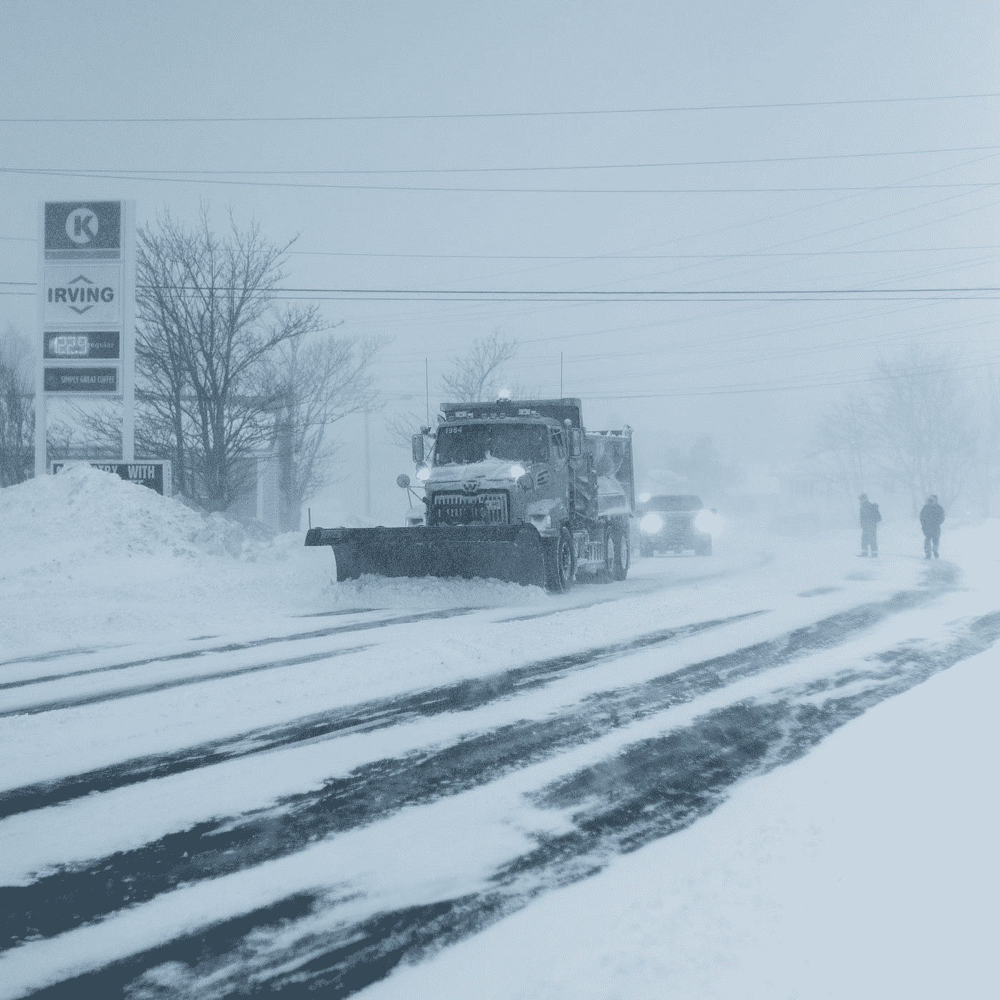
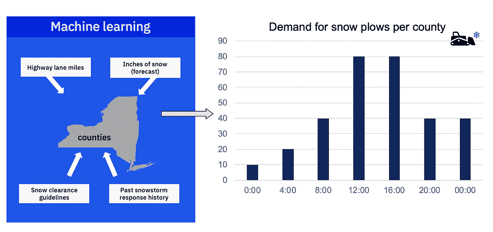
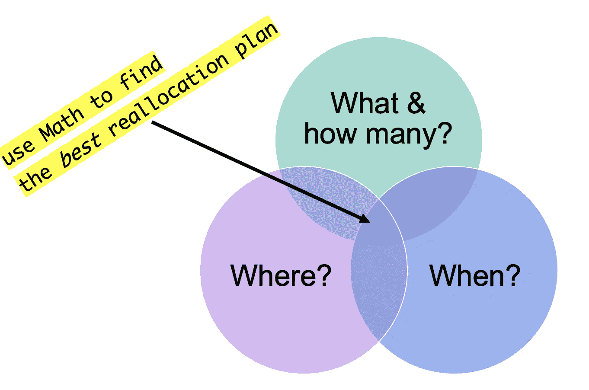
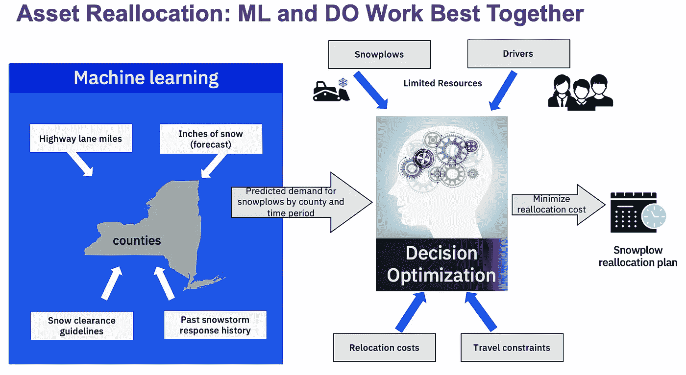
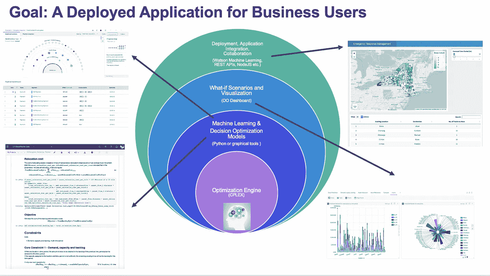
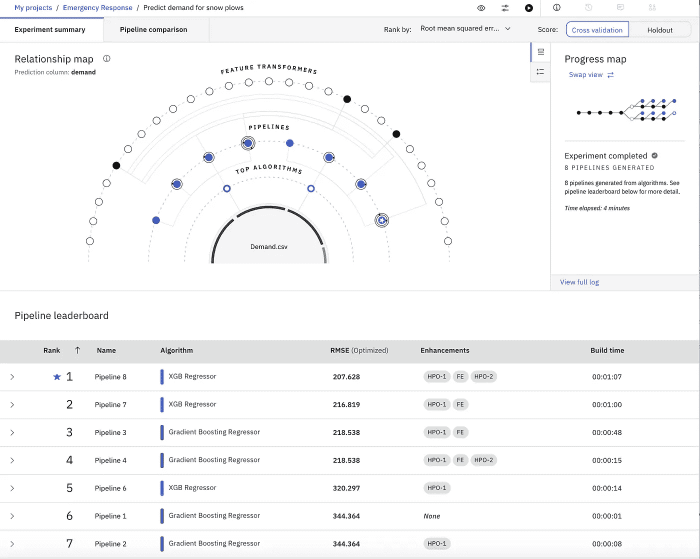
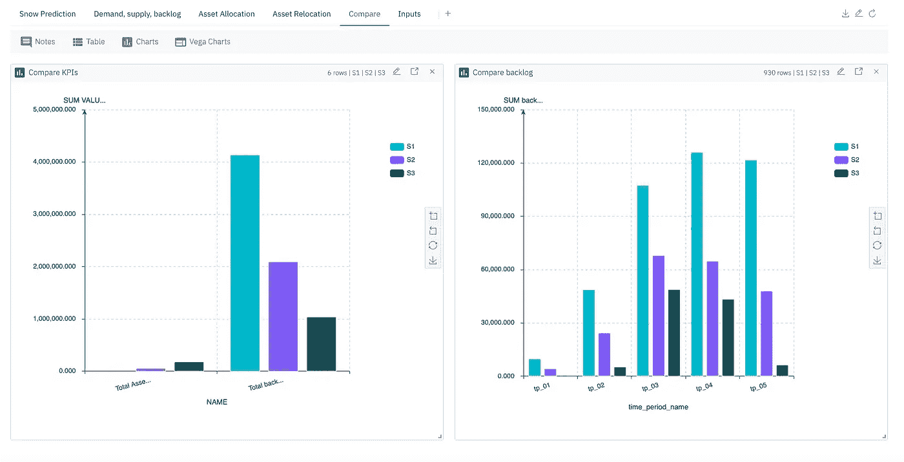
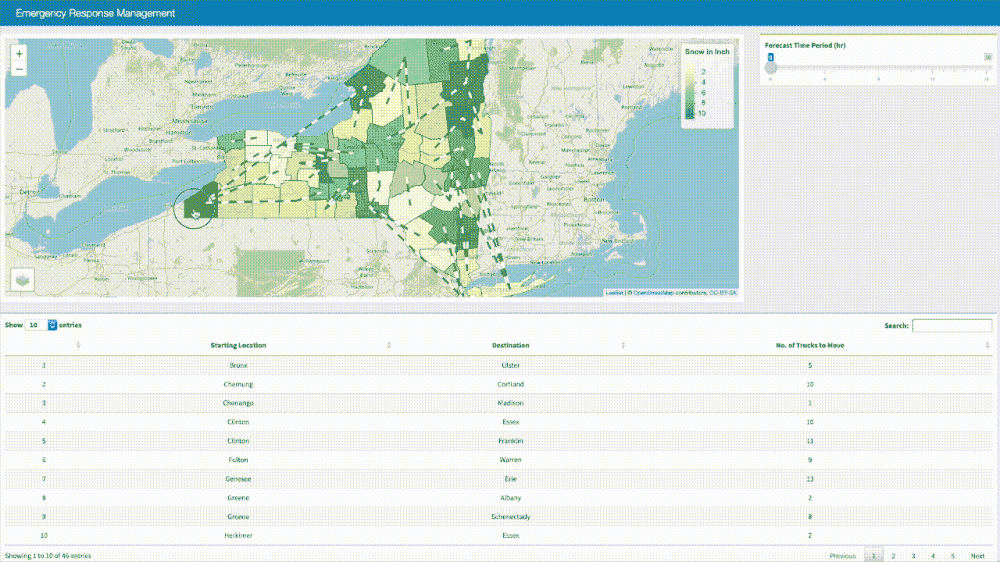

# 应对大规模紧急事件和中断:人工智能和决策优化可以有所帮助

> 原文：<https://towardsdatascience.com/responding-to-emergencies-and-disruptions-how-ai-and-decision-optimization-can-help-dc9ba45289d8?source=collection_archive---------62----------------------->

## 安全、快速、无浪费地重新分配您的资源

照片由埃德温·胡珀在 Unsplash 上拍摄

# 什么是应急响应？

在写这篇文章的时候，我们正在深入新冠肺炎疫情。医院、超市和政府机构等都被对服务的巨大需求所淹没，同时试图管理他们有限的资源和资产，同时努力保证人们的安全。现在应该如何分配资源*以便它们正好用在病人和医生最需要的地方*？*如何根据不断变化的需求和地理位置，在遵守安全法规和出行限制的同时，随着时间的推移重新分配*呼吸机？不管这意味着什么，一旦一切开始恢复“正常”，我们该如何安全地重返工作岗位？**

*由于其前所未有的性质，像新冠肺炎疫情这样的事件的自动化决策是复杂的，需要仔细的分析，准确的数据可能不容易获得，更不用说任何政治和行政方面的考虑。*

**这种真实而大规模的中断正在吞噬着这个世界，但这只是需要快速而准确的响应、管理有限资源并确保运营成本不会飙升的紧急情况的一个例子。* ***正如我们将看到的，高效的应急响应需要人工智能技术的结合，特别是机器学习和决策优化。****

*本文中讨论的方法可以应用于处理各种类型的大规模中断。我们将特别关注天气突发事件，如暴风雪，因为它们的影响可能是毁灭性的。[根据国家环境信息中心和 NOAA Climate.gov](https://www.climate.gov/news-features/blogs/beyond-data/2010-2019-landmark-decade-us-billion-dollar-weather-and-climate)的数据，自 1980 年**以来，美国已经遭受了 **258 次天气和气候灾害**。这 258 个事件的累计成本超过了 1.75 万亿美元。***

# *示例:应对大规模天气事件*

**

*埃里克·麦克莱恩在 [Unsplash](https://unsplash.com?utm_source=medium&utm_medium=referral) 上拍摄的照片*

*当恶劣天气事件即将发生时，无论是暴风雪、洪水还是地震，一个州或地区的运营经理都必须迅速决定如何最好地满足对资源和资产(如扫雪机、水、警察和救援车辆)的需求。*

*让我们具体看看如何应对暴风雪。对扫雪机的需求取决于降雪预报，一些地区可能会比其他地区受到更严重的影响，当风暴来袭时，需要更多的扫雪机。机器学习模型可以预测每个县的卡车需求，同时考虑所有相关信息，如降雪预测、安全指南和过去的暴风雪历史(图 1)。*

> *首先，我们需要准确的需求预测*

**

*图 1:机器学习预测每个时间段每个县对扫雪机的需求*

*然后，我们需要决定如何将这些资产从低影响地区重新分配到高影响地区，例如，将多少资产从 C1 和 C2 县转移到 C3、C4 和 C5 县，确保每个县都有足够的扫雪机来满足需求。*

*然而，我们不要忘记，降雪预报每隔几个小时就会发生变化，因为暴风雪会穿过该州，所以我们需要不断移动卡车，同时考虑到天气预报和当时的积压水平(积雪)。*

> *我们需要一种有效的方法来重新分配扫雪机和其他资产*

# *为什么预测资源需求是关键，但不足以解决应急响应问题？*

*如果我们一次考虑一个县，并且没有冲突的优先事项，我们的机器学习模型生成的预测可能足以做出决定。然而，一旦我们开始引入一些现实生活中的复杂性、依赖性和有限的资产，确定最佳的重新分配计划就变得更加具有挑战性。*

*例如，如果该州相对两侧的两个县在风暴开始时预计会收到最多的降雪，该怎么办？在这种情况下，如果我们没有足够的雪犁来满足所有需求，我们应该把雪犁送到哪里，送多少？*

> *预测不会告诉我们如何分配有限的资源*

*在风暴开始时，C1 县最需要资源，但几个小时后，该州另一边的 C2 和 C3 也需要资源，这种情况会怎样？我们会把扫雪机搬到 C1 吗，即使在它们被暴风雪袭击之前把它们运到 C2 和 C3 是不可能的？这种延迟会如何影响积雪和道路安全？*

> *我们所做的决定是相互依赖的，因此我们必须一起做出决定*

*为了创建一个可行的计划，我们在风暴开始时做出的关于如何分配资产的决策需要与风暴后期的重新分配决策结合起来。此外，我们不能孤立地为一个县和其他县做出决策，因为它们都在争夺同样有限的资源。*

*最后，有几个决定？例如，让我们考虑 2000 台扫雪机和 60 个县。假设我们考虑在 24 小时的暴风雪中每 4 小时重新分配它们。有多少种重新分配的可能性？在 6 个时间段中的任何一个时间段，我们可以决定从 60 个县中的任何一个县向 60 个县中的任何一个县移动 0-2，000 台扫雪机。在不考虑距离、可用性、积雪积压、需求约束和多种资产类型的情况下，做一个非常粗略的估计，我们可能需要考虑的选项数量是 60 * 60 * 2000 * 6 = 43200000！没有人能够手动确定这些决策中的哪一个是最佳的。*

> *涉及重新分配的决策很容易需要评估 43，000，000 多个选项！没有人能够人工确定这些选项中哪一个是最好的。*

# *人工智能和决策优化有什么帮助？*

**

*决策优化使用来自机器学习的见解来做出**最佳**决策*

> *决策优化使用非常专业的算法和技术来有效地搜索和评估数以百万计的潜在解决方案，而无需一一列举。*

*虽然机器学习可以考虑所有可用的数据和过去的历史，以预测每个县或地区在任何给定时间对扫雪机和其他资源*的需求，但决策优化(DO)可以更进一步，并生成在整个规划范围内对整个州最优的*计划，受限于有限的资源*(例如，扫雪机)*其他约束和依赖性*(可用资源的类型和数量， 每个扫雪机的当前位置、行驶距离和时间)*和优化指标*(最小化总成本、最大化安全性/客户满意度、最小化卡车总行驶距离)*。* 它不仅为我们提供了有价值的见解，而且还生成了*一个可操作的时间表或计划*(图 2)。**

**

*图 2:结合机器学习和决策优化的力量进行应急响应*

*与任何决策支持解决方案一样，仅仅创建一个模型是不够的。我们的最终目标应该是在业务用户和决策者手中交付一个解决方案。构建这样一个解决方案通常需要几个关键部分(图 3):*

*   *一个强大的数学优化引擎，如 CPLEX，它可以运行和求解决策优化模型，找到一个*最优*解决方案*
*   *构建人工智能模型(机器学习和决策优化)的高效建模环境*
*   *假设场景分析和仪表板，用于为业务用户测试模型、分析场景和原型可视化*
*   *一种将模型作为 web 服务部署到决策支持应用程序中的机制，以便规划者可以实时运行场景*

**

*图 3:使用 IBM 数据和 AI 平台的决策优化应用程序开发和部署*

*更具体地说，将上述内容应用到我们实施应急响应计划解决方案的具体示例中，该过程可以总结为以下三个步骤:*

***步骤 1** :建立一个机器学习模型，按地点和时间段预测对资源(扫雪机)的需求。*

***第二步**:建立一个决策优化模型，在暴风雪来临之前和期间，根据需求和可用性，确定如何最佳地重新分配资源。该模型将业务需求转化为数学优化引擎可以使用的术语。*

***第三步**:部署模型，并将它们嵌入到您的规划应用程序中*

*让我们更详细地看看这三个步骤。无论使用什么技术，方法都是相似的。在这里，作为一个例子，我们概述了如何使用 IBM 数据和人工智能平台来构建一个紧急响应解决方案。*

# *第一步:建立一个机器学习模型来预测需求*

*这可以通过多种方式实现，具体取决于您使用的工具。例如，IBM 数据和人工智能平台(IBM Cloud Pak for Data 或 IBM Watson Studio Cloud 中的 IBM Watson Studio)包括 AutoAI，它可以自动选择正确的算法，构建机器学习管道，执行超参数优化(HPO)和特征选择，并根据指定的评估指标确定最佳模型(图 4)。另一种选择是使用 SPSS Modeler 的拖放界面来创建自己的机器学习管道。如果您喜欢从头开始构建您的模型，您可以使用开源包(如 scikit-learn)用 R 或 Python 实现它们。一旦模型被训练、验证和测试，它就可以被部署为在线模型，使用 REST APIs 进行访问。*

**

*图 4: AutoAI 体验:自动生成预测扫雪机需求的最佳模型*

# *步骤 2:建立一个决策优化模型来重新分配资源*

*决策优化模型的关键要素是*决策变量、优化指标和约束。**

*需要做出的决策(建模为决策变量)决定了在每个时间段内要在每对县之间重新分配的资产(例如扫雪机)的类型和数量。这些值*不是*我们输入数据的一部分，而是由优化引擎自动确定的*。**

*优化指标定义了我们优化的目标(最小化/最大化)。在紧急响应的情况下，这些指标可以是以下指标的任意组合:*

*   *最小化重新分配卡车的成本(基于重新分配的总次数，以及基于行驶里程的可变成本)*
*   *最小化未降雪*
*   *最大限度提高安全性*
*   *最大化客户/通勤者满意度*

*最后，优化模型需要考虑许多约束条件，包括:*

*   *在给定的时间段内，在一个位置可用的任何现有的积雪和铲雪能力与对铲雪机的预测需求(ML 模型的输出)相平衡*
*   *任何重新分配的决定必须是可行的，也就是说，在任何给定的时间和地点，我们移动的卡车数量都不会超过可用的数量*

*决策优化仪表板显示我们 DO 模型的输入和输出。关键输入是雪犁的需求预测和初始分配(图 5):*

**

*图 5:决策优化仪表板场景输入:雪犁的预测需求和初始分配*

*这里我们看到了按时间和位置(ML 模型的输出)对扫雪机的需求，以及资产的当前分布，即按位置的数量。*

*然后，我们创建三种不同的假设情景:*

*   ***方案 S1(基准方案)**:不执行任何重新分配(无优化，仅计算 KPI)*
*   ***场景 S2(风暴前重新分配)**:重新分配一次资产，为暴风雪做准备(局部优化)*
*   ***场景 S3(风暴期间重新分配)**:随着暴风雪的推进，每隔几个小时重新分配资产(完全优化)*

*在解决了这三个场景之后，我们在 DO 仪表板中并排比较结果(图 6):*

**

*图 6:决策优化仪表板:假设分析*

*我们可以清楚地看到，优化程度最高的场景，即 S3 场景，产生的积压最少(是没有优化的基准场景 S1 的 1/4，或者是部分优化的场景 S2 的 1/2)。当然，这是需要评估成本的。情景 S3 的成本最高(176，324 美元)，因为重新分配的次数最多，相比之下，情景 S2 为 51，061 美元，情景 S1 为 0 美元(无重新分配)。*

*比较这三种情况，计划者将评估较小的积雪积压与较高的重新分配成本的优势。如果需要，总成本也可以表示为这里使用的两个优化指标的加权和，即每个场景的总积压和重新分配成本的组合。规划者可能还想在做出最终决定之前运行几个额外的场景，例如，她可以看看从附近的州借几台扫雪机是否会产生明显更好的解决方案。*

# *步骤 3:部署模型并将它们嵌入到您的规划应用程序中*

*一旦模型准备好并经过测试，它们就可以作为 web 服务进行部署，并嵌入到我们的规划应用程序中。如果使用 IBM 数据和人工智能平台，在沃森机器学习中部署模型只是点击几次的事情。然后，每个模型通过 REST API 端点变得可用。最后一步是构建和部署 web 应用程序(例如 Node.js 或 R Shiny)，或者在现有的应用程序中嵌入服务，并通过访问已部署的 ML 和 DO 模型来生成我们的优化重新分配计划。*

*这个演示是使用一个 R Shiny 应用程序实现的(图 7):*

**

*图 7:注入了 ML 和 DO 模型的示例应急响应计划应用程序*

*当雪地作业经理 Alex 登录到她的应急计划门户网站时，她需要掌握所有必要的信息来做出决策。她看了看纽约州，迅速评估了实时更新的降雪预报，并用地图上的颜色表示。颜色越深，对应的县预计降雪量越大。右上角的滑块可用于选择不同的时间段，以查看情况如何随时间变化。*

*Alex 注意到 Chautauqua 预计在风暴开始时会有最多的雪，他在地图上选择了该县以查看更详细的信息，例如确切的积雪英寸数、可用的扫雪机数量与预测的需求量以及预期的积压量。预测需求是从我们部署的 ML 模型中实时获得的。*

*然后，Alex 选择了一个即将到来的箭头，并观察到 20 辆卡车正在从利文斯顿县重新分配。这很有道理，因为目前那里的降雪量很小。*

*Alex 将时间滑块向右移动，以查看建议的卡车重新分配，这些卡车重新分配对应于因暴风雪席卷整个州而不断变化的需求。下表中也提供了相同的卡车重新分配建议。它们是使用我们部署的决策优化模型实时获得的。*

*如果亚历克斯对推荐的计划感到满意，她可以继续批准它。她可能还会选择运行一些假设场景，尝试潜在地增加一些可用的扫雪机，或者手动指定一些重新分配。在解决了这些额外的情况并比较了由此产生的变动和相应的 KPI 后，Alex 将对如何继续做出最终决定…*

*当然，这只是一个使用 IBM 数据和 AI 平台、决策优化和 R Shiny 实现的演示的简单示例。至于你能做什么以及如何在你自己的应用程序中呈现信息，这种可能性是无穷无尽的。*

# *摘要*

*应对大规模紧急情况和干扰是一个关键问题，需要立即采取行动。使用有效的应急响应解决方案的好处是巨大的，包括但不限于:*

*   *减少规划/调度时间和工作量*
*   *提高安全性和合规性*
*   *降低运营成本*
*   *提高资源利用率*
*   *提高客户满意度*

*创建最佳资产重新分配计划是一个具有挑战性的问题，最好使用机器学习和决策优化的组合能力来解决。虽然机器学习可以考虑所有可用的数据和过去的历史，以预测在给定时间每个位置对资源*的需求，但决策优化可以更进一步，生成对一组位置*最优的计划，该计划受有限资源、其他约束和依赖性以及优化指标的限制。*优化不仅能提供有价值的见解，还能*生成可操作的时间表或计划。***

*有效应对大规模中断需要为业务用户提供有效的决策工具。即使我们建立了伟大的人工智能模型，它们的力量也只能通过将它们放在计划者和决策者的手中来加以利用。嵌入了嵌入式人工智能模型的应用程序允许决策者在实施最终决策之前试验各种场景并并排比较收益，所有这些都不需要理解人工智能模型背后的实施细节。*

*如果您的组织正在寻找更好的方法来优化对中断的响应，分配和重新分配资源，或者解决其他预测和优化挑战，请不要犹豫，寻求帮助。IBM 数据科学精英团队的使命是帮助我们的客户在他们的人工智能之旅中取得成功，作为这一使命的一部分，我们免费提供初始启动服务。我们很高兴在数据科学/人工智能项目上与您合作。更多信息，请参考[ibm.co/DSE-Community](http://ibm.co/DSE-Community)。*

# *附加链接*

* [## 2010-2019:美国数十亿美元天气和气候灾害的标志性十年| NOAA…

### 2019 年，美国经历了 14 次独立的灾害，每次损失至少 10 亿美元。自 1980 年以来，258…

www.climate.gov](https://www.climate.gov/news-features/blogs/beyond-data/2010-2019-landmark-decade-us-billion-dollar-weather-and-climate)  [## 数据科学精英——IBM 数据科学社区

www.ibm.com](https://www.ibm.com/community/datascience/elite/)  [## 紧急响应加速器(IBM 云包数据)

community.ibm.com](https://community.ibm.com/community/user/cloudpakfordata/viewdocument/emergency-response-management?CommunityKey=c0c16ff2-10ef-4b50-ae4c-57d769937235&tab=librarydocuments)  [## 决策优化

### IBM Decision Optimization 是一个产品系列，旨在使用规范性分析来改进优化，以…

www.ibm.com](https://www.ibm.com/analytics/decision-optimization)  [## IBM Cloud Pak for Data -概述

### IBM Cloud Pak for Data 是一个数据平台，它统一并简化了数据的收集、组织和分析

www.ibm.com](https://www.ibm.com/products/cloud-pak-for-data)  [## 沃森工作室-概述

### 了解更多关于 Watson Studio 的信息。通过为您的团队提供一个最佳的工作环境来提高工作效率…

www.ibm.com](https://www.ibm.com/cloud/watson-studio)*