# 用 R 实现可靠的流行病数据可视化

> 原文：<https://towardsdatascience.com/responsible-epidemic-data-visualisations-with-r-bcb24a16b753?source=collection_archive---------39----------------------->

## 告知来激发意识，而不是恐惧。


马库斯·斯皮斯克在 [Unsplash](https://unsplash.com?utm_source=medium&utm_medium=referral) 上的照片

D 与任何其他分析不同，与疫情相关的数据可视化会带来无数风险，从在公众中虚假传播恐惧到甚至误导决策当局。最近强调了许多明智和负责任的数据可视化措施。最著名的是来自[丽莎·夏洛特·罗斯特](https://blog.datawrapper.de/coronaviruscharts/)、[阿曼达·马库雷克](https://medium.com/nightingale/ten-considerations-before-you-create-another-chart-about-covid-19-27d3bd691be8)和[埃文·佩克](https://twitter.com/EvanMPeck/status/1237088603160928256)的。让我们深入采纳他们的一些建议，并使用 R 软件生成类似的适当的可视化。

## 步骤 1:获取和提炼数据

让我们从两个来源获取数据— [约翰·霍普斯金大学新冠肺炎存储库](https://github.com/CSSEGISandData/COVID-19)和[牛津大学政府响应跟踪系统(OxCGRT)](https://www.bsg.ox.ac.uk/research/research-projects/coronavirus-government-response-tracker?fbclid=IwAR0JW4WaBfzA3hZWNLJ2ecp-Vj3mRFwz99-IxlZHx1S_FLcCrQ-dWZ8LtD8) 。

```
df<-read.csv('Cases.csv')                  **#Data from John Hopkins** df2<-read.csv('Database2.csv')             **#Data from Oxford CGRT**
```

第一个数据库给出了国家和日期的*确诊*、*痊愈*和*死亡*。一个单独的*现役*列是通过从*中减去已康复*中的数字和从*中减去*死亡*中的数字计算出来的。让我们检查数据库的前几行和前几列。*

```
head(df)[,1:15] 
```

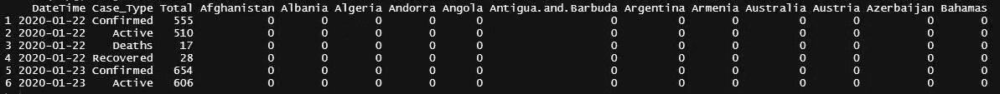

第二个数据库看起来像:

```
head(df2)
```

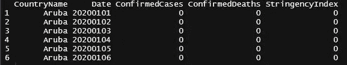

很明显，第二个数据库需要一些改进和重塑，如下所示:

```
**#Convert the Date column from numeric to datetime type** df2 <- transform(df2, Date = as.Date(as.character(Date), "%Y%m%d"))**#Combine Confirmed Cases and Deaths into a single column for labels**
df2<-gather(df2,Case_Type,Cases,ConfirmedCases:ConfirmedDeaths) **#Modified database:**
head(df2)
```

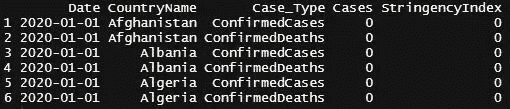

## **第二步:基本可视化**

最基本和最常见的新冠肺炎可视化是累积条形图。

很容易通过使用 R 中的 ggplot2 包获得—

```
ggplot(data=dfsumcases, aes(x = Date, y = ConfirmedCases))+ geom_bar(stat = 'identity')
```

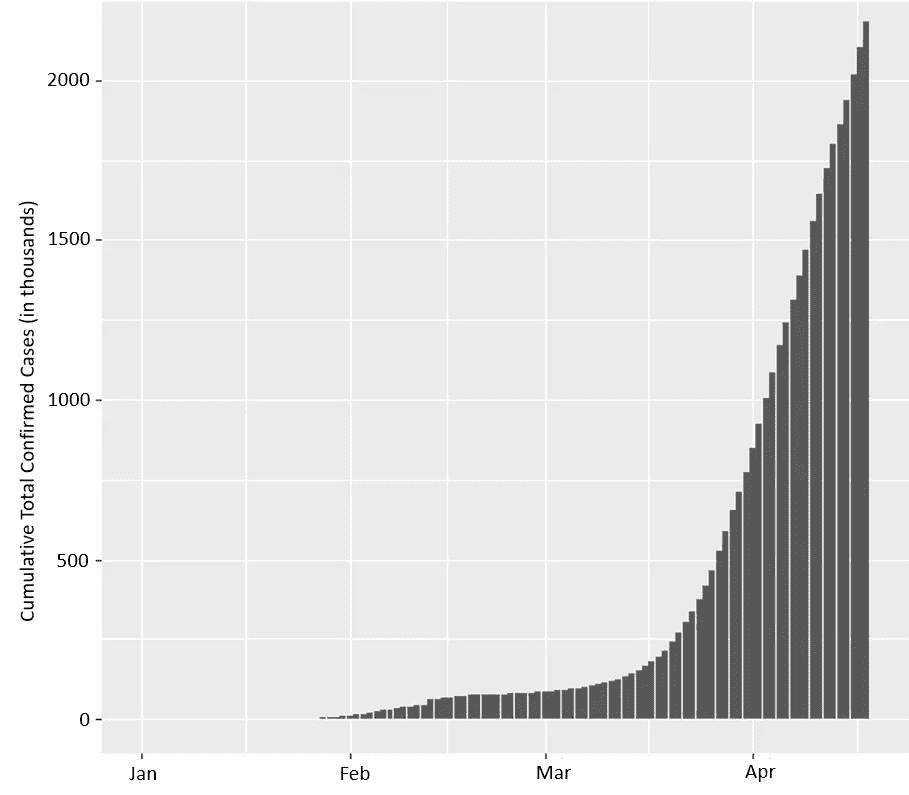

在全球累计确诊病例图表中，我们可以看到病例从 1 月底开始出现(数据库限制:我们知道这不是真的，因为中国的病例比那早得多。数据库中没有 Jan 的数据记录)。

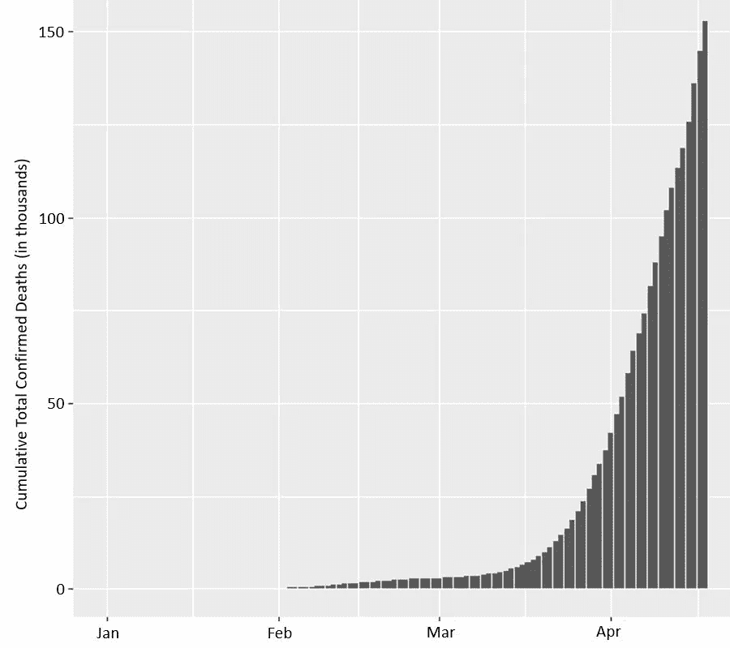

注意到病例数量的突然增加了吗？

在最初的两个月中，案例总数达到了 70 万(1k=1000)，但随后在不到一个月的时间里，几乎翻了一番，达到了 200 万。

在死亡人数上也可以观察到同样的模式。

然而，除了死亡人数相对于确诊病例明显较低之外，很难解释这两个图表之间的差异。

这让我们想到了下一个问题——我们真的需要把死亡人数单独想象成一个看起来可怕的指数增长吗？公共卫生专家阿曼达非常恰当地[放下笔](https://medium.com/nightingale/ten-considerations-before-you-create-another-chart-about-covid-19-27d3bd691be8) —

> **“新冠肺炎不是死刑，我们的观想需要反映这一点。包括恢复的案例是可视化案例编号的一个重要背景。”**

## 第三步:前进，负责任的观想

我们必须清楚地传达数据向我们揭示了什么—

1.  **死亡**的部分作为**总确诊**病例的子集。
2.  强调**恢复的数量**作为**总确诊**病例的子集。

资深数据科学家罗伯特·伍德在这方面做得很好。在我们的例子中，使用第一个数据库可以解决这两点，如下所示—

```
df %>%
  filter(!grepl('Confirmed', Case_Type)) %>% 
  group_by(DateTime, Case_Type) %>% 
  summarise(Cases = Total/1000) %>% 

  ggplot(aes(x = DateTime, y = Cases, fill = Case_Type))+
  geom_bar(stat = 'identity')+
  theme(axis.title.x=element_blank())+

  scale_fill_manual("legend", values = c("Active" = "steelblue4", "Deaths" = "black", "Recovered" = "goldenrod3"))
```

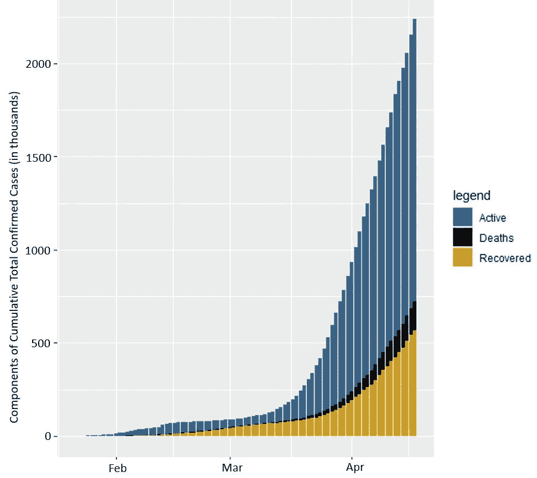

确诊病例总数分为 3 部分——活动期、死亡期和恢复期

马上我们可以看到，这不仅在视觉上吸引人，而且更适合这个敏感的场景，因为它迎合了上述两个重点。

注意手动颜色填充的故意使用？原因？

不幸的是，已经有许多与 COVID 相关的死亡。然而，不要用令人担忧的红色来呈现这些案例，而是采用不同的颜色，比如黑色(表示尊敬)。

现在，如果我们想获得 3 个组件中每一个的估计值，我们可以将*位置*参数设置为*减淡*，在*几何 _ 条*内

```
df %>%
  filter(!grepl('Confirmed', Case_Type))%>%
  group_by(DateTime, Case_Type)%>%
  summarise(Cases = Total/1000)%>%

  ggplot(aes(x = DateTime, y = Cases, fill = Case_Type))+
  geom_bar(stat = 'identity', position = 'dodge')+
  theme(axis.title.x=element_blank())+

  scale_fill_manual("legend", values = c("Active" = "steelblue4", "Deaths" = "black", "Recovered" = "goldenrod3"))
```

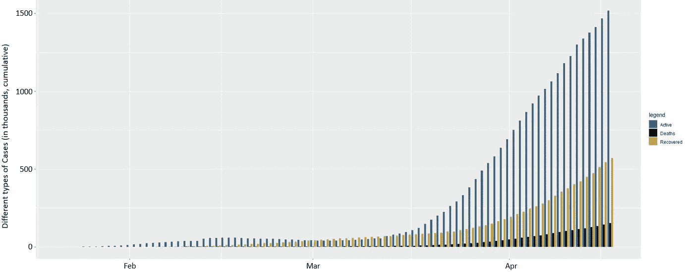

与新冠肺炎相关的全球活跃、康复和死亡的累计登记病例

如果我们想在一个国家接一个国家的基础上观察同样的情况呢？我们可以利用 facet_wrap 选项—

```
df2 %>%
  filter(grepl('China|Korea|United States|United Kingdom|Italy|Spain',CountryName) & Date > '2019-12-31') %>%
  group_by(Date, Case_Type, CountryName)%>%
  summarise(Cases = sum(Cases))%>%
  ggplot(aes(x = Date, y = Cases, fill = Case_Type))+
  geom_bar(stat = 'identity', position = 'dodge')+
  scale_fill_manual("legend", values = c("ConfirmedCases" = "steelblue4", "ConfirmedDeaths" = "black"))+
  facet_wrap(~CountryName)
```

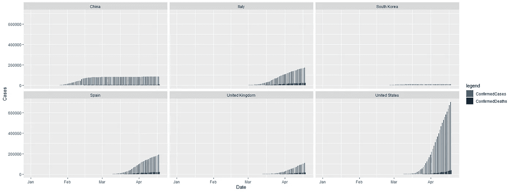

注意到上图的一些问题了吗？

1.  很难单独观察确诊病例和确诊死亡病例，这是因为美国的病例数量非常高。
2.  显示的国家好像没有顺序(最好是最大案例降序排列？)

让我们使用 ***ggpubr*** 包中的 ***ggarrange*** 函数来解决这些问题。但首先，让我们按照确诊病例的降序排列数据库。

```
maxconfirmed <- df2 %>% filter(Case_Type=="ConfirmedCases") %>% group_by(CountryName) %>% arrange(-(Cases)) %>% distinct(CountryName, .keep_all = TRUE)head(maxconfirmed)
```

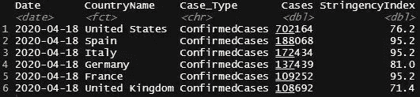

现在，我们可以在面网格中选择这些排名靠前的国家。然而，对于 ggarrange，我们需要每个国家都有单独的 ggplot 对象。让我们首先创建一个函数来完成这项工作。然后把它应用到所有想要的国家。

```
countryplot <- function(x) {
  df2 %>%
    filter(CountryName == x & Date > '2019-12-31')%>%
    group_by(Date, Case_Type)%>%              
    ggplot(aes(x = Date, y = Cases/1000, fill = Case_Type))+
    geom_bar(stat = 'identity', position = 'dodge')+ggtitle(x)+
    theme(plot.title = element_text(hjust = 0.5),    
    plot.margin=unit(c(0.1,0.1,0.1,0.1), "cm"),  
    axis.title.x=element_blank(), axis.title.y=element_blank(),  
    axis.text.x = element_text(angle = 45))+
    scale_fill_manual("legend", values = c("ConfirmedCases" = "steelblue4", "ConfirmedDeaths" = "black"))}pus<-countryplot('United States')
pit<-countryplot('Italy')+ coord_cartesian(ylim = c(0, 180))
psp<-countryplot('Spain')+ coord_cartesian(ylim = c(0, 180))
pge<-countryplot('Germany')+ coord_cartesian(ylim = c(0, 180))
pfr<-countryplot('France')+ coord_cartesian(ylim = c(0, 180))
puk<-countryplot('United Kingdom')+ coord_cartesian(ylim = c(0, 180))
pch<-countryplot('China')+ coord_cartesian(ylim = c(0, 180))
```

既然我们已经有了所有国家的单独 ggplot 对象，我们就可以使用 ggarrange 了。让我们在左边分开，在右边跟随 6 个国家作为 3x2 矩阵。

```
plc1<-ggarrange(psp,pit,pge,ncol = 3,legend = "none")
plc2<-ggarrange(pfr,puk,pch,ncol = 3, legend = "none")
plc3<-ggarrange(plc1,plc2,nrow = 2, legend = "none")
plc4<-ggarrange(pus,plc3,widths = c(1,3),common.legend = TRUE, legend = "bottom")annotate_figure(plc4,bottom = text_grob("Data source: The Oxford COVID-19 Government Response Tracker (OxCGRT)", color = "blue", hjust = 1, x = 1, face = "italic", size = 10),left = text_grob("Cases (in thousands)", color = "black", rot = 90))
```

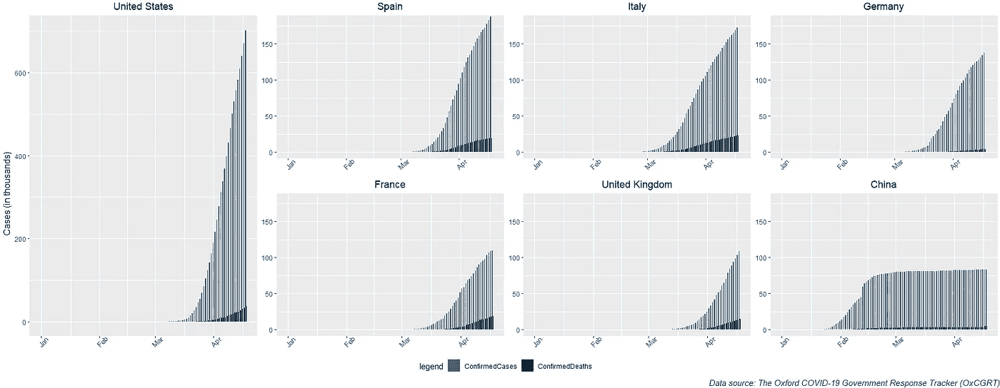

## 所有这些真的算不上什么进步。因此，第 4 步:真正的交易

之前的观想非常简单。我们必须做得更多。但是这些都是细微的差别，我们必须小心谨慎—

1.  如果我们想安全地更深入地挖掘数据，而不仅仅是显示累计数字，该怎么办？
2.  如何看待每个国家都经历了病例和死亡的增加？而这同时又不受与数据记录相关的不确定性的可能威胁？
3.  我们能否利用对数标度来获得改进的感觉？

流行病概况是指数曲线，随着曲线的上升，很难看到和捕捉重要的(可能有用的)细节。世界经济论坛的资深作家肖恩·弗莱明精彩地强调了这种对数标度的[好处，以获得疫情数据背后的更大图景。这些进一步反映在丽萨在 datawrapper 的优秀的](https://www.weforum.org/agenda/2020/04/covid-19-spread-logarithmic-graph/)[疫情可视化](https://blog.datawrapper.de/coronaviruscharts/)页面上。

让我们看看对数刻度能得到什么。然后嘣——

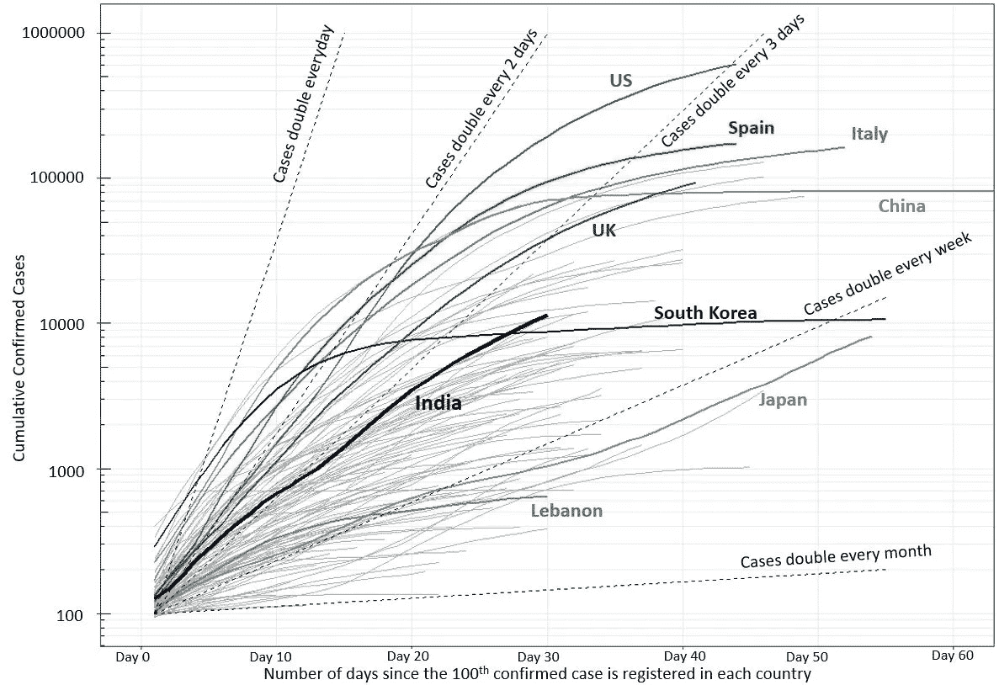

y 轴是累计确诊病例，用对数标度的七天滚动平均值平滑。否则，该刻度上的直线对应于指数增长。

在疫情的情况下，我们必须把微观水平的数据分析和解释留给流行病学家。此外，我们必须注意每个国家的所有数据收集和记录的不确定性。这促使使用*七天滚动平均值*来平滑累积确诊病例的概况。可以使用滚动平均函数计算滚动平均值—

```
df3<-df2[df2$Case_Type == "ConfirmedCases", ]
df3<-df3[order(df3$CountryName,df3$Date),] %>% 
  group_by(CountryName) %>% 
  mutate(roll_mean = rollmean(Cases, 5, na.pad = T))
```

此外，请注意，x 轴对应于自每个国家登记第 100 例病例以来的天数。因此，在有条件地删除案例数小于 100 的行之后，让我们创建一个单独的列作为日计数器(dc)。这将使所有国家的确诊病例配置文件从第*和 ***天开始= 100*** 。*

```
*df3<-df3[!(df3$Cases<10),]
df3<-df3 %>% group_by(CountryName) %>% mutate(dc = row_number())*
```

*最后，让我们用两个变量，breaks 和 minor_breaks，在对数标度上表示滚动平均值与直流的关系。*

```
*breaks <- 10^(-10:10)
minor_breaks <- rep(1:9, 21)*(10^rep(-10:10, each=9))

ggplot() +
  geom_line(data=df4,aes(x=dc, y=roll_mean, group=CountryName),color="gray68") +
  geom_line(data=df4 %>% filter(CountryName =='United States'),aes(x=dc, y=roll_mean),color="steelblue4",size=1) +
  geom_line(data=df4 %>% filter(CountryName =='Italy'),aes(x=dc, y=roll_mean),color="darkseagreen4",size=1) +**#(Repeat the geom_line() step to bold as many countries as you want)** scale_y_log10(breaks = breaks, minor_breaks = minor_breaks) +
  annotation_logticks(sides=c("l")) +
  coord_cartesian(xlim = c(0, 60)) +
  theme_bw()*
```

*同样，由于国与国之间确诊病例总数的不确定性，最好对死亡总数进行同样的可视化，以衡量每个国家的表现。复制以上死亡的所有步骤给我们—*

*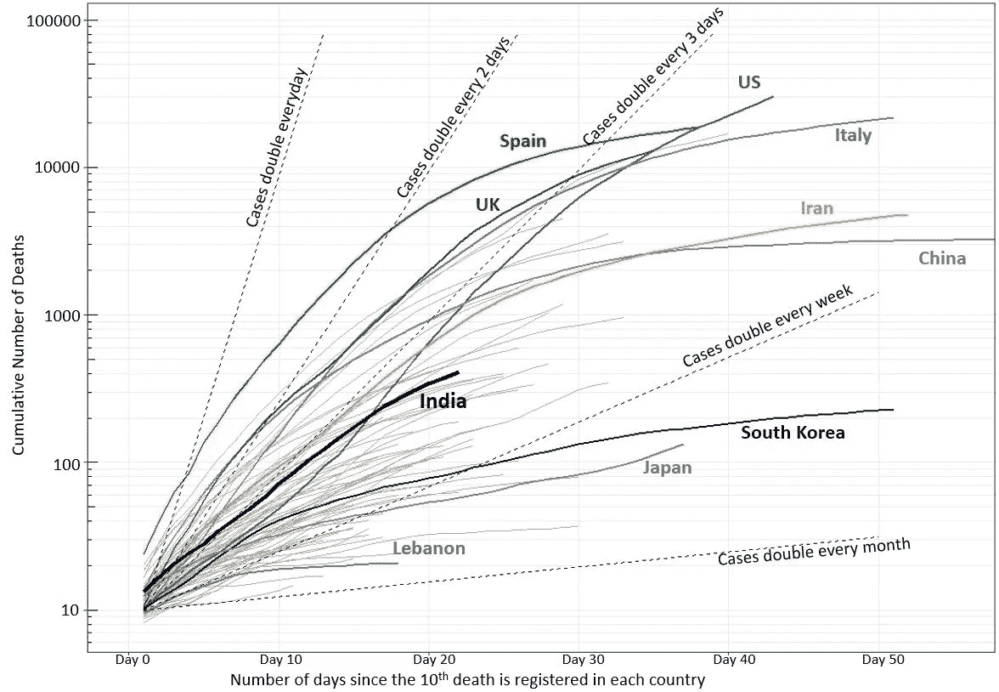*

*现在，如果我们想观察数字的变化率，比如 5 天内的变化，我们可以从数据中获得更多的见解。我们可以使用 lag()函数来获取以前的实例值。*

```
*df7<-df2[df2$Case_Type == "ConfirmedCases", ]
df7<-df7[order(df7$CountryName,df7$Date),]
growth_rate = df7 %>% group_by(CountryName)%>%
  mutate(Cases_1 = lag(Cases),
         Cases_2 = lag(Cases_1),
         Cases_3 = lag(Cases_2),
         Cases_4 = lag(Cases_3),
         Cases_5 = lag(Cases_4),
         Diff_growth = Cases - Cases_5,
         Rate_percent = ((Diff_growth/5)/Cases * 100))*
```

*我们这次使用 3 天滚动平均值平滑增长率，增长率与日计数器图给出了—*

**

*y 轴是 5 天期间的病例变化率(%)，用 3 天滚动平均值平滑*

*我们可以立即注意到变化率的正弦曲线行为，虽然增长率总体下降，但印度和日本等一些国家比其他国家更容易出现增长率上升。*

*同样，想象死亡案例总是分析新冠肺炎行动的一个更安全的赌注。因此，对死亡人数重复同样的步骤会给我们—*

*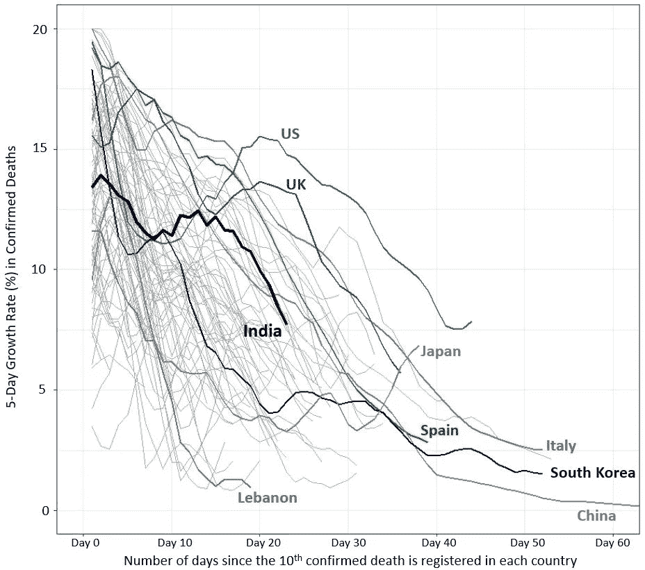*

*y 轴是 5 天期间死亡率(%)的变化率，用 3 天滚动平均值平滑*

*我们在这里看到一些惊人的启示。同样，死亡人数的变化率普遍下降。然而，日本的情况令人担忧，在过去的近 10 天里，变化的速度越来越快。同样，美国也开始经历变化率的增加。*

# ***关键要点***

*在疫情的情况下，数据可视化需要高度的正念和谨慎。我们必须意识到，通过在公共领域分享作品，我们冒着误导人们和在大众中煽动恐惧的风险。否则，目标应该是让人们意识到并帮助决策，以在危机情况下实现最佳的健康、福祉和经济繁荣。以下是收集到的一些关键点—*

1.  *数据一下载， ***探索*** it， ***理解*** it，获取 ***上下文*** 。想象一下如何最好地利用它来迎合你心目中的基于数据的调查。在我的分析工作中，我使用了两个不同的数据库来帮助我。*
2.  *注意图表的装饰方面，如颜色、形状、数字和大小。最好将 ***【死亡】******【恢复】******当前活跃病例*** 作为 ***总确诊病例*** 的子集显示，避免选择红色作为颜色强加不必要的警报和恐惧。在我的分析中，我展示了如何满足这些观点。*
3.  *在试图汇总数据以发明任何指标度量时要小心谨慎。计算和分析 ***病死率*** 很诱人，但是，没人知道分母有多精确？确诊病例总数是否包括所有有症状的病例？确诊病例占总感染病例的比例是多少？因此，除了简单的增长率之外，我的工作中没有应用任何汇总。*
4.  *由于不同国家有不同的数据收集方法、获得护理的机会和护理质量以及检测包的可获得性，因此不一致，跨国比较可能有风险。此外，平均人口年龄，免疫力和空气质量，以及健康习惯加在一起造成了不一致。在我的研究中进行的跨国分析试图忽略一些外部因素，因为我们只是在 n 个病例已经登记后才开始可视化，所有国家都来自一个共同的点。对数据进行了平滑处理，以进一步减少不一致性。*

*所有这些图形和数据库的源代码都可以在我的 [github 库](https://github.com/sashganguly/CovidAnalysis)中找到。*

## ***免责声明***

*[*迈向数据科学*](http://towardsdatascience.com/) *是一份主要基于数据科学和机器学习研究的媒体出版物。我们不是健康专家或流行病学家，本文的观点不应被解释为专业建议。想了解更多关于疫情冠状病毒的信息，可以点击* [*这里*](https://www.who.int/emergencies/diseases/novel-coronavirus-2019/situation-reports) *。**