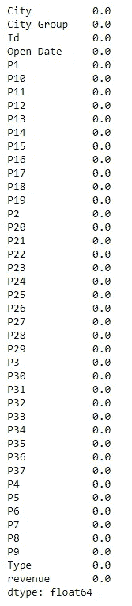
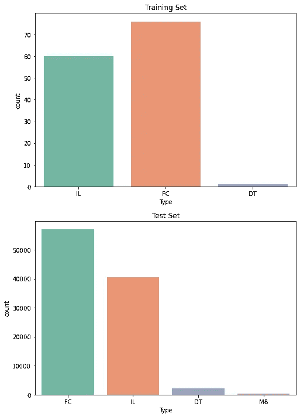
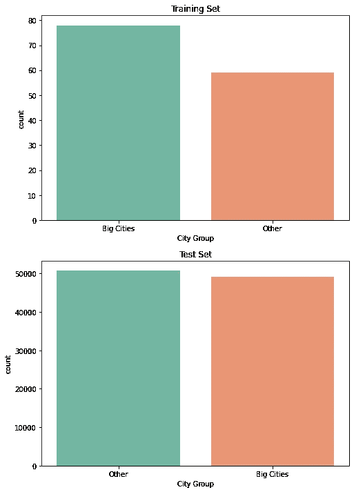
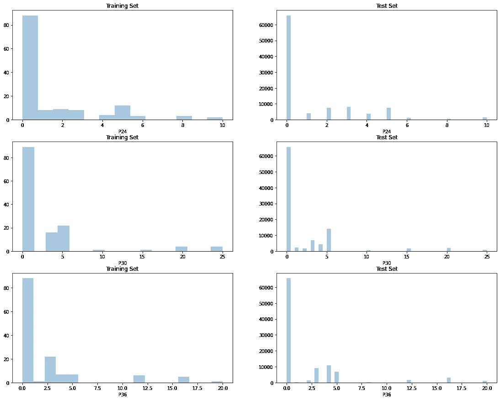
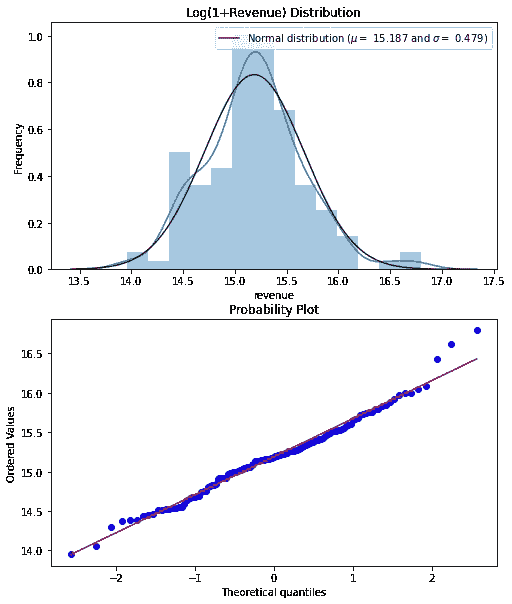
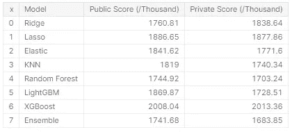

# 餐馆收入预测

> 原文：<https://towardsdatascience.com/restaurant-revenue-prediction-467f0990403e?source=collection_archive---------16----------------------->

## 开发预测餐馆收入的经典模型


[梁杰森](https://unsplash.com/@ninjason?utm_source=medium&utm_medium=referral)在 [Unsplash](https://unsplash.com?utm_source=medium&utm_medium=referral) 上的照片

餐馆是一个国家经济和社会的重要组成部分。无论是为了社交聚会，还是为了吃快餐，我们大多数人都至少经历过一次拜访。随着最近弹出式餐馆和快餐车的兴起，企业主必须弄清楚何时何地开设新餐馆，因为这样做需要花费大量的时间、精力和资金。这就带来了寻找开一家新餐馆的最佳时间和地点的问题。拥有许多大型连锁餐厅的 TFI 在 [Kaggle](https://www.kaggle.com/c/restaurant-revenue-prediction/overview) 上提供了他们餐厅收入预测的人口统计、房地产和商业数据。这里的挑战是建立一个健壮的模型，能够预测餐馆的收入。

# 数据

看了一下数据，训练集中有 137 个样本，测试集中有 10 万个样本。这非常有趣，因为数据的分布通常是相反的。这里的目标是基于训练集中的 137 个样本对收入进行建模，并查看该模型在测试集中的 100，000 个样本上的表现如何。每个样本的数据字段包括样本中每个餐厅的唯一餐厅 ID、餐厅的开业日期、城市、城市组、餐厅类型、几个非任意 P 变量以及作为目标变量的收入。对这个带有噪声的小训练数据集使用复杂模型将导致模型过度适应数据集。为了防止这种情况发生，肯定需要使用线性回归的正则化技术。

## **空值**



简单查看一下训练数据后，似乎没有空值，这是一件好事。然而，对于 P 变量，情况可能并非如此，我们将在后面的数据探索中看到这一点。

## 数据预处理和探索特性

**类型**



上面的两个图显示了训练集和测试集中餐馆类型的数量。仔细看，在训练集中似乎没有出现一个“MB”类型。“MB”标牌代表流动餐馆，“DT”标牌代表得来速餐馆。由于移动餐馆与免下车餐馆的关系比直营餐馆和美食广场更密切，因此测试集中的“MB”样本被替换为“DT”类型。

**城市集团**



“城市组”功能似乎不需要任何更改。训练集的“大城市”样本略多于“其他”样本，但这在我们创建模型时应该不成问题。这也应该是直观的，餐馆在城市的收入比其他地区。

**城市**

```
(df['City'].nunique(), test_df['City'].nunique())
Out[10]: (34, 57)
```

对于“城市”功能，测试集中似乎存在不在训练集中的城市。还值得注意的是，一些非任意 P 变量已经包含地理位置信息，因此两个数据集都删除了整个“城市”特征。

**开业日期**

```
import datetime
df.drop('Id',axis=1,inplace=True)
df['Open Date']  = pd.to_datetime(df['Open Date'])
test_df['Open Date']  = pd.to_datetime(test_df['Open Date'])
launch_date = datetime.datetime(2015, 3, 23)
*# scale days open*
df['Days Open'] = (launch_date - df['Open Date']).dt.days / 1000
test_df['Days Open'] = (launch_date - test_df['Open Date']).dt.days / 1000
df.drop('Open Date', axis=1, inplace=True)
test_df.drop('Open Date', axis=1, inplace=True)
```

开业日期是餐馆第一次开业的日期。这在预测收入方面没有多大用处，但知道餐馆从开业之日起营业了多长时间会很有用。出于这个原因，我决定使用 2015 年 3 月 23 日作为比较日期来计算餐厅已经营业的天数。然后，我选择将开放的天数缩减 1000 倍，以略微提高模型性能。

**P-变量**

该数据有 37 个 p 变量，它们都是混淆数据。根据 Kaggle 竞赛页面上的数据字段描述，这些要素包含人口统计数据、房地产数据和商业数据。



最初，我认为 p 变量是数字特征，但在阅读了比赛中的一些[讨论](https://www.kaggle.com/c/restaurant-revenue-prediction/discussion)后，发现其中一些特征实际上是使用整数编码的分类数据。更有趣的是，这些特性的大部分值为零。再一次，在深入讨论之后，人们得出结论，这些零值实际上是空值，如上图所示。通过链式方程(也称为 MICE)的多变量插补用于替换这些特征中的缺失值。它的工作方式是使用整个可用数据集来估计缺失值。

```
from sklearn.experimental import enable_iterative_imputer
from sklearn.impute import IterativeImputer

imp_train = IterativeImputer(max_iter=30, missing_values=0, sample_posterior=True, min_value=1, random_state=37)
imp_test = IterativeImputer(max_iter=30, missing_values=0, sample_posterior=True, min_value=1, random_state=23)

p_data = ['P'+str(i) for i **in** range(1,38)]
df[p_data] = np.round(imp_train.fit_transform(df[p_data]))
test_df[p_data] = np.round(imp_test.fit_transform(test_df[p_data]))
```

分别对训练集和测试集的所有 p 变量使用估算器。在估算者取平均值之前，缺失值被估算几次。在将这些平均值输入模型之前，需要将其四舍五入为最接近的整数。

**一个热编码**

为了处理数据中的对象类型，将使用一种热编码来将这些特征转换成可以提供给机器学习模型的数字形式。虚拟编码也可用于避免冗余。将被编码的要素是“类型”和“城市组”,因为它们是数据集中仅有的对象类型。

```
columnsToEncode = df.select_dtypes(include=[object]).columns
df = pd.get_dummies(df, columns=columnsToEncode, drop_first=False)
test_df = pd.get_dummies(test_df, columns=columnsToEncode, drop_first=False)
```

**目标变量分布**


从分布来看，收入是右偏的。似乎也有异常值，这将导致模型训练中的问题。由于我们将试验线性模型，目标变量将被转换为正态分布，以改进模型解释。目标变量已进行了对数变换，因此最终预测将需要进行指数运算，以将结果重新调整回正常值。



# 模型实验

我决定尝试的模型是几种不同的线性模型，KNN，随机森林和梯度增强模型。这里的目标是找到最好的超调模型来集成最终模型。在我们训练任何模型之前，我们将把训练集分成训练集和验证集。

```
df['revenue'] = np.log1p(df['revenue'])
X, y = df.drop('revenue', axis=1), df['revenue']
X_train, X_test, y_train, y_test = train_test_split(X, y, test_size=0.20, random_state=118)
```

## 岭线性模型

岭回归是一种正则化的线性模型。如前所述，需要使用正则化技术来防止过度拟合，特别是因为我们的训练集非常小。在我们在训练上训练一个脊模型之前，我们需要找到模型的最优参数。为了做到这一点，网格搜索和 k-fold 交叉验证被用来寻找导致最佳分数的最佳参数。

然后，使用训练集和测试集将最佳参数用于模型评估。这里的 RMSE 实际上是 RMSLE，因为我们已经取了目标变量的对数。

## 套索线性模型

现在我们对套索模型重复同样的步骤。套索模型的工作方式不同于岭模型，因为它缩小了不太重要的要素的系数。这可以在稍后的特征重要性图中看到。

我们可以看到，lasso 模型比仅使用“开放天数”特征的 ridge 模型概括得更好。它能够实现与使用所有特征的岭模型几乎相同的测试误差，这显示了这些正则化技术的真正潜力。

## 弹性网

ElasticNet 是一个结合了 ridge 和 lasso 正则化技术的线性模型。我们将使用 ElasticNetCV 通过交叉验证来选择最佳的混合模型。

使用弹性网模型几乎没有改善。我们可以看到线性模型之间的训练分数和测试分数都差不多。

在特征重要性方面，弹性模型减少了 72%的特征。即使有这种减少，该模型似乎也没有给出相对于脊或套索模型的改进的分数。这可能是由于小数据集和线性模型倾向于过度拟合。

## KNN

对于 KNN，我们将使用 sklearn 的 KNeighborsRegressor。我们应用相同的过程来寻找最佳邻居参数。

令人惊讶的是，在测试集上，KNN 模型似乎比线性模型表现得好一点。

## 随机森林

随机森林是非常强大的模型，与袋装决策树略有不同。与袋装树不同，随机森林会随机选择一个要素子集，并在每个节点找到要分割的最佳要素，而袋装树则考虑在每个节点使用所有要素进行分割。随机森林还提供独特的超参数来减少过度拟合。我们将基于这些超参数中的几个来调整我们的模型。

我们可以看到，与上面使用的线性模型和 KNN 相比，训练分数有了显著提高。该模型还能够使用几乎所有的数据来实现这一点，如下面的特征重要性图所示。

## LightGBM

LightGBM 为决策树提供了增强功能。它是 XGBoost 的一个很好的替代品，我们将在后面测试它。

根据训练分数，由于测试分数没有提高，模型似乎过度适应了训练集。稍后在我们的系综中包含这个模型可能不是最佳的。

## XGBoost

XGBoost 是决策树的另一种提升算法。让我们来看看在优化超参数之后它与 LightGBM 相比如何。

该模型似乎没有 LightGBM 那样过度拟合。训练和测试分数似乎也低于随机森林模型。这解释了为什么这个模型在任何问题设置中都被大量使用。

在增强模型中很容易过度拟合，因此我们将添加早期停止参数以减少过度拟合。这给了我们一个更好的模型，仍然能够很好地概括测试集。

## 组装

根据上述模型的实验，很明显，线性模型和 KNN 不是该数据集的最佳模型。因此，它们不会被用作合奏的一部分。正如我们从上面的训练和测试错误中看到的，集成的最佳模型是随机森林和 XGBoost 模型。我决定使用随机森林集合，因为在这个场景中，boosting 模型有过度拟合的趋势，如 LightGBM 模型所示。对于合奏，我决定使用堆叠合奏。这样做的好处是创建一个单一的模型，该模型具有几个基本模型的良好性能。基本模型是不同的调整随机森林模型，元模型将是一个简单的模型，如线性回归。

我在整个数据集上拟合了堆叠模型，并根据 Kaggle 私人排行榜进行了测试。这款车型表现惊人，以 1741680.77896 的 RMSE 分数在私人排行榜上排名第四。作为参考，私人排行榜的第一名解决方案是 RMSE 1727811.48553。

## 得分



# 挑战和经验教训

最初，我没有为这个项目计划很多事情。在我阅读 Kaggle 竞赛中的一些讨论之前，我假设 p 变量实际上是数值。考虑到这一点，我对这些变量进行了对数转换，最终使线性模型更好地预测了目标变量。这是有意义的，因为每个特征都是归一化的，使得线性模型更容易预测。在发现 p 变量是有许多缺失值的分类变量后，插补是一个好得多的方法。这带来了一个教训，即理解您正在处理的数据非常重要，尤其是如果它是一个小数据集。我也试验过许多模型，手动调整超参数，直到我发现网格搜索在寻找最佳模型时节省了时间和精力。这些只是我在处理这个数据集时学到的一些东西。未来可能尝试的几件事是根据相关特征拟合模型，并包括更多样化的模型集合。

# 参考

*   [Kaggle 比赛](https://www.kaggle.com/c/restaurant-revenue-prediction)
*   [Kaggle 讨论](https://www.kaggle.com/c/restaurant-revenue-prediction/discussion)
*   [源代码](https://github.com/allenkong221/restaurant-revenue-prediction)