# 恢复多维空间的直觉

> 原文：<https://towardsdatascience.com/restoring-intuition-over-multi-dimensional-space-6c9aa438b4bb?source=collection_archive---------34----------------------->

## 尝试使用数学和 python 来理解 N 维空间在对机器学习有用的上下文中的行为。


我见过的最强大的极光。马尔维克 2019。(私人图片)

如果我们不诅咒事物，我们就不是人类。作为被限制在三维世界中的生物，每当我们在可视化扩展到三维以上的数据方面遇到问题时，我们往往会责怪空间。从科学书籍和期刊论文到简单的博客文章和评论，“维度诅咒”这个术语像咒语一样不断重复，几乎让我们相信，任何物体，只要其本质不仅仅是“3D”，我们的大脑就无法触及。

本文既不讨论数据可视化，也不试图符合高维空间不可理解的普遍观点。

恰恰相反:高维空间不是不可理解的。这很奇怪，也不太直观。幸运的是，利用一些数学工具，把它们作为一张“免费票”来获得更多的直觉。更准确地说，我们将展示三条“路线”，我们可以用它们来更好地感受“第二空间”中的事情是如何进行的

# 可能性的空间

我们经常听说优化问题中的一个可能的失败发生在优化器“陷入局部最小值”的时候。想象我们的任务只是最小化一个变量的函数，我们只能向两个方向移动:向左或向右。如果试图向任何方向移动都会使函数增大，我们会发现自己处于局部最小值。除非这也是一个全球最小值，否则我们有点不走运。

现在，考虑给空间增加一个维度。在二维空间中，即使我们在其中一个轴上找到了局部最小值，也总有机会在另一个轴上取得进展。空间中特定点的函数值达到极值(最小值或最大值)的情况称为*临界点。*如果这个点在一个轴上是最小值，但在另一个轴上是最大值，它被称为*鞍点*。

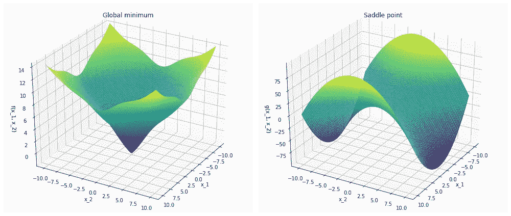

(全局)最小值(左)和鞍点(右)的示例。

鞍点为优化器提供了一个“逃跑”方向。虽然给定一个维度时不存在，但给定更多维度时，任何给定临界点是鞍点的可能性应该会增加。

为了说明这一点，让我们考虑所谓的 Hessian 矩阵，它是 f 关于所有自变量的二阶导数的矩阵。

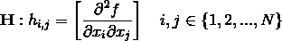

由于 Hessian 矩阵是对称矩阵，我们可以对角化它。

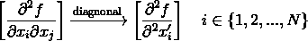

临界点最小的条件是海森矩阵是正定的，这意味着 *h₁，h₂，…，hₙ > 0。*

假设 *f* 是一个复杂的函数，不偏向任何正值或负值，我们可以假设对于任何临界点， *P(hᵢ) > 0* ，以及 *P(hᵢ) < 0，*为 *1/2。*此外，如果我们假设 *hᵢ* 不依赖于任何其他 *hⱼ* ，我们可以将 *p(hᵢ)* 视为独立事件，在这种情况下:

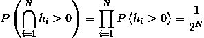

类似地，对于最大值:

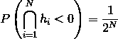

我们的临界点是鞍点的可能性是，它既不是最大值也不是最小值。因此，我们可以看到:

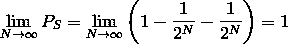

因此，高维空间似乎是可能性的空间。维度的数量越多，就越有可能感觉到鞍点为优化器的工作提供了方向。

当然，因为我们可以找到不符合这个陈述的函数的例子，所以这个陈述不是证明。然而，如果函数 f 对它的自变量有某种复杂的依赖性，我们至少可以预期，维数越高，空间就越“宽容”(平均而言)。

# 超级大球

圆形、球形或超球形——对这些物体的数学描述都很简单。

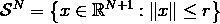

这个方程描述的只是一组点到原点的距离小于或等于一个常数的点(不考虑维数)。可以看出，对于任意数量的维度，该物体的总体积(或超大体积)可以使用以下公式来计算:

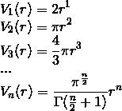

观察它与 n 的比例关系，我们可以看到:

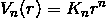

如果我们尝试为任意维数的单位超球( *r* = 1)绘制这个方程，会发生一件有趣的事情:

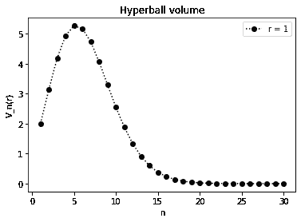

单位半径超球的体积。

正如我们所看到的，在最初的几秒钟里，球体的体积增加了。但是，一*n*5，就迅速下降到一个很小的数字。

单位超球在失去质量是真的吗？为了了解质量的去向，让我们定义一个密度参数:

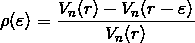

其中ε用于定义任意厚度的“壳”。同样，将 *r* 设为 1，将ε从 0 扫到 1，我们可以得出一个有趣的观察结果:

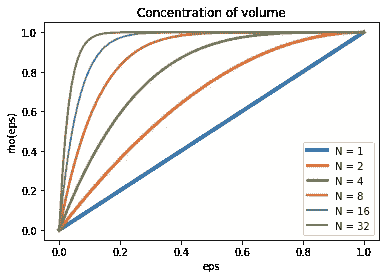

N 维球的体积浓度。

随着维度数量的增长，事实证明几乎所有球的质量都集中在它的边界周围。

如果我们考虑从属于高维空间的某个邻域中抽取样本，那么高维空间的这一特性就特别重要。在电脑上，和[马克·库利](https://marckhoury.github.io/counterintuitive-properties-of-high-dimensional-space/)提供了有趣的插图，试图展示当 *N* 变高时会发生什么。感觉就好像空间的维度使空间发生了偏转，使得被限制的点想要逃离或者推向终点，就好像它们试图探索可用的额外自由度一样。

# 多维蛋糕

让我们考虑一个立方体蛋糕，我们想把它切成 N 片 *N 片*来创建一些小块。如果我们的蛋糕是一个三维立方体(我们现在将使用 *K* 来描述维度)，我们可以将它分成的最大数量由以下序列描述:

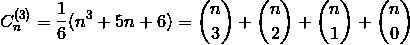

在哪里

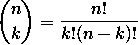

是二项式系数。

和以前一样，我们可以将数学扩展到更多的维度。

有一个尺寸为 *K* 的多维蛋糕和一把用于切片的多维刀，使用( *K-1* )维超平面，计算“超块”的数量:

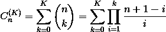

其中后一个公式是完全等价的，但是更容易计算。

现在，让我们看看超级件数将如何与 *N* 和 *K* 成比例。

```
import numpy as np
import pandas as pd
form itertools import productdef cake(n, K):
    c = 0
    for k in range(K + 1):
        term = [(n + 1 - i) / i for i in range(1, k + 1)]
        c += np.array(term).prod()
    return cN = 10  # cuts
K = 10  # dimensions
p = list(product(range(1, N + 1), range(1, K + 1)))
X = pd.DataFrame(pd.DataFrame((p,)).to_numpy().reshape(N, K)
X.index = range(1, N + 1)
X.columns = range(1, K + 1)
C = X.applymap(lambda x: cake(x[0], x[1])).astype(int)
ns = X.applymap(lambda x: x[0])
ks = X.applymap(lambda x: x[1])
C_normed = C / (nx * ks)
```

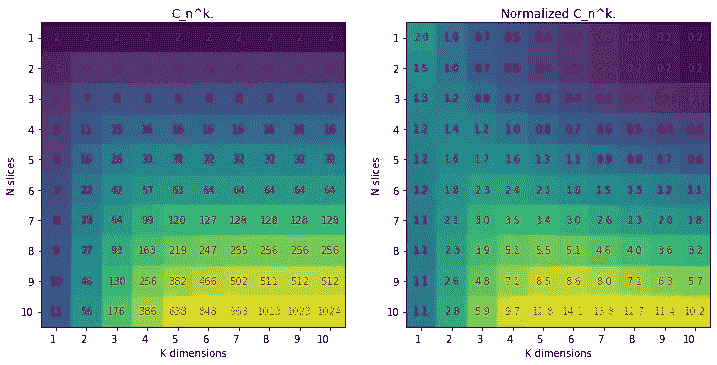

N，K——蛋糕数(左):显示使用 N 次切割的 K 维空间的最大切片数。标准化蛋糕数 C/(N * K)显示了添加尺寸或切割时切片数的比例。

看左图，我们看到上面公式的直接结果。尽管它看起来接近指数，它仍然是一个多项式表达式。直觉上，维度越多或切得越多，我们能从蛋糕中产出的部分就越多。

但是，如果我们将 *C* 除以 *N * K* 的乘积进行归一化，我们可以看到，对于某些固定的切割次数，具有 *N* 的切片数量的增加不再那么快。换句话说，似乎空间被分割成更独特的区域的潜力在某种程度上是饱和的，并且对于任何数量的切割 *K* ，存在一个“最佳”维数 *N* ，空间“更喜欢”被分割。

考虑到，例如，对于密集的神经网络层，输出状态通过以下向量矩阵乘法获得:

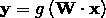

其中 *g* 为激活函数，且

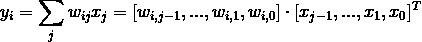

*N* 和 *K* 都可以操作。正如我们之前看到的，增加 *K* (也就是 *x* 的特征数量)或 *N* (也就是超平面的数量)会导致更多区域的定义，这些区域会对与这些片段相关联的 *y* 的独特“触发”模式做出贡献。我们拥有的片段越多，我们应该期望的性能越好，但同时增加 *N* 和 *K* 也意味着更多的操作和更大的内存占用。因此，如果对于给定的 *N* ，每增加一个额外维度的切片数量不再增长，那么就资源消耗而言，保持密集层较小可能是有利的？

# 结论

在这篇文章中，我们探讨了空间多维性的三个方面。由于我们无法将它可视化(我们甚至没有尝试…)，我们利用一些数学机制来更深入地了解这个世界的奇怪行为。尽管没有任何终极证据的支持，但我们希望刚刚提出的数学推理能够激发一些灵感、直觉和想象力，这是在处理 *N* 维度时经常需要的东西。

如果你有你的想法或观点(或者你想指出一些不一致的地方)，请在下面的评论中分享。

# 还会有更多…

我计划把文章带到下一个层次，并提供简短的视频教程。

如果您想了解关于视频和未来文章的更新，**订阅我的** [**简讯**](https://landing.mailerlite.com/webforms/landing/j5y2q1) **。你也可以通过填写表格让我知道你的期望。回头见！**