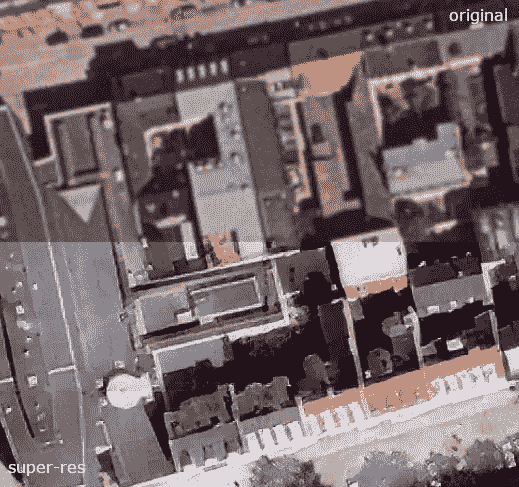
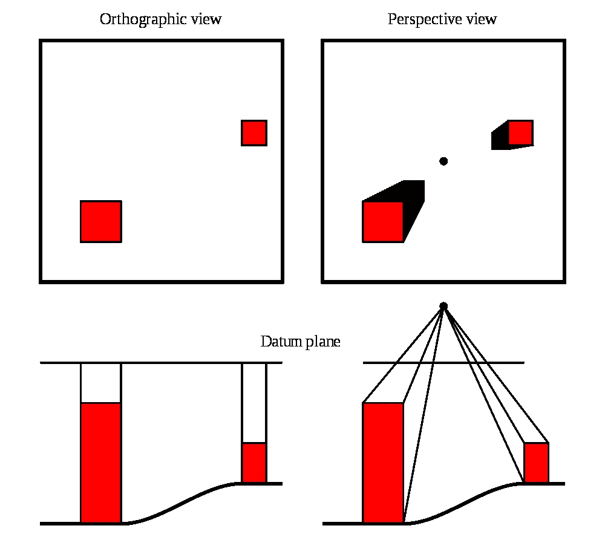
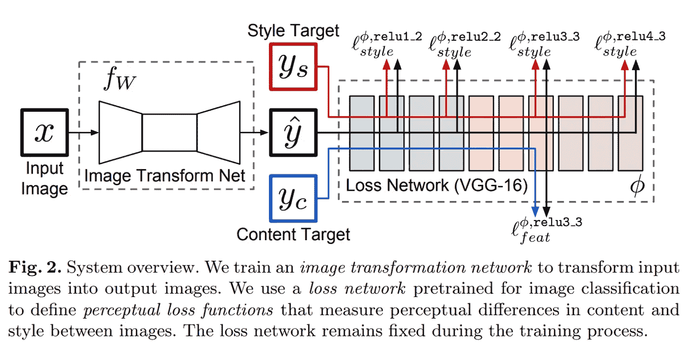
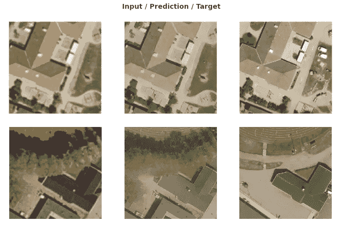

# 利用深度学习恢复旧航拍图像

> 原文：<https://towardsdatascience.com/restoring-old-aerial-images-with-deep-learning-60f0cfd2658?source=collection_archive---------51----------------------->

## 以感知损失函数和真实图像作为输入的超分辨率

# 介绍

在超分辨率的帮助下，我给我居住的城市的旧航拍照片带来了生命。使用高分辨率图像训练的神经网络，我能够创建细节，使旧的航空图像看起来质量更高。

原始图像在顶部，预测图像在底部。图片:马尔默市

# 超分辨率

超分辨率的工作原理是放大图像数据，并为其提供比使用双线性或最近邻插值放大时更多的细节。我相信你们中的很多人都尝试过在 Photoshop 中放大照片，并看到了模糊的结果。超分辨率和升迁完全不同。它以一种非常令人信服的方式编造从未有过的细节。

为了训练一个超分辨率模型，你需要一对描绘同一事物的图像，一个低分辨率，一个高分辨率。创建训练数据的常用方法是从模型中用作目标的高分辨率图像中生成低分辨率输入图像。这为您提供了具有相应像素的图像对——良好的训练数据。

我决定用一种稍微不同的方式来尝试。也许有更简单的方法？由于地理数据与地面上的位置相关，因此也与所有其他地理数据相关，我想我不必创建自己的训练数据，我已经有了我需要的数据。

由于我的数据是 1998 年拍摄的图像，而我从 2017 年开始在同一地区拍摄分辨率更高的图像，所以我已经有了“降级”的图像和目标。

这样我就可以得到所有我想修复的缺陷，包括那些我没有想到的或者那些我不能手工复制的缺陷。通过使用来自同一来源的数据，我后来想增强，我得到了所有自然发生的缺陷——模糊，色偏等。这可以让我不费吹灰之力就获得现成的训练数据。

如前所述，地理数据的一大优势是，一切都与地面上的一个点相关，并用坐标来描述它。这使得从不同数据集中剪切出具有完全相同范围的部分变得容易。在这种情况下，这意味着创建覆盖城市中同一区域的输入和目标图像。使用航空影像时会有一些潜在的问题，我将进一步讨论这些问题。

我使用的过程是基于 fast.ai 的 MOOC v3 的工作实例。最大的不同是数据扩充部分，在这里我使用了一组变换，这些变换以前给了我很好的航空影像效果。

# 数据

## 正射影像

正射影像是由飞机或无人机拍摄的几张重叠照片组成的图像。它经过校正，以创建类似地图的图像，可用于测量精确的距离和角度，就像在地图中一样。图像中的一切似乎都是从垂直的自上而下的视角拍摄的。

## 潜在的问题

正射影像的问题在于它们并不总是正交的。航空图像，尤其是旧的，没有足够的重叠。正是这种重叠使得每张照片的中心部分，也就是垂直于地面的部分，被用于制作最终的照片。缺少重叠，物体从某个角度被描绘。这是一个问题，尤其是对于其中有高层建筑的图像，导致屋顶从覆盖区偏移，建筑的立面变得可见。有时这是想要的效果，但大多数时候不是。在我的例子中，它导致输入图像的内容与目标图像不同，特别是在有高楼的区域。

来源:Pieter Kuiper，维基共享(公共领域)

当使用真实的低分辨率图像而不是生成的图像训练模型时，内容的差异仍然是一个问题。房屋被建造、拆除、道路被重绘、树木被种植等等。一个城市在 19 年里发生了很多事情，使得目标与投入不同。不过，这并没有引起我想象的那么大的问题。我的总体印象是，尽管存在差异，但该模型做得很好。

在为我的训练集选择区域时，我很小心地选择了这样的区域:a)存在于 1998 年，b)自那以后变化不大。

原始数据:
输入 1998 年的航拍影像(正交镶嵌图)(25cm/像素)
输入 2017 年的目标航拍影像(正交镶嵌图)(10cm/像素)

训练数据:
1 万对图像瓦片
每个瓦片为 500 x 500 像素，覆盖地面 50 x 50m = 10cm/像素
共 25 km
~ 5 GB 的数据

# 模型和培训

我不会详细讨论感知损失的概念，因为许多其他人对此做得更好:
[贾斯廷·约翰逊等人关于感知损失的原始论文](https://arxiv.org/abs/1603.08155)
[Christopher Thomas 的深入文章](/deep-learning-based-super-resolution-without-using-a-gan-11c9bb5b6cd5)

简而言之，对于像超分辨率这样的任务，感知损失函数是使用 GAN 的替代方案。它的相似之处在于，它使用第二个模型来决定第一个模型的表现——“它创造的东西像我们想要的东西吗？”。不同的是，第二个模型，鉴别器，在这个过程中没有被训练。在我的例子中，模型是在 ImageNet 上预先训练的用于图像分类的神经网络，VGG16。

来源:实时风格转换和超分辨率的感知损失:[https://arxiv.org/abs/1603.08155](https://arxiv.org/abs/1603.08155)

在这种情况下，主模型是 U-Net，其中编码器部分是预训练的 resnet34 架构。通过 VGG 获取预测值和目标值来拟合模型。然后，在 VGG 内部，我们比较它们的激活并计算损失。通过这种方式，我们可以得到模型表现如何的数字，例如，在应该有草地的地方创建一个草地，或者模型在生成一个有尖角的房子方面做得不好。
损失取决于模型如何预测特征和风格，而不仅仅是比较像素值。这有助于我们的模型知道什么是重要的。例如，一个建筑角可能不会占据图像中的许多像素，但对于图像的感知却非常关键。感知损失函数认识到这些像素的重要性。

超高分辨率使屋顶更清晰、更分明。左边是原始图像，后面是预测图像和目标图像。注意输入和目标之间的差异，以及模型如何模仿目标图像的风格，而不是内容。图片:马尔默市

在一个 16GB 的 GPU 上，10，000 个图像对的数据集花费了大约两个小时来训练总共 20 个时期。

# 结果和后处理

结果显示更明确的屋顶线和更少的噪音。植被通常显示更多细节，但有时看起来模糊不清。在带有大面积灰色区域(如道路)的图像拼贴中，颜色通常看起来有点淡。当创建一个用于推理的自动化工作流程时，我会加入一些基本的图像处理来给它们更多的对比度。
我相信有很多方法可以让模型表现得更好。如果有什么可以帮忙的，请随时通知我！

不幸的是，由于版权和隐私问题，我不能展示很多例子，但如果你是高分辨率航空影像的幸运拥有者，我建议你尝试一下。下面是这个项目中使用的代码的链接。

推断是使用与原始输入相同大小和分辨率的图块进行的。在创建它们的时候，我还做了一个空间参考文件(。wld)。
将预测图像保存为与。在 GIS 软件中使用时，wld 将预测图像与地面相关联。结果是一个与空间相关的超分辨率航空影像，可用作 web 地图或任何其他应用程序的背景。

# 结论

这太有趣了！1998 年的画面以一种我从未见过的方式鲜活起来。当然，它不是真实的，因为你无法提取从一开始就不存在的细节，而是它可能看起来的样子的再现。请记住，当模型进行预测时，它不知道目标是什么，只是知道或了解详细的航拍图像应该是什么样子。剩下的就是模特有资格的猜测或者说是幻觉/代入缺失的细节。这不是真的，但看起来很像。

我很惊讶这个模型表现得如此之好，尽管输入图像和目标图像之间的差异比用降级方法创建的要大得多。几乎没有进行任何预处理，只是将两个图像集的子集切割成小块。感知损失函数的使用有助于缩短训练时间，从而有望使更多拥有大量地理数据的市政当局或其他组织能够使用这样的项目。

我不知道内容的偏斜度和差异对模型的效率有多大影响。如果两个图像集都是真正正交的，或者如果我有早些年的高分辨率图像并在两个图像集之间获得较短的时间跨度，可能需要的训练数据会更少。不可避免的是，图像之间的东西会有所不同，即使是在建筑物保持不变的区域。我发现，在 1998 年和 2017 年，很少有汽车停在同一个地方。

Kaggle 上的笔记本链接:
[https://www . ka ggle . com/peterahlstrom/super-resolution-aerial-images-fastai](https://www.kaggle.com/peterahlstrom/super-resolution-aerial-images-fastai)