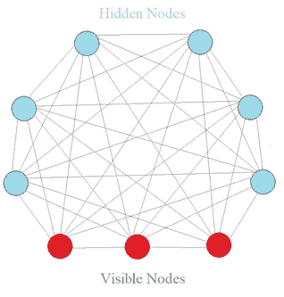
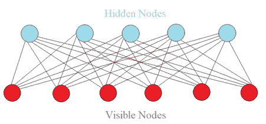

# 作为电影评论推荐系统的受限玻尔兹曼机器创造(上)

> 原文：<https://towardsdatascience.com/restricted-boltzmann-machine-how-to-create-a-recommendation-system-for-movie-review-45599a406deb?source=collection_archive---------18----------------------->

## 关于受限波尔兹曼机器的直观介绍以及使用电影分级数据进行模型训练的详细数据处理步骤


通过[链接](https://unsplash.com/photos/CiUR8zISX60)改编自 unsplash 的 Img

这是如何建立一个受限波尔兹曼机器(RBM)作为推荐系统的第一部分。这里重点是**数据处理**。

> 您将学习如何将原始电影分级数据转换为准备训练 RBM 模型的数据。它分为三个部分。

1.  RBM 简介
2.  问题陈述
3.  数据处理

现在让我们开始旅程🏃‍♂️🏃‍♀️.

1.  **RBM 简介**

首先，让我们从玻尔兹曼机(BM)说起。BM 是一种无监督的神经网络。如图 1 所示，BM 有三个明显的特征。

*   没有输出图层
*   连接之间没有方向
*   每个神经元彼此紧密相连，甚至在输入节点(可见节点)之间也是如此



图 1 玻尔兹曼机器图(作者创建的 Img)

> 为什么 BM 这么特别？从根本上说，BM 并不期待投入。相反，它自己生成模型的状态或值。因此，BM 是一个生成性模型，而不是确定性模型。BM 不区分可见节点和隐藏节点。可见节点只是我们度量值的地方。

> 然而，BM 有一个问题。随着节点数量的增加，连接的数量呈指数增长，这使得不可能计算完整的 BM。因此，建议采用 RBM，如图 2 所示。



图 2 受限玻尔兹曼机器图(作者创建的 Img)

与完全 BM 相比，RBM 不允许隐藏节点之间的连接和可见节点之间的连接。这是唯一的区别📣📣。

通过训练过程，我们向 RBM 输入大量数据，RBM 学会了如何分配每个隐藏节点来表示电影的特征，如流派、演员、导演等。换句话说，调整每个节点的权重，使得隐藏节点更好地反映特征。

具体来说，RBM 将接受从可见节点到隐藏节点的输入。它尝试基于隐藏节点值来重构输入值。如果重构值不正确，则调整权重，RBM 再次重构输入。最后，RBM 被训练成最能代表生成所有数据的系统。好处是所有权重都经过优化，RBM 可以了解系统的正常和异常情况。

2.**问题陈述**

给出大量的电影分级数据来建立 RBM。任务是预测一个用户喜欢一部电影是 1，不喜欢是 0。

3.**数据处理**

数据 *MovieLens 100K 电影收视率*来自*群镜头研究*这里。简单看一下图 3 中的数据， **Movies** 数据包含电影的名称和类型， **Ratings** 数据包含用户 ID、电影 ID、从 0 到 5 的用户评级和时间戳， **User** 数据包含用户 ID、性别、年龄、工作代码和邮政编码。


图 3 源数据集片段

3.1 导入数据

数据集包含 80，000 行训练集和 20，000 行测试集。让我们读一读。具体来说，

```
training_set = pd.read_csv(‘ml-100k/u1.base’, delimiter = ‘\t’)
training_set = np.array(training_set, dtype = ‘int’)test_set = pd.read_csv(‘ml-100k/u1.test’, delimiter = ‘\t’)
test_set = np.array(test_set, dtype = ‘int’)
```

**注意，我们将 Dataframe 转换为 Numpy 数组，因为我们将使用 Pytorch 张量，它需要数组作为输入。**图 4 显示了训练/测试集，包括用户 ID、电影 ID、评级和时间戳(对于模型训练是不可逆的)。


图 4 训练和测试数据集片段

3.2 数据结构创建

> **为了准备训练/测试数据，我们需要以数组格式创建训练/测试集，每行代表一个用户，行中的每个单元格代表每部电影的评级。**这是 RBM 的预期输入。

为此，我们需要将用户总数作为行号，将电影总数作为列号。

```
nb_users = int(max(max(training_set[:, 0]), max(test_set[:, 0])))
nb_movies = int(max(max(training_set[:, 1]), max(test_set[:, 1])))
```

我们创建了一个数据转换函数，它返回一个列表列表。每个子列表代表一个用户对所有电影的评级。如果用户没有对电影进行分级，则将分级初始化为 0。

```
def convert(data):
    new_data = []
    for id_users in range(1, nb_users + 1):
        id_movies = data[:,1][data[:,0] == id_users]
        id_ratings = data[:,2][data[:,0] == id_users]
        ratings = np.zeros(nb_movies)
        ratings[id_movies — 1] = id_ratings
        new_data.append(list(ratings))
    return new_data
```

通过上面的转换，我们转换了训练集和测试集。

```
training_set = convert(training_set)
test_set = convert(test_set)
```

图 5 显示了最终的训练集。同样，每行包含用户对所有电影的评级。


图 5 最终训练数据集的片段

最后，我们将 list 类型的**列表转换为**张量**，因为我们将使用 Pytorch 构建 RBM。**

```
training_set = torch.FloatTensor(training_set)
test_set = torch.FloatTensor(test_set)
```

3.3 二进制数据转换

我们的任务是预测用户是否喜欢电影为 1，不喜欢为 0。RBM 将采用用户的电影评级，并试图预测未被用户评级的电影。因为要预测的评级是根据原始输入计算的，所以我们必须以一致的方式保持输入评级和预测评级。

具体来说，先前设置为 0 的评级被重置为-1，给出 1 或 2 的电影被设置为 0(不喜欢)，评级超过 3 的电影被设置为 1(喜欢)。

```
training_set[training_set == 0] = -1
training_set[training_set == 1] = 0
training_set[training_set == 2] = 0
training_set[training_set >= 3] = 1test_set[test_set == 0] = -1
test_set[test_set == 1] = 0
test_set[test_set == 2] = 0
test_set[test_set >= 3] = 1
```

太好了。我们成功地将原始评级数据转换为二进制评级数据，准备好训练模型。

**太好了！这就是第 1 部分的全部内容。接下来的** [**篇**](https://medium.com/@vistaxjtu/restricted-boltzmann-machine-as-a-recommendation-system-for-movie-review-part-2-9a6cab91d85b) **将一步步走完如何打造一个 RBM。如果需要源代码，请访问我的**[**Github**](https://github.com/luke4u/Movie-Rating-Prediction)**页面🤞🤞。**