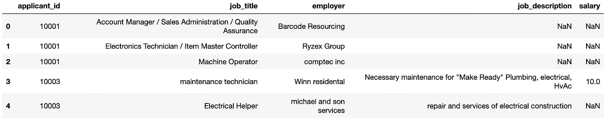
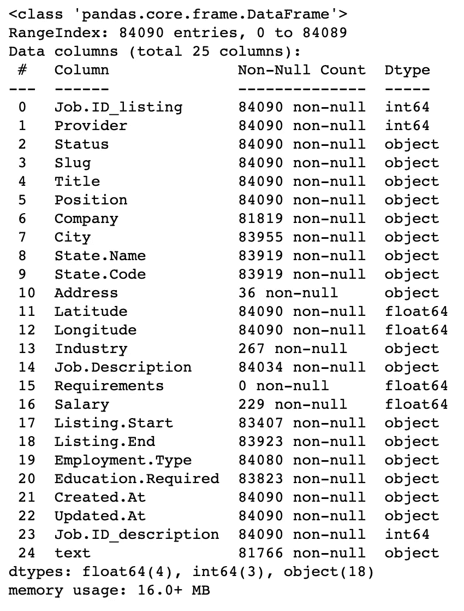
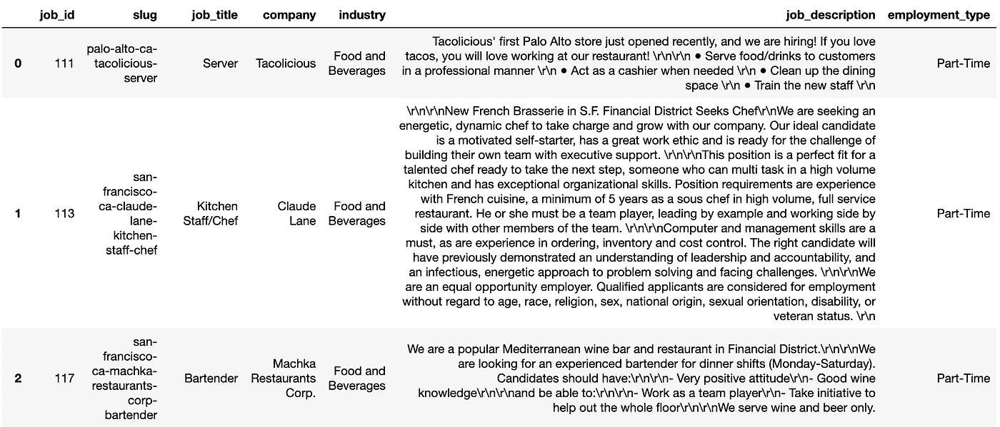
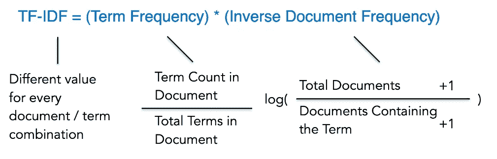
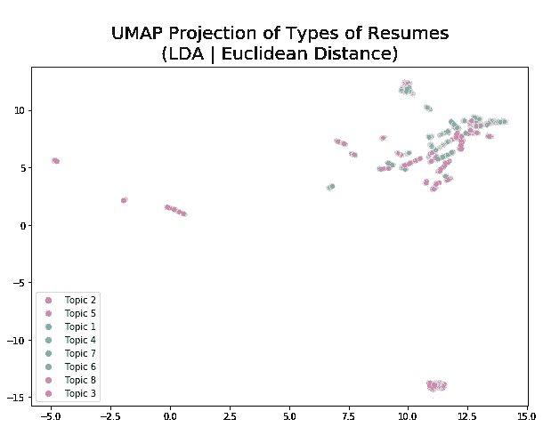
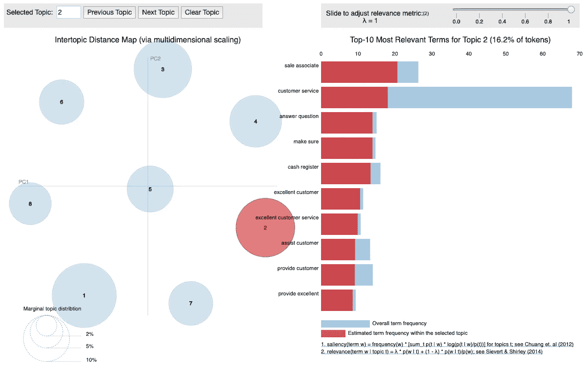
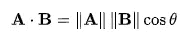
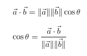
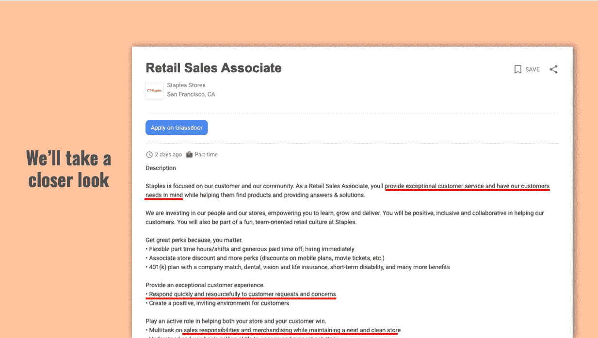

# 如何建立一个像求职者跟踪系统(ATS)一样的简历推荐系统

> 原文：<https://towardsdatascience.com/resume-screening-tool-resume-recommendation-engine-in-a-nutshell-53fcf6e6559b?source=collection_archive---------12----------------------->

## 一个人头。1000 份简历。先看哪个？

图片由[经由 Shutterstock.com](https://www.shutterstock.com/g/Abscent)拍摄

2014 年，谷歌在其职业网站上有 7000 个职位空缺，在这些职位空缺中，该公司当年也收到了 300 万份简历。

现在，有很多简历需要筛选，只有不到 1%的申请人！毫无疑问，招聘是劳动密集型的，候选人越多，就越难筛选出最合格的候选人。随着公司的扩张和增长，招聘团队也随着公司的发展而增长，这可能会变得低效和昂贵。我们如何优化这种筛选这无数简历的劳动密集型过程？

# 目标

我们可以创建一个推荐系统，根据你的工作列表推荐最匹配的简历！

图片由[通过 Shutterstock.com 启发](https://www.shutterstock.com/g/Inspiring)

为此，我们将使用自然语言处理(NLP)技术来处理简历和工作列表，并按余弦相似度降序排列简历，以创建这个终极简历筛选工具！

> **自然语言处理**是人工智能的一个分支，它允许计算机阅读、理解人类语言并从中获取意义。

图片由[赖特工作室](https://www.shutterstock.com/g/Kirill%2BWright)通过 Shutterstock.com 提供

# 方法

## 1.数据收集和简单 EDA

该数据集是在 [Kaggle](https://www.kaggle.com/kandij/job-recommendation-datasets) 上找到的，共有 8653 个求职者经历条目和 80000 个职位列表。请注意，这些申请人经历并不专门针对任何工作列表。

## 摘要

为了用这些数据制作一份简历，我将所有的工作经历按申请人 ID 连接起来。职位/经历不完整的简历被删除，以确保有足够的文本供以后建模。例如，对于`applicant_id` 10001，其工作描述显示为前三行的`Nan`，因此这些观察值将被删除，不会在数据集中考虑。

`employer`和`salary`对我们的推荐引擎没有帮助，所以我们也将它们移除。

## 工作说明

对于工作描述，为了简单起见，我只在工作列表的数据框中保留了`job_title`和`job_description`。正如你在上面的栏目列表中看到的，有很多关于工作地点的信息(`city`、`State.Name`、`State.Code`、`Address`、`Latitude`、`Longitude`)，我们不会用这些信息来推荐简历。其余的专栏要么似乎没有为我们的用例增加很多价值，要么有很多缺失的价值。

## 2.文本预处理

文本预处理是清理和准备文本数据的实践。使用 SpaCy 和 NLTK，简历和工作描述将进行如下预处理:

*   停止单词删除
*   词性标注
*   词汇化
*   仅字母字符

因为经过预处理后，长度较短的简历变得更短，也就是少于 20 个单词。我已经决定删除少于 23 个单词的简历，以便在数据集中仍然有至少 1000 份简历，确保有足够的文本供模型训练。

## 3.矢量器

## 为什么选择词频-逆文档频率(TF-IDF)而不是计数矢量器(又称词频)？

**Count Vectorizer 让流行词占据主导地位。有些词可能在一份简历中和所有简历中被多次提及，这使得这些词成为“流行”词。篇幅较长的简历也更有可能不止一次包含这些“流行”词汇。Count Vectorizer 得出结论，简历中提到的这些“流行”词彼此更相似，因为它更强调这些流行词，即使它们在我们的上下文中可能并不重要。**

**TF-IDF 更看重生僻字。**没有在所有简历中提及，但只在这两份简历中出现的单词——表明这些文档可能比其他文档更相似。

在清理完所有文本后，将 TF-IDF 放在简历上以比较简历之间的相似性。我们已经设置了 2 个单词和 3 个单词的短语(二元和三元)，每个短语需要在至少 12 个文档中出现，以便在以后作为主题出现。

## 4.主题建模(降维)

我尝试了 3 种不同的主题建模技术:潜在狄利克雷分配(LDA)，潜在语义分析(LSA)和非负矩阵分解(NMF)。

一开始，我使用 LDA 和 pyLDAvis 来衡量简历中合适的主题数量、放入 TF-IDF 中的 grams/terms 数量以及包含 grams/terms 的最小文档数量。然后，对于每种主题建模技术，我创建了一个 UMAP，并检查了每个主题中的术语。似乎 LDA 对于主题具有最好的可分性。

下面是使用 PyLDAvis 创建的图表，它呈现了我们的主题建模的**全局视图。**

皮尔戴维斯图表

## **如何解读** [pyLDAvis](https://github.com/bmabey/pyLDAvis) **生成的图表？**

在左侧面板上，是包含 8 个圆圈的**主题间距离图**，这表明我们的简历数据集中有 8 个主题。每个主题都由最相关/最重要的术语组成，显示在图表的右侧面板中。右侧面板显示了与每个主题最相关的前 10 个术语。对于主题 2，一些最相关的术语是“销售助理”、“客户服务”、“回答问题”和“收银机”，这听起来像是零售业中潜在的销售角色。最后，蓝色条表示总的术语频率，而红色条表示该主题中的估计术语频率。

## PyLDAvis 图表的目标是什么？

简而言之，您希望您的 PyLDAvis 图表看起来与我们这里的相似。

**主题间距离图(左)—** 请注意，每个圆圈**的间距相当大，大小**也差不多，这意味着**每个主题几乎均匀地分布在文档(简历)中，并且这些主题都有自己独特的术语**。然而，由于人们可以有不同层次的经验，例如，3 年后从管理员到数据科学家，主题仍然不可避免地有很少的术语相互重叠。

**与主题 2(右)最相关的前 10 个术语—** 您可以看到红色条非常接近填满蓝色条，这意味着这些术语大多在该主题中，与其他主题几乎没有重叠。

## 5.基于余弦相似度的推荐系统

最后，我们需要在工作描述和简历之间找到某种相似性。我在争论是用点积还是余弦相似度。见下面我的思维过程。

**余弦相似度是两个向量之间夹角的余弦，它决定了两个向量是否大致指向同一方向。**在我们的案例中，这些术语(我们之前在 TFIDF 中定义的二元和三元语法)是否同时出现在简历和职位描述中。

**点积是两个向量的欧几里得幅度与它们之间夹角的余弦的乘积。**除了**术语出现**，简历中出现术语的**频率也会提升匹配度。**

## 我们应该使用哪种相似性度量？

点积听起来像是一个双赢的局面，我们将考虑这些术语是否出现以及在每个文档中出现的频率。这听起来可能是一个好主意，但回想一下，这是我们之前试图避免的缺点(TF vs . TF-IDF)——把重点放在这些经常提到的词上。

想象一下 *a* 和 *b* 之间的点积，就好像我们正在**将 *a* 投影到 *b* 上(反之亦然)，然后取投影长度为 *a* ( | *a* |)与长度为 *b* (| *b* |)的乘积。**

*   当 *a* 与 *b* 正交**时，点积为零。****a*到 *b* 的投影产生一个**零长度**的向量，因此**零相似度**。*****
*   ***当 *a* 和**b**指向**同一方向**时，点积产生的**最大值**。*****
*   *****当 *a* 和 *b* 指向**相反方向**时，点积产生**最低值**。*****

****点积将 ***大小*** 考虑在内，因此点积随着向量长度的增加而增加。为了归一化点积，然后将其除以归一化向量。输出是余弦相似度，它对于缩放是不变的，并且将值限制在-1 和 1 之间。余弦值为 0 表示这两个向量互成 90 度(正交)且不匹配。余弦值越接近 1，角度越小，向量之间的匹配度越大。****

****从上面的公式中可以看出， **cos ⁡θ实际上就是两个向量的点积除以两个向量的长度(或幅度)的乘积**。一般来说， **cos ⁡θ根据矢量**的*方向*来表示相似性。随着维数(也称为向量，也称为术语)的增加，这仍然成立，因此 cos ⁡θ是多维空间中一个有用的度量。****

# ****例子****

****这是我找到的一份工作清单，“旧金山史泰博零售销售助理”。****

********************************

# ****未来的工作****

****将来，如果有更多的时间和对公司数据的访问，我愿意做以下事情来改进推荐引擎。****

*   ******获取关于职位描述、候选人简历和其他内部信息的公司数据**，例如，该角色的工作级别是什么？这是人事经理的角色吗？****
*   ******一次对一个工作类别或角色的文本数据建模**。由于该项目基于一个简历数据集，该数据集涉及广泛的工作职能，只有 1000 个观察值，因此主题主要是工作职能的更高层次的细分。当只对一个工作角色建模时，我们可以缩小主题范围，使其更具体地针对该角色，这可以带来更好的推荐引擎。****
*   ******与招聘人员合作应用监督学习技术**，使用筛选过的简历作为一个指标，表明这份简历是一份好的推荐。****
*   ******与工程部门合作，应用用户反馈循环**来持续改进推荐引擎。****