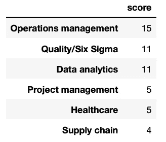
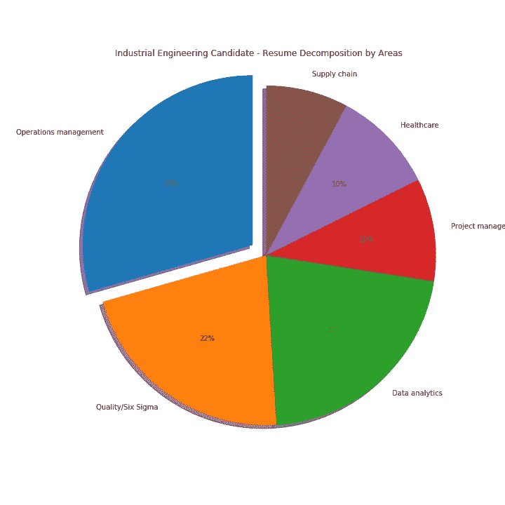

# 用 Python 恢复筛选

> 原文：<https://towardsdatascience.com/resume-screening-with-python-1dea360be49b?source=collection_archive---------4----------------------->

## Python 用于文本分析

## 分析空缺职位的候选人简历

图片由斯科特·格雷厄姆拍摄，可在 [Unsplash](https://unsplash.com/photos/OQMZwNd3ThU) 获得

# 介绍

写一份简历不是一件小事，尤其是在正确选择关键词的时候。人们花费数小时撰写和格式化完美的简历，希望它能被人才招聘专家阅读，并最终帮助他们获得工作面试。不幸的是，大约 75%提交的简历从未被人看到过。

由于大量的申请人和简历提交到职位发布，对于人才招聘专业人员来说，手动简历筛选过程变得繁琐、低效且耗时。因此，标准化的自动化筛选方法是必要的，以便根据背景、教育和专业经验更快地将**合格的**与**不合格的**候选人进行分类，从而以更高的效率和更准确的结果简化招聘流程。

## 筛选程序中的人工智能

人工智能以及文本挖掘和自然语言处理算法可以用于开发程序(即申请人跟踪系统)，这些程序能够在几分钟内客观地筛选数千份简历，并根据阈值、特定标准或分数无偏见地确定最适合某个职位空缺的**简历。**

这些程序通常寻找特定的关键字；他们对简历进行分类和排名，以确定招聘人员应该进一步审查的工作申请。虽然每个公司可能都有自己的简历筛选系统，但对于候选人来说，了解他们如何根据他们申请的职位空缺来改进他们的关键词选择是至关重要的。

# 工程师简历筛选示例

由于我是工业和系统工程师，下面这个例子就落地在这个专业领域吧。在工业和系统工程领域，有广泛的集中领域，包括但不限于质量保证、运营管理、制造、供应链、物流、项目管理、数据分析和医疗保健系统。其中每一个都有相关的关键术语和概念，在工业和系统工程领域内众所周知。

尽管工业工程师必须具备每个集中领域的知识和背景，但通常建议他们在该领域的特定集中领域从事职业。此外，考虑到我们目前正处于**专业化时代**，招聘经理更有可能优先考虑在特定领域拥有强大背景、知识和经验的候选人，而不是“多面手”候选人。不幸的是，在候选人之间存在一种误解，即“擅长并精通”每一件事和在某一特定主题上“专业且高度熟练”。

对于以下示例，让我们构建一个简历筛选 Python 程序，该程序能够将关键字分类到六个不同的集中领域(例如，质量/六西格玛、运营管理、供应链、项目管理、数据分析和医疗保健系统)，并确定工业和系统工程师简历中具有最高专业水平的一个。让我们在我的[简历](https://github.com/rsalaza4/Resume-Screening/blob/master/Files/Roberto%20Salazar%20-%20Resume.pdf)上测试一下，看看结果吧！

## Python 代码

下面的 Python 代码将分为六个主要步骤。包含的注释行提供了简短的解释，并指导您完成编码过程。

**步骤#1: PDF 文件打开、阅读和文本提取**

**步骤#2:文本清理**

**步骤#3:按区域设置的关键术语字典***

**免责声明:本词典每个领域中包含的关键术语是通过研究工业和系统工程职位招聘中最常见的关键术语获得的。该词典可以根据招聘经理的标准定制添加/删除关键术语。*

**步骤#4:计算每个区域的分数**

**步骤#5:用于最终分数创建的排序数据帧**

分数汇总数据框

**步骤#6:饼图创建**

**最终结果**

简历筛选结果

## **成果解读**

有意思。根据我的简历筛选结果，我的主要工业和系统工程集中领域是运营管理，其次是与数据分析相关的质量/六西格玛。结果显示了一定程度的医疗保健和项目管理角色的经验。

有两种可能的方法来分析这些结果。通过查看分数汇总数据框，招聘经理可以确定给定列表中每个集中区域包含了多少关键术语。另一方面，通过查看饼状图，招聘经理可以确定我的主要专注领域，并确定我在多大程度上可以被考虑从事与其他领域相关的工作。分数会受到每个集中区域的关键字数量的很大影响，这就是为什么强烈建议均匀分布关键字以避免对结果产生不希望的偏差。

如前所述，由招聘经理和人才获取专业人员来定义阈值、指标和分数，以确定候选人对于给定工作类型的资格。

## 现在轮到你了

试试看！在这里下载 Python 代码[，加载 PDF 格式的简历并运行代码。根据简历找出你最强的工业和系统工程专长领域！](https://github.com/rsalaza4/Resume-Screening)

# 总结想法

在本教程中，我们已经经历了人工智能和文本挖掘在简历筛选程序中的许多可能应用之一。真正的申请人跟踪系统比这里内置的程序要复杂和先进得多；他们不仅浏览简历内容，还浏览简历格式。对于候选人来说，了解简历筛选系统如何击败他们，并让他们的简历被人才招聘专业人员查看是至关重要的。

科技使求职过程变得越来越容易和困难。大量的申请人和有限的机会迫使候选人写出能够击败“机器人”的优秀简历。强烈建议应聘者对简历关键词进行优化，以体现自己的软硬技能，避免包含流行语。不要放弃！努力完善你的简历，对你的技能和专业能力充满信心。祝你在求职过程中一切顺利！

*— —*

*如果你觉得这篇文章有用，欢迎在* [*GitHub*](https://github.com/rsalaza4/Resume-Screening) *上下载我的个人代码。也可以直接发邮件到*[*rsalaza4@binghamton.edu*](mailto:rsalaza4@binghamton.edu)*找我，在*[*LinkedIn*](https://www.linkedin.com/in/roberto-salazar-reyna/)*找我。有兴趣了解工程领域的数据分析、数据科学和机器学习应用的更多信息吗？通过访问我的媒体* [*个人资料*](https://robertosalazarr.medium.com/) *来探索我以前的文章。感谢阅读。*

*——罗伯特*