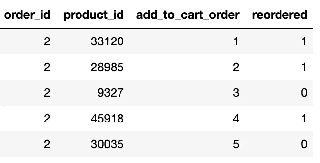
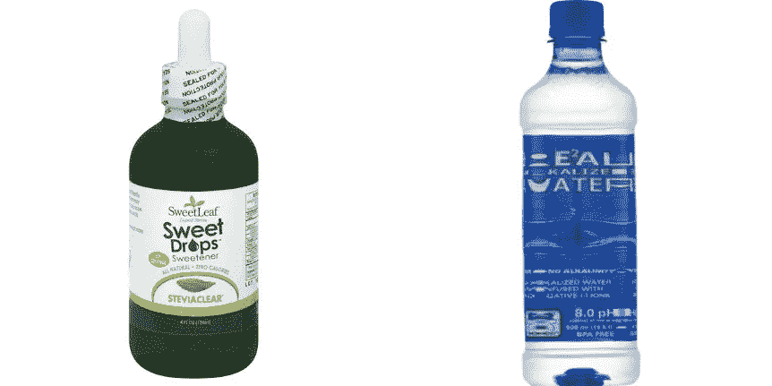
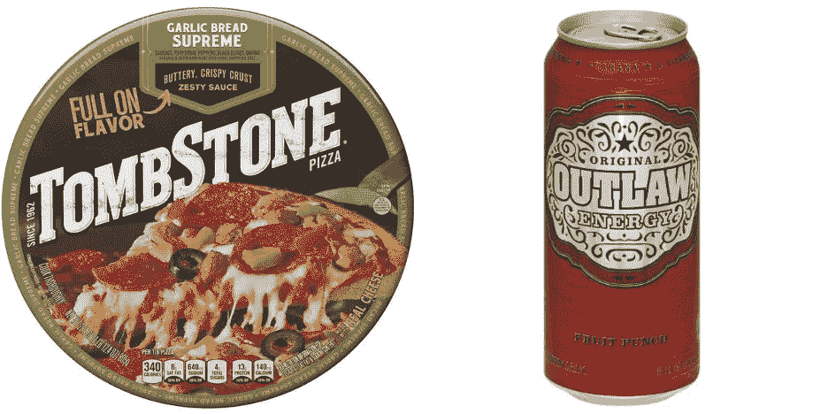
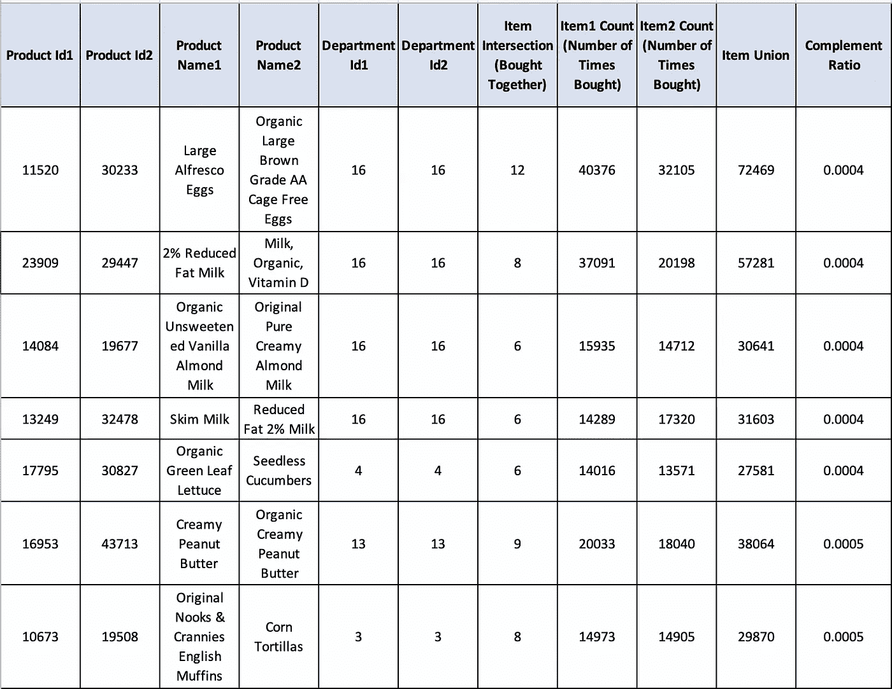

# 零售分析:寻找替代品和补充品的新颖而直观的方式

> 原文：<https://towardsdatascience.com/retail-analytics-a-novel-and-intuitive-way-of-finding-substitutes-and-complements-c99790800b42?source=collection_archive---------11----------------------->

## 零售分析:零售数据科学

零售(弗兰克·科尔多瓦在 [Unsplash](https://unsplash.com/photos/UfRLtAHHaP8) 上拍照)

[零售业](https://en.wikipedia.org/wiki/Retail)向顾客出售商品和服务。有了大量可用的消费者购买历史，我们可以应用数据分析来正确预测库存需求、供应链移动、商品放置、推荐商品之间的关系等，这就创造了零售分析这一术语。

零售分析的一个重要部分是找到面包和黄油搭配以及牙膏和牙刷搭配等物品之间的关系。替代品是用于同一目的的不同品牌的替代产品。替代品的例子可以是茶和咖啡或不同品牌的牙膏(Pepsodent 和高露洁)。这几项基本都是彼此的竞争对手。另一方面，补品是一起购买和使用的物品。这些商品有助于提升客户购物篮中彼此的销售额。补充的例子可以是面包和黄油或航班和出租车服务等。

了解这种关系有助于做出有数据支持的决策。确定替代物和补充物后的可能优势是-

1.  商店中的物品摆放。互补物品可以放在一起/更近。
2.  在电子商务网站中，每当购买物品时，推荐其赠品，因为这些是一起购买的物品。
3.  在一个项目不可用时，推荐它的替代品。
4.  提供该商品及其补充品的组合报价，以提高销售额或清理库存。
5.  每当某个商品的价格上涨/下跌时，监控对其替代品的销售/需求的影响。这有助于做出有意识和有计划的定价决策。

[关联规则挖掘](https://en.wikipedia.org/wiki/Association_rule_learning)是数据挖掘技术的一个分支，它引入了像[支持度](https://en.wikipedia.org/wiki/Association_rule_learning#Support)、[置信度](https://en.wikipedia.org/wiki/Association_rule_learning#Confidence)、[提升度](https://en.wikipedia.org/wiki/Association_rule_learning#Lift)、[确信度](https://en.wikipedia.org/wiki/Association_rule_learning#Conviction)、[先验算法](https://en.wikipedia.org/wiki/Apriori_algorithm)这样的概念，有助于发现这样的关系。通过这篇博文，我打算提出一种替代的、直观的方法来寻找项目关系。因此，一个人不需要有任何先验知识，因为这是一种新颖的方式，没有任何先决条件。

为了演示算法的工作和有效性，我们将在 [Kaggle 的 Instacart 数据集](https://www.kaggle.com/c/instacart-market-basket-analysis)上运行所提出的方案。使用的代码可以从[这里](https://github.com/samread81/Instacart)下载。

# 寻找补充

> 补充品是通常一起购买的物品“X”和“Y”。找到这种商品对的一种策略是，在所有顾客购物篮中，找到一起购买“X”和“Y”的次数与购买“X”和“Y”的次数的比率。

> 补码比率= (X ∩ Y)/(X ⋃ Y)

对于要成为补码的项目“X”和“Y ”,补码比率需要尽可能高。它的上限为 1。在所有的项目对中，我们将找到称赞率最高的项目对。

同样，从[集合论](https://en.wikipedia.org/wiki/Set_(mathematics))中，我们知道，

集合 A 和集合 B 的并集([图像源](https://wikimedia.org/api/rest_v1/media/math/render/svg/a0bbdac1eb429befc47b8dca8180078642af9592)

[图像来源](https://en.wikipedia.org/wiki/Set_(mathematics)) ( [媒体来源](https://upload.wikimedia.org/wikipedia/commons/thumb/8/86/A_union_B.svg/440px-A_union_B.svg.png))

我们将从 Instacart 数据集找到跨部门的补充。我们先来看看数据集。

订单表快照

总共有 320 万份订单，这些订单中订购了 3240 万件商品。

产品表的快照

共有 49.6K 个不同的项目。

部门表快照

总共有 21 个部门。

接下来，我们将执行 orders 表的交叉连接，以查找商品一起购买的次数。我们还将它与 product 和 department 表连接起来，以查找产品的详细信息。按补码比率降序排列的最终输出表如下所示

结果快照(算法建议的补充)

让我们看看算法建议什么作为补充:

甜叶菊甜味剂和碱水([图像来源 1](https://d2lnr5mha7bycj.cloudfront.net/product-image/file/large_b0895703-43d3-4992-92d5-d203b682cbcb.jpg) & [图像来源 2](https://d2lnr5mha7bycj.cloudfront.net/product-image/file/large_9a944556-38e7-458d-988c-40e590cb0ece.png)

至尊披萨和能量饮料([图片来源 1](https://d2lnr5mha7bycj.cloudfront.net/product-image/file/large_9e40431a-b216-4f45-94d9-f295f44c5cee.JPG) & [图片来源 2](https://d2lnr5mha7bycj.cloudfront.net/product-image/file/large_31bee999-2e36-4991-b0ad-ecf3f5baad6a.jpg) )

皮塔薯片和烤松仁豆沙([图像来源 1](https://d2lnr5mha7bycj.cloudfront.net/product-image/file/large_d70c39f7-10d2-41fe-961b-101442f10512.jpg) & [图像来源 2](https://d2lnr5mha7bycj.cloudfront.net/product-image/file/large_500daeb8-d2ef-4496-8e84-05434e5baf4b.jpg) )

> 结果看起来真的很好。人们用碱化水购买甜叶菊透明甜味剂是有道理的，因为当与水混合时，几滴甜味剂会给它带来良好的味道。
> 
> 类似地，人们更喜欢吃配有能量饮料的比萨饼和配有鹰嘴豆泥或洋葱蘸酱的皮塔饼或薯片。

# 寻找替代品

> 替代品是用于同一目的的不同品牌的替代产品。如果商品“X”和“Y”是彼此的直接竞争对手，并且人们通常会购买其中之一，那么它们就是替代品。一种商品价格的上涨或下跌不太可能以相反的方式影响其替代销售。

> **替代率=(X∩Y)/最小值(X，Y)**

对于要替代的两个项目‘X’和‘Y’，我们倾向于替代率越低越好。

> ***为什么公式中有最小值函数？***
> 
> 一些像香蕉或苹果这样的东西会很受欢迎，是许多篮子的一部分。最小函数有助于消除这种偏差，并使比较达到公平的标准。

我们将从 Instacart 数据集中找到同一部门的替代者。我们将执行 orders 表的交叉连接，以查找一起购买的商品与分开购买的商品的次数。我们还将它与 product 和 department 表连接起来，以查找产品的详细信息。按补码比率升序排序时，最终输出表如下所示

结果快照(算法建议的替代)

> 结果看起来不错。人们大多购买大型露天鸡蛋或有机大型棕色鸡蛋是有道理的。
> 
> 同样，人们购买 2%的低脂牛奶或含有维生素 D 的有机牛奶或脱脂牛奶。

# 结论

通过这篇博文，我们找到了一种替代和直观的方法来寻找替代和补充。这些简单的指标给了我比寻找支持、信心、提升、信念或其他关联规则挖掘算法更好的结果。同样，这些指标非常直观，并且易于大规模实施。结果支持这些指标的良好性。数据集可以从 [Kaggle 的 Instacart 数据集](https://www.kaggle.com/c/instacart-market-basket-analysis)下载。使用的代码可以从[这里](https://github.com/samread81/Instacart)下载。请点击这里查看我在零售分析[上的另一篇有趣的帖子。](/retail-analytics-finding-a-rank-ordering-of-seasonal-items-16c56f4f0f43)

***我的 Youtube 频道获取更多内容:***

 [## 阿布舍克·蒙戈利

### 嗨，伙计们，欢迎来到频道。该频道旨在涵盖各种主题，从机器学习，数据科学…

www.youtube.com](https://www.youtube.com/channel/UCg0PxC9ThQrbD9nM_FU1vWA) 

> **关于作者-:**
> 
> Abhishek Mungoli 是一位经验丰富的数据科学家，拥有 ML 领域的经验和计算机科学背景，跨越多个领域并具有解决问题的思维方式。擅长各种机器学习和零售业特有的优化问题。热衷于大规模实现机器学习模型，并通过博客、讲座、聚会和论文等方式分享知识。
> 
> 我的动机总是把最困难的事情简化成最简单的版本。我喜欢解决问题、数据科学、产品开发和扩展解决方案。我喜欢在闲暇时间探索新的地方和健身。在 [**中**](https://medium.com/@mungoliabhishek81) 、**[**Linkedin**](https://www.linkedin.com/in/abhishek-mungoli-39048355/)**或**[**insta gram**](https://www.instagram.com/simplyspartanx/)**关注我，查看我[以前的帖子](https://medium.com/@mungoliabhishek81)。我欢迎反馈和建设性的批评。我的一些博客-********

*   ******[统计决定胜负的力量](https://medium.com/analytics-vidhya/whos-right-the-manager-or-the-restuarant-owner-aaa9b92e153f)******
*   ******[以简单&直观的方式分解时间序列](/decomposing-a-time-series-in-a-simple-and-intuitive-way-19d3213c420b?source=---------7------------------)******
*   ******[挑哪个？GPU 计算 vs Apache Spark 扩展您的下一个大任务](https://medium.com/analytics-vidhya/which-one-to-pick-gpu-computing-vs-apache-spark-to-scale-your-next-big-task-c26b811b47a7)******
*   ******[GPU 计算如何在工作中真正拯救了我？](https://medium.com/walmartlabs/how-gpu-computing-literally-saved-me-at-work-fc1dc70f48b6)******
*   ******信息论& KL 分歧[第一部分](/part-i-a-new-tool-to-your-toolkit-kl-divergence-5b887b5b420e)和[第二部分](/part-2-a-new-tool-to-your-toolkit-kl-divergence-736c134baa3d)******
*   ******[使用 Apache Spark 处理维基百科，创建热点数据集](/process-wikipedia-using-apache-spark-to-create-spicy-hot-datasets-1a59720e6e25)******
*   ******[一种基于半监督嵌入的模糊聚类](/a-semi-supervised-embedding-based-fuzzy-clustering-b2023c0fde7c)******
*   ******[比较哪个机器学习模型表现更好](/compare-which-machine-learning-model-performs-better-4912b2ed597d)******