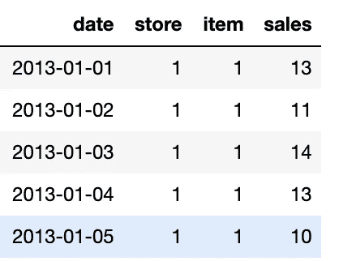
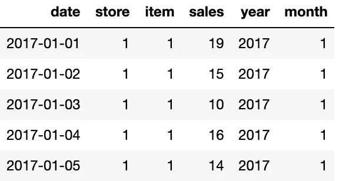
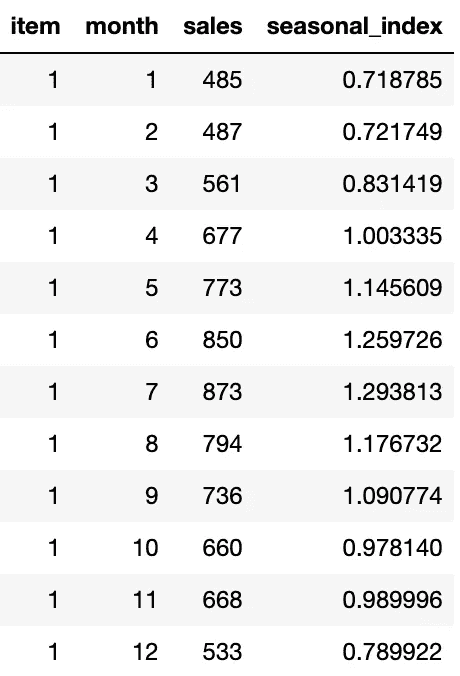
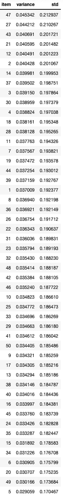
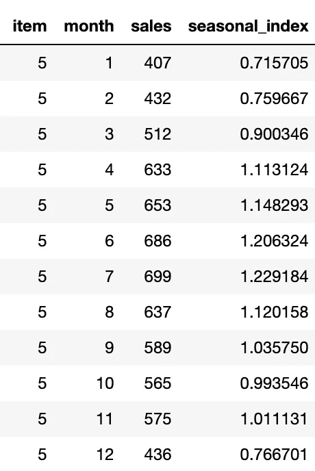
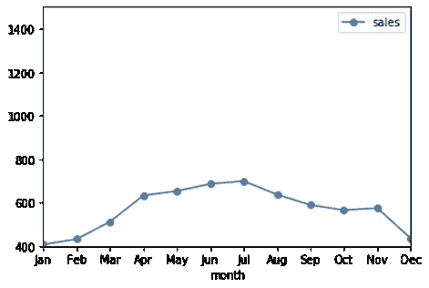
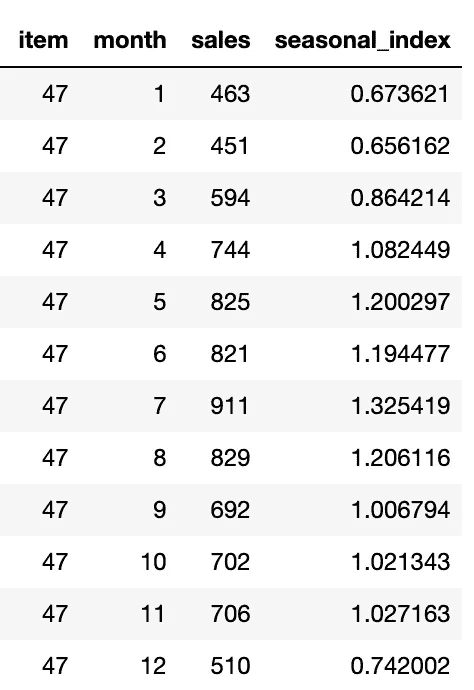
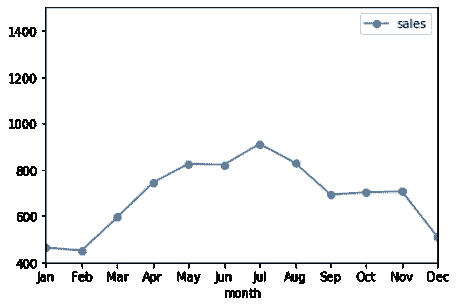

# 零售分析:寻找季节性商品的排序

> 原文：<https://towardsdatascience.com/retail-analytics-finding-a-rank-ordering-of-seasonal-items-16c56f4f0f43?source=collection_archive---------23----------------------->

## 零售分析:零售数据科学

Aj Povey 在[像素](https://images.pexels.com/photos/226400/pexels-photo-226400.jpeg?auto=compress&cs=tinysrgb&dpr=2&h=750&w=1260)上拍摄的照片

[零售业](https://en.wikipedia.org/wiki/Retail)向顾客出售商品和服务。我有在零售行业工作的经验，也写过一些关于零售分析的博客，可以在[这里](/retail-analytics-a-novel-and-intuitive-way-of-finding-substitutes-and-complements-c99790800b42)找到。
零售分析通过分析客户的购买历史来做出基于数据的决策。在这篇博文中，我想强调影响销售的因素，并对最受这些因素影响的项目进行排名。

这些商品的销售受到各种因素的影响，比如-

1.  [经济](https://en.wikipedia.org/wiki/Economy)有时
2.  项目性质(季节性或非季节性)
3.  促销或折扣
4.  来自对手的竞争
5.  替代产品的竞争
6.  像[超级碗](https://en.wikipedia.org/wiki/Super_Bowl)、[感恩节](https://en.wikipedia.org/wiki/Thanksgiving)、[新年](https://en.wikipedia.org/wiki/New_Year%27s_Eve)等特殊事件因地而异

雨伞的销量在雨季会更多，而冰淇淋的销量在夏季会更多。同样，促销/折扣或一些特殊事件，相同的百分比折扣可能导致项目“X”和“Y”的不同销售，这取决于它们的季节性。通过这篇博客，我打算建议一种根据季节性给物品排序的方法。这不是一件小事，它有自己的挑战。我会列出挑战和应对方法。敬请期待，阅读愉快。

为了证明该方法的工作和有效性，我们将在 [Kaggle 的商店商品需求预测挑战赛](https://www.kaggle.com/c/demand-forecasting-kernels-only/data)上运行提议的方案。使用的代码可以从[这里](https://github.com/samread81/Store-Item-Demand-Forecasting-Challenge)下载。

# 根据季节性对项目进行排序的挑战

## 1.销售规模

第一个挑战是不同商品的销售规模。商品“X”在正常季节的销量可能达到 10 件，在最有利的季节可能达到 100 件。而另一方面，在正常到最有利的季节中，一些其它商品“Y”的销售可能从 100 到 1000 不等。

## 2.不同项目的季节不同

不同的项目有不同的有利季节。例如，雨伞的最佳季节是雨季，而冰淇淋的最佳季节是夏季。同样，毛毯在冬天卖得更多，火鸡在感恩节卖得更多。

> 我们的目标是想出一种方法，能够解决所有这些挑战，并根据它们随季节的变化对项目进行排序。我们打算最终根据物品的季节性对它们进行排序。

# 季节性项目的排序方法

方法是-

1.  首先，为每个项目找到一个月度季节指数。月指数是用月销售额除以平均销售额得到的。作为这一步的结果，我们得到每个月每个项目的 12 个值。由于月度季节性指数是比率，因此可以跨项目进行比较。
2.  接下来，为每个项目计算季节指数的方差/标准差。作为这一步的结果，我们将得到每个项目的一个值，即每月季节性指数的方差/标准差。
3.  根据项目的方差/标准差对项目进行排序。方差/标准差最大的项目是季节性最强的项目。

此外，由于这一点，我们得到了一个根据季节性排序的项目。

# 实施和测试该方法

我们将在 [Kaggle 的商店商品需求预测挑战](https://www.kaggle.com/c/demand-forecasting-kernels-only/data)上测试该方法。我们先来看看数据集。

资料组

该数据集由 2013 年 1 月至 2017 年 12 月的商店商品销售数据组成。总共有 50 个项目和 10 个商店。

在本练习中，我们将筛选与商店 1 和 2017 年相对应的数据。过滤后的数据如下所示。

1 号店和 2017 年的数据

接下来，我们计算每个项目的月度季节指数。

用于合计销售额并计算商品月度季节性指数的 Python 代码

某项商品的月度季节性指数看起来像-

项目 1 的月度季节性指数

接下来，我们计算所有 50 个项目的月度指数的方差和标准差。按方差/标准差降序排列的项目的最终排名如下

根据每月季节性指数的变化对所有 50 个项目进行排名

> 该方法建议列表中的 ***项 47*** 最具季节性(易出现高方差) ***项 5*** 最不具季节性。让我们把结果可视化来检查一下

**销售&项目 5** 月度季节性指数

**第 5 项的销售额如何变化**

**销售&第 47 项**月度季节指数

**第 47 项**的销售变化

> 从图中可以明显看出，第 47 项的销售偏离比第 5 项更大。与项目 5 的平坦曲线相比，项目 47 具有更多的峰值和谷值。此外，项目 47 的最低和最高月销售额之间有 101.9%的涨幅(最低 451 个单位，最高 911 个单位)，而项目 5 的最低和最高月销售额之间只有 71.7%的涨幅(最低 407 个单位，最高 699 个单位)。因此，该算法在根据季节性对项目进行排序方面做得很好。该方法中季节性最强和最弱商品的图表和销售数据也表明了同样的情况。

***我的 Youtube 频道获取更多内容:***

 [## 阿布舍克·蒙戈利

### 嗨，伙计们，欢迎来到频道。该频道旨在涵盖各种主题，从机器学习，数据科学…

www.youtube.com](https://www.youtube.com/channel/UCg0PxC9ThQrbD9nM_FU1vWA) 

# 结论

在这篇博客文章中，我们设计了一种根据季节性对物品进行排序的方法。存在挑战，但这种方法能够解决这些问题。通过该方法得到的季节性最强和最弱商品的图表和销售数据证明了该方法的有效性。该数据集可从 [Kaggle 的商店商品需求预测挑战](https://www.kaggle.com/c/demand-forecasting-kernels-only/data)中下载。使用的代码可以从[这里](https://github.com/samread81/Store-Item-Demand-Forecasting-Challenge)下载。

> 关于作者:
> 
> Abhishek Mungoli 是一位经验丰富的数据科学家，拥有 ML 领域的经验和计算机科学背景，跨越多个领域并具有解决问题的思维方式。擅长各种机器学习和零售业特有的优化问题。热衷于大规模实现机器学习模型，并通过博客、讲座、聚会和论文等方式分享知识。
> 
> 我的动机总是把最困难的事情简化成最简单的版本。我喜欢解决问题、数据科学、产品开发和扩展解决方案。我喜欢在闲暇时间探索新的地方和健身。在 [Medium](https://medium.com/@mungoliabhishek81) 、 [Linkedin](https://www.linkedin.com/in/abhishek-mungoli-39048355/) 或 [Instagram](https://www.instagram.com/simplyspartanx/) 关注我，查看我的[以前的帖子](https://medium.com/@mungoliabhishek81)。我欢迎反馈和建设性的批评。我的一些博客-

*   [零售分析:寻找替代品和补充品的新颖而直观的方式](/retail-analytics-a-novel-and-intuitive-way-of-finding-substitutes-and-complements-c99790800b42)
*   [统计决定胜负的力量](https://medium.com/analytics-vidhya/whos-right-the-manager-or-the-restuarant-owner-aaa9b92e153f)
*   [以简单直观的方式分解时间序列&](/decomposing-a-time-series-in-a-simple-and-intuitive-way-19d3213c420b?source=---------7------------------)
*   [挑哪个？GPU 计算 vs Apache Spark 扩展您的下一个大任务](https://medium.com/analytics-vidhya/which-one-to-pick-gpu-computing-vs-apache-spark-to-scale-your-next-big-task-c26b811b47a7)
*   [GPU 计算如何在工作中拯救了我？](https://medium.com/walmartlabs/how-gpu-computing-literally-saved-me-at-work-fc1dc70f48b6)
*   信息论& KL 分歧[第一部分](/part-i-a-new-tool-to-your-toolkit-kl-divergence-5b887b5b420e)和[第二部分](/part-2-a-new-tool-to-your-toolkit-kl-divergence-736c134baa3d)
*   [使用 Apache Spark 处理维基百科，创建热点数据集](/process-wikipedia-using-apache-spark-to-create-spicy-hot-datasets-1a59720e6e25)
*   [一种基于半监督嵌入的模糊聚类](/a-semi-supervised-embedding-based-fuzzy-clustering-b2023c0fde7c)
*   [比较哪种机器学习模型表现更好](/compare-which-machine-learning-model-performs-better-4912b2ed597d)