# 零售客户分析

> 原文：<https://towardsdatascience.com/retail-customer-analysis-c84b97d21ff9?source=collection_archive---------22----------------------->

## **在线零售商客户细分和分析**

# 介绍

在本文中，我们将对一个在线零售店数据集进行探索性分析，以了解其客户。让我们假设，我们拥有一家经营得非常好的零售店，我们想找到一种高效和有效地扩展业务的方法。为了做到这一点，我们需要确保我们了解我们的客户，并根据我们客户的特定子集定制我们的营销或扩展工作。在这种情况下，主要的业务问题是“我如何以最有效的方式扩展我目前做得非常好的业务？”。支持主要业务目标的子问题可能是“为了获得最佳投资回报，我们可以为每个客户执行什么类型的营销计划？”。

# 关于数据

数据集是一个非常常见的数据集，可以在许多公开可用的数据源中找到，旨在用作在线零售商店数据的示例。每个变量的描述都是简单明了的。

# 数据收集和清理

缺少 1454 个“描述”和 135，080 个“客户 ID”值。保留缺失的“描述”值不会对分析产生任何影响，因为我们将专注于了解我们的客户。基于每个缺失的“CustomerID”代表一个新客户的假设(意味着缺失的“CustomerID”值对于数据集是唯一的)，我们还可以假设缺失的“CustomerID”值也不会对我们的分析产生任何影响。

我们注意到“InvoiceDate”数据类型是 object，需要更新为 Date 数据类型。我们还可以从“InvoiceDate”变量中获取月份和年份，并创建带有“InvoiceMonth”和“InvoiceYear”的新列。

我们加载了在线商店数据集，并对其进行了少量清理。我们可以进一步分析客户。

# 数据探索

最初，我们将执行基本的探索性统计分析，以了解变量分布。此外，我们将了解我们在客户中的收入情况。谈到在线零售商店的商业模式，收入是最常见和最重要的指标之一。我们希望确保我们的收入增长，因为我们正在定义我们业务的可扩展性。

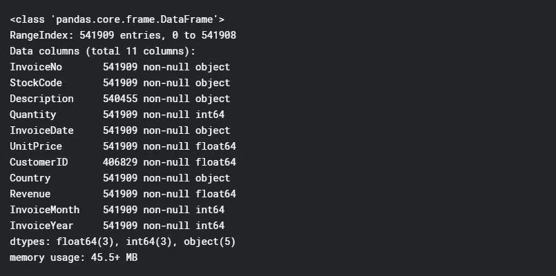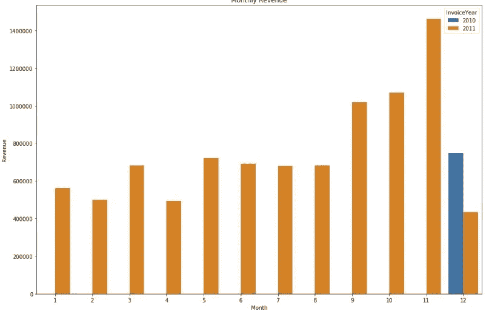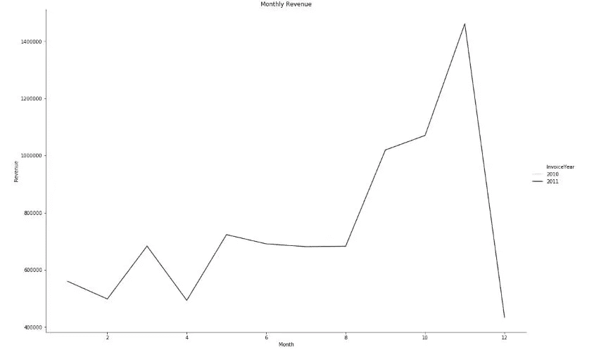

当我们查看月度收入增长时，我们意识到我们的数据集从 2010 年 12 月开始，一直到 2011 年 12 月。我们注意到收入在 2011 年 12 月左右下滑。我们需要了解这是由于客户没有购买我们的商品，还是与数据集中的问题有关。

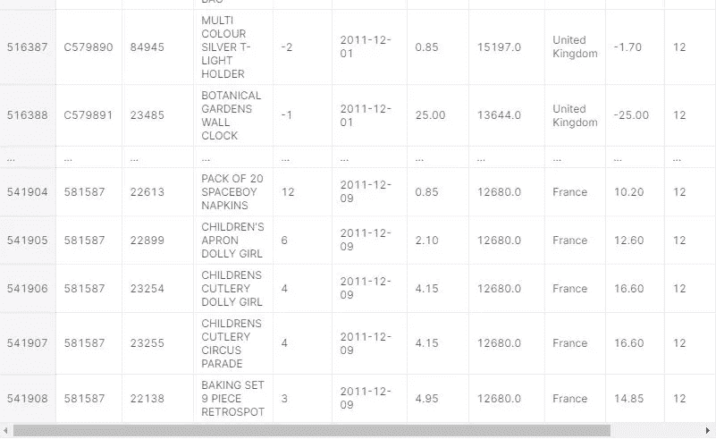

根据 2011 年 12 月的数据，我们了解到该数据集不包括 2011 年 12 月 9 日之后的任何购买。我们需要确保在我们的分析和结论中考虑到这一点。

单独说明；我们可以看到，从 2011 年 9 月到 2011 年 12 月，收入稳步增长，11 月是收入最好的月份。

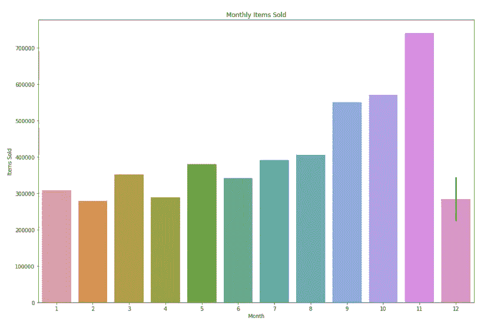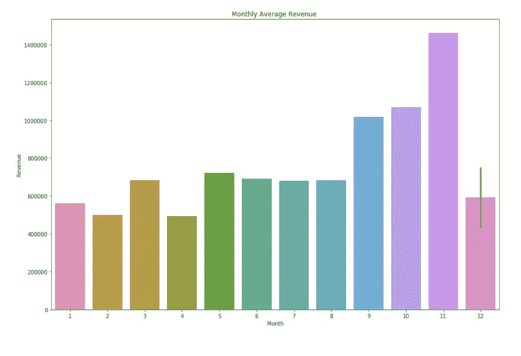

正如预期的那样，每月售出的商品、每月活跃用户和每月平均收入与每月收入增长呈正相关。

在大多数情况下，除了级别之外，我们看到新客户和现有客户的正收入增长和负收入增长是一致的。然而，当我们查看 2011 年 1 月至 2 月和 10 月至 11 月的收入时，我们发现即使现有客户收入增长，新客户收入却下降了。

# 客户细分

我们根据收入、活动、新客户和现有客户的月收入分析了我们的客户，我们肯定有一些可以采取行动的见解。我们还可以对客户进行细分，以便根据我们正在努力解决的主要业务问题来确定我们的行动目标。

我们将使用 RFM(近期、频率和货币价值)策略来分析和评估每个客户的价值，并相应地进一步细分他们。通过查看最近发生的事情，我们可以了解客户购买的时间、频率以及购买的频率，而货币价值可以让我们了解他们消费的频率。

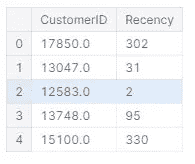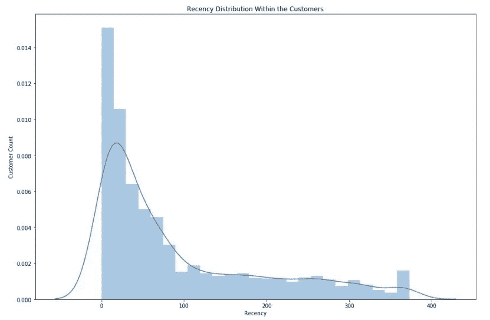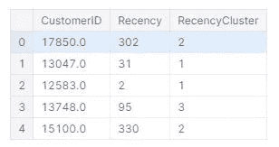

我们将客户分为 4 个不同的类别，从 0 到 4。集群 0 中有 524 个客户，集群 1 中有 2157 个客户，集群 2 中有 632 个客户，集群 3 中有 1059 个客户。当我们比较最近时，聚类 0 是表现最好的客户集，而聚类 1 是表现最差的客户集。

我们可以进一步考察频率，并根据客户的购买频率对他们进行细分。

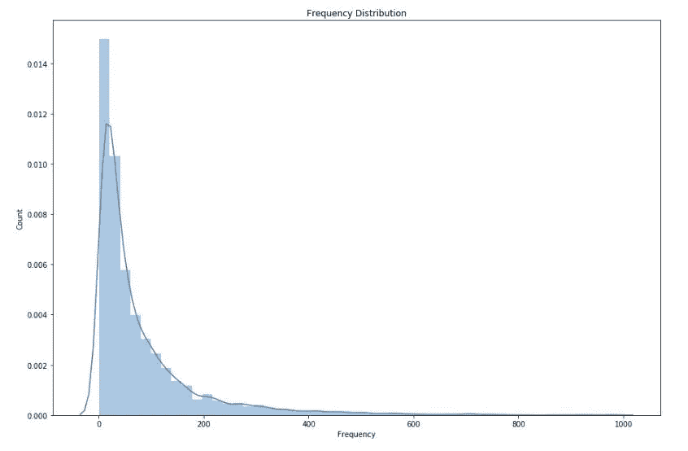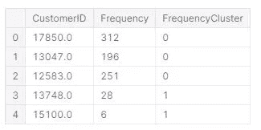

根据频率，分类 0 的客户最多，分类 2 的客户最少。基于这种划分，我们看到聚类 0 的客户频率最低，但客户数量最多。

最后，我们可以根据客户的货币价值对他们进行细分。

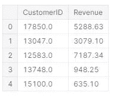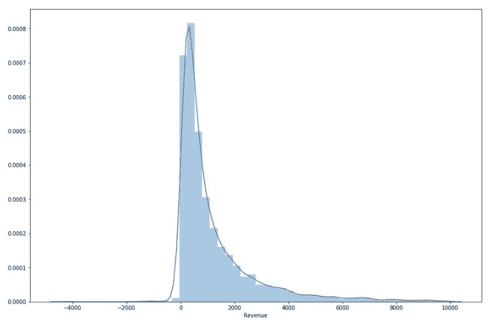

# 结论

通过新近性、频率、货币价值细分和我们对客户的探索性分析，我们可以进一步决定我们产品的购买周期，确定我们营销活动的优先顺序和定义。例如，我们可以查看我们当前的营销活动、库存购买策略和 1 月和 10 月的运营，看看我们是否可以吸引更多的新用户，以便将新用户的负收入增长转变为正收入增长。我们可以调查历史营销活动，以了解它们对每个新近性和频率群集的影响。我们可以进一步将此应用于我们的主要业务目标，以扩大业务规模。我们还可以为 RFM 的每个类别分配 1-10 分。例如，如果客户一年没有购物，他们的最近得分为 1，如果他们在上个月购物，他们的最近得分为 10。我们可以进一步将每个类别的所有分数相加，并为每个聚类创建一个客户价值。这些行动将极大地有助于我们在业务可扩展性方面取得成功。