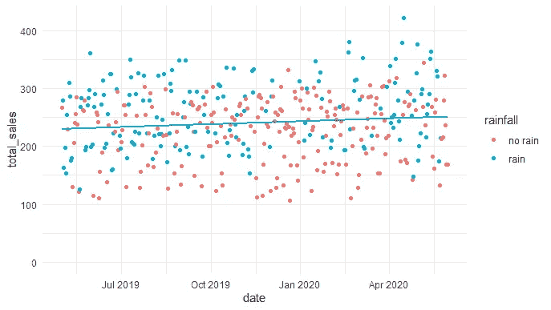
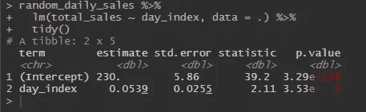
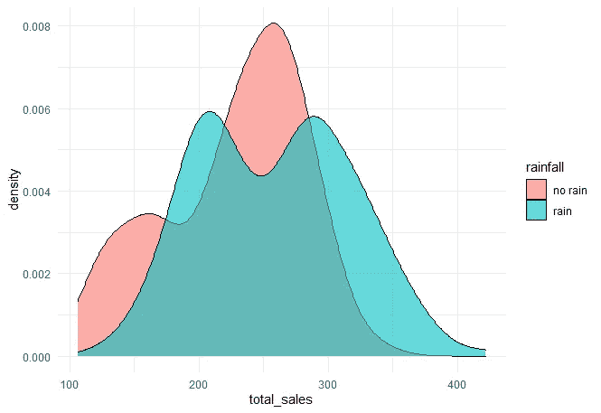
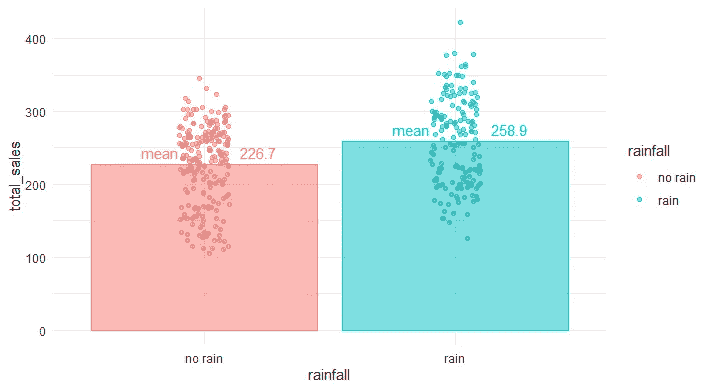
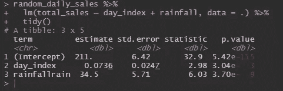
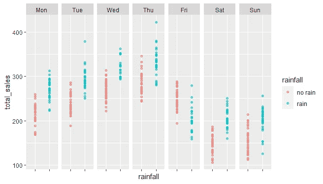
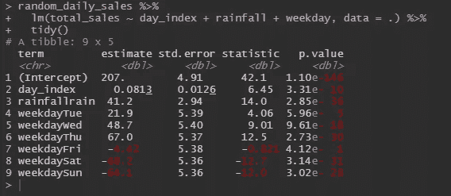
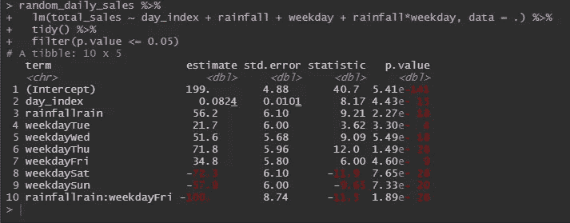

# 零售预测(天气的影响)

> 原文：<https://towardsdatascience.com/retail-sales-forecasting-effect-of-the-weather-3e648e42d378?source=collection_archive---------26----------------------->

## 为您的企业提供一些方便的基于 R 的统计数据

照片由[多尔萨·马斯加蒂](https://unsplash.com/@dorsamasghati?utm_source=unsplash&utm_medium=referral&utm_content=creditCopyText)在 [Unsplash](https://unsplash.com/s/photos/man-selling-rain?utm_source=unsplash&utm_medium=referral&utm_content=creditCopyText) 上拍摄

我最近和一个潜在的零售客户通了电话，他们表示怀疑天气影响了他们的销售。“完全正确，”我想，“人们对不同的天气会有不同的反应。当然可以。”这当然不是他们的主要关注点，更多的是好奇，但我仍然想知道我将如何着手调查这个问题(并通过快速转身产生一个有意义的答案)。

从他们的 POS 上可以很容易地获得汇总的销售数据，每天的天气数据也是可用的，[按位置，从 BOM](http://www.bom.gov.au/climate/dwo/IDCJDW3050.latest.shtml) (每小时会更好，所以我们可以知道天气事件是发生在之前*还是在*工作时间内*——但现在保持事情简单)。*

很明显，这是一个统计学问题，而我这个数学呆子热衷于研究这个问题。但是，当然，在我们去那里之前，我必须思考“那又怎么样？”问题:

> *他们在此类调查中的投资会有什么回报？
> 这一知识能为哪些业务行动提供信息？*

也许意识到他们可能会忙一天，可以让他们安排一个额外的员工。相反，在一个安静的日子里，他们可能会在展示中少放一些易腐的“小玩意”。

天气的影响(我们现在主要关注降雨)只是他们对导致销售波动的原因的更广泛理解的一个方面。每一个“位”信息，指导他们的业务优化，减少“惊喜”。这个特定“位”的*即时*值实际上取决于所发现的效应大小。因此，快速，低预算的调查将是出路。

我继续进行并生成了一些虚拟数据，供我们进行一个假想的(但仍然真实的)调查。

让我们首先保持我们的焦点非常简单。在下图中，每一天都是一个点。

“最佳拟合线”显示出非常轻微的上升趋势。我们可以通过统计来确定这一趋势。

在一年的时间里，平均日销售额增加了 20 (0.0539 * 365 = 19.6)。好样的。

但这种上升趋势可能只是因为有或多或少的雨天(以及对客户的相应影响)，而不是你所有的辛勤工作！

在上图中，很难说雨天和非雨天是否有明显的区别。在下面的图表中，多雨的分布似乎稍微向右移动了一点(表明更多的销售)。

下图向我们展示了差异确实存在。

一般来说，雨天更有利于销售。我们可以通过另一个简单的回归来检测这是否具有“统计显著性”。

是的(p.value < 0.05).

If we were going to guess the number of sales, our results would certainly be more accurate if we included our rainy day feature. The trend (from the day_index) has also stayed significant -so we can say that the increasing trend is independent of the rate of rainy days.

It looks like rain adds 34.5 extra sales to a day. We could bring in the standard error measurement to qualify that statement a bit, by saying that, *大部分时间* (~95%的时间)，下雨会给一天增加 23 到 45 的额外销售额(34 +/- 1.96*5.71)。

但是这种“额外的降雨”可能会被其他一些我们已经知道的因素减轻，比如一周中的某一天。

我们可以看到一个非常一致的模式。每一天都有不同的表现；而且，在这些天里，我们可以看到更高值的雨天。除了星期五。

下面的回归向我们展示了影响。

对于这些数字，我们的基本估计是一个不下雨的星期一(在我们时间线的开始)。我们可以看到，即使给定了一周中的某一天以及我们在时间轴上走了多远，雨仍然会产生“显著”的影响。

> *周二的销售额通常比周一多 21.9 倍。
> 周三通常比周一多 48.7 英镑，等等……
> ……无论哪一天下雨，通常都会增加 41.2 英镑的额外销售额。*

所以现在，我们对下雨影响的猜测从 34.5 变成了 41.2 额外销售。

但是上面的模型没有考虑到这样一个事实:星期五**，下雨有不同的影响。我们需要添加一个工作日/雨天的“互动”。**

****

**这里我们可以看到模型中的重要术语。**

**星期几系数略有变化。我们可以看到 rain 现在为任何一天增加了 56.2 的销售额。**周五**除外，周五导致销售额下降约 43.8(56.2–100)。**

**太棒了。**

**所以，这代表了我可以舒服地向客户展示的复杂程度。这也代表了“虚拟”销售数据中的全部效果(因为是我自己在编写数据时放进去的)。**

**还有更复杂的模型和更有趣的“特征”有待研究:**

*   **降雨量(或*何时*下雨)有影响吗？**
*   **连续几天下雨有影响吗？**
*   **忙碌的一天会影响第二天的销售吗？**

**此外，还有要问的“如果”问题，例如“如果我们在雨天叫一个额外的员工怎么办？这有什么影响？”**

**简单模型的好处是，你可以非常快速和(相对)容易地对你正在处理的效果大小有一个清晰的认识。**

**从那里，更容易确定增加调查是否可能导致更有利可图的商业决策，从而值得额外的投资。**

**通常，业务的其他方面也需要类似的基本可见性。**

**对于那些好奇的人，我的代码可以在下面找到。**

** [## 数据分析/天气对零售的影响

### 通过在 GitHub 上创建一个帐户，为 Tadge-Analytics/天气对零售销售的影响的发展做出贡献。

github.com](https://github.com/Tadge-Analytics/weather-impact-on-retail-sales)** 

***原载于 2020 年 6 月 27 日 https://tadge-analytics.com.au***。****