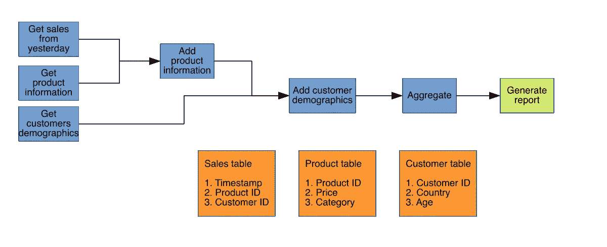
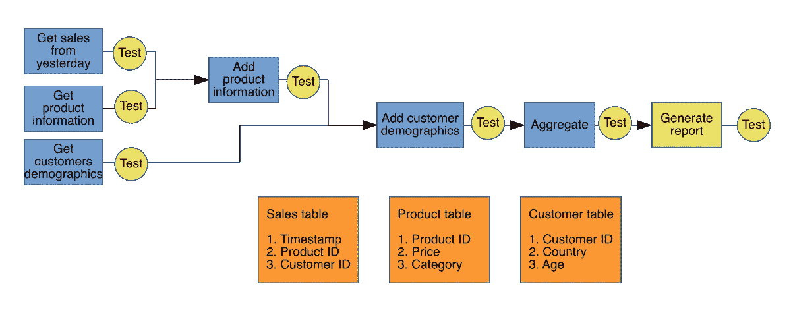
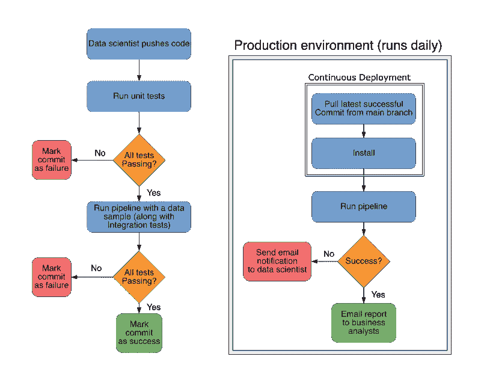
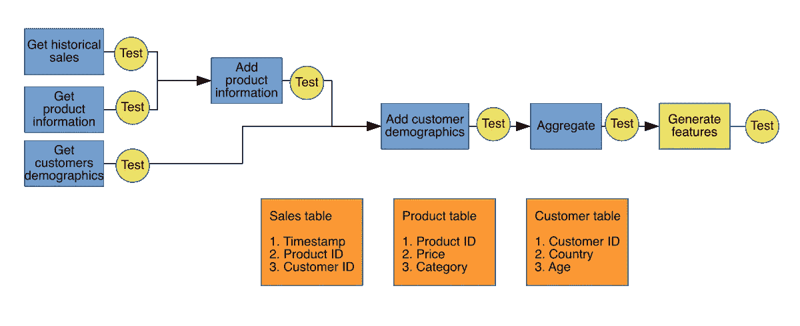

# 重新思考数据科学的持续集成

> 原文：<https://towardsdatascience.com/rethinking-continuous-integration-for-data-science-ebf0dfc61788?source=collection_archive---------34----------------------->

## 数据科学软件工程

## 软件工程中广泛使用的实践应该在我们的领域中有自己的风格

照片由[扬西·敏](https://unsplash.com/@yancymin?utm_source=medium&utm_medium=referral)在 [Unsplash](https://unsplash.com?utm_source=medium&utm_medium=referral) 上拍摄

# 前奏:数据科学中的软件开发实践

随着数据科学和机器学习得到更广泛的行业采用，从业者意识到部署数据产品会带来高昂的(往往是意想不到的)维护成本。正如[斯卡利和合著者](https://papers.nips.cc/paper/5656-hidden-technical-debt-in-machine-learning-systems.pdf)在他们著名的论文中所说:

> *(ML 系统)具有传统代码的所有维护问题，外加一组 ML 特有的问题。*

矛盾的是，尽管数据密集型系统比传统的软件系统有更高的维护成本，但是软件工程的最佳实践却常常被忽视。根据我与其他数据科学家的交谈，我认为这种做法被忽略了，主要是因为它们被视为不必要的额外工作，原因是动机不正确。

数据项目的最终目标是影响业务，但是这种影响在开发过程中很难评估。仪表板会产生多大的影响？预测模型的影响如何？如果产品尚未投入生产，则很难估计业务影响，我们不得不求助于代理指标:对于决策工具，业务利益相关者可能会主观判断新的仪表板在多大程度上可以帮助他们改善决策，对于预测模型，我们可以根据模型的性能进行粗略估计。

这导致工具(例如仪表板或模型)被视为数据管道中唯一有价值的部分，因为它是代理指标所依据的。结果，大部分时间和精力都花在了尝试改进这个最终的可交付成果上，而所有之前的中间步骤得到的关注较少。

如果项目进入生产阶段，根据整体的代码质量，团队可能需要重构大量的代码库以准备投入生产。这种重构的范围可以从做小的改进到彻底的检修，项目经历的变化越多，就越难重现最初的结果。所有这些都可能严重推迟或危及发射。

一个更好的方法是始终让我们的代码随时(或几乎随时)准备好部署。这需要一个工作流来确保我们的代码得到测试，并且结果总是可重复的。这个概念被称为持续集成，是软件工程中广泛采用的实践。这篇博文介绍了一个经过修改的 CI 过程，它可以通过现有的开源工具有效地应用于数据项目。

# 摘要

1.  将您的管道组织成几个任务，每个任务将中间结果保存到磁盘
2.  以可以参数化的方式实现管道
3.  第一个参数应该对原始数据进行采样，以便进行快速的端到端测试
4.  第二个参数应该改变工件的位置，以分离测试和生产环境
5.  在每次推送时，CI 服务都会运行单元测试来验证每个任务内部的逻辑
6.  然后使用数据样本执行流水线，集成测试验证中间结果的完整性

# 什么是持续集成？

持续集成(CI)是一种软件开发实践，在这种实践中，小的变化被持续地集成到项目的代码库中。每一项变更都会被自动测试，以确保项目在生产环境中按照最终用户的预期运行。

为了对比传统软件和数据项目之间的差异，我们比较了两个用例:一个在电子商务网站上工作的软件工程师和一个开发数据管道的数据科学家，该管道输出每日销售额报告。

在电子商务门户用例中，生产环境是实时网站，最终用户是使用它的人；在数据管道用例中，生产环境是运行日常管道以生成报告的服务器，而最终用户是使用报告为决策提供信息的业务分析师。

我们将数据管道定义为一系列有序的任务，其输入是原始数据集，中间任务生成转换后的数据集(保存到磁盘)，最终任务产生数据产品，在这种情况下，是具有每日销售额的报告(但这也可以是其他东西，如机器学习模型)。下图显示了我们的每日报告管道示例:

作者图片

每个蓝色块代表一个管道任务，绿色块代表一个生成最终报告的脚本。橙色块包含原始源的模式。每个任务生成一个产品:蓝色块生成数据文件(但也可以是数据库中的表/视图)，而绿色块生成带有图表和表格的报告。

# 数据科学的持续集成:理想的工作流

正如我在序言中提到的，数据管道中的最后一个任务通常是最受关注的(例如，机器学习管道中的训练模型)。毫不奇怪，现有的关于数据科学/机器学习的 CI 的文章也关注这一点；但是为了有效地应用 CI 框架，我们必须考虑整个计算链:从获取原始数据到交付数据产品。不承认数据管道具有更丰富的结构，会导致数据科学家过于关注最末端，而忽略其余任务中的代码质量。

根据我的经验，大多数错误都是在这个过程中产生的，更糟糕的是，在许多情况下，错误不会破坏管道，但会污染您的数据并损害您的结果。每一步都应该同等重要。

让我们通过描述提议的工作流来使事情更加具体:

1.  数据科学家推动代码变更(例如，修改管道中的一个任务)
2.  推送触发 CI 服务端到端地运行管道，并测试每个生成的工件(例如，一个测试可以验证`customers`表中的所有行都具有非空的`customer_id`值)
3.  如果测试通过，接下来是代码审查
4.  如果审阅者批准了更改，则合并代码
5.  每天早上，“生产”管道(主分支中的最新提交)端到端运行，并将报告发送给业务分析师

这种工作流程有两个主要优点:

1.  早期缺陷检测:缺陷是在开发阶段检测到的，而不是在生产阶段
2.  总是生产就绪:由于我们要求代码更改在集成到主分支之前通过所有测试，我们确保我们可以通过在主分支中部署最新的提交来持续部署我们最新的稳定特性

这个工作流程就是软件工程师在传统软件项目中所做的。我称之为理想的工作流程，因为如果我们能够在合理的时间内完成端到端的管道运行，我们就会这么做。由于数据规模的原因，这对于很多项目来说是不正确的:如果我们的管道需要几个小时来端到端地运行，那么每次我们做一个小的改变时都运行它是不可行的。这就是为什么我们不能简单地将标准 CI 工作流(步骤 1 至 4)应用于数据科学。我们将做一些改变，使它对于运行时间是一个挑战的项目是可行的。

# 软件测试

CI 允许开发人员通过运行自动化测试来持续集成代码变更:如果任何测试失败，提交将被拒绝。这确保了我们在主分支中总是有一个工作项目。

传统的软件是在小的、很大程度上独立的模块中开发的。这种分离是很自然的，因为组件之间有明确的界限(例如注册、计费、通知等)。回到电子商务网站用例，工程师的待办事项列表可能是这样的:

1.  人们可以使用电子邮件和密码创建新账户
2.  可以通过向注册的电子邮件发送消息来找回密码
3.  用户可以使用以前保存的凭据登录

一旦工程师编写了支持这种功能的代码([甚至更早！](https://en.wikipedia.org/wiki/Test-driven_development))，他/她将通过编写一些测试来确保代码工作，这些测试将执行被测试的代码并检查它是否如预期的那样运行:

但是单元测试不是唯一的测试类型，我们将在下一节看到。

# 测试级别

软件测试有[四个级别](https://en.wikipedia.org/wiki/Software_testing#Testing_levels)。理解这些差异对于为我们的项目开发有效的测试是很重要的。在这篇文章中，我们将关注前两个。

## 单元测试

我在上一节中展示的代码片段被称为单元测试。单元测试验证单个*单元*工作。对于*单元*没有严格的定义，但是它通常等同于调用一个单独的过程，在我们的例子中，我们正在测试`create_account`过程。

单元测试在传统的软件项目中是有效的，因为模块被设计成在很大程度上相互独立；通过分别对它们进行单元测试，我们可以快速查明错误。有时，新的变化破坏测试不是因为变化本身，而是因为它们有副作用，如果模块是独立的，它给我们保证我们应该在模块的范围内寻找错误。

拥有过程的效用在于，我们可以通过使用输入参数定制它们的行为来重用它们。我们的`create_account`函数的输入空间是所有可能的电子邮件地址和所有可能的密码的组合。组合的数量是无限的，但是可以合理地说，如果我们针对有代表性的数量的情况来测试我们的代码，我们就可以得出结论，这个过程是可行的(如果我们发现一个不可行的情况，我们就修正代码并添加一个新的测试用例)。在实践中，这归结为针对一组代表性案例和已知边缘案例的测试过程。

假设测试以自动化的方式运行，我们需要一个通过/失败的标准。在软件工程术语中，这被称为[测试 oracle](https://en.wikipedia.org/wiki/Test_oracle) 。提出好的测试预言对测试来说是必不可少的:测试在评估正确结果的程度上是有用的。

## 集成测试

第二个测试级别是集成测试。单元测试有点简单，因为它们独立地测试单元，这种简化对效率是有用的，因为不需要启动整个系统来测试它的一小部分。

但是当输入和输出跨越模块边界时，有时会出现错误。尽管我们的模块在很大程度上是独立的，但它们仍然必须在某个点上相互交互(例如，计费模块必须与通知模块对话才能发送收据)。为了在这个交互过程中捕捉潜在的错误，我们使用集成测试。

编写集成测试比编写单元测试更复杂，因为需要考虑更多的元素。这就是为什么传统的软件系统被设计成松散耦合的 T2，通过限制交互的数量和避免跨模块的副作用。正如我们将在下一节中看到的，集成测试对于测试数据项目是必不可少的。

# 有效测试

编写测试本身就是一门艺术，测试的目的是在开发过程中尽可能多地捕捉错误，这样它们就不会出现在产品中。在某种程度上，测试是模拟用户的行为，并检查系统是否如预期的那样运行，因此，有效的测试是模拟现实场景并适当评估系统是否做了正确的事情。

**有效的测试应该满足四个要求:**

*1。当用户与系统交互时，系统的模拟状态必须代表系统*

测试的目标是防止生产中的错误，所以我们必须尽可能接近地表现系统状态。尽管我们的电子商务网站可能有几十个模块(用户注册、账单、产品列表、客户支持等)，但它们被设计成尽可能独立，这使得模拟我们的系统更容易。我们可以说，当新用户注册时，有一个虚拟数据库就足以模拟系统，任何其他模块的存在或不存在都不会对被测试的模块产生影响。组件之间的交互越多，就越难在生产中测试真实的场景。

*2。输入数据代表真实的用户输入*

当测试一个过程时，我们想知道给定一个输入，这个过程是否做了它应该做的事情。由于我们不能运行每一个可能的输入，我们必须考虑足够多的情况来代表常规操作以及可能的边缘情况(例如，如果用户使用无效的电子邮件地址注册会发生什么)。为了测试我们的`create_account`过程，我们应该传递一些常规的电子邮件帐户和一些无效的帐户，并验证是否创建了帐户或显示了适当的错误消息。

*3。适当的测试甲骨文*

正如我们在上一节中提到的，测试 oracle 是我们的通过/失败标准。要测试的程序越简单越小，就越容易想出一个。如果我们没有测试出正确的结果，我们的测试就没有用。我们对`create_account`的测试意味着检查数据库中的 users 表是评估我们函数的一种合适的方式。

*4。合理运行时间*

测试运行时，开发人员必须等待结果返回。如果测试很慢，我们将不得不等待很长时间，这可能会导致开发人员完全忽略 CI 系统。这会导致代码变更越来越多，使得调试更加困难(当我们更改 5 行代码时，比更改 100 行代码时更容易发现错误)。

# 数据管道的有效测试

在前面的章节中，我们描述了软件测试的前两个层次以及有效测试的四个属性。本节讨论了如何将测试技术从传统的软件开发应用到数据项目中。

## 数据管道的单元测试

与传统软件中的模块不同，我们的流水线任务(图中的块)不是独立的，它们有一个逻辑执行。为了准确地表示我们系统的状态，我们必须尊重这样的顺序。因为一个任务的输入依赖于上游依赖项的输出，所以错误的根本原因可能在失败的任务中，也可能在任何上游任务中。这对我们没有好处，因为它增加了搜索 bug 的潜在位置的数量，在更小的过程中抽象逻辑并对它们进行单元测试有助于减少这个问题。

假设我们的任务`add_product_information`在加入产品销售之前执行一些数据清理:

我们将清理逻辑抽象为两个子过程`clean.fix_timestamps`和`clean.remove_discontinued`，任何子过程中的错误都会传播到输出，从而传播到任何下游任务。为了防止这种情况，我们应该添加一些单元测试，单独验证每个子过程的逻辑。

有时，转换数据的管道任务仅由对外部包(例如 pandas)的几个调用组成，几乎没有自定义逻辑。在这种情况下，单元测试不会非常有效。想象您管道中的一个任务如下所示:

假设您已经对清理逻辑进行了单元测试，那么就没有太多关于转换的单元测试了，为这样简单的过程编写单元测试并不是一个很好的时间投资。这就是集成测试的用武之地。

## 数据管道的集成测试

我们的管道传递输入和输出，直到产生最终结果。如果任务输入预期不真实(例如列名)，这个流程可能会中断，此外，每个数据转换都编码了我们对数据做出的某些假设*。集成测试帮助我们验证输出正确地流经管道。*

如果我们想要通过上面显示的转换来测试*组，我们可以运行流水线任务，并使用输出数据来评估我们的期望:*

这四个断言写起来很快，并且清楚地编码了我们的输出期望。现在让我们看看如何详细地编写有效的集成测试。

**系统状态**

正如我们在上一节中提到的，管道任务有依赖关系。为了在我们的测试中准确地表示系统状态，我们必须遵守执行顺序，并在每个任务完成后运行我们的集成测试，让我们修改我们的原始图表来反映这一点:

作者图片

**测试甲骨文**

测试管道任务的挑战是没有唯一正确的答案。当开发一个`create_user`过程时，我们可以说为新用户检查数据库是成功的一个适当的度量，但是清理数据的过程呢？

没有唯一的答案，因为*干净数据*的概念取决于我们项目的具体情况。我们能做的最好的事情就是明确地将我们的输出期望编码为一系列的测试。要避免的常见情况包括分析中的无效观察、空值、重复、意外的列名等。这种期望是集成测试的良好候选，以防止脏数据泄漏到我们的管道中。即使是提取原始数据的任务也应该进行测试，以检测数据变化:列被删除、重命名等。测试原始数据属性有助于我们快速识别源数据何时发生了变化。

即使我们不编写测试，一些更改(如列重命名)也会破坏我们的管道，但显式测试有一个很大的优势:我们可以在正确的位置修复错误，避免多余的修复。想象一下，如果重命名列会破坏两个下游任务，每个任务由不同的同事开发，一旦他们遇到错误，就会试图在代码中重命名列(两个下游任务)，而正确的方法是修复上游任务。

此外，破坏我们管道的错误应该是我们最不担心的，数据管道中最危险的错误是偷偷摸摸的；它们不会破坏您的管道，但会以微妙的方式污染所有下游任务，这可能会严重破坏您的数据分析，甚至推翻您的结论，这是最糟糕的情况。正因为如此，我不能强调将数据期望编码作为任何数据分析项目的一部分有多重要。

管道任务不一定是 Python 过程，它们通常是 SQL 脚本，您应该以同样的方式测试它们。例如，您可以使用以下查询测试某一列中没有空值:

对于输出不是数据集的过程，提出一个测试 oracle 变得更加棘手。数据管道中的常见输出是人类可读的文档(即报告)。虽然技术上可以测试图形输出，如表格或图表，但这需要更多的设置。第一种(通常也是足够好的)方法是对生成可视化输出的输入进行单元测试(例如，测试为绘图而不是实际绘图准备数据的函数)。如果你对试验田感兴趣，点击这里。

**现实输入数据和运行时间**

我们提到过，真实的输入数据对于测试非常重要。在数据项目中，我们已经有了可以在测试中使用的真实数据，但是，传递完整的数据集进行测试是不可行的，因为数据管道有计算开销很大的任务，需要花费很多时间来完成。

为了减少运行时间并保持输入数据的真实性，我们传递了一个数据样本。如何获取样本取决于项目的具体情况。目标是获得一个具有代表性的数据样本，其属性类似于完整的数据集。在我们的例子中，我们可以随机抽取昨天的销售额。然后，如果我们想要测试某些属性(例如，我们的管道正确处理 NAs)，我们可以在随机样本中插入一些 NAs，或者使用另一种采样方法，例如[分层采样](https://en.wikipedia.org/wiki/Stratified_sampling)。采样只需要发生在提取原始数据的任务中，下游任务将只处理来自上游依赖项的任何输出。

仅在测试期间启用采样。确保您的管道被设计为容易关闭该设置，并保持生成的工件(测试与生产)被清楚地标记:

上面的代码片段假设我们可以将管道表示为“管道对象”,并使用参数调用它。这是一个非常强大的抽象，使您的管道可以灵活地在不同的设置下执行。任务成功执行后，您应该运行相应的集成测试。例如，假设我们想要测试我们的`add_product_information`过程，一旦这样的任务完成，我们的管道应该调用下面的函数:

请注意，我们将数据的路径作为参数传递给函数，这将允许我们轻松地切换加载数据的路径。这对于避免管道运行相互干扰非常重要。例如，如果你有几个 git 分支，你可以在一个名为`/data/{branch-name}`的文件夹中按分支组织工件；如果您与同事共享一个服务器，每个人都可以将其工件保存到`/data/{username}`。

如果您正在使用 SQL 脚本，您可以应用相同的测试模式:

除了采样，我们还可以通过并行运行任务来进一步加速测试。尽管我们能做的并行化是有限的，这是由流水线结构决定的:我们不能运行一个任务，直到它们的上游依赖完成。

我们的库 [Ploomber](https://github.com/ploomber/ploomber) 支持参数化管道和任务执行时执行测试。

# 数据科学中的测试权衡

数据项目比传统软件有更多的不确定性。有时候我们甚至不知道这个项目在技术上是否可行，所以我们必须投入一些时间来给出答案。这种不确定性不利于好的软件实践:因为我们想要减少不确定性来估计项目的影响，好的软件实践(比如测试)可能不会被认为是*实际的进展*而被忽视。

我的建议是随着你的进步不断增加测试。在早期阶段，关注集成测试是很重要的，因为它们可以快速实现并且非常有效。数据转换中最常见的错误很容易使用简单的断言检测出来:检查 id 是否唯一、没有重复、没有空值、列是否在预期的范围内。你会惊讶地发现，用几行代码就能发现多少错误。一旦你看了数据，这些错误是显而易见的，但甚至可能不会破坏你的管道，它们只会产生错误的结果，集成测试防止了这一点。

第二，尽可能利用现成的软件包，尤其是对于高度复杂的数据转换或算法；但是要注意质量，喜欢维护包，即使它们不能提供最先进的性能。第三方软件包自带测试，可以减少您的工作量。

也可能有不太重要或者很难测试的部分。绘图过程是一个常见的例子:除非您正在生成一个高度定制的绘图，否则测试一个只调用 matplotlib 并稍微定制 axis 的小绘图函数没有什么好处。重点测试进入绘图功能的输入。

随着项目的成熟，您可以开始专注于增加您的测试覆盖范围并支付一些技术债务。

# 调试数据管道

当测试失败时，就是调试的时候了。我们的第一道防线是日志记录:无论何时运行管道，我们都应该生成一组相关的日志记录供我们查看。我建议您看看 Python 标准库中的`[logging](https://docs.python.org/3/library/logging.html)` [模块，它为此提供了一个灵活的框架(不要使用`print`进行日志记录)，一个好的做法是保存一个文件，其中包含每次管道运行的日志。](https://docs.python.org/3/library/logging.html)

虽然日志可以提示您问题出在哪里，但是设计易于调试的管道是至关重要的。让我们回忆一下我们对数据管道的定义:

> *输入为原始数据集的一系列有序任务，中间任务生成转换数据集(保存* ***到磁盘*** *)，最终任务生成数据产品。*

将所有中间结果保存在内存中肯定更快，因为磁盘操作比内存慢。但是，将结果保存到磁盘会使调试更加容易。如果我们不将中间结果保存到磁盘，调试意味着我们必须再次重新执行我们的管道来复制错误条件，如果我们保留中间结果，我们只需重新加载失败任务的上游依赖项。让我们看看如何使用标准库中的 [Python 调试器](https://docs.python.org/3/library/pdb.html)来调试我们的`add_product_information`过程:

由于我们的任务是相互隔离的，只通过输入和输出进行交互，所以我们可以很容易地复制错误条件。只需确保您向函数传递了正确的输入参数。如果您使用 [Ploomber 的调试功能，您可以很容易地应用这个工作流程。](https://ploomber.readthedocs.io/en/stable/guide/debugging.html)

调试 SQL 脚本更加困难，因为我们没有 Python 中的调试器。我的建议是将您的 SQL 脚本保持在一个合理的大小:一旦一个 SQL 脚本变得太大，您应该考虑将它分成两个独立的任务。使用`WITH`组织您的 SQL 代码有助于提高可读性，并且可以帮助您调试复杂的语句:

如果您在这样组织的 SQL 脚本中发现一个错误，您可以将最后一个`SELECT`语句替换为类似`SELECT * FROM customers_subset`的语句，以查看中间结果。

# 在生产中运行集成测试

在传统的软件中，测试只在开发环境中运行，它假设如果一段代码进入生产环境，它一定已经被测试并正常工作。

对于数据管道，集成测试是管道本身的一部分，由您决定是否执行它们。这里起作用的两个变量是响应时间和最终用户。如果运行频率很低(例如，每天执行的管道)并且最终用户是内部的(例如，业务分析师)，您应该考虑将测试保持在生产中。机器学习训练管道也遵循这种模式，它的运行频率很低，因为它是按需执行的(每当你想训练一个模型时)，最终用户是你和团队中的任何其他人。这一点很重要，因为我们最初是用数据样本运行测试的，如果我们的采样方法没有捕捉到数据中的某些属性，那么用整个数据集运行测试可能会得到不同的结果。

另一个常见的(通常不可预见的)场景是数据更改。让您自己了解上游数据的计划变更(例如，迁移到不同的仓库平台)是很重要的，但是在您通过管道传递新数据之前，您仍然有机会发现数据变更。在最好的情况下，您的管道将引发一个您能够检测到的异常，在最坏的情况下，您的管道将正常执行，但输出将包含错误的结果。因此，保持您的集成测试在生产环境中运行是非常重要的。

底线:如果你可以允许一个管道延迟它的最终输出(例如每日销售报告)，保持测试在生产中，并确保你被适当地通知，最简单的解决方案是让你的管道给你发一封电子邮件。

对于需要经常快速输出的管道(如 API)，您可以改变策略。对于非关键错误，您可以记录而不是引发异常，但是对于关键情况，如果您知道失败的测试会阻止您返回适当的结果(例如，用户为“年龄”列输入了负值)，您应该返回一条信息性的错误消息。处理生产中的错误是*模型监控*的一部分，我们将在接下来的帖子中介绍。

# 重新审视工作流程

作者图片

我们现在根据前面章节的观察重新审视工作流。在每次推送时，首先运行单元测试，然后使用数据样本执行管道，在每次任务执行时，运行集成测试来验证每个输出，如果所有测试都通过，则提交被标记为成功。CI 流程到此结束，应该只需要几分钟。

假设我们持续测试每个代码变更，我们应该能够随时部署。这种持续部署软件的想法被称为[持续部署](https://en.wikipedia.org/wiki/Continuous_deployment)，它值得一个专门的帖子，但这里是摘要。

因为我们需要生成每日报告，所以管道每天早上运行。第一步是(从存储库或工件存储中)提取可用的最新稳定版本，并将其安装在生产服务器中，对每个成功的任务运行集成测试，以检查数据预期，如果这些测试中的任何一个失败，将发送通知。如果一切顺利，管道会将报告通过电子邮件发送给业务分析师。

# 实施细节

本节提供了使用现有工具实施 CI 工作流的一般指南和资源。

**单元测试**

为了在每个数据管道任务中单元测试逻辑，我们可以利用现有的工具。我强烈推荐使用 [pytest](https://docs.pytest.org/en/stable/) 。它对基本用法的学习曲线很小；随着你对它越来越熟悉，我建议你探索它的更多特性(例如[夹具](https://docs.pytest.org/en/stable/fixture.html#fixture))。成为任何测试框架的超级用户都有很大的好处，因为您将投入更少的时间来编写测试，并最大限度地提高它们捕捉 bug 的效率。坚持练习，直到编写测试成为编写任何实际代码之前的第一步。这种首先编写测试的技术被称为[测试驱动开发(TDD)](https://en.wikipedia.org/wiki/Test-driven_development) 。

**运行集成测试**

集成测试有更多的工具需求，因为它们需要考虑数据管道结构(按顺序运行任务)、参数化(用于采样)和测试执行(在每个任务之后运行测试)。最近工作流管理工具激增，在某种程度上有助于做到这一点。

我们的库 [Ploomber](https://github.com/ploomber/ploomber) 支持实现该工作流所需的所有特性:将您的管道表示为 [DAG](https://en.wikipedia.org/wiki/Directed_acyclic_graph) ，分离开发/测试/生产环境，参数化管道，在任务执行时运行测试功能，与 Python 调试器集成，以及其他特性。

**外部系统**

许多简单到中等复杂的数据应用程序是在单个服务器上开发的:第一个管道任务从仓库中转储原始数据，所有下游任务将中间结果输出为本地文件(例如 parquet 或 csv 文件)。这种架构允许在不同的系统中轻松地包含和执行管道:要在本地测试，只需运行管道并将工件保存在您选择的文件夹中，要在 CI 服务器中运行管道，只需复制源代码并在那里执行管道，不依赖于任何外部系统。

然而，对于数据规模是一个挑战的情况，管道可能只是作为一个执行协调器，几乎不做任何实际的计算，例如一个纯粹的 SQL 管道，它只向分析数据库发送 SQL 脚本并等待完成。

当执行依赖于外部系统时，实现 CI 会更加困难，因为您依赖于另一个系统来执行您的管道。在传统的软件项目中，这是通过创建[模拟](https://en.wikipedia.org/wiki/Mock_object)来解决的，它模仿另一个对象的行为。想想电子商务网站:生产数据库是一个支持所有用户的大型服务器。在开发和测试期间，不需要如此大的系统，一个有一些数据(可能是真实数据甚至是虚假数据的样本)的较小系统就足够了，只要它准确地模仿生产数据库的行为。

这在数据项目中通常是不可能的。如果我们使用一个大的外部服务器来加速计算，我们很可能只有那个系统(例如一个公司范围的 Hadoop 集群),模仿它是不可行的。解决这个问题的一个方法是将管道工件存储在不同的“环境”中。例如，如果您为您的项目使用一个大型的分析数据库，那么将生产工件存储在一个`prod`模式中，将测试工件存储在一个`test`模式中。如果您不能创建模式，您也可以为所有的表和视图添加前缀(例如`prod_customers`和`test_customers`)。参数化管道可以帮助您轻松切换模式/后缀。

**CI 服务器**

为了自动化测试执行，您需要一个 CI 服务器。每当您推送到存储库时，CI 服务器将针对新提交运行测试。有许多选项可用，验证您工作的公司是否已经有 CI 服务。如果没有，您将不会得到自动化的过程，但是您仍然可以通过在每次提交时本地运行您的测试来实现它。

# 扩展:机器学习管道

作者图片

让我们修改之前的每日报告管道，以涵盖一个重要的用例:开发机器学习模型。假设我们现在想要预测下个月的日销售额。我们可以通过获取历史销售额(而不仅仅是昨天的销售额)、生成特征和训练模型来做到这一点。

我们的端到端过程有两个阶段:首先，我们处理数据以生成训练集，然后我们训练模型并选择最佳模型。如果我们在整个过程中对每个任务都遵循同样严格的测试方法，我们将能够从进入我们的模型中捕获脏数据，记住:[垃圾入，垃圾出](https://en.wikipedia.org/wiki/Garbage_in,_garbage_out)。有时，实践者通过尝试许多花哨的模型或复杂的超参数调优模式，过于关注训练任务。虽然这种方法肯定是有价值的，但在数据准备过程中通常会有很多容易实现的结果，这些结果会对我们模型的性能产生重大影响。但是为了最大化这种影响，我们必须确保数据准备阶段是可靠的和可重复的。

数据准备中的错误导致*好得不真实*(即数据泄露)的结果或次优模型；我们的测试应该解决这两种情况。为了防止数据泄漏，我们可以测试训练集中是否存在有问题的列(例如，只有在我们的目标变量可见后才知道其值的列)。为了避免次优性能，验证我们的数据假设的集成测试起着重要作用，但我们可以包括其他测试来检查我们最终数据集中的质量，例如验证我们有跨所有年份的数据，并且被认为不适合训练的数据不会出现。

获取历史数据会增加 CI 的总体运行时间，但数据采样(正如我们在每日报告管道中所做的)会有所帮助。更好的是，您可以缓存数据样本的本地副本，以避免每次运行测试时都提取样本。

为了确保完整的模型再现性，我们应该只使用从自动化过程中生成的工件来训练模型。一旦测试通过，流程可以自动触发完整数据集的端到端管道执行，以生成训练数据。

保留历史工件也有助于模型的可读性，给定一个散列提交，我们应该能够定位生成的训练数据，此外，从同一个提交重新执行管道应该产生相同的结果。

# 模型评估是 CI 工作流程的一部分

我们当前的 CI 工作流使用数据样本测试我们的管道，以确保最终输出适合培训。如果我们也能测试训练程序，那不是很好吗？

回想一下，CI 的目的是允许开发人员迭代地集成小的变更，为了有效，反馈需要快速返回。训练 ML 模型通常需要很长的运行时间；除非我们有办法在几分钟内完成我们的训练程序，否则我们将不得不考虑如何快速测试。

让我们分析两个微妙不同的场景，以了解如何将它们集成到 CI 工作流中。

**测试训练算法**

如果您正在实现自己的训练算法，您应该独立于管道的其余部分来测试您的实现。这些测试验证了您的实现的正确性。

这是任何 ML 框架都会做的事情(scikit-learn，keras 等)。)，因为他们必须确保对当前实现的改进不会破坏它们。在大多数情况下，除非您正在处理一个非常数据饥渴的算法，否则这不会带来运行时间问题，因为您可以用一个合成/玩具数据集对您的实现进行单元测试。这个逻辑同样适用于任何训练预处理程序(比如数据缩放)。

**测试您的培训渠道**

实际上，培训不是一个单一阶段的过程。第一步是加载您的数据，然后您可能会做一些最后的清理，如删除 id 或热编码分类特征。之后，您将数据传递到一个多阶段训练管道，该管道涉及分割、数据预处理(例如标准化、PCA 等)、超参数调整和模型选择。这些步骤中的任何一步都可能出错，尤其是如果您的管道具有高度定制的过程。

测试你的培训渠道是困难的，因为没有明显的测试预言。我的建议是，通过利用现有的实现(scikit-learn 为[这个](https://scikit-learn.org/stable/modules/compose.html)提供了惊人的工具)来减少要测试的代码量，从而尽可能地简化您的管道。

在实践中，我发现相对于之前的结果定义一个测试标准*是很有用的。如果我第一次训练一个模型，我得到的精度是 X，那么我保存这个数字，并把它作为参考。后续实验应在 X 的合理范围*内失败:性能的突然下降或上升会触发警报以手动查看结果。有时这是好消息，这意味着性能正在提高，因为新功能正在工作，但有时这是坏消息:性能的突然提高可能来自信息泄漏，而性能的突然下降可能来自数据处理不当或意外删除行/列。**

为了保持运行时间的可行性，请使用数据样本运行训练管道，并让您的测试将性能与使用相同采样过程获得的指标进行比较。这比听起来更复杂，因为如果你用更少的数据训练，结果差异会增加，这使得得出*合理范围*更具挑战性。

如果上述策略不起作用，您可以尝试在您的 CI 管道中使用一个代理模型，它可以更快地训练和增加您的数据样本大小。例如，如果您正在训练一个神经网络，您可以使用一个更简单的体系结构进行训练，以使训练更快，并增加 CI 中使用的数据样本，以减少 CI 运行中的差异。

# 下一个前沿:数据科学光盘

CI 允许我们在短周期内集成代码，但这并不是故事的结尾。在某些时候，我们必须*部署*我们的项目，这就是[连续交付](https://en.wikipedia.org/wiki/Continuous_delivery)和[连续部署](https://en.wikipedia.org/wiki/Continuous_deployment)的用武之地。

部署的第一步是*发布*我们的项目。发布是指获取所有必要的文件(即源代码、配置文件等)，并将其转换成可用于在生产环境中安装项目的格式。例如，发布一个 Python 包需要将我们的代码上传到 Python 包索引中。

持续交付保证了软件*可以随时*发布，但是部署仍然是一个手动过程(即必须有人在生产环境中执行指令)，换句话说，它只是自动化了发布过程。持续部署包括自动化发布和部署。现在让我们从数据项目的角度来分析这个概念。

对于产生人类可读文档(例如报告)的管道，连续部署是简单的。在 CI 通过之后，另一个过程应该获取所有必要的文件并创建一个可安装的工件，然后，生产环境可以使用这个工件来设置和安装我们的项目。下次管道运行时，它应该使用最新的稳定版本。

另一方面，ML 管道的连续部署要困难得多。管道的输出不是唯一的模型，而是几个候选模型，应该对它们进行比较以部署最佳模型。如果我们已经有了生产中的模型，事情会变得更加复杂，因为没有部署可能是最好的选择(例如，如果新模型没有显著提高预测能力，并且带来了运行时间的增加或更多的数据依赖性)。

一个比预测能力更重要(也更难)评估的属性是[模型公平性](https://en.wikipedia.org/wiki/Fairness_(machine_learning))。必须评估每个新部署是否偏向敏感群体。想出一个自动的方法来评估一个模型的预测能力和公平性是困难和有风险的。如果你想了解更多关于模型公平性的知识，[这是一个很好的起点](https://fairmlbook.org/)。

但是 ML 的持续输送仍然是一个可管理的过程。一旦提交通过了带有数据样本(CI)的所有测试，另一个进程就会运行带有完整数据集的管道，并将最终数据集存储在对象存储中(CD 阶段 1)。

然后，训练过程加载工件，并通过调整每个选定算法的超参数来找到最佳模型。最后，它将最佳模型规范(即算法及其最佳超参数)与评估报告一起序列化(CD 阶段 2)。完成所有工作后，我们查看报告并选择部署模型。

在上一节中，我们讨论了如何在 CI 工作流中包含模型评估。所提出的解决方案受到 CI 运行时间要求的限制；在 CD 过程的第一阶段完成后，我们可以通过使用完整数据集训练最新的最佳模型规范来包含更健壮的解决方案，这将捕获导致性能下降的错误，而不是必须等待第二阶段完成，因为第二阶段具有更长的运行时间。CD 工作流程如下所示:

作者图片

从成功的 CI 运行中触发 CD 可以是手动的，数据科学家可能不希望为每个传递的提交生成数据集，但在给定提交哈希的情况下，应该很容易做到这一点(例如，通过单击或命令)。

允许手动执行第二阶段也很方便，因为数据科学家经常通过定制训练管道使用同一个数据集来运行几个*实验*，因此，单个数据集可能会触发许多训练工作。

在 ML 管道中，实验再现性至关重要。在提交、CI 运行和数据准备运行(CD 阶段 1)之间存在一对一的关系，因此，我们可以通过生成数据集的提交散列来唯一地标识数据集。我们应该能够通过再次运行数据准备步骤并使用相同的训练参数运行训练阶段来重现任何实验。

# 结束语

随着数据科学的 CI/CD 流程开始成熟和标准化，我们将开始看到简化实施的新工具。目前，许多数据科学家甚至不考虑将 CI/CD 作为他们工作流程的一部分。在某些情况下，他们只是不知道，在其他情况下，因为有效地实施 CI/CD 需要一个复杂的重新利用现有工具的设置过程。数据科学家不应该担心设置 CI/CD 服务，他们应该专注于编写代码、测试和推送。

除了专门为数据项目定制的 CI/CD 工具，我们还需要数据管道管理工具来标准化管道开发。在过去的几年里，我看到了很多新项目，不幸的是，其中大多数都专注于调度或扩展等方面，而不是用户体验，如果我们希望模块化和测试等软件工程实践被所有数据科学家接受，这是至关重要的。这就是我们构建 [Ploomber](https://github.com/ploomber/ploomber) 的原因，以帮助数据科学家轻松、渐进地采用更好的开发实践。

缩短 CI-开发人员反馈循环对 CI 的成功至关重要。虽然数据采样是一种有效的方法，但是通过使用增量运行，我们可以做得更好:通过重用先前计算的工件，在管道中更改单个任务应该只触发最少量的工作。Ploomber 已经提供了一些限制，我们正在试验改进这个特性的方法。

我认为 CI 是数据科学软件堆栈中最重要的缺失部分:我们已经有很好的工具来执行 AutoML、一键式模型部署和模型监控。CI 将缩小这个差距，允许团队自信地、持续地训练和部署模型。

为了推进我们的领域，我们必须开始更加关注我们的开发过程。

在这篇文章中发现一个错误？[点击这里让我们知道](https://github.com/ploomber/posts/issues/new?title=Issue%20in%20post%3A%20%22Rethinking%20Continuous%20Integration%20for%20Data%20Science%22)。

最初发布于 [ploomber.io](https://ploomber.io/posts/ci4ds)