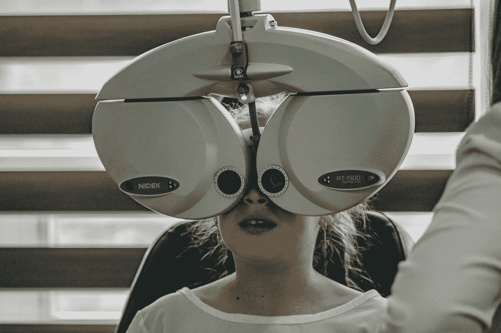
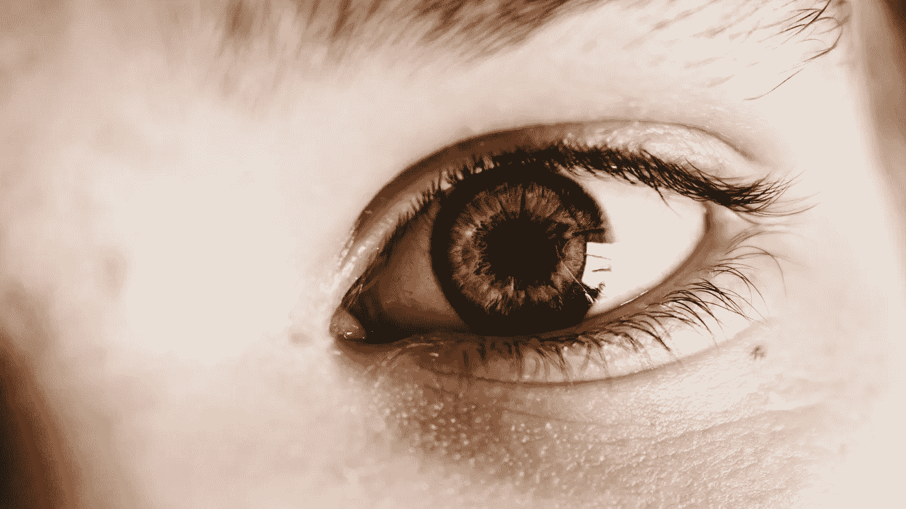

# 视网膜图像具有奇怪的预测性

> 原文：<https://towardsdatascience.com/retinal-images-are-weirdly-predictive-888744b4a153?source=collection_archive---------47----------------------->

## 请密切关注深度学习的这些发展

照片由 [nrd](https://unsplash.com/@nicotitto?utm_source=unsplash&utm_medium=referral&utm_content=creditCopyText) 在 [Unsplash](https://unsplash.com/s/photos/eye-doctor?utm_source=unsplash&utm_medium=referral&utm_content=creditCopyText) 上拍摄

如果你曾经去看过眼科医生，你可能经历过一个常规的程序，专家会给你的眼球后部拍一张照片。

听说视网膜图像对诊断眼疾相当方便，你不会感到惊讶。然而，你可能没有想到，它们还可以提供许多关于一个人患心血管疾病风险的见解。视网膜成像是一种检查某人血管状况的非侵入性方法，这可能预示着此人更广泛的心血管健康状况。

如果你以前见过这些视网膜图像中的一张，你可能会指出视盘和各种血管(如果你没有，请尝试在谷歌上搜索“视网膜图像”——或“眼底”，这是眼睛后部的医学术语)。

医生将能够更进一步，通过识别异常并建议可能需要进一步调查或治疗的特征。

然而，把它喂给一台机器，它就能预测:

*   你多大了；
*   你的性别；
*   你的种族；
*   无论你是否吸烟；甚至
*   那天早上你吃了什么？

好吧，最后一条可能是我编的，但值得注意的是，其余的都是真的。毫无疑问，*视网膜图像有着怪异的预测能力。*

# 眼睛有

谷歌的研究人员在 2017 年写了一篇论文[阐述了一项关于深度学习如何用于从视网膜图像中预测一系列心血管风险因素的调查。论文简要解释了医学发现的更传统的方法:首先观察潜在风险因素和疾病之间的联系和相关性，然后才设计和测试假设。Ryan Poplin 等人接着演示了深度学习架构如何在没有被告知要寻找什么的情况下，自己获取这些关联。](https://arxiv.org/abs/1708.09843)

我相信我们都在某个时候听说过这样的断言，即某些医学专家将被人工智能算法取代，人工智能算法将能够在识别医学图像中的异常方面胜过他们。这项研究将事情引向一个稍微不同的方向——不寻求在现有的任务中胜过医生，而是看看新的信息机器可以从这些特定的图像中收集到什么。

在研究的早期，该团队发现他们的模型非常擅长预测年龄和性别等变量——以至于*他们最初认为这是模型*中的一个错误(Ryan 向我们介绍了该项目是如何在 [TWiML talk 112](https://twimlai.com/twiml-talk-122-predicting-cardiovascular-risk-factors-eye-images-ryan-poplin/) 上开发的)。但是随着他们对事物的深入研究，他们发现这些都是真实的预测。不仅如此，它们也是令人难以置信的强健——例如，年龄可以被成功预测，平均绝对误差为 3.26 年。

发现了许多其他关联，结果表明，该团队可以获得比他们的基线模型更好的预测能力，包括血压、血糖水平甚至种族——所有心血管疾病的风险因素。

观察这些结果后，研究小组推断，如果心血管风险因素的范围可以预测得如此之好，那么该模型甚至可以在识别哪些患者未来最有可能患主要心血管事件(如中风或心脏病发作)时具有预测能力。尽管他们的训练数据存在一些限制，但仅在视网膜图像上训练的模型(因此没有明确给定的风险因素)能够实现 0.70 的 AUC(浏览[本文](/evaluating-classifier-model-performance-6403577c1010?source=friends_link&sk=7e7ae3e38fc734e23b78769c5ee0c10d)的 ROC/AUC 部分，以了解更多关于 AUC 作为性能指标的信息)——这与另一个现有风险评分系统获得的 0.72 相比变得尤其令人印象深刻，该系统利用了更多的输入变量。

# 不仅仅是心灵的窗户

利亚姆·韦尔奇在 [Unsplash](https://unsplash.com/s/photos/eye-doctor?utm_source=unsplash&utm_medium=referral&utm_content=creditCopyText) 上的照片

在前面提到的 TWiML 播客中，Ryan 推测了一种可能的未来，即视网膜图像被用作生命体征，以提供患者整体健康状况的图片，而不仅仅是用于诊断眼部疾病。正如我们所见，这不仅仅是幻想——这种简单的非侵入性程序可以提供比我们之前预期的更广泛的患者健康快照。

总结一下——心血管疾病仍然是全世界死亡的主要原因，但是 [80%的过早心脏病和中风是可以预防的](https://www.euro.who.int/en/health-topics/noncommunicable-diseases/cardiovascular-diseases/data-and-statistics)。像上面讨论的论文这样的研究可以帮助我们更好地了解谁是心血管疾病的高危人群，以及如何最好地管理这些人群——适当的早期干预可以在很大程度上延长和改善人类生活质量。

# 学分和更多信息

**Andrew Hetherington** 是英国伦敦的一名见习精算师和数据爱好者。

*   查看我的[网站](https://www.andrewhetherington.com/)。
*   在 [LinkedIn](https://www.linkedin.com/in/andrewmhetherington/) 上和我联系。
*   看看我在 [GitHub](https://github.com/andrewhetherington/python-projects) 上鼓捣什么。

论文讨论:R. Poplin 等人，“使用深度学习从视网膜眼底照片预测心血管风险因素”，DOI[10.1038/s 41551–018–0195–0](https://arxiv.org/ct?url=https%3A%2F%2Fdx.doi.org%2F10.1038%2Fs41551-018-0195-0&v=45068349)，[https://arxiv.org/abs/1708.09843v2](https://arxiv.org/abs/1708.09843v2)。

[nrd](https://unsplash.com/@nicotitto?utm_source=unsplash&utm_medium=referral&utm_content=creditCopyText) 和 [Liam Welch](https://unsplash.com/@lwxlch?utm_source=unsplash&utm_medium=referral&utm_content=creditCopyText) 在 [Unsplash](https://unsplash.com/) 上的照片。