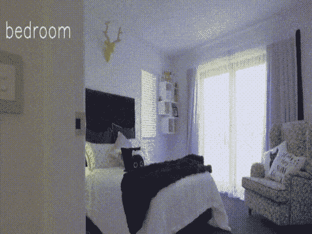
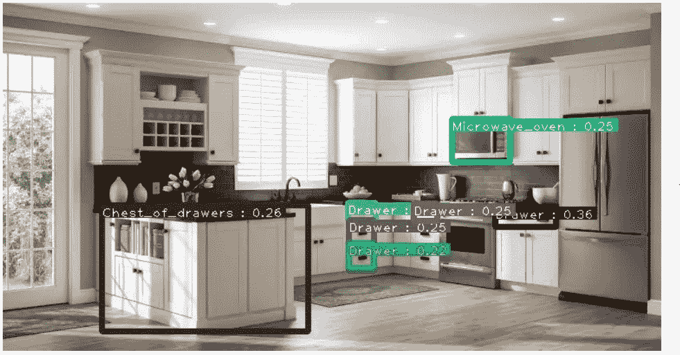
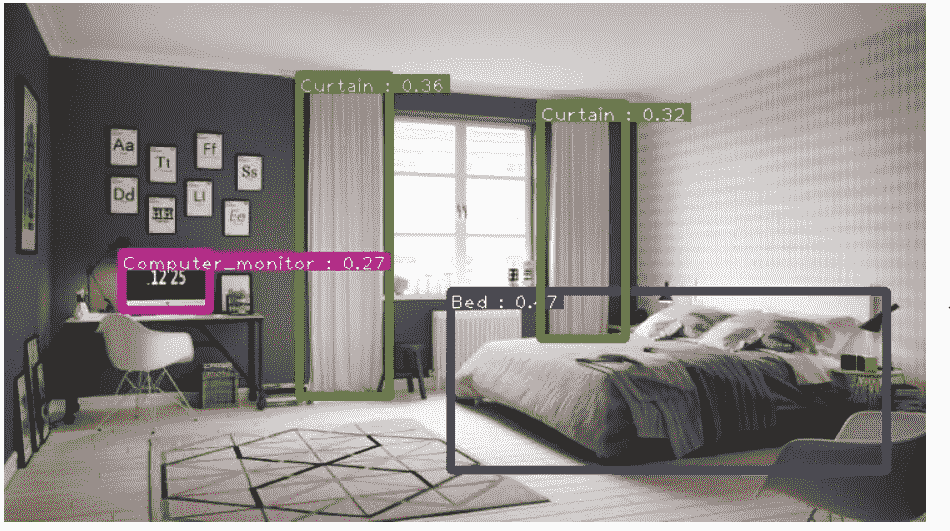
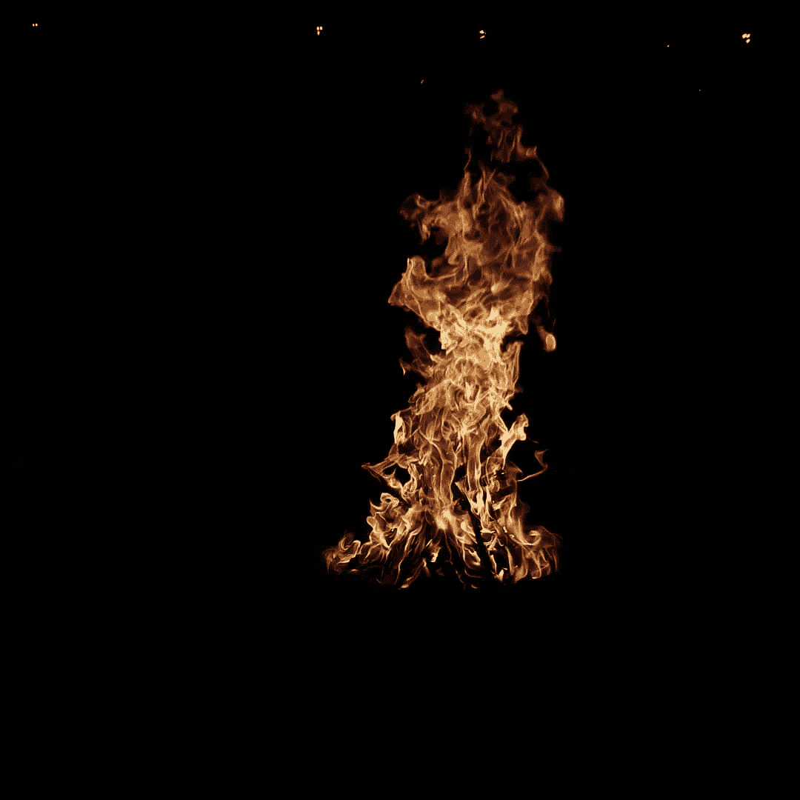

# RetinaNet:用 5 行代码进行自定义对象检测训练

> 原文：<https://towardsdatascience.com/retinanet-custom-object-detection-training-with-5-lines-of-code-37442640d142?source=collection_archive---------17----------------------->

## 使用 Monk，低代码深度学习工具和计算机视觉的统一包装器，使计算机视觉变得简单。



室内物体检测

在[之前的文章](https://medium.com/@akulahemanth/custom-object-detection-using-efficientdet-the-simplest-way-32749fb93359)中，我们已经使用[和尚](https://github.com/Tessellate-Imaging/Monk_Object_Detection)的 EfficientDet 构建了一个自定义的对象检测器。在本文中，我们将使用[和尚](https://github.com/Tessellate-Imaging/Monk_Object_Detection)的 RetinaNet 构建一个室内物体检测器，构建于 [PyTorch RetinaNet](https://github.com/yhenon/pytorch-retinanet) 之上。

如今，从自动驾驶汽车到监控摄像头等等，计算机视觉无处不在。要开始学习计算机视觉，我们必须学习各种深度学习框架，如 TensorFlow、PyTorch 和 Mxnet，这是一个乏味的过程。

借此机会，我想向您介绍一下 [Monk](https://github.com/Tessellate-Imaging/Monk_Object_Detection) ，这是一个功能齐全、低代码、易于安装的对象检测管道。

[](https://github.com/Tessellate-Imaging/Monk_Object_Detection) [## 镶嵌成像/Monk_Object_Detection

### 低代码、易于安装的对象检测管道的一站式存储库。

github.com](https://github.com/Tessellate-Imaging/Monk_Object_Detection) 

> 我们开始吧！！

# **目录**

1.  **数据收集**
2.  **转换为 COCO 格式**
3.  **培训模式**
4.  **检测对象检测器**

# **数据收集**

这里我们使用的是 [OpenImages](https://storage.googleapis.com/openimages/web/index.html) 。使用 [OIDv4_ToolKit](https://github.com/EscVM/OIDv4_ToolKit) 收集数据。我从数据集中选择了 25 个类，你可以随意选择。

用于收集数据的命令示例

```
python main.py downloader --classes Apple Orange --type_csv validation
```

打开命令提示符，运行以下命令从整个数据集中收集 Alarm_clock 类。您可以使用这个过程来下载其他类。

```
$ git clone [https://github.com/EscVM/OIDv4_ToolKit](https://github.com/EscVM/OIDv4_ToolKit)
$ cd OIDv4_ToolKit
$ python main.py downloader --classes Alarm_clock --type_csv train
$ mv OID/Dataset/train/Alarm\ clock OID/Dataset/train/Alarm_clock 
```

您可以使用直接下载格式化的数据集

```
$ wget --load-cookies /tmp/cookies.txt "https://docs.google.com/uc?export=download&confirm=$(wget --save-cookies /tmp/cookies.txt --keep-session-cookies --no-check-certificate 'https://docs.google.com/uc?export=download&id=1bXzK3SYRCoUj9-zsiLOSWM86LJ6z9p0t' -O- | sed -rn 's/.*confirm=([0-9A-Za-z_]+).*/**\1\n**/p')&id=1bXzK3SYRCoUj9-zsiLOSWM86LJ6z9p0t" -O OIDv4_ToolKit.zip && rm -rf /tmp/cookies.txt
```

# **转换为 COCO 格式**

**COCO 格式**

```
./ (root_dir)
      |
      |------Dataset (coco_dir) 
              |
              |------Images (set_dir)
              |         |
              |         |----Alarm_clock
              |                 |
              |                 |---------img1.jpg
              |                 |---------img2.jpg
              |                 |---------..........(and so on)
              |
              |         |-----Curtain
              |                 |
              |                 |---------img1.jpg
              |                 |---------img2.jpg
              |                 |---------..........(and so on)
              |
              |         |-----...........(and so on)
              |
              |
              |
              |------annotations 
              |----------|
                         |--------------------instances_Images.json  (instances_<set_dir>.json)
                         |--------------------classes.txt
```

*   instances_Train.json ->正确的 COCO 格式
*   classes.txt ->按字母顺序排列的类列表

对于列车组

*   root _ dir = " oid v4 _ ToolKit/OID/"；
*   coco _ dir = " Dataset
*   img_dir = "。/";
*   set _ dir = " Images

注意:注释文件名与 set_dir 一致

**我们通过 Monk 格式**转换成 COCO 格式

1.从当前格式转换为 Monk 格式。

2.从 Monk 格式转换为 COCO 格式

运行 classes.txt

对于。“json”文件运行

# **培训模式**

我们选择“resnet50”来进行这个实验。您可以按照代码中的建议设置超参数。如果你使用的是 GPU，那么设置 use_gpu=True，默认为 False。我们使用 4 个 GPU，所以 gpu_devices=[0，1，2，3]。如果您使用的是一个 GPU，请更改 gpu_devices=[0]。用'设置时期数和型号名称。pt '分机。

正如标题中提到的，我们只需要 5 行代码进行训练，这里是 Train.py

# **检测物体探测器**

在训练模型之后，我们可以得到权重文件。加载重量并开始预测。

一些形象的推论，你可以看到:



推论 1



推论 2

你可以在 [Github](https://github.com/Tessellate-Imaging/Monk_Object_Detection/blob/master/application_model_zoo/Example%20-%20Indoor%20Image%20Object%20Detection%20and%20Tagging.ipynb) 上找到完整的代码。如果你喜欢蒙克，给我们 GitHub 回购⭐️。

在这个实验中，我们使用 Retinanet 创建了一个自定义对象检测，只需要基本的编程技能，甚至不需要了解架构和 PyTorch 框架。

有关自定义对象检测的更多示例，请查看

[](https://github.com/Tessellate-Imaging/Monk_Object_Detection/tree/master/example_notebooks) [## 镶嵌成像/Monk_Object_Detection

github.com](https://github.com/Tessellate-Imaging/Monk_Object_Detection/tree/master/example_notebooks) 

有问题可以联系 [Abhishek](https://www.linkedin.com/in/abhishek-kumar-annamraju/) 和 [Akash](https://www.linkedin.com/in/akashdeepsingh01/) 。请随意联系他们。

我对计算机视觉和深度学习充满热情。我是 [Monk](https://github.com/Tessellate-Imaging/Monk_Object_Detection) 库的开源贡献者。

你也可以在以下网址看到我的其他作品:

[](https://medium.com/@akulahemanth) [## 阿库拉·赫曼思·库马尔培养基

### 阅读阿库拉·赫曼思·库马尔在媒介上的作品。计算机视觉爱好者。每天，阿库拉·赫曼思·库马尔和…

medium.com](https://medium.com/@akulahemanth) 

照片由 [Srilekha](https://www.instagram.com/_fernwehd_._/) 拍摄