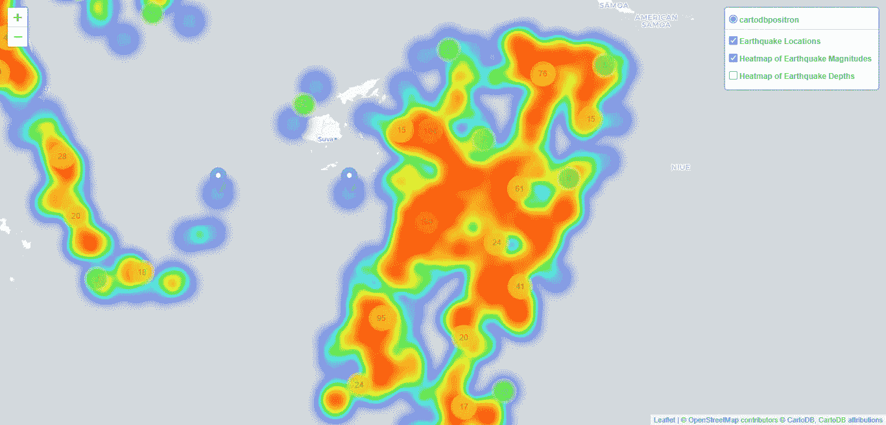

# 检索、分析和可视化地理参考数据

> 原文：<https://towardsdatascience.com/retrieve-analyze-and-visualize-georeferenced-data-aec1af28445b?source=collection_archive---------54----------------------->

## 使用叶地图和标准 Python 库


图片来自 [Pixabay](https://pixabay.com/?utm_source=link-attribution&utm_medium=referral&utm_campaign=image&utm_content=3167693) 的[图米苏](https://pixabay.com/users/Tumisu-148124/?utm_source=link-attribution&utm_medium=referral&utm_campaign=image&utm_content=3167693)

在地理数据科学中，往往很难得到准确可靠的数据进行分析和展示。地理数据来自不同的来源，在不同的时间通过不同的技术收集，因此，人们总是关注用于从地理空间数据中获取信息的数据的质量和可靠性[1]。获取地理空间数据是每个地理信息系统(GIS)项目的关键步骤。据估计，获取阶段通常会消耗**花费在 GIS 项目上的 70%到 80%的时间和金钱**。

有两种类型的地理空间数据捕获:原始数据捕获(PDC)和二次数据捕获(SDC)。PDC 指的是直接数据采集，通常与使用全球定位系统( [GPS](https://en.wikipedia.org/wiki/Global_Positioning_System) )或[全站仪](https://en.wikipedia.org/wiki/Total_station)【2】的现场勘测相关。在这一类别中，我们包括来自卫星、无人驾驶飞机、飞机和其他类型的太空、空中或手持传感器的遥感数据。

SDC 涉及检索地理空间数据的间接方法。有大量的在线资源允许我们为我们的地理空间项目挖掘在线资源。这些来源包括来自国际机构、政府、大学、商业网站和数据仓库的数据。这些类型的数据通常是免费的，并且格式与许多 GIS 软件兼容。在这一类别中，我们还包括可以从非数字格式检索的其他地理空间信息来源，例如纸质地图[2]。

在本文中，我们将讨论获取地理空间数据的 SDC 方式。具体来说，我们将简要展示如何检索、分析和可视化自 1964 年以来斐济[附近地震的地理参考数据。为此，我们写了一套三本](https://es.wikipedia.org/wiki/Fiyi)[木星笔记本](https://jupyter.org/):

1.  [reading_dataset](https://github.com/acoiman/mapping_earthquakes/blob/master/reading_dataset.ipynb) :包含读取数据集集合并查找包含单词 ***纬度*** 或 ***经度*** 的数据集链接的代码。
2.  [db _ seismics](https://github.com/acoiman/mapping_earthquakes/blob/master/db_earthquakes.ipynb)从选择的数据集创建一个数据库，并计算一些空间统计数据。
3.  [地图 _ 地震](https://github.com/acoiman/mapping_earthquakes/blob/master/map_earthquakes.ipynb)获取数据库数据并使用[叶子](https://pypi.org/project/folium/)包创建网络地图。

我们不会给你很多关于我们使用的代码的细节。如果你想访问整个库，点击[这里](https://github.com/acoiman/mapping_earthquakes)或者这篇文章的末尾。

# 读取数据集

我们使用了来自数据集的可用数据集列表。CSV 格式的列表被导入、打开和阅读。然后，我们在每个数据集的 HTML 代码[(网页抓取)](https://en.wikipedia.org/wiki/Web_crawler)中寻找单词`latitude`或`longitude`。最后，从结果列表中，我们选择了一个用于创建数据库和地图的数据集。

```
# open the collection dataset
with open('datasets.csv', newline='') as csvfile:
    reader = csv.DictReader(csvfile)
    # append in a list all the content of the Doc column 
    for row in reader:
        url_list.append(row['Doc'])
    for url in url_list:
        ctx = ssl.create_default_context()
        ctx.check_hostname = False
        ctx.verify_mode = ssl.CERT_NONE
        r = requests.get(url)
        if r.status_code == 200:
            html = urlopen(url, context=ctx).read()
            soup = BeautifulSoup(html, "html.parser")
            for item in soup:
                # find latitude or longitude word
                if soup.find_all(text=re.compile(r'\blatitude\b | \blongitude\b', flags=re.I | re.X)):
                    sel_list.append(url)
                else:
                    continue
        else:
            continue
    for item2 in sel_list:
        if item2 not in sel_list2:
            sel_list2.append(item2)
    print('List of datasets containing the terms latitude or longitude: \n', sel_list2)
```

从 1340 个数据集中，我们获得了 20 个包含单词纬度或经度的 HTML 链接，接下来我们为接下来的步骤选择了一个数据集。

```
print('The selected dataset is: ', sel_list2[8])
```

所选数据集是:

[https://raw . githubusercontent . com/vincentarelbundock/rdata sets/master/doc/datasets/quakes . html](https://raw.githubusercontent.com/vincentarelbundock/Rdatasets/master/doc/datasets/quakes.html)

# 创建数据库和计算空间统计数据

我们使用了所选数据集的 CSV 文件。该数据集包含自 1964 年以来斐济附近发生的地震事件的位置数据、深度和震级。然后，我们创建了一个数据库，并使用这个 CSV 文件填充它。最后，我们查询数据库并计算一些统计数据。

我们创建了一个轻量级的 [SQLite](https://www.sqlite.org/index.html) 数据库和一个名为`quakes`的表，与所选数据集具有相同的列名。为此，我们使用了 [SQL CREATE TABLE 语句](https://www.w3schools.com/sql/sql_create_table.asp)。

```
*# create database*
conn = sqlite3.connect('eartquakes.sqlite')
cur = conn.cursor()*# create table* 
cur.execute('''CREATE TABLE IF NOT EXISTS quakes     (id INTEGER PRIMARY KEY, lat REAL, lon REAL, depth INTEGER,     mag REAL, stations INTEGER)''')
```

接下来，我们用地震数据填充数据库。我们检索 URL 的数据集，并使用这些数据填充数据库。然后，我们丢下一些行代码和 SQL 语句来计算:总地震、平均震级和深度、最强和最小地震。

```
*# get and read data (on line)*
**with** closing(requests.get(url, stream=**True**)) **as** r:
    f = (line.decode('utf-8') **for** line **in** r.iter_lines())
    reader = csv.reader(f, delimiter=',', quotechar='"')
    next(reader)

    *# populate the database*
    list = []
    **for** row **in** reader:
        list.append(row)
    **for** item **in** list:
        cur.execute('INSERT OR IGNORE INTO quakes (id, lat, lon, depth, mag, stations) VALUES ( ?, ?, ?, ?, ?, ?)', ( item[0],item[1],item[2],item[3],item[4],item[5], ) )
    conn.commit()

    *# total earthquakes*
    cur.execute("SELECT COUNT(*) from quakes")
    **for** row **in** cur:
        count = row[0]

    *# average magnitude*
    cur.execute("SELECT AVG(mag) from quakes")
    **for** row **in** cur:
        magAvg = row[0]

    *# average depth*
    cur.execute("SELECT AVG(depth) from quakes")
    **for** row **in** cur:
        depAvg = row[0]

    *# strong and first minor earthquake in the dataset*
    cur.execute("SELECT MAX(mag), id, lat, lon, depth FROM quakes")
    **for** row **in** cur:
        mag = row[0]
        id = row[1]
        lat = row[2]
        lon = row[3]
        depth = row[4]
    cur.execute("SELECT MIN(mag), id, lat, lon, depth FROM quakes")
    **for** row **in** cur:
        mag2 = row[0]
        id2 = row[1]
        lat2 = row[2]
        lon2 = row[3]
        depth2 = row[4]*# id and magnitude dictionary*
    cur.execute("SELECT id, mag FROM quakes")
    dict = {rows[0]:rows[1] **for** rows **in** cur}
    cur.close()
```

当打印结果时，我们得到在我们的研究区域有 1000 次地震，平均震级为 4.6，平均深度为 311.37 千米。此外，我们计算出最强地震的震级为 6.4，深度为 127 公里，而最小地震的震级为 4.0，深度为 649 公里。

接下来，我们计算了最大和最小震级之间的距离。为了做到这一点，我们使用了计算两个坐标之间最短距离的哈弗辛公式。这与[欧几里德距离](https://en.wikipedia.org/wiki/Euclidean_distance)非常相似，除了它允许我们考虑地球的球形形状【3】。

```
*# Haversine distance formula*
**import** **math**
x_dist = math.radians(lon2-lon)
y_dist = math.radians(lat2-lat)
y1_rad = math.radians(lat)
y2_rad = math.radians(lat2)
a = math.sin(y_dist/2)**2 + math.sin(x_dist/2)**2 \
* math.cos(y1_rad) * math.cos(y2_rad)
c = 2*math.asin(math.sqrt(a))
distance = c * 6371 *# kilometers*
print()
print("Distance between the strongest earthquake (ID:"+str(id) +") and weakest earthquake **\**
(ID:"+str(id2)+"): "+str(round(distance,2))+" km.**\n**")
```

我们的结果显示，最强地震(ID:152)和最小地震(ID:5)之间的距离为 1609.06 公里。

最后，我们根据[麦卡利烈度表](https://en.wikipedia.org/wiki/Modified_Mercalli_intensity_scale)对地震进行了震级分类。我们遍历了之前创建的包含每个事件的 *id* 和震级数据的字典，然后根据麦卡利等级阈值过滤这些事件，并计算发生的百分比。

```
*# dictionary length*
dictLen= len(dict)*# calculate percentage mercaly intensity I*
mer_I = [item **for** item, occurrences **in** dict.items() **if** occurrences < 2.0]
merIPerc = round((len(mer_I)/dictLen)*100, 2)*# calculate percentage mercaly intensity II*
mer_II = [item **for** item, occurrences **in** dict.items() **if** occurrences >= 2.0 **and** occurrences <= 2.9 ]
merIIPerc = round((len(mer_II)/dictLen)*100,2)*# calculate percentage mercaly intensity III*
mer_III = [item **for** item, occurrences **in** dict.items() **if** occurrences >= 3.0 **and** occurrences <= 3.9 ]
merIIIPerc = round((len(mer_III)/dictLen)*100,2)...
```

根据我们的结果，研究区内 80%的*地震属于麦卡利烈度表 ***IV-V*** 。这些类型的事件被分类为轻度到中度地震。许多人在室内都能感觉到。轻)，几乎每个人都感觉到了(中等)[4]。*

# *绘制地震事件图*

*在我们系列笔记本的最后一部分，我们使用了在第 2 部分中创建的数据库，其中包含自 1964 年以来在斐济附近发生的地震事件的位置数据(经度和纬度)、深度和震级。从那个数据库中，我们通过[叶子](https://python-visualization.github.io/folium/)地图库提取了一些构建地震事件网络地图所需的数据。该 web 地图包含一个基础图层、地震事件位置和两个热图:地震的震级和深度。*

*我们阅读了我们的数据库并提取了以下数据:地震事件的纬度、经度、震级和深度。这些数据存储在列表对象中。为此，我们使用了嵌入在 Python 代码中的 SQL 语句。Python 有自己的内置模块来连接 Python 程序和数据库。*

```
**# read dataset*
conn = sqlite3.connect('eartquakes.sqlite')
cur = conn.cursor()*# create a list of latitude, longitude, mag and depth*
lats=[]
lons =[]
mags =[]
depths =[]
cur.execute("SELECT lat, lon, mag, depth FROM quakes")
**for** row **in** cur:
    lat = row[0]
    lon = row[1]
    mag = row[2]
    depth = row[3]
    lats.append(lat)
    lons.append(lon)
    mags.append(mag)
    depths.append(depth)
cur.close()*# get a list of latitude and longitude values*
locations = list(zip(lats, lons))*# get a list of  magnitude and depth values*
magdepth = list(zip(mags, depths))*
```

*我们使用了[的](https://python-visualization.github.io/folium/)地图库来建立我们的地震事件网络地图。首先，我们配置了一个[弹出窗口](https://www.webopedia.com/TERM/P/pop_up_window.html)来显示每个地震的震级和深度。接下来，我们建立了 [Cartodb 正电子](https://carto.com/blog/getting-to-know-positron-and-dark-matter/)作为[底图](http://maps.macog.com/MACOG/Help/Content/Client_APIs/SV_User/SVU_AboutBaseMaps.htm)。我们利用标记聚类技术来制作地震事件的动画点聚类可视化。最后，我们创建了地震震级和地震深度的热图。更多关于热图技术[的信息请点击](https://en.wikipedia.org/wiki/Heat_map)。*

```
**# configure map popup*
popups = ['magnitude:**{}**<br>depth:**{}**'.format(mags, depths) **for** (mags, depths) **in** magdepth]*# create basemap*
map = folium.Map(
    location=[np.mean(lats), np.mean(lons)],
    tiles='Cartodb Positron',
    zoom_start=5
)*# create marker clusters*
marker_cluster = MarkerCluster(
    locations=locations,
    popups=popups,
    name='Earthquake Locations',
    overlay=**True**,
    control=**True**,)
marker_cluster.add_to(map)*# create heatmap of earthquake magnitude*
data_heat_mag = list(zip(lats, lons, mags))
mag_hm = plugins.HeatMap(data_heat_mag,
                         name='Heatmap of Earthquake Magnitudes',
                         overlay=**True**,
                         control=**True**,
                         show=**False**
                        )
mag_hm.add_to(map)*# create heatmap of earthquake depth*
data_heat_depth = list(zip(lats, lons,depths))
dep_hm = plugins.HeatMap(data_heat_depth,
                         name='Heatmap of Earthquake Depths',
                         overlay=**True**,
                         control=**True**,
                         show=**False**
                        )
dep_hm.add_to(map)*# add map control layer*
folium.LayerControl(collapsed=**False**).add_to(map)*
```

*这是我们的最终地图*

**

*点击[此处](https://acoiman.github.io/maps/earthquake_fiji/map/)获取网络版(*图片作者)**

# *结论*

*尽管使用像 [pandas](https://pandas.pydata.org/) 和 [geopandas](https://geopandas.org/) 这样的专业库也有可能达到我们在这里提出的相同目标，但是我们演示了(可能更详细)，通过 Folium 和标准 Python 库检索、分析和可视化地理参考数据是可能的。一如既往，欢迎任何与此相关的反馈！*

# *参考*

*[1] Gervais，m .，Bédard，y .，Andree Levesque，m .，Bernier，e .，Devillers，R. (2009 年)。数据质量问题和地理知识发现。在米勒，h，韩，j。)地理数据挖掘和知识发现(第 99–115 页)，美国纽约:泰勒&弗朗西斯集团。*

*[2][https://2012 books . lardbucket . org/books/Geographic-information-system-basics/s09-01-Geographic-Data-Acquisition . html](https://2012books.lardbucket.org/books/geographic-information-system-basics/s09-01-geographic-data-acquisition.html.)地理数据采集。*

*[3]https://en.wikipedia.org/wiki/Haversine_formula。哈弗辛公式。*

*[4][https://en . Wikipedia . org/wiki/Modified _ Mercalli _ intensity _ scale](https://en.wikipedia.org/wiki/Modified_Mercalli_intensity_scale)。改良麦卡利烈度表。*

*[](https://github.com/acoiman/mapping_earthquakes) [## acoi man/制图 _ 地震

### 检索、分析和可视化 1964 年以来斐济附近地震的地理参考数据

github.com](https://github.com/acoiman/mapping_earthquakes)*