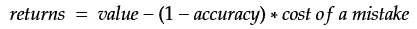
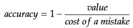
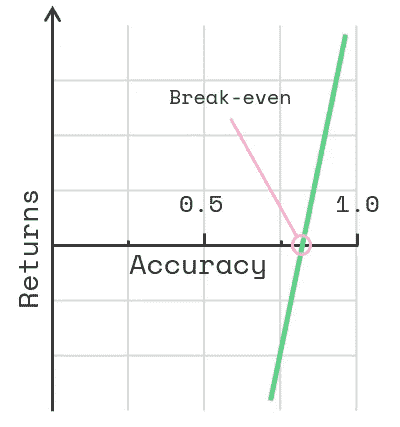
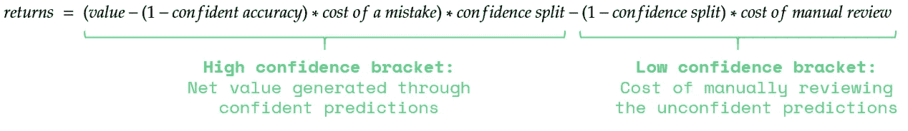
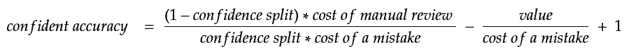
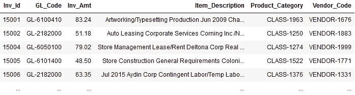
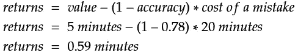
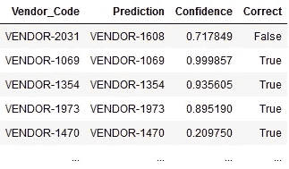
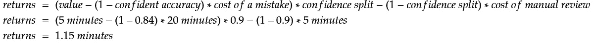

# 机器学习的投资回报

> 原文：<https://towardsdatascience.com/return-on-investment-for-machine-learning-1a0c431509e?source=collection_archive---------21----------------------->

## 与其问“我们如何获得 100%的准确率？”，正确的问题是“我们如何最大化投资回报率？”

在一个不确定的世界里，你仍然可以保持一致。由[micha Parzuchowski](https://unsplash.com/@mparzuchowski?utm_source=unsplash&utm_medium=referral&utm_content=creditCopyText)在 [Unsplash](https://unsplash.com/s/photos/poker?utm_source=unsplash&utm_medium=referral&utm_content=creditCopyText) 拍摄的照片

机器学习处理概率，这意味着总有出错的可能。这种内在的不确定性导致许多决策者对实现机器学习感到不舒服，并使他们陷入对神奇的 100%准确性的无休止的追逐中。当我与迈出智能自动化第一步的公司合作时，对错误的恐惧几乎总是会出现，有人问我“如果算法做出错误的预测怎么办？”

如果这个问题得不到解决，公司很可能会在机器学习上花费大量的资源和数年的开发时间，而不会获得投资回报。在本文中，我将向您展示一个简单的等式，我用它来缓解这些担忧，让决策者对不确定性更加放心。

# 机器学习什么时候值得

就像任何投资一样，机器学习的可行性归结于它产生的价值是否大于它的成本。这是一种正常的投资回报(ROI)计算，在机器学习的背景下，它将产生的价值与错误和准确性的成本进行权衡。因此，与其问“我们如何获得 100%的准确率？”，正确的问题是“我们如何最大化投资回报率？”

确定预期回报非常简单。我通常通过用数学术语比较机器学习的好处和潜在成本，来开始打开机器学习实现的商业案例。这可以形式化为一个等式，基本上就是“在考虑了错误的成本之后，所产生的价值还剩下什么？”解这个简单的方程让我们可以估计不同情况下的利润。

让我们看看变量:

*   **返回**:每次预测产生的净值或利润
*   **value** :每次预测生成的新值(例如，将文档分配到正确的类别现在需要 0.01 秒，而不是 5 分钟，因此节省了 5 分钟)
*   **精度**:算法预测的精度
*   **错误成本**:错误预测导致的额外成本(例如，有人需要 20 分钟来纠正系统中的错误)

通过翻转等式并将回报率设为零，我们得到了产生净值所需的最低精确度。这被称为**盈亏平衡精度**:

在图表中绘制时，等式变得更加直观:

图中的盈亏平衡点

假设每个预测为你节省了 5 分钟的工作时间，但是要修正一个错误的预测却需要 20 分钟的额外工作时间。我们现在可以计算出盈亏平衡准确度为*1–5/20 =***75%**。此后的任何改进都会带来具体的利润。

上面的等式假设我们盲目地接受算法做出的任何预测，然后修正错误。听起来很冒险？我们可以做得更好，用置信度分数来扩展等式，以降低风险。

# 优化投资回报率

一个机器学习算法(做对了)不仅仅会喷涌出预测，它还会告诉我们它对每一个预测有多有信心。大多数错误发生在算法不确定其答案时，这使我们可以将自动化集中在最高确定性的预测上，同时手动审查最低确定性的预测。尽管人工审查确实要花费一些人力，但通常比以后修复错误要便宜得多。

让我们选择一个阈值，挑选出 10%最不自信的预测进行人工审查。剩下的 90%会自动处理。这个比例叫做*置信分割*。由于许多错误出现在小的不自信括号中，高自信括号中的准确度现在将会好得多。这将我们引向扩展方程。它说“在考虑了错误和人工审查的成本之后，所产生的价值还剩下什么？”

看起来很可怕，但一旦你知道它包含什么，它就很简单:

*   **返回**:每次预测产生的净值或利润
*   **值**:每次预测产生的新值
*   **置信精度**:高置信区间的预测精度
*   **错误成本**:错误预测所产生的额外成本
*   **置信度分割**:高置信度预测的比率(在我们的例子中是 90%)
*   **人工审核成本**:人工审核预测的成本

我们可以再次翻转等式，通过将回报设置为零来计算盈亏平衡精度，如下所示:

我们将使用以下变量来求解:

*   价值=节省了 5 分钟
*   错误的代价= 20 分钟
*   人工审核的成本= 5 分钟
*   置信区间= 0.9

现在新的盈亏平衡精度是 **78%** 。等等，这比更简单的方程要高，是不是变得更糟了？不完全是！请记住，许多错误都出现在低置信度类别中，这大大提高了高置信度类别的准确性。即使盈亏平衡的最低精度要求变得更高，现在也更容易实现。

计算运行中的机器学习算法的盈利能力，可以让你找到最佳的准确性。不，不是 100%。正如我在我的[上一篇文章](/small-ml-is-the-next-big-leap-in-rpa-c33c3cc70eb9)中所讨论的，任何系统的开发成本都是指数增长的，而回报却是递减的。有了上面的等式，您可以估计一个现实的 ROI，并计算在您选择的时间框架内，准确性的提高比回报的增加产生更多开发成本的点。这是 ROI 优化的精度。

# 实际例子

让我们来看一个真实世界的场景，并贯穿整个过程。假设您的应付账款团队每个月要处理 5000 张发票，并且您已经有了自动化部分流程的想法。更具体地说，拟议的自动化将对收到的发票进行分类，以匹配复杂的内部供应商代码，目前这是手工完成的。你需要弄清楚一种机器学习方法是否值得花力气来解决这个任务。

就数据而言，以下是您将要处理的内容。您有以前处理过的发票的历史记录以及每张发票的正确“供应商代码”值。任务是为任何新发票预测正确的“供应商代码”。你可以在这里 找到原来的数据集 [**。**](https://www.kaggle.com/nikhil1011/predict-product-category-from-given-invoice/data#Train.csv)

先睹为快

首先，使用您喜欢的任何机器学习库或工具，并对数据进行基本的准确性测试。我使用的是 [aito.ai](http://aito.ai) ，经过 4000 行的训练和 1500 行的测试，我的准确率达到了 78%。如果我们使用和以前一样的价值和成本，我们可以用第一个等式计算月回报:

使用忽略置信度分数的简单方法，算法以 78%的准确率做出的每个预测平均为您节省 0.59 分钟的工作，或 35 秒。这意味着通过处理 5000 张发票，每个月可以节省将近 50 个小时的工作时间。还不错。

现在让我们来看看考虑置信度得分的等式。我将每个预测的结果和可信度分数整理成一个简洁的表格，如下所示，这样我们就可以将它们分为高可信度和低可信度两类。在这种情况下，任何置信度低于 0.21 的预测都将被手动审核。这个阈值给了我们 90/10 的置信区间。

预测结果

在我们的高信心等级中，准确率达到了令人印象深刻的 84%，而在低信心等级中，准确率只有区区 22%。这使得利用置信度得分的影响非常明显。现在，当信心和人工审查成本成为等式的一部分时，我们可以计算新的回报:

扩展的方法几乎使回报翻倍！每次预测平均节省 1.15 分钟。现在，处理你每月 5000 张发票的工作量**减少了 95 个小时**,即使算上错误成本和人工审核 10%的预测。太棒了！

现在你知道你目前可以达到的盈利水平。更好的是，您现在有了一个工具来确定进一步机器学习开发的可行性。例如，使用该等式，您可以计算假设 90%准确率的回报，并发现回报为每月节省 **183 小时**。将它与达到 90%准确率的估计开发成本进行比较，您将有事实数据来决定进一步的开发是否值得投资。

# 总结一下

正如你所看到的，机器学习应该像任何其他投资一样进行。不可避免的错误只是做生意的成本，它们是我们计算中的正常变量。有了这些等式，你就知道什么时候开始收获机器学习的好处，而不是玩猜谜游戏，并且你可以更早地将算法投入生产。从永无止境的追求 100%准确度的苦差事中解脱出来，并开始创造价值。

*做得比完美更好。*

*我在*[*aito . ai*](http://aito.ai/rpa)*为不同平台开发机器学习集成，让机器学习的好处大众化。*