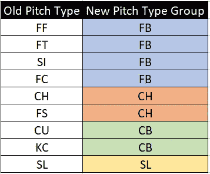
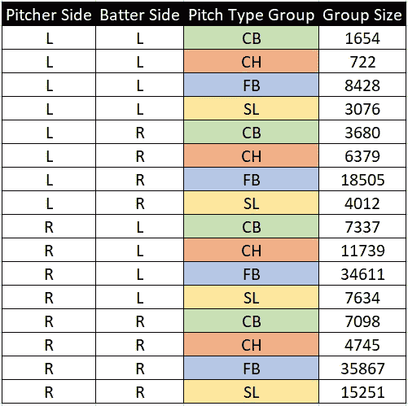
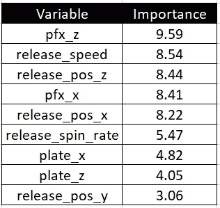
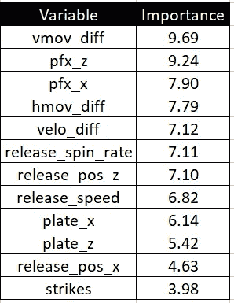
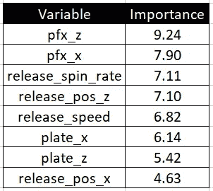
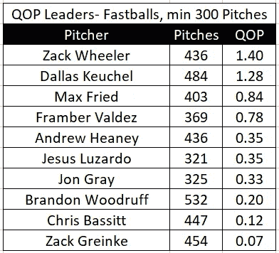
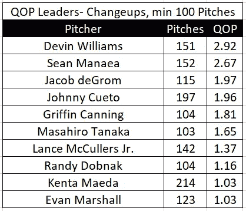
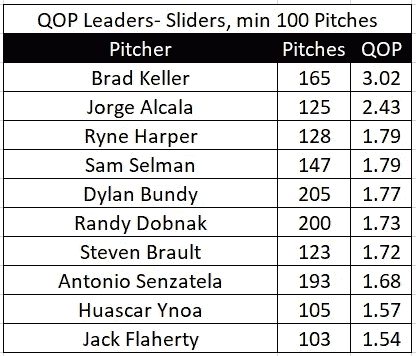
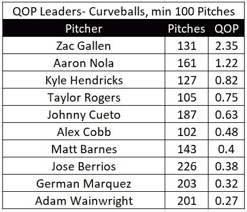

# 修改我的音高质量标准

> 原文：<https://towardsdatascience.com/revamping-my-pitch-quality-metric-66cb2dbe8d8a?source=collection_archive---------25----------------------->

## 从头到尾对 Ethan 改进后的新指标进行了全面分析

*作者注:本文(QOP)讨论的度量在未来的工作中将被称为 xRV(预期运行值)。*

*有关 QOS+的信息，一个本文中描述的姐妹指标，* [*点击此处*](#3aac) *或滚动到本文底部。*

今年早些时候，我创建了一个模型，试图量化一个 MLB 项目的质量。这个想法是，每个音高都可以根据它的区域位置、释放点和一些音高特性来给定一个预期的运行值。虽然我最初对我的度量结果(最初在这里介绍了)和我能够做的后续分析(这里的、这里的、这里的和这里的)感到满意，但我承认从建模的角度来看还有改进的空间。

在过去的几天里，我决定使用一个更具统计学意义的模型构建过程，彻底重建我的音高质量指标。本文将详细描述这个过程，并附有我的可复制代码，在这里找到[。](https://github.com/ethanmoore21/PitchQuality/blob/master/qop_3_rfs.R)

# 问题

对于这个项目，我首先问

> 在 2020 赛季的每一场比赛中，我们期望得到多少分？

为了回答这个问题，我决定使用[线性权重框架](https://library.fangraphs.com/principles/linear-weights/)，它给出了每一个投球结果(球、好球、一垒打、本垒打、出局等)。)基于该事件在先前游戏中的价值的运行值。这个想法是，投出更多可能得到好结果(比赛中球的全垒打和出局)的投手应该得到奖励，而投出更多可能导致坏结果(比赛中球和球的跑垒员)的投手应该受到惩罚。

# 以前的方法问题

以前的度量标准，期望运行值(xRV)有什么问题，以至于我不得不改变它？一些事情。首先，它是使用一种叫做 k-最近邻的模型制作的，这种模型对于像这样的大型高维模型来说不是非常严格。在那个模型中，我使用了 100 个最近邻，这是一个任意的值，我没有特别的理由就选择了这个值。我没有进行特征选择，只使用了视觉测试来评估这个指标是否足够好。我的结论是，它的糟糕的 RMSE 分数证明了我是错的。这是很好的第一步，但我知道我可以做得更好，所以我做了。结果是一个改进的度量，其蓝图完全包含在本文中。

# 新方法

在进入杂草之前，我想概述一下这个新的度量，我称之为音高质量(简称 QOP)，是如何计算的。我根据投手惯用手、击球手惯用手和投球类型，将本赛季的每一次投球分为 16 类。稍后我将详细介绍这些群体。对于每一组，我在该类别的一个音高子集上制作了一个单独的随机森林模型，确认该模型是有用的，然后将该模型应用于该类别的所有音高。数据集中的每个音高只属于一个类别，因此只能从 16 个模型中的一个得到预测。

最后，我将所有 16 个模型的预测汇总在一起，并通过均方根误差(RMSE)评估模型的质量。这个模型比我最初在三月份做的这个度量的第一次迭代有了显著的改进。

我们走进杂草中。

# 数据采集

本项目使用的所有数据都来自于通过比尔·佩蒂的 [baseballR](http://billpetti.github.io/baseballr/) 包公开提供的[BaseballSavant.com](https://baseballsavant.mlb.com/statcast_search)，使用了以下函数和参数:

```
data = scrape_statcast_savant(start_date = “2020–07–23”,
       end_date = “2020–09–05”, player_type = “pitcher”)
```

这种方法往往一次只能获取 40，000 个音高，所以我将它分解成更多日期范围更小的函数调用，并使用 rbind()命令将所有数据帧合并成一个。

# 数据清理和特征创建

不幸的是，这个公开可用的数据集不包括每个事件的线性权重值，就像我需要回答我的研究问题一样，所以我从头开始计算线性权重。我确信 2020 年的线性权重值存在于互联网上的其他地方，我可以找到并加入数据集，但我已经有了以前项目的代码，除了初始数据采集之外，我不希望在这个项目的任何部分依赖任何外部来源。公平的警告，这段代码，也可以在我的 GitHub [这里](https://github.com/ethanmoore21/PitchQuality/blob/master/qop_3_rfs.R)找到，有点乱，但最终完成了工作。

我想指出的是，我选择了将导致三振的投球赋予与典型三振相同的跑垒值(不是三振)，而导致保送的投球被赋予典型球的跑垒值。因为这个指标是上下文无关的，击球次数不会成为这个模型的一个特征，所以我觉得这个改变是必要的。

一旦我获得了数据中每一行的线性权重值，我就根据下表将所有音高分组为四个音高类型组:



所有其他球场类型的球场，如指关节球、椭圆球等。已从数据集中删除。在这一步中，大约有 250 个球丢失了，我只剩下大约 170，000 个。*(注:本文使用的数据是通过 9 月 5 日玩的游戏)*

最后，我创造了三个新的变量来量化每一个速投和投手的平均快速球速度和移动之间的速度和移动差异。我这样做是因为我希望在以后的最终模型中包含这些变量，如果它们被证明是有用的话。

# 特征选择和重要性

如我之前所说，这个指标实际上是 16 个不同随机森林模型的组合。2020 年的每一次投球都属于 16 个类别之一，如下所示:



虽然我总共创造了 16 个模型，但是只有两个模型方程式:一个是快速球，一个是慢速球。

## 快速球特征选择

在筛选出恰到好处的快速球和恰到好处的快速球并随机抽取 10%的数据后，我用所有可能的特征运行了 [Boruta](https://cran.r-project.org/web/packages/Boruta/Boruta.pdf) 特征选择算法。(使用所有的数据会花费太多的时间，并且会产生相似的结果，所以我使用这个较小的子集来代替。)Boruta 是一种基于树的算法，特别适用于随机森林模型中的特征选择。

```
library(Boruta)Boruta_FS <- Boruta(lin_weight ~ release_speed + release_pos_x + release_pos_y + release_pos_z + pfx_x + pfx_z + plate_x + plate_z + balls + strikes + outs_when_up + release_spin_rate,
       data = rr_fb_data_sampled)print(Boruta_FS)
```

该算法发现，除了一局中的球、击球和出局之外，上述所有变量在 0.01 水平上都是显著的，这是有意义的，因为我的上下文中性方法计算线性权重，即响应变量。

所以在我最终的快速球模型中的特征是投球速度、释放点、旋转速度和球板位置。因为我使用的是随机森林，所以我不需要担心运动和旋转速率等特征之间的潜在协方差。以下是模型中的最终特征，根据 Boruta 根据其对线性重量游程值预测的重要性进行排序。



用简单的语言来说，这些是对快速球质量最重要的变量。垂直运动是第一名，速度是第二名，伸展是第三名，这不应该是一个惊喜，而且肯定通过了嗅觉测试。

对于偏速模型，我遵循了一个非常相似的程序，为了特征选择的目的，子集化到随机的 10%的右对右偏速音高。我再次使用了具有相同潜在特性的 Boruta，但这次也包括了我之前创建的变量:每个投球和投手典型快速球之间的速度和运动差异。

```
Boruta_OS <- Boruta(lin_weight ~ release_speed + release_pos_x + release_pos_y + release_pos_z + pfx_x + pfx_z + plate_x + plate_z + balls + strikes + outs_when_up + release_spin_rate + velo_diff + hmov_diff + vmov_diff, data = rr_os_data_sampled)print(Boruta_OS)
```

结果如下:



我要做一个决定。保持原始的速度和移动值，还是使用基于投手快速球的值？该表显示，我们选择哪一个并不重要，因为两组变量具有非常相似的重要性分数。因此，我将使用包含原始值的变量。这里是个人偏好选择，但同样，与备选方案相比，它不应该对指标的准确性产生太大影响。

此外，即使博鲁塔发现罢工非常重要，我还是要排除这个变量，因为在我看来，它在我们的环境中立的情况下没有什么意义。所以偏离速度方程的最终变量是…



…除了释放延伸之外，与快速球方程式中的变数相同。很高兴事情是这样发展的。请注意不同重要性顺序的不同。到目前为止，移动似乎是变速球最重要的特征，这也是有道理的(特别是因为它混合了变速球、滑球和曲球)。

# 模型验证和评估

正如敏锐的观察家指出的，我完全没有验证我最初的音高质量模型，这是一个问题！我怎么知道它好不好？我几乎没有。我不会再犯同样的错误了！回顾过去，我之前的指标的 RMSE 是 0.21。考虑到 0.21 是响应列的标准偏差，线性权重，这是不好的。我希望通过这个新的指标，用一个更小的最终 RMSE 来改善这个数字。

为了验证这一指标，我使用了一种以前从未使用过的方法，将模型嵌套在一个数据框架中，一次性训练和测试我的所有 16 个模型。我从这篇 StackOverflow 帖子中大量借用了这篇文章，我的代码版本可以在我的 GitHub [这里](https://github.com/ethanmoore21/PitchQuality/blob/master/qop_3_rfs.R)看到。

按照惯例，我用 70%的数据训练每个模型，并将其应用于另 30%的数据，即我的测试集。

快速球训练和验证

```
#Fastball Training and Validating
fbs_predictions <- fb_nested %>% 
  mutate(my_model = map(myorigdata, rf_model_fb))%>%
  full_join(new_fb_nested, by = c("p_throws", "stand", "grouped_pitch_type"))%>%
  mutate(my_new_pred = map2(my_model, mynewdata, predict))%>%
  select(p_throws,stand,grouped_pitch_type, mynewdata, my_new_pred)%>%
  unnest(c(mynewdata, my_new_pred))%>%
  rename(preds = my_new_pred)rmse(fbs_predictions$preds, fbs_predictions$lin_weight)
```

超速训练和验证

```
os_predictions <- os_nested %>% 
  mutate(my_model = map(myorigdata, rf_model_os))%>% 
  full_join(new_os_nested, by = c("p_throws", "stand", "grouped_pitch_type"))%>%
  mutate(my_new_pred = map2(my_model, mynewdata, predict))%>%
  select(p_throws,stand,grouped_pitch_type, mynewdata, my_new_pred)%>%
  unnest(c(mynewdata, my_new_pred))%>%
  rename(preds = my_new_pred)rmse(os_predictions$preds, os_predictions$lin_weight)
```

我对快速球模型的验证 RMSE 是 0.105，对慢速球模型的验证 RMSE 是 0.099，这两个指标都比我预期的好得多，表明这个指标在准确性和预测能力方面比我以前的指标有了真正的改善。

知道了我们对模型在验证集上的表现的了解，我对将这些模型应用到 2020 年迄今为止的每一场比赛感到很舒服。在这样做的时候，我给了 2020 年的每一个音高它的预期运行值。

> 当我这样做并结合预测时，我最终的总体 RMSE 是 0.145，比我之前的 0.21 RMSE 有了很大的提高！

我可以自信地说，这个模型在量化 MLB 音高的预期运行值方面优于我以前的音高质量模型。

# 限制

我想重申这个模型的目的和功能，以便揭示它的缺陷。正如[乔治·博克斯的名言](https://en.wikipedia.org/wiki/All_models_are_wrong)所说，“所有的模型都是错的，但有些是有用的。”这个模型根据 2020 年 MLB 赛季中每一场比赛的结果在真空中的可能性为每一场比赛赋值。虽然它看起来做得相当好，但这个指标没有考虑到

*   音高排序，以前的音高对当前音高的影响
*   对方击球手的强项和弱项
*   比赛情况(得分、局数、投球数)
*   击球情况(计数、跑垒员、出局数)

与任何模型一样，理解限制和适当的用例与理解模型本身的机制一样重要。也许在未来的迭代中，这些特性中的一些可以被集成到模型中，并且有可能提高它的性能。

# 结果

与我过去的一些文章不同，这些文章包括了以前的音高质量模型的结果的完整分析，我将保持这一部分的简短，以便将重点放在这一指标的创建过程上，而不是对其最终排行榜的争论。

也就是说，这里有一些来自这个模型的有趣的见解。请记住，QOP 的所有单位都是“每 100 场比赛阻止的预期得分”，所有排行榜都是准确的，直到 9 月 5 日的比赛。

**快速球 QOP 2020 年迄今领先**



**2020 年迄今换台 QOP 领导人**



**滑块 2020 年 QOP 领导人至今**



**QOP 2020 年迄今领先**



顺便提一下，里奇希尔排名第 11

写下来并公开代码对我来说真的很重要，算是结束了我这个非常活跃的研究夏天。我希望有人将能够采取这一点，并改善它，以进一步了解棒球比赛在公共领域！

一如既往，感谢您的阅读，如果您有任何问题、反馈或理想的工作机会😅，请在推特上告诉我 [@Moore_Stats](https://twitter.com/Moore_Stats) ！

# QOS+详情

东西的质量+(简称 QOS+)与本文概述的度量标准密切相关，QOP。我与《运动》杂志的 Eno Sarris 合作，为他的双周刊《材料与命令》撰写了这一指标。

以下是 QOS+和 QOP 的相关区别:

*   QOS+不包括板位置作为其快速球或偏速模型方程的特征，以隔离投手的“材料”对其投球的预期跑分值的影响
*   QOS+使用速度和移动值，相对于投手在其越速模式下的典型快速球
*   QOS+的标度与 QOP 不同，100 是联盟平均水平，110 是比联盟平均水平高一个标准差

QOS+和 QOP 的排行榜预计会有所不同，QOS+排行榜更倾向于拥有好“东西”的投手，而不是 QOP，这也是投手的指挥。