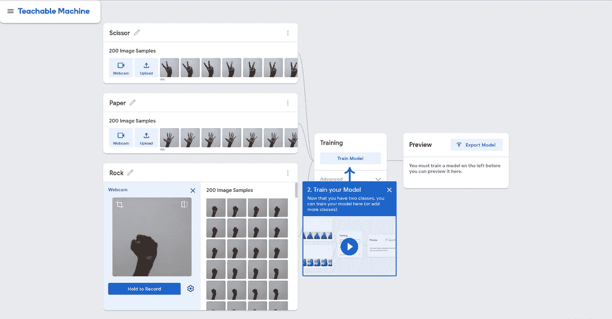
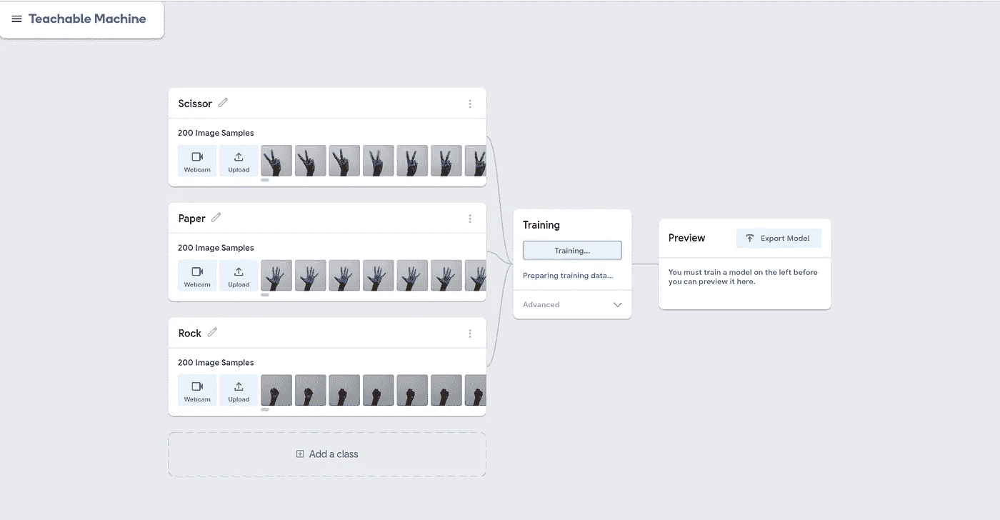
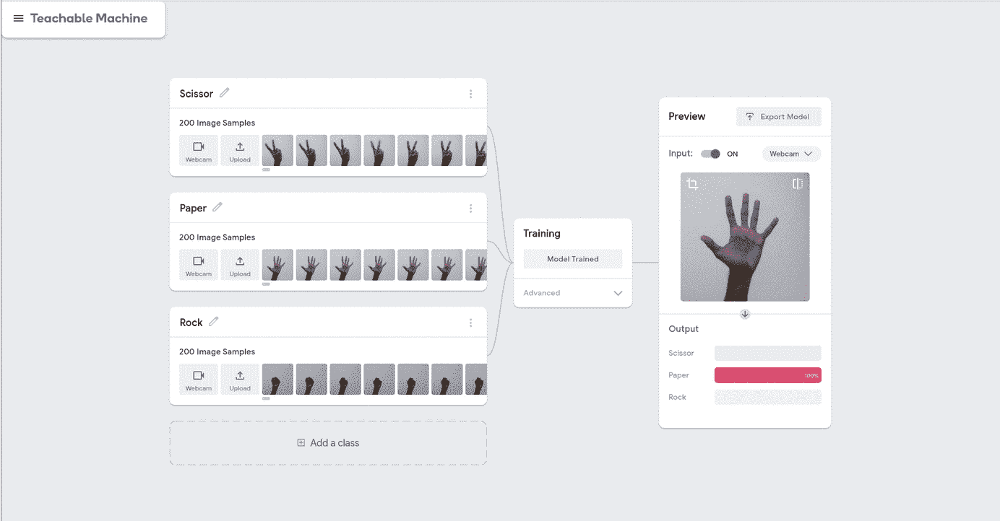
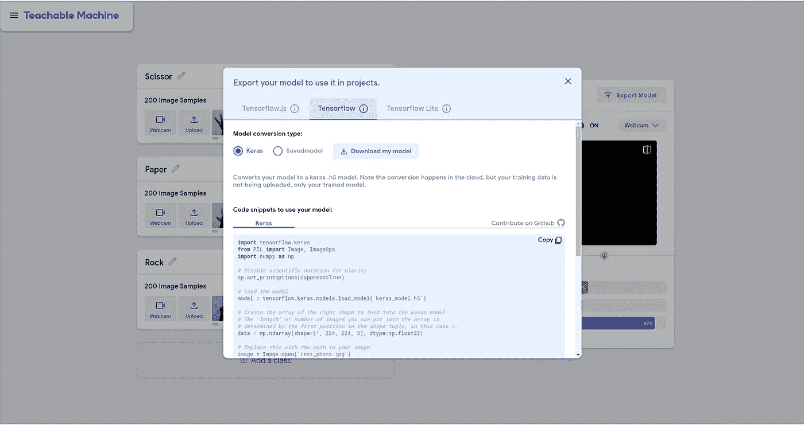
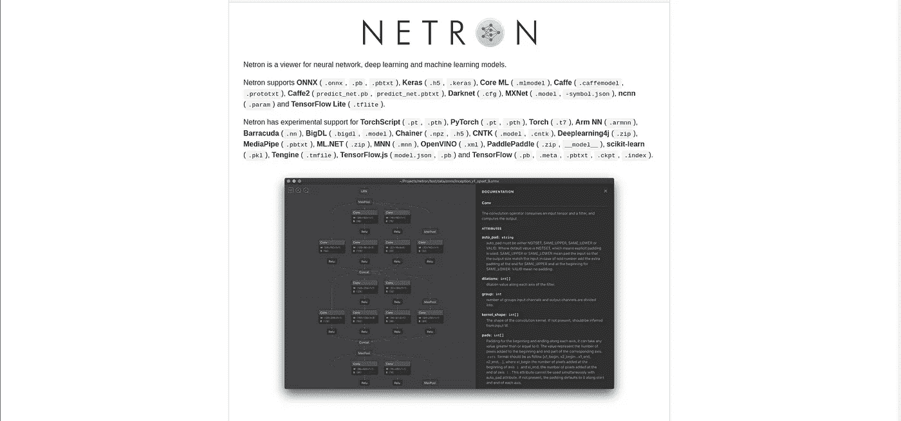
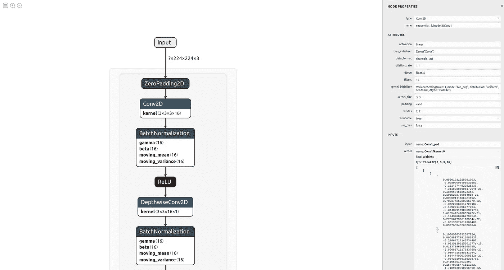

# 逆向工程谷歌的技术，以赢得 95%以上的准确性

> 原文：<https://towardsdatascience.com/reverse-engineering-googles-tech-to-win-95-accuracy-2070c2b1052c?source=collection_archive---------60----------------------->

## 等等，你没看错😃让我们像专业人士一样设计神经网络吧！

> 我们看到谷歌如何提出许多突破性的科学构建，即使是在深度学习时代的早期阶段。他们拥有世界上最好的资源，硬件、软件和工程师。我们将研究如何对谷歌的一项新服务进行逆向工程，以获得惊人的结果。

我想给你讲一个故事。两年前，谷歌提出了一个想法，即开发一个平台，任何人都可以在这个平台上开发自己强大的深度学习模型，而无需事先有编码经验。这个平台的早期版本只允许用户使用他们的网络摄像头创建分类模型。这个想法很简单，走到讲台上，打开你的相机，给它看几张不同班级的照片。这个模型是在谷歌的计算机中训练出来的。所有这些事情的发生只是时间问题。该平台的最初版本非常简单。最近，谷歌更新了平台，为多个类别、姿势估计、音频分类、不同格式的下载模型等提供了巨大的支持。谷歌称之为 [***可教机器***](https://teachablemachine.withgoogle.com/train) 。当前版本支持以下内容。

*   根据图像数据训练模型
*   根据音频数据训练模型
*   根据姿势数据训练模型(像在 [Posenet](https://medium.com/tensorflow/real-time-human-pose-estimation-in-the-browser-with-tensorflow-js-7dd0bc881cd5) 中)
*   将您自己的数据集上传到训练模型
*   每个模型培训 3 个以上的班级
*   禁用类别
*   保存您的 TensorFlow.js 模型
*   下载您的模型
*   部署您的模型以用于您自己的项目(网站、应用程序、物理机器等)。)

***怎么样？对我来说，太棒了。***

为了更好地了解这个平台，请观看下面由 Google 制作的视频。

谷歌可教机器视频

## 这个逆向工程任务是如何工作的？

我们要逆向工程的服务不过是 ***可教的机器*** 。首先也是最重要的，我们去平台，输入一些不同类别的图片。我选择了 ***摇滚*** *-* ***纸*** *-* ***剪刀*** 。您可以使用网络摄像头实时捕捉图像，或者上传您自己的自定义数据集。为了说明，我使用网络摄像头的方法。

截图取自[https://teachablemachine.withgoogle.com/](https://teachablemachine.withgoogle.com/)

如您所见，数据集已经准备好了。每个类由 200 幅图像组成。接下来就是训练模型了，我们只要点击 ***训练模型*** 选项就可以开始训练模型了。

截图取自[https://teachablemachine.withgoogle.com/](https://teachablemachine.withgoogle.com/)

我们的模特不到一分钟就能完成训练。剩下的是，我们必须看看我们的模型在现实世界中的表现。为此，我们可以使用现场演示选项。下面是一张 GIF 图，展示了我们训练的模型的结果。

截图取自[https://teachablemachine.withgoogle.com/](https://teachablemachine.withgoogle.com/)

一切正常，对吧？精度栏每次都打到 100。我做的每个测试都得到了几乎相似的结果。这只是一个例子，你可以用更复杂的数据集来尝试。对于这个解决方法的主要部分，我们必须将模型导出为某种格式。在这里，我使用了 ***Keras*** 模型的变体。如果您愿意，可以在相同的 Tensoflow.js 或 Tensorflow Lite 版本之间进行选择。

截图来自[https://teachablemachine.withgoogle.com/](https://teachablemachine.withgoogle.com/)

我们已经完成了模型训练部分。现在，我们必须开始问题的核心部分，即逆向工程。我们将要看到的是 ***模型是如何建立的*** ，所有的层配置都使用了什么，有多少层，内核大小是什么，前馈网络的维数等等。为此，我们使用一个叫做[***netron***](https://github.com/lutzroeder/netron)的工具。深度学习模型不是一堆简单的层，对吗？

**Netron** 是一个开源工具，我们可以用它来看看深度学习模型是如何设计的以及相关的权重。我们必须访问他们的网站，并安装基于操作系统的客户端应用程序。我一直在用 Ubuntu，所以我下载了它的 Linux 版本。这个项目的主页将如下所示。

截图取自[https://github.com/lutzroeder/netron](https://github.com/lutzroeder/netron)

我们最后要做的就是用 ***netron*** app 打开下载的模型。**抓住你了**！我们成功了。

截图来自 netron app

你在上图中看到的是我们模型的架构。这是一个非常长的设计，不能放在一张截图里。放大后，我们得到了下面的图片。

截图来自 netron app

我们可以看到一些熟悉的层，对不对？在右侧，也给出了模型权重和超参数。如果我们可以通过查看层配置从零开始创建相同的模型，那就太棒了。我们可以在下一个项目中尝试这种配置。谷歌应该做了很多功课。所以采用同样的方法应该会有回报。

这是一种新的深度学习方法，可以极大地改善最终结果。希望这对您有所帮助。干杯，大家。

