# 逆向工程图卷积网络

> 原文：<https://towardsdatascience.com/reverse-engineering-graph-convolutional-networks-dd78d4682ea1?source=collection_archive---------43----------------------->

让我们对 GCN 进行逆向工程。在 [Unsplash](https://unsplash.com?utm_source=medium&utm_medium=referral) 上拍摄的 [ThisisEngineering RAEng](https://unsplash.com/@thisisengineering?utm_source=medium&utm_medium=referral)

这篇博客文章将总结“[简化图卷积网络](https://arxiv.org/pdf/1902.07153.pdf)【1】”这篇文章试图对图卷积网络进行逆向工程。因此，让我们向后发展图卷积网络。

图是结构的普遍模型。它们无处不在，从社交网络到化学分子。各种事物都可以用图表来表示。然而，将机器学习应用于这些结构并不是我们直接想到的。机器学习中的一切都来自于一个小的简单的想法或模型，它根据需要随着时间变得复杂。举个例子，最初，我们有发展成多层感知的感知机，类似地，我们有发展成非线性 CNN 的图像滤波器，等等。然而，图卷积网络，被称为 GCN，是我们直接从现有的想法中衍生出来的，并有一个更复杂的开始。因此，为了揭穿 GCNs，本文试图对 GCN 进行逆向工程，并提出一种简化的线性模型，称为**简单图卷积(SGC)。** SGC 在应用时可提供与 GCNs 相当的性能，甚至比快速 GCN 还要快。

# 基本符号

图卷积网络的输入是:
1。节点标签
2。邻接矩阵

**邻接矩阵:**邻接矩阵 **A** 为 **n x n，**矩阵其中 n 为节点个数，若节点 I 与节点 j 相连则 a(i，j) = 1 否则 a(i，j) = 0。如果边是加权的，那么 a(i，j) =边权重。

**对角矩阵:**对角矩阵 **D** 是 n×n 矩阵，d(i，i) =邻接矩阵的第 **i** 行之和。

**输入特征:** X 是大小为 **n x c** 的输入特征矩阵，c 为类别数。

在逆向工程之前，让我们看看 GCNs 实际上是如何工作的。

# **图卷积网络在行动**

当我们通过 CNN 层输入图像时，会发生什么？它使用一个像素及其相邻像素来给出特定索引的输出。同样的行为在 GCNs 中也很普遍。对于每一层，我们传播一个新的特征:

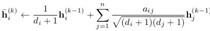

正向传播步长

此外，该步骤可以矩阵形式表示为:

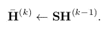

第 k 个输出通过将 S 乘以前一个输出获得

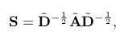

归一化邻接矩阵

因此，每下一步都可以表示为 S 与 H(i-1)的稀疏矩阵乘法

这就是平滑局部隐藏的表示。怎么会？每一步都从邻居传播特征。因此，在第一步之后，节点 **x** 具有其自身以及其邻居的信息。在第二步之后，它再次从它的邻居那里获取信息，但是他们已经有了它的 2 步远邻居的信息，所以这些添加到节点 **x** 上。同样，信息是在每一跳收集的。现在，将结果乘以权重矩阵 **W** ，并且应用逐点非线性函数(ReLU)来获得下一个特征矩阵。

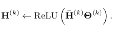

非线性激活函数

由此获得的结果可以被输入到 softmax 层以获得分类概率。

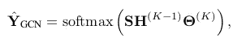

使用 GCNs 分类(等式 1)

图卷积网络可以用下图来概括:

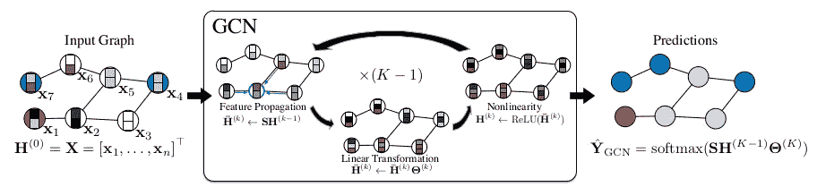

GCN 在行动| [来源](https://arxiv.org/abs/1902.07153) [1]

# **简单图形卷积:GCN 简化**

让我们回忆一下 MLP 和 CNN。在 CNN 的节目中，每一层都有一个局部的感知，形成了我们的特征地图，随着我们越走越深，每个值都比以前有更多的接收。类似地，GCNs 从每一跳的邻居获得信息，因此每一层之后，每个节点都有更多关于整个网络的信息。这是从邻居提取特征的部分。

然而，每一层都有一个非线性函数，但它不会增加网络的接收能力。因此，除去非线性部分，我们得到一个简单的模型:

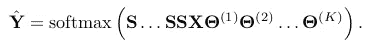

线性 GCN 被称为 SGC，在去除了 GCN 的非线性功能之后

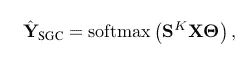

简化的 SGC 方程(相当于线性化的方程 1)

这是**简单图形卷积的方程。**我们可以清楚地看到，这个模型被简化为一个简单的预处理步骤，采用直接多类回归。多酷啊！需要注意的一点是，当 S 和 X 都是输入时，上面的等式有一个可学习的参数**θ**。所以 **S** ᵏ **X** 可以重写给 x ':

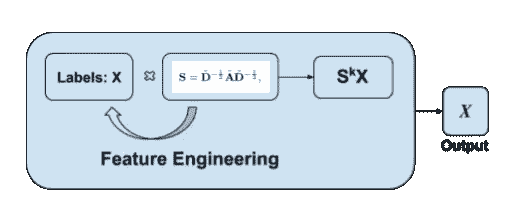

***X*** (输出)相当于作者的特征工程化输入|图像

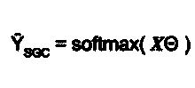

得到的分类器方程

因此，我们可以在下图中看到，我们如何对 GCNs 进行逆向工程，并实现删除非线性层，这有助于我们理解跳跃只不过是机器学习中的一个特征工程步骤。这部分的实现可以在 [GitHub](https://github.com/pulkit1joshi/SGC) 上找到。此外，SGC 可以总结为下图所示。

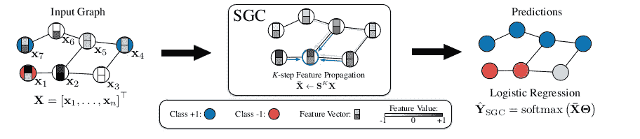

简单图卷积| [来源](https://arxiv.org/abs/1902.07153) [1]

# 图形卷积网络的数学基础

这一部分将解释 GCNs 的数学流程，给出[图卷积网络的半监督分类](https://arxiv.org/abs/1609.02907)【3】

*   **图拉普拉斯:**

矩阵是表示图形的好方法。我们将图拉普拉斯算子及其归一化版本定义为:

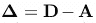

图拉普拉斯(D =对角矩阵，A =邻接矩阵)

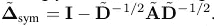

标准化形式

*   **特征分解**

每个半定矩阵都可以分解成以下形式:

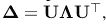

特征分解

其中 **U** 包括标准正交特征向量，λ是以特征值作为其对角元素的对角矩阵。
现在，你有正交向量，我们能定义关于它们的图形傅立叶变换吗？绝对是！阅读关于 [DFT](https://en.wikipedia.org/wiki/DFT_matrix) 的内容。我们把 x 的傅立叶变换写成:

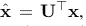

傅里叶变换

和逆变换为:

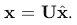

逆变换

*   **根据傅立叶变换的图形卷积**

现在，我们从信号和系统知识中知道，我们可以把任意两个信号的卷积写成它们在傅里叶变换中的乘积！使用这个我们得到:

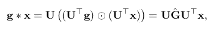

滤波器与输入的卷积

这里 **G** 是以对角线作为滤波器系数的对角矩阵(你要学习的参数)
最后，我们使用一个使用 k 阶多项式拉普拉斯的近似来给出:

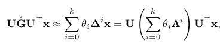

**G** 是大括号内的近似值！！

*   **最终表情**

上述近似通过使用(导致一阶切比雪夫滤波器)进一步近似:

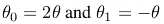

给予

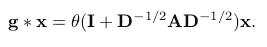

基本 GCN 卷积运算

此外，矩阵 I + D^(-1/2)AD^(-1/2 可写成:

其中 A' = A + I，D' = D + I。

# 简单图形卷积和低通滤波

我们导出的传播矩阵 S 是一阶切比雪夫滤波器。根据归一化拉普拉斯算子，它可以写成:

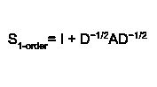

因此，第 k 阶滤波器系数变为:

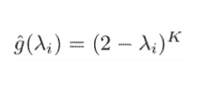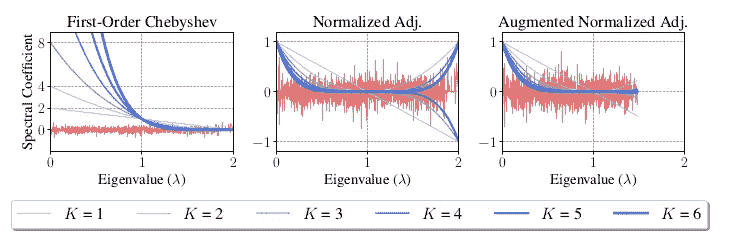

Cora 数据集上不同传播矩阵的特征(红色)和过滤器(蓝色)光谱系数|来自 [SGC 论文](https://arxiv.org/abs/1902.07153) [1]的结果

如图所示，K 值越大，滤波器系数爆炸并过度放大信号。

归一化的 S 给出了归一化的拉普拉斯算子，其进一步影响特征值

这就是在 GCN 帮助中使用*重正化技巧*的地方。通过重正化，滤波器系数变成重正化传播矩阵的多项式。

此外，添加自环γ > 0 后，归一化图拉普拉斯的最大特征值变小

# 结论

gcn 是神经网络复兴的结果，神经网络直接进化为复杂的网络来研究。在这里，GCN 被简化成它可能的前身 SGC。首先，我们研究了 GCNs 的工作原理，然后将其逆向工程为一个*简化的回归模型，并通过特征工程*增加了复杂性*。*进一步使用 GCNs 的数学表达式，网络被表示为切比雪夫滤波器！从而简化了网络！

# 接下来呢？

关于 SGC 和 GCNs 实现和比较更多细节，可以在参考文献[2]中找到作者实现。我在 CORA 数据集上实现的 SGC 可以在 [GitHub](https://github.com/pulkit1joshi/SGC) 上找到。

**参考文献:**

1.  [图卷积网络|图论 2020](https://www.youtube.com/watch?v=-EO5diMJskk)
2.  [吴，费利克斯，等，“简化图卷积网络” *arXiv 预印本 arXiv:1902.07153* (2019)。](https://arxiv.org/pdf/1902.07153.pdf)
3.  实现可以在 [GitHub](https://github.com/pulkit1joshi/SGC) 上找到
4.  作者编写的简单图形卷积的代码可在 [Github](https://github.com/Tiiiger/SGC) 上获得
5.  基普夫、托马斯·n 和马克斯·韦林。"图卷积网络的半监督分类." *arXiv 预印本 arXiv:1609.02907* (2016)。