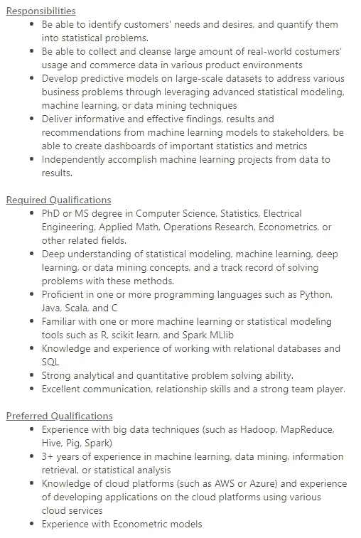
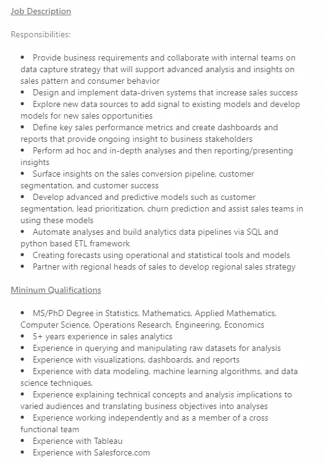

# 对您进入数据科学的道路进行逆向工程

> 原文：<https://towardsdatascience.com/reverse-engineering-your-path-into-data-science-fc54718fce08?source=collection_archive---------24----------------------->

## *如何组织你的自学之旅并获得你梦想中的角色*

自学成为数据科学家似乎是一项几乎不可能完成的任务。有太多的东西要学，太多的东西要理解，因此，关于如何成为一名数据科学家，互联网上不乏各种观点。如果没有一些指导，很难判断你是否在朝着正确的方向前进。

别害怕。自学路线比你想象的要容易管理得多。用正确的策略武装自己的技能，你可以学习如何成为一名非常受欢迎的数据科学家，并获得你梦想的角色。

在这篇文章中，我将向您展示如何通过逆向工程实现您梦想中的数据科学角色。我们都是从某个地方开始我们的旅程的，我希望为你进入这个行业提供第一块垫脚石。

**逆向工程路径——定义你的目标**

逆向工程是把一个物体拆开，看看它是如何工作的，以便复制或增强所述物体。这里的目标将是你的最终目标，*定义你梦想中的角色是什么*。你梦想的数据科学角色是什么？请考虑以下情况:

*   你想从事什么领域的工作？你想解决什么样的商业问题？你想贡献什么样的工作？
*   你认为自己会使用哪些技术？你很想了解哪些技术？为什么？
*   你想要什么样的工作文化？你是想从一家规模较小的初创公司开始，还是想从一家已经很有名气的公司开始？或许介于两者之间？

一旦你有了想成为哪种数据科学家的想法，就很容易逆向开发你需要学习的技能来实现你的目标。记住*你的最终目标会随着你旅程的进展而改变*。随着学习的进展，你会发现你喜欢使用哪种数据和技术。

如果你还不完全确定你的理想角色是什么，不要担心。对你来说，列出你不想要的角色可能是个更好的主意。这样你就可以集中精力探索你可能喜欢的技术和行业。

**所有这一切的关键是你的旅程是一个迭代的过程，它永远不会是完美的**。一旦你开始并开始前进，道路就会变得越来越清晰。

**找到你的垫脚石**

既然你已经对自己想成为什么样的数据科学家有了一些大致的了解，我们现在需要找到你有一天真的想成为的真正角色。然后，我们将需要提取所需的技能，以获得面试机会，从而获得上述职位。

根据你刚刚为自己定义的理想角色，*找到 5 个符合你要求的职位*。哪 5 份工作会让你欣喜若狂？

一旦你有了 5 分，是时候让我们为你建立一个技能清单，让你在自学之旅中掌握。这一部分可能有点棘手，因为某些招聘信息对他们想要的技能非常模糊，而其他的则非常具体。在任何情况下，单独通读每一条招聘信息，记下雇主正在寻找的**特定技术和非技术技能**。

然后你要比较和对比这些技能列表，寻找它们之间的共性。你最常看到的共性是“必须学习”的技能，你需要首先掌握的技能。该技能出现得越频繁，该角色的日常操作就越需要它。

那些不太常见的技能将会是更“专业”的技能，这些技能你将会优先考虑最后掌握。这些技能也很重要，但它们更适合特定的角色和行业。

让我们来看看 LinkedIn 上的一些招聘信息，我会告诉你如何提取你需要的信息，为你的旅程制作一份技能清单:

X 公司数据科学家的工作要求

**我们可以从 X 公司**的招聘启事中获得什么信息？

这一职位的强有力候选人似乎需要具备以下条件:

*   对统计学有很好的理解，具有优秀的批判性思维技能和定量问题解决技能
*   非常强的沟通和数据可视化技能
*   精通编程语言(最好是 Python)
*   精通 SQL
*   精通数据清理、操作和可视化
*   深度学习和机器学习
*   有大数据、云平台和计量经济学模型的经验更好(但不是必需的)。

这是一个非常好的技能列表，事实上，大多数核心数据科学家技能都列在第一个列表中。但是，让我们来看看另一家公司的第二份招聘启事，这样你就能明白我的意思了:)在阅读过程中，请注意与第一份工作描述的一些相似之处:

Y 公司数据科学家职位的工作描述

我们可以从 Y 公司的招聘启事中获得什么信息？

这一职位的强有力候选人似乎需要具备以下条件:

*   对统计学有很好的理解，具有优秀的批判性思维能力
*   非常强的沟通和数据可视化技能。
*   编程语言(最好是 Python，因为它是最流行的)
*   结构化查询语言
*   数据清理和数据操作。
*   机器学习(对特定模型有不同的侧重)
*   时间序列分析(预测)
*   对于这一特定角色，销售背景将受到高度重视

第二个角色比第一个角色更专业，但是你看到两者之间的所有相似之处了吗？使用这种逆向工程策略可以消除在计算成为数据科学家需要学习哪些技能时的猜测。雇主实际上是在告诉你他们想让你知道的事情。想象一下，通过 5 个职位，你将能够收集到多少额外的信息，非常令人兴奋。

一旦你完成了最常见和最特殊的技能的汇总，你就为你的学习创造了“检查点”,为了成功，你必须带你去那里。现在，我们实际上可以构建您自己的行业发展道路

**建设你的道路**

现在你知道了什么是踏脚石，你可以开始规划你想如何开始你的学习。没有正确或错误的方法，但理想情况下，您会希望首先专注于数据科学家的核心技能，从学习 Python 语法开始。我建议在学习熊猫、Numpy 和 SciPy 之前先学习属性(或者你可以一起学习:)

大多数职位招聘都需要以下技能(我也提到了与之相关的 Python 库):

*   统计数据(熟悉使用 SciPy 和 Numpy 来分析关于数据的统计数据)
*   Python 编程(免费学习 Python 基础知识[这里](https://automatetheboringstuff.com/)
*   数据清理、争论和形状操纵(Numpy 和 Pandas)
*   数据可视化(Pandas、Seaborn、Matplotlib、Pyplot 等等)
*   监督和非监督机器学习(Scikit Learn)

学习上面的 Python 包的一个很好的资源是[Python 数据科学手册](https://tanthiamhuat.files.wordpress.com/2018/04/pythondatasciencehandbook.pdf)以及搜索文档的特定库

**学习策略**

作为给你的临别礼物，我强烈推荐看看这篇关于基于项目的学习的文章。因为您有如此多的东西要学，有如此多的技能要掌握，所以您会希望通过创建不同的项目来开发您在真实世界数据上的技能，从而在真实世界的场景中实践它们。

通过使用基于项目的学习，你不仅可以更容易地单独掌握每项技能，还可以开发将多项技能结合使用的方法，以从数据中获得强大的洞察力。如果您需要访问真实世界的数据资源，请点击这里查看这篇文章。随着你完成越来越多的项目，并进一步发展你的技能，你可以随时回到你以前的项目，并对它们进行修改，使它们成为你简历中的最佳分析。

好吧，那对我来说就够了。非常感谢您花时间阅读我的文章，我希望我能够为您的数据科学之旅提供一点帮助。下次再见，祝你这周过得愉快！

我叫 Kishen Sharma，是一名数据科学家，在旧金山湾区工作。我的使命是教授和激励全世界有抱负的数据科学家。

请随时在 [Instagram](https://www.instagram.com/keesh_codes/) 上与我联系，并在这里查看我的附加内容[。你也可以在这里查看我的其他文章](http://linktr.ee/keesh_codes)。