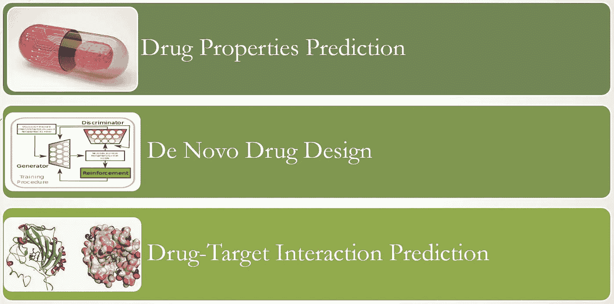
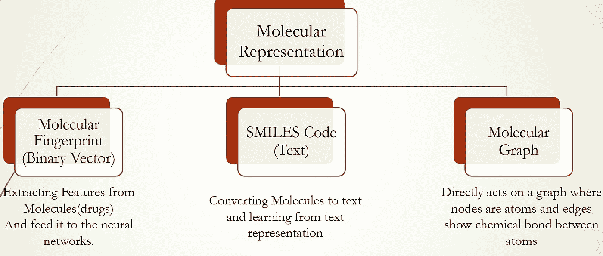
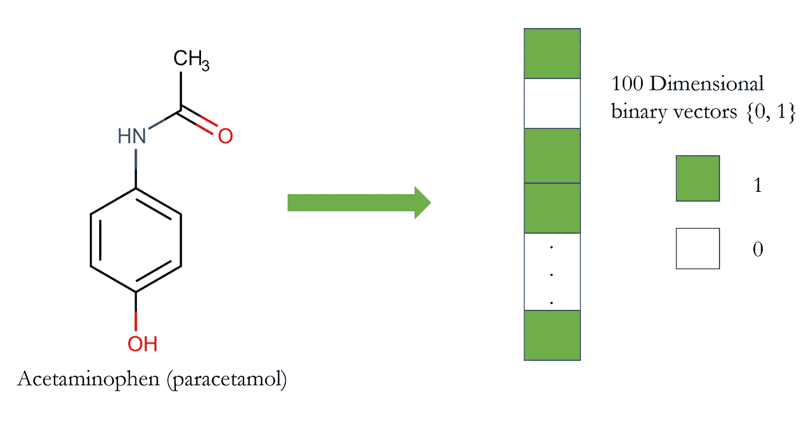
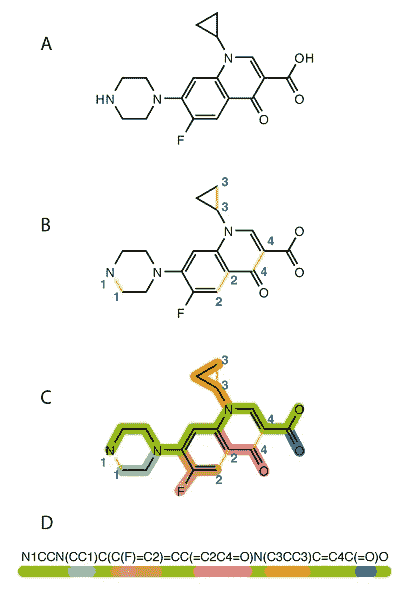
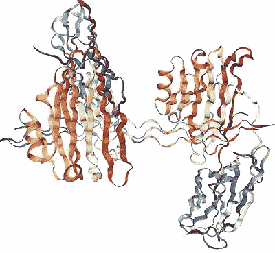
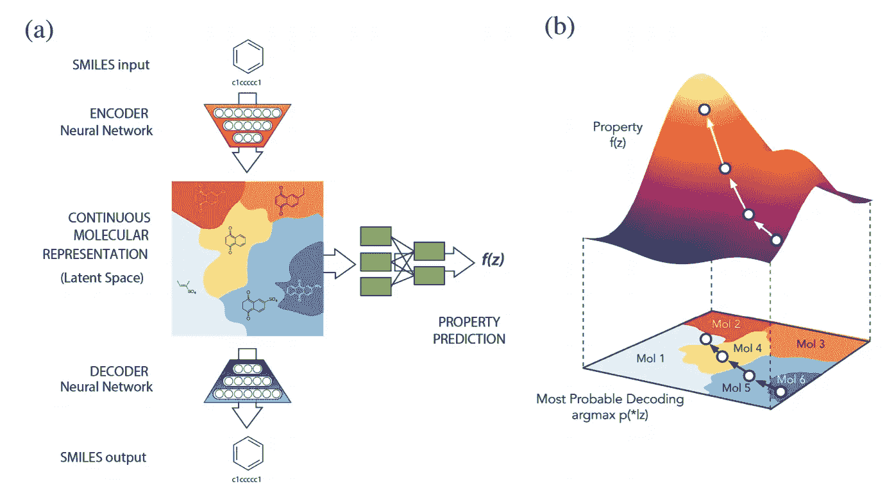
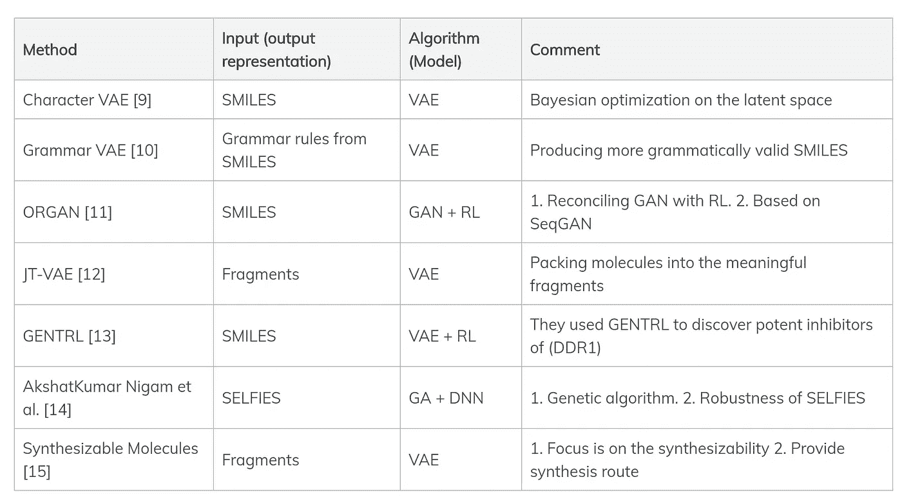

# 综述:药物发现中的深度学习

> 原文：<https://towardsdatascience.com/review-deep-learning-in-drug-discovery-f4c89e3321e1?source=collection_archive---------11----------------------->

深度学习算法已经在许多不同的任务中实现了最先进的性能。卷积神经网络(CNN)可用于在图像分类、对象检测和语义分割任务中实现出色的性能。递归神经网络(RNNs)及其后代，如 LSTMs 和 GRUs 以及 transformers，是人们首先想到的解决神经语言翻译、语音识别等问题的方法，甚至可以用来生成新的文本和音乐。

药物发现是可以从深度学习的成功中受益匪浅的领域之一。药物发现是一项非常耗时且昂贵的任务，深度学习可以用来使这一过程更快、更便宜。
最近，围绕这个主题发表了许多论文，在这篇文章中，我将详细回顾一下如何在这个领域使用深度学习。

我可以将深度学习在药物发现中的应用主要分为三个不同的类别:

*   药物性质预测
*   从头药物设计
*   药物-靶标相互作用(DTI)预测

图 1:深度学习可以帮助和促进药物发现的三个领域。

在下文中，我试图详细阐述每一类并讨论一些相关的论文。

# 药物性质预测

机器学习问题大致分为三个子组:监督学习、非监督学习(自我监督学习)和强化学习。药物性质预测可以被框架化为监督学习问题。算法的输入是药物(化合物)，输出是药物性质(例如，药物毒性或溶解度)。

*   输入:一种药物(小分子)
*   输出:0–1 个标签，表示药物是否具有某些特性。它也可以被设计为多标签分类或回归任务。

图 2:表示分子的不同方式。

因此，有不同的方法来表示一种药物(化合物):

*   分子指纹
*   基于文本的表示(例如，微笑、InChIKey、自拍)
*   图形结构(二维或三维图形)

## 分子指纹

在机器学习框架的输入管道中表示药物的一种方式是分子指纹。最普遍的指纹类型是一系列二进制数字(位),代表分子中特定亚结构的存在或不存在。因此，药物(小化合物)被描述为 0 和 1 的向量(阵列)。

图 3:如何用二元向量表示一个分子。

它在文献中被广泛使用[1]。但是，很明显，将分子编码为矢量不是一个可逆的过程(这是一个有损变换)；也就是说，我们不能从指纹中完全重建一个分子，这表明在这个操作过程中丢失了许多信息。

代表一个小分子有许多不同的指纹。你可以跟随这份[指南](https://www.rdkit.org/UGM/2012/Landrum_RDKit_UGM.Fingerprints.Final.pptx.pdf)【2】去了解更多。

## 微笑代码

另一种表示分子的方式是将结构编码成文本。它是将图形结构数据转换为文本内容并在机器学习管道中使用文本(编码字符串)的方式。标准之一和最流行的代表是简化的分子输入行输入系统(SMILES)。转换后，我们可以使用自然语言处理(NLP)文献中的强大算法来处理药物，例如，预测属性、副作用，甚至化学-化学相互作用。孙英权【3】。

图 4:如何用 SMILES 代码表示一个分子。

如果你有兴趣了解更多关于微笑的知识，你可以点击这个[链接](http://opensmiles.org/opensmiles.html)【4】。虽然 SMILES 在化学家和机器学习研究人员中非常流行，但它不是唯一可用于表示药物的基于文本的表示。InChIKey 是另一个你可以在文学作品中找到的流行代表。 [Mario Krenn 等人](https://arxiv.org/abs/1905.13741) [5]提出的自拍照(自引用嵌入字符串)，基于乔姆斯基 type-2 语法。我在从头药物设计部分更多地谈论它们(优点)。

## 图形结构数据

对图结构数据进行深度学习的流行，如图卷积网络[ [Thomas Kipf](https://tkipf.github.io/graph-convolutional-networks/) ] [6]，使得直接使用图数据作为深度学习管道的输入成为可能。
例如，化合物可以认为是一个图，其中顶点是原子，原子之间的化学键是边。我们已经看到在图形神经网络领域取得了显著的成功
，并且有诸如[深度图形库](https://www.dgl.ai/)、 [PyTorch-Geometric](https://github.com/rusty1s/pytorch_geometric) 、 [PyTorch-BigGraph](https://github.com/facebookresearch/PyTorch-BigGraph) 等库专门致力于这项工作。

# 药物-靶标相互作用预测

蛋白质在生物中起着核心作用；即蛋白质是生物细胞内外大多数功能的关键角色。例如，有一些蛋白质负责凋亡、细胞分化和其他关键功能。另一个重要的事实是，蛋白质的功能直接依赖于它的三维结构。即改变蛋白质的结构可以显著改变蛋白质的功能，这是药物发现的重要事实之一。许多药物(小分子)被设计成与特定的蛋白质结合，改变它们的结构，从而改变功能。此外，至关重要的是要注意到，仅改变一种蛋白质的功能就能对细胞功能产生巨大影响。蛋白质直接相互作用(例如，你可以看到蛋白质-蛋白质网络)，而且一些蛋白质充当转录因子，这意味着它们可以抑制或激活细胞中其他基因的表达。因此，改变一种蛋白质的功能可以对细胞产生巨大的影响，并可以改变不同的细胞途径。

图 5:胶原粘附素和胶原复合物结构。

因此，计算药物发现中的一个重要问题是预测特定药物是否能与特定蛋白质结合。这是一个被称为药物-靶标相互作用(DTI)预测的概念，近年来受到了极大的关注。

我们可以按如下方式构建 DTI 预测任务:

*   描述:预测化合物和蛋白质结合亲和力的二元分类(它可以形式化为回归任务或二元分类)
*   输入:化合物和蛋白质表示
*   输出:0–1 或[0–1]中的实数

[冯庆元等](https://arxiv.org/abs/1807.09741)【7】提出了一个基于深度学习的药物-靶标相互作用预测框架。大多数用于 DTI 预测的深度学习框架都将化合物和蛋白质信息作为输入，但区别在于它们使用什么表示来输入神经网络。正如我在上一节中提到的，化合物可以用多种方式表示(二进制指纹、微笑代码、从图形卷积网络提取的特征)，蛋白质也可以有不同的表示方式。根据输入表示，可以使用各种架构来处理 DTI 预测。
例如，如果我们要对化合物和蛋白质使用基于文本的表示(化合物和氨基酸的 SMILES 代码或蛋白质的其他基于序列的描述符)，首先想到的就是基于 RNNs 的架构。

[Matthew Ragoza 等人](https://pubs.acs.org/doi/10.1021/acs.jcim.6b00740)提出了一种利用卷积神经网络进行蛋白质配体评分的方法【8】。他们利用蛋白质配体的三维(3D)表示，而不是基于文本的表示。因此，他们决定使用卷积神经网络，该网络可以作用于这种 3D 结构，并提取有意义的适当特征来预测蛋白质配体结合亲和力。

最近， [Bo Ram Beck et al.](https://www.biorxiv.org/content/10.1101/2020.01.31.929547v1) 建议采用分子转换器药物靶点相互作用(MT-DTI)来识别可作用于 2019-nCoV 病毒蛋白的市售药物。

虽然提出深度学习算法用于计算机模拟 DTI 预测已经成为一种趋势，并且在某些情况下取得了令人印象深刻的结果，但这些论文非常相似，我在其中发现的唯一创新是输入表示的选择，以及随后对输入进行操作的架构。因此，我可以将这项任务总结如下:

*   查找包含化合物和目标信息的数据库，以及它们是否相互作用(例如，[缝合数据库](http://stitch.embl.de/))。
*   最常见的是，在 DTI 预测中，网络将一对化合物和蛋白质作为输入。
*   你应该选择你认为适合化合物和蛋白质的表示法。我回顾了其中一些，但还有其他的表述。
*   根据您选择的表示，您应该考虑合适的神经网络架构来处理输入。根据经验，在基于文本的输入表示的情况下，可以使用基于 RNNs 的架构(GRU、LSTM……)和转换器，在图像或 3D 结构的情况下，可以使用卷积神经网络。
*   该问题可以被认为是二元分类(化合物是否与靶结合)或回归(预测化合物和蛋白质之间的亲和力强度)。

所以，这就是 DTI 预测。起初，这可能看起来是一个困难和具有挑战性的任务，但是我读过的论文使用了非常简单的技术和策略来解决这个问题。

# 从头药物设计

到目前为止，我们只是观察了判别算法；即，给定一种药物，算法可以预测副作用和其他相关属性，或者给定化合物-蛋白质对，它将预测它们是否可以结合。然而，如果我们对设计一种具有某些特性的化合物感兴趣呢？例如，我们希望设计一种化合物，它可以结合特定的蛋白质，修饰某些途径，并且不与其他途径相互作用，还具有某些物理性质，如特定的溶解度范围。
我们不能用我们在前面章节中介绍的工具包来解决这个问题。这个问题最好在生成模型的领域中实现。
生成模型，从自回归算法、归一化流、变分自动编码器(VAEs)到生成对抗网络(GANs)，已经在机器学习社区中变得普遍和广泛。然而，在重新设计药物的任务中利用它们的尝试并不是很早。

问题是，产生一种化合物，给定某些期望的性质。显而易见，这比我们在上一节中讨论的另外两个问题更难。
可能的化学分子空间非常大，在这个空间中寻找合适的药物非常耗时，几乎是不可能完成的任务。我看到了应用生成模型设计化学分子的最新趋势。虽然文献中有一些有希望的结果，但这一领域还处于起步阶段，需要更成熟的方法。在这里，我将回顾我在这一领域读过的一些最好的论文。

你可以在文献中找到很多论文，这些论文把微笑作为输出，最后，把微笑转换成化学空间。
[Rafael Gomez-Bombarelli 等人](http://pubs.acs.org/doi/full/10.1021/acscentsci.7b00572)提出了一种利用数据驱动的分子连续表示进行自动化学设计的方法【9】。

图 5:使用变分自动编码器生成具有期望属性的化合物。来源:拉斐尔·戈麦斯-邦巴里等人。

他们使用 VAEs 来产生分子。输入表示是 SMILES 代码，输出也是 SMILES 代码。
本文中的巧妙之处在于使用潜在空间(连续空间)中的高斯过程来达到具有期望属性的点。
然后，使用解码器将潜在空间中的该点转换(解码)为 SMILES 码。论文写得很好，绝对值得推荐阅读。
然而问题是，SMILES 码和分子之间并不是一一对应的。即，不是所有产生的代码都可以转换回原始(化学)空间，因此，产生的 SMILES 代码通常不对应于有效分子。

微笑是非常受欢迎的表示，但是它们有一个很大的缺点:微笑不是健壮的表示。即，改变微笑中的一个字符(字符突变)可以将分子从有效变为无效。

[Matt J. Kusner 等人](https://arxiv.org/pdf/1703.01925.pdf)提出了语法 VAE 来专门解决这个问题(产生与有效分子不对应的微笑代码)[10]。
他们不是将 SMILES 字符串直接输入网络并生成 SMILES 代码，而是将 SMILES 代码转换成解析树(通过利用 SMILES 上下文无关语法)。使用语法，他们可以生成更多语法上有效的分子。此外，提交人指出:

> 令人惊讶的是，我们表明，我们的模型不仅更经常地生成有效输出，它还学习了一个更连贯的潜在空间，其中附近的点
> 解码为类似的离散输出。

最近，Mario Krenn 等人提出了另一种基于 VAE 和自拍表现的方法[5]。自拍的主要优点是结实耐用。

但是，这些都是深度学习领域产生小分子的作品的小样本。基于化合物的表示(微笑、自拍、图形……)和生成算法(、甘、标准化流、遗传算法)，您可以在文献中找到不同的方法(下表)。

# 结论

在这篇文章中，我试图回顾深度学习在药物发现中的一些应用。显然，这篇综述并不完整，我也没有时间覆盖更多的领域(我也不想让这篇文章更长)，但我试图为好奇的读者提供参考。我希望这篇文章能鼓励你为这个领域做出贡献，让药物发现变得更便宜，更简单。

# 参考

1.  数据库指纹(DFP):一种表示分子数据库的方法， [Eli Fernández-de Gortari 等人](https://jcheminf.biomedcentral.com/articles/10.1186/s13321-017-0195-1#Sec11)
2.  [RDKit](https://www.rdkit.org/UGM/2012/Landrum_RDKit_UGM.Fingerprints.Final.pptx.pdf) 中的指纹
3.  DeepCCI:用于化学-化学相互作用预测的端到端深度学习， [Sunyoung Kwon](https://arxiv.org/abs/1704.08432)
4.  OpenSMILES 规范。[链接](http://opensmiles.org/opensmiles.html)
5.  自拍:语义约束图的鲁棒表示，以及在化学中的示例应用， [Mario Krenn 等人](https://arxiv.org/abs/1905.13741)
6.  图卷积网络，[托马斯·基普夫](https://tkipf.github.io/graph-convolutional-networks/)
7.  PADME:基于深度学习的药物-靶点相互作用预测框架，[冯庆元等](https://arxiv.org/abs/1807.09741)
8.  用卷积神经网络进行蛋白质-配体评分， [Matthew Ragoza 等人](https://pubs.acs.org/doi/10.1021/acs.jcim.6b00740)
9.  使用数据驱动的连续分子表示进行自动化学设计， [Rafael Gomez-Bombarelli 等人](http://pubs.acs.org/doi/full/10.1021/acscentsci.7b00572)
10.  语法变分自动编码器，[马特 j .库斯纳等人](https://arxiv.org/pdf/1703.01925.pdf)
11.  针对序列生成模型的目标增强型生成对抗网络(ORGAN)， [Gabriel Guimaraes 等人](https://arxiv.org/pdf/1705.10843.pdf)
12.  用于分子图生成的连接树变分自动编码器，[晋文公等](https://arxiv.org/abs/1802.04364)
13.  深度学习能够快速识别有效的 DDR1 激酶抑制剂， [Alex Zhavoronkov 等人](https://www.nature.com/articles/s41587-019-0224-x)
14.  用深度神经网络增强遗传算法以探索化学空间， [AkshatKumar Nigam 等人](https://arxiv.org/abs/1909.11655)
15.  寻找可合成分子的模型，[约翰·布拉德肖等人](https://arxiv.org/abs/1906.05221)。