# 回顾:纽维尔·ECCV 16 年和纽维尔·POCV 16 年——堆叠沙漏网络(人体姿势估计)

> 原文：<https://towardsdatascience.com/review-newell-eccv16-and-newell-pocv-16-stacked-hourglass-networks-human-pose-estimation-a9eeb76d40a5?source=collection_archive---------22----------------------->

## 使用堆叠沙漏网络的自下而上和自上而下的重复处理，胜过了 [DeepCut](https://medium.com/@sh.tsang/review-deepcut-deepercut-multi-person-pose-estimation-human-pose-estimation-da5b469cbbc3) 、 [IEF](https://medium.com/towards-artificial-intelligence/review-ief-iterative-error-feedback-human-pose-estimation-a56add160fa5) 、[汤普森 CVPR 15](/review-tompson-cvpr15-spatial-dropout-human-pose-estimation-c7d6a5cecd8c?source=post_page---------------------------)和 [CPM](https://medium.com/@sh.tsang/review-cpm-convolutional-pose-machines-human-pose-estimation-224cfeb70aac?source=post_page---------------------------) 。

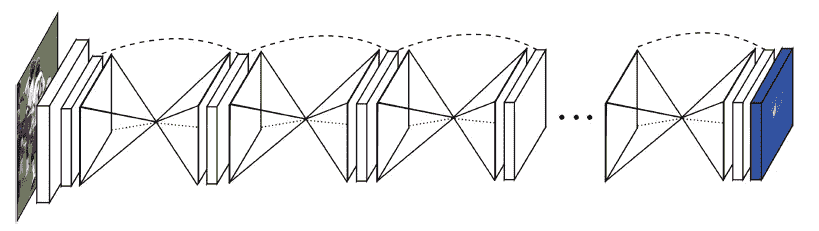

**多重堆叠沙漏网络**

在这个故事里，**16 级的纽维尔·ECCV 和 16 级的纽维尔·POCV**，由**密执安大学**创作，回顾。在纽维尔·POCV 的 16 中，仅使用了 2 个堆叠沙漏网络，而在纽维尔·ECCV 的 16 中，使用了 8 个堆叠沙漏网络。ECCV 的版本更详细，引用了 1500 多次。因此，这里介绍 ECCV 的情况。( [Sik-Ho Tsang](https://medium.com/u/aff72a0c1243?source=post_page-----a9eeb76d40a5--------------------------------) @中)。

# 概述

1.  **网络架构**
2.  **中间监督**
3.  **一些训练细节**
4.  **消融研究**
5.  **与 SOTA 方法的比较**
6.  **进一步分析**

# **1。网络架构**

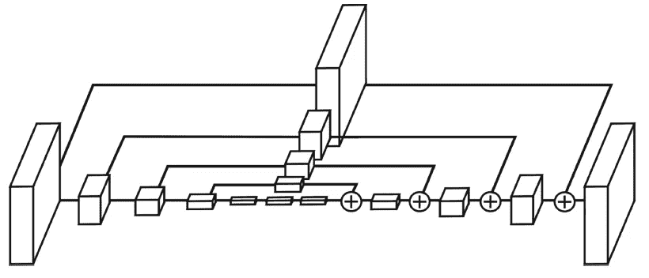

**单个“沙漏”模块(不包括最后的 1×1 层)。每个盒子对应于如下剩余模块。**

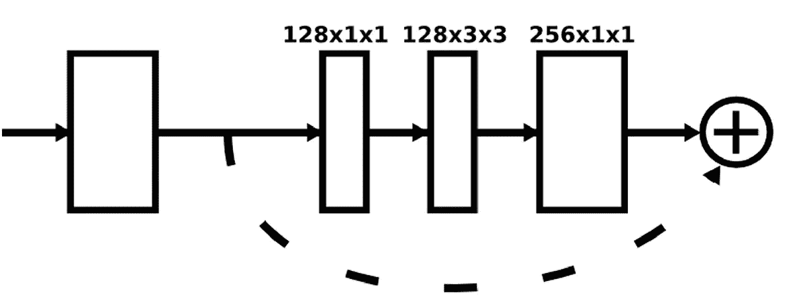

**一个剩余模块。**

*   **卷积层和最大池层**用于处理低至极低分辨率的特征。
*   达到最低分辨率后，网络开始自上而下的上采样序列和跨尺度的特征组合。
*   对于上采样路径，**完成较低分辨率的最近邻上采样****，随后是两组特征的逐元素相加**。
*   在达到网络的输出分辨率后，**应用两轮连续的 1×1 卷积**来产生最终的网络预测。
*   最终设计大量使用了**剩余模块**。
*   从不使用大于 3×3 的过滤器。

# 2.中间监督

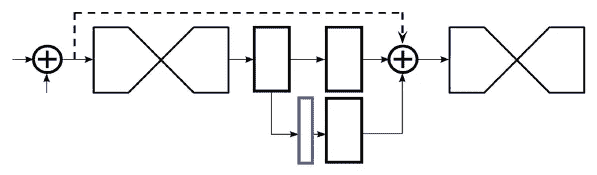

**中间监督**

*   **网络分裂并产生一组热图(蓝色轮廓),其中可以应用损失**。
*   **1×1 卷积重新映射热图**以匹配中间特征的通道数量。这些要素与前面沙漏中的要素一起添加。
*   在最终的网络设计中，使用了**八个沙漏**。

# 3.**一些训练细节**

*   **FLIC** : 5003 张图片(3987 次训练，1016 次测试)取自电影。
*   **MPII 人体姿态** : 25k 带注释的图像，供多人使用，提供 40k 带注释的样本(28k 训练，11k 测试)。
*   约 3000 个样本的验证集。
*   然后，所有输入图像的大小都被调整为 256×256 像素。我们进行数据扩充，包括旋转(30 度)和缩放(0.75-1.25 度)。
*   Torch7，在 12GB 的 NVIDIA TitanX GPU 上训练需要 3 天左右。
*   [使用批量标准化](https://medium.com/@sh.tsang/review-batch-normalization-inception-v2-bn-inception-the-2nd-to-surpass-human-level-18e2d0f56651)。
*   为了生成最终的测试预测，我们通过网络运行原始输入和图像的翻转版本，并将热图平均在一起。

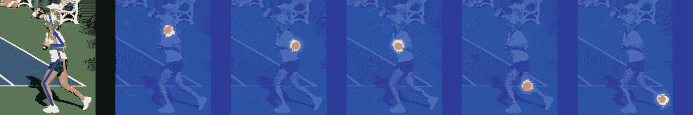

**示例输出(从左到右:脖子、左肘、左手腕、右膝盖、右脚踝)**

*   如上所示，网络的最终预测是给定关节的热图的最大激活位置。

# **4。消融研究**

## 4.1.变体

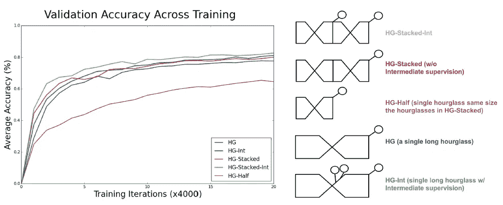

**随着培训的进展验证准确性**

*   **HG-Half** :表现最差的单个沙漏。
*   **HG:** 单个长沙漏，性能更好。
*   **HG-Int** :单个长沙漏，中间监督，性能更好。
*   **HG-Stack** :两个堆叠沙漏但没有中间监管，性能类似。
*   **HG-Stack-Int** :两个堆叠沙漏中间监督，性能最佳。

## 4.2.沙漏数

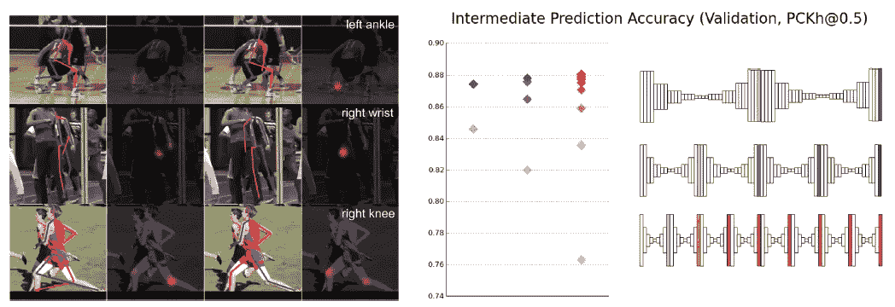

*   **左**:示例验证图像，说明从中间阶段(第二个沙漏)(左)到最终预测(第八个沙漏)(右)的预测变化。
*   **右**:比较不同堆叠方式下网络中间阶段的验证精度。
*   从 87.4%到 87.8%再到 88.1 %的每一次叠加，最终性能都会有适度的提高。

# 5.**与 SOTA 方法的比较**

## 5.1.警察

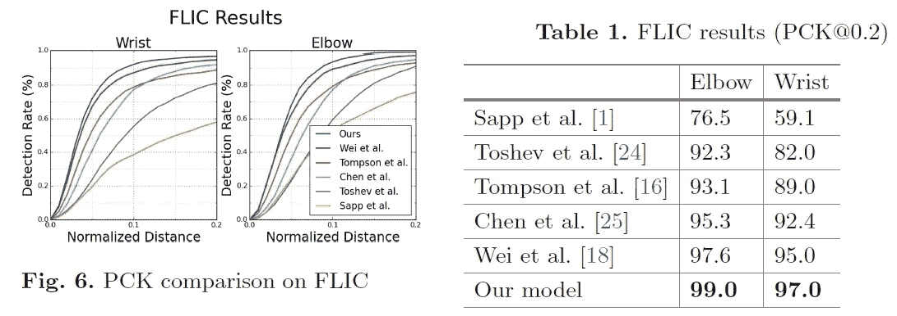

*   99%的 PCK@0.2 精度在肘部，97%在腕部。
*   所提出的方法优于 SOTA 的方法，例如 [DeepPose](/review-deeppose-cascade-of-cnn-human-pose-estimation-cf3170103e36?source=post_page---------------------------) 、[汤普森 CVPR 15](/review-tompson-cvpr15-spatial-dropout-human-pose-estimation-c7d6a5cecd8c?source=post_page---------------------------)和 [CPM](https://medium.com/@sh.tsang/review-cpm-convolutional-pose-machines-human-pose-estimation-224cfeb70aac?source=post_page---------------------------) 。

## 5.2.MPII

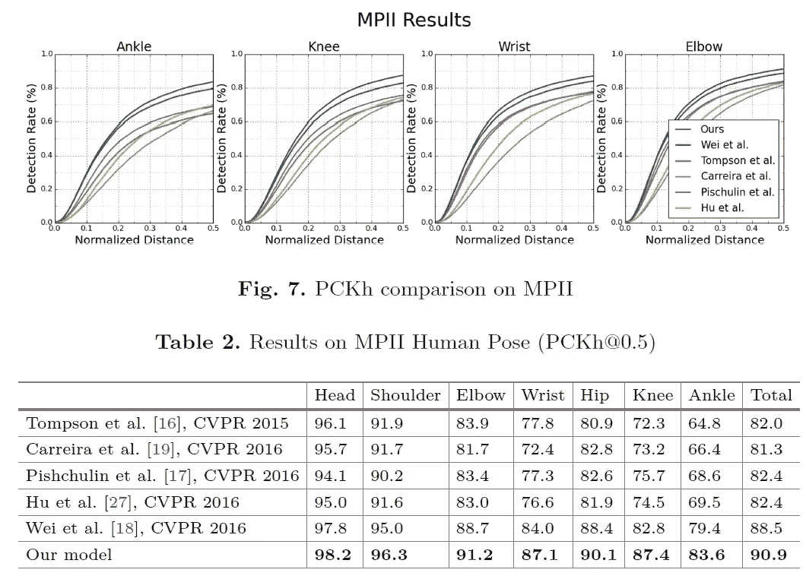

*   所提出的方法优于 SOTA 的方法，包括 [DeepCut](https://medium.com/@sh.tsang/review-deepcut-deepercut-multi-person-pose-estimation-human-pose-estimation-da5b469cbbc3) 、 [IEF](https://medium.com/towards-artificial-intelligence/review-ief-iterative-error-feedback-human-pose-estimation-a56add160fa5) 、[汤普森 CVPR](/review-tompson-cvpr15-spatial-dropout-human-pose-estimation-c7d6a5cecd8c?source=post_page---------------------------)和 [CPM](https://medium.com/@sh.tsang/review-cpm-convolutional-pose-machines-human-pose-estimation-224cfeb70aac?source=post_page---------------------------) 。
*   在像手腕、肘部、膝盖和脚踝这样的困难关节上，所提出的方法在 SOTA 结果的基础上平均提高了 3.5% (PCKh@0.5)，平均错误率从 16.3 %下降到 12.8%。
*   最终肘关节准确率为 91.2%，腕关节准确率为 87.1 %。

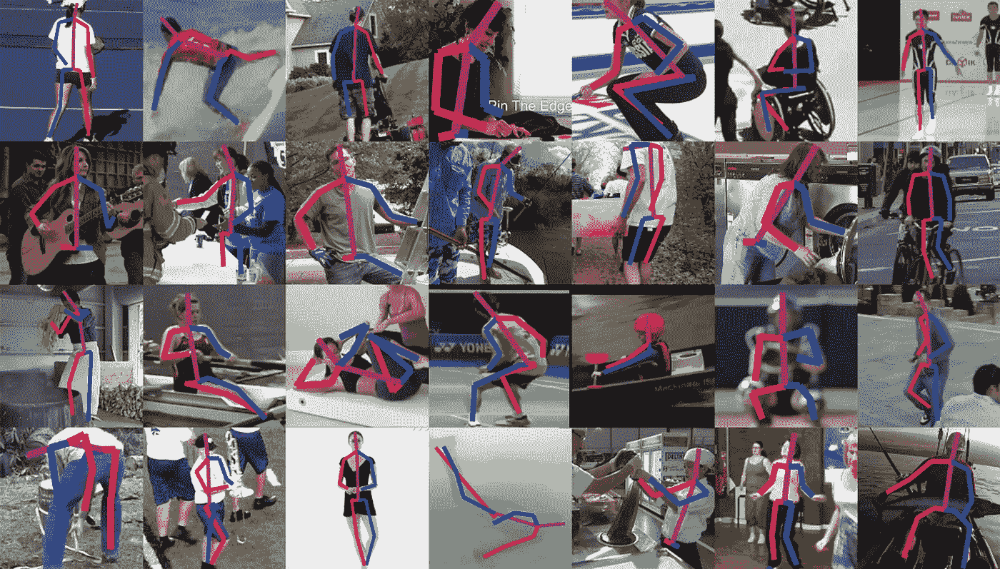

**MPII 的一些例子**

# 6.进一步分析

## 6.1 多人

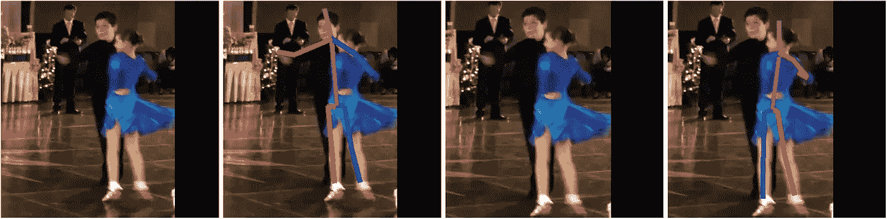

**多个人靠在一起甚至重叠**

*   检测多人超出了本文的范围。但是作者仍然分析它。
*   通过轻微平移和改变输入图像的比例，检测到不同的人或没有人。

## 6.2.闭塞

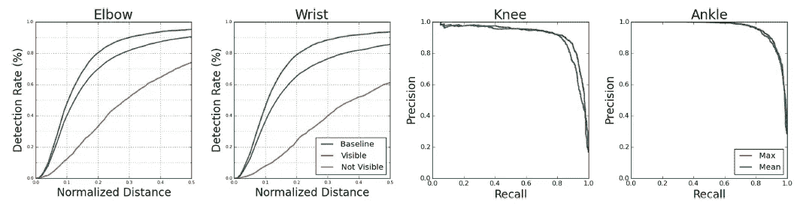

**左图** : PCKh 曲线，验证比较仅考虑可见(或不可见)接头时的性能。**右**:显示预测一个关节是否存在注释的精确度的精确召回曲线。

*   在仅考虑可见关节的情况下，腕部准确度从 85.5%上升到 93.6%(验证性能略差于测试集性能 87.1 %)。另一方面，在完全闭塞的关节上的性能是 61.1 %。
*   对于肘部，对于可见关节，准确率从 90.5%到 95.1%，对于遮挡关节，准确率下降到 74.0%。
*   在存在注释的情况下，获得了 AUC 为 92.1%的膝盖和 AUC 为 96.0%的脚踝。这是在 2958 个样本的验证集上完成的，其中 16.1%的可能膝盖和 28.4%的可能脚踝没有地面真实注释。

## 参考

【2016 ECCV】【纽维尔·ECCV’16[用于人体姿态估计的堆叠沙漏网络](https://arxiv.org/abs/1603.06937)

【2016 POCV】【纽维尔·POCV’16用于人体姿态估计的堆叠沙漏网络
(我已经下载了但是抱歉现在找不到链接。这是一篇只有 2 页的论文，还不如看 ECCV 版，哈哈。)

# 我以前的评论

**图像分类**[[lenet](https://medium.com/@sh.tsang/paper-brief-review-of-lenet-1-lenet-4-lenet-5-boosted-lenet-4-image-classification-1f5f809dbf17?source=post_page---------------------------)][[alexnet](https://medium.com/coinmonks/paper-review-of-alexnet-caffenet-winner-in-ilsvrc-2012-image-classification-b93598314160?source=post_page---------------------------)][[max out](/review-maxout-network-image-classification-40ecd77f7ce4?source=post_page---------------------------)][[in](/review-nin-network-in-network-image-classification-69e271e499ee?source=post_page---------------------------)][[znet](https://medium.com/coinmonks/paper-review-of-zfnet-the-winner-of-ilsvlc-2013-image-classification-d1a5a0c45103?source=post_page---------------------------)][] [ [感受性-v3](https://medium.com/@sh.tsang/review-inception-v3-1st-runner-up-image-classification-in-ilsvrc-2015-17915421f77c?source=post_page---------------------------) ] [ [感受性-v4](/review-inception-v4-evolved-from-googlenet-merged-with-resnet-idea-image-classification-5e8c339d18bc?source=post_page---------------------------) ] [ [异常](/review-xception-with-depthwise-separable-convolution-better-than-inception-v3-image-dc967dd42568?source=post_page---------------------------)][[mobile netv 1](/review-mobilenetv1-depthwise-separable-convolution-light-weight-model-a382df364b69?source=post_page---------------------------)][[resnet](/review-resnet-winner-of-ilsvrc-2015-image-classification-localization-detection-e39402bfa5d8?source=post_page---------------------------)][[预活化  [ResNeXt](/review-resnext-1st-runner-up-of-ilsvrc-2016-image-classification-15d7f17b42ac?source=post_page---------------------------) ] [ [致密](/review-densenet-image-classification-b6631a8ef803?source=post_page---------------------------) ] [ [金字塔网](https://medium.com/@sh.tsang/review-pyramidnet-deep-pyramidal-residual-networks-image-classification-85a87b60ae78?source=post_page---------------------------)][[drn](/review-drn-dilated-residual-networks-image-classification-semantic-segmentation-d527e1a8fb5?source=post_page---------------------------)][[dpn](/review-dpn-dual-path-networks-image-classification-d0135dce8817?source=post_page---------------------------)][[残馀关注网络【t】](/review-residual-attention-network-attention-aware-features-image-classification-7ae44c4f4b8?source=post_page---------------------------)

**物体检测** [ [过食](https://medium.com/coinmonks/review-of-overfeat-winner-of-ilsvrc-2013-localization-task-object-detection-a6f8b9044754?source=post_page---------------------------) ] [ [R-CNN](https://medium.com/coinmonks/review-r-cnn-object-detection-b476aba290d1?source=post_page---------------------------) ] [ [快 R-CNN](https://medium.com/coinmonks/review-fast-r-cnn-object-detection-a82e172e87ba?source=post_page---------------------------) ] [ [快 R-CNN](/review-faster-r-cnn-object-detection-f5685cb30202?source=post_page---------------------------)][[MR-CNN&S-CNN](/review-mr-cnn-s-cnn-multi-region-semantic-aware-cnns-object-detection-3bd4e5648fde?source=post_page---------------------------)][[DeepID-Net](/review-deepid-net-def-pooling-layer-object-detection-f72486f1a0f6?source=post_page---------------------------)][[CRAFT](/review-craft-cascade-region-proposal-network-and-fast-r-cnn-object-detection-2ce987361858?source=post_page---------------------------)][[R-FCN](/review-r-fcn-positive-sensitive-score-maps-object-detection-91cd2389345c?source=post_page---------------------------)][[离子](/review-ion-inside-outside-net-2nd-runner-up-in-2015-coco-detection-object-detection-da19993f4766?source=post_page---------------------------) [[G-RMI](/review-g-rmi-winner-in-2016-coco-detection-object-detection-af3f2eaf87e4?source=post_page---------------------------)][[TDM](https://medium.com/datadriveninvestor/review-tdm-top-down-modulation-object-detection-3f0efe9e0151?source=post_page---------------------------)][[SSD](/review-ssd-single-shot-detector-object-detection-851a94607d11?source=post_page---------------------------)][[DSSD](/review-dssd-deconvolutional-single-shot-detector-object-detection-d4821a2bbeb5?source=post_page---------------------------)][[yolo v1](/yolov1-you-only-look-once-object-detection-e1f3ffec8a89?source=post_page---------------------------)][[yolo v2/yolo 9000](/review-yolov2-yolo9000-you-only-look-once-object-detection-7883d2b02a65?source=post_page---------------------------)][[yolo v3](/review-yolov3-you-only-look-once-object-detection-eab75d7a1ba6?source=post_page---------------------------)][[FPN](/review-fpn-feature-pyramid-network-object-detection-262fc7482610?source=post_page---------------------------)[[retina net](/review-retinanet-focal-loss-object-detection-38fba6afabe4?source=post_page---------------------------)[[DCN](/review-dcn-deformable-convolutional-networks-2nd-runner-up-in-2017-coco-detection-object-14e488efce44?source=post_page---------------------------)

**语义分割** [ [FCN](/review-fcn-semantic-segmentation-eb8c9b50d2d1?source=post_page---------------------------) ] [ [解码网络](/review-deconvnet-unpooling-layer-semantic-segmentation-55cf8a6e380e?source=post_page---------------------------) ] [ [深层波 1&](/review-deeplabv1-deeplabv2-atrous-convolution-semantic-segmentation-b51c5fbde92d?source=post_page---------------------------)][[CRF-rnn](/review-crf-rnn-conditional-random-fields-as-recurrent-neural-networks-semantic-segmentation-a11eb6e40c8c?source=post_page---------------------------)][] [[fc-denne](/review-fc-densenet-one-hundred-layer-tiramisu-semantic-segmentation-22ee3be434d5?source=post_page---------------------------)][[idw-CNN](/review-idw-cnn-learning-from-image-descriptions-in-the-wild-dataset-boosts-the-accuracy-807eb5ffe371?source=post_page---------------------------)][[说](https://medium.com/@sh.tsang/review-dis-dual-image-segmentation-semantic-segmentation-103477de6cbf)][[sdn](https://medium.com/@sh.tsang/review-sdn-stacked-deconvolutional-network-using-densenet-semantic-segmentation-f929c94906b)][[deep labv 3+](https://medium.com/@sh.tsang/review-deeplabv3-atrous-separable-convolution-semantic-segmentation-a625f6e83b90)

**生物医学图像分割**[][[【T2/DCA】](https://medium.com/datadriveninvestor/review-cumedvision2-dcan-winner-of-2015-miccai-gland-segmentation-challenge-contest-biomedical-878b5a443560?source=post_page---------------------------)][[【u-net】](/review-u-net-biomedical-image-segmentation-d02bf06ca760?source=post_page---------------------------)[[【CFS-fcn】](https://medium.com/datadriveninvestor/review-cfs-fcn-biomedical-image-segmentation-ae4c9c75bea6?source=post_page---------------------------) [ [注意 u-net](https://medium.com/@sh.tsang/review-attention-u-net-learning-where-to-look-for-the-pancreas-biomedical-image-segmentation-e5f4699daf9f)][[ru-net&r2u-net](https://medium.com/@sh.tsang/review-ru-net-r2u-net-recurrent-residual-convolutional-neural-network-medical-image-38945a957df1)][[voxrsnet](https://medium.com/@sh.tsang/review-voxresnet-deep-voxelwise-residual-networks-for-volumetric-brain-segmentation-biomedical-4986df62f590)][[致密电子数码](https://medium.com/@sh.tsang/review-densevoxnet-volumetric-brain-segmentation-biomedical-image-segmentation-9136bb6128dd) ][ [UNet++](https://medium.com/@sh.tsang/review-unet-a-nested-u-net-architecture-biomedical-image-segmentation-57be56859b20)

**实例分割** [ [SDS](https://medium.com/datadriveninvestor/review-sds-simultaneous-detection-and-segmentation-instance-segmentation-80b2a8ce842b?source=post_page---------------------------) ] [ [超列](/review-hypercolumn-instance-segmentation-367180495979?source=post_page---------------------------) ] [ [深度掩码](/review-deepmask-instance-segmentation-30327a072339?source=post_page---------------------------) ] [ [清晰度掩码](/review-sharpmask-instance-segmentation-6509f7401a61?source=post_page---------------------------) ] [ [多路径网络](/review-multipath-mpn-1st-runner-up-in-2015-coco-detection-segmentation-object-detection-ea9741e7c413?source=post_page---------------------------) ] [ [MNC](/review-mnc-multi-task-network-cascade-winner-in-2015-coco-segmentation-instance-segmentation-42a9334e6a34?source=post_page---------------------------) ] [ [实例中心](/review-instancefcn-instance-sensitive-score-maps-instance-segmentation-dbfe67d4ee92?source=post_page---------------------------) ] [ [FCIS](/review-fcis-winner-in-2016-coco-segmentation-instance-segmentation-ee2d61f465e2?source=post_page---------------------------)

**超分辨率**[[SR CNN](https://medium.com/coinmonks/review-srcnn-super-resolution-3cb3a4f67a7c?source=post_page---------------------------)][[fsr CNN](/review-fsrcnn-super-resolution-80ca2ee14da4?source=post_page---------------------------)][[VDSR](/review-vdsr-super-resolution-f8050d49362f?source=post_page---------------------------)][[ESPCN](https://medium.com/datadriveninvestor/review-espcn-real-time-sr-super-resolution-8dceca249350?source=post_page---------------------------)][[红网](https://medium.com/datadriveninvestor/review-red-net-residual-encoder-decoder-network-denoising-super-resolution-cb6364ae161e?source=post_page---------------------------)][[DRCN](https://medium.com/datadriveninvestor/review-drcn-deeply-recursive-convolutional-network-super-resolution-f0a380f79b20?source=post_page---------------------------)][[DRRN](/review-drrn-deep-recursive-residual-network-super-resolution-dca4a35ce994?source=post_page---------------------------)][[LapSRN&MS-LapSRN](/review-lapsrn-ms-lapsrn-laplacian-pyramid-super-resolution-network-super-resolution-c5fe2b65f5e8?source=post_page---------------------------)][[SRDenseNet](/review-srdensenet-densenet-for-sr-super-resolution-cbee599de7e8?source=post_page---------------------------)][【T20

**人体姿势估计**[深层姿势](/review-deeppose-cascade-of-cnn-human-pose-estimation-cf3170103e36?source=post_page---------------------------)][[tompson nips’14](/review-tompson-nips14-joint-training-of-cnn-and-graphical-model-human-pose-estimation-95016bc510c?source=post_page---------------------------)][[tompson cvpr’15](/review-tompson-cvpr15-spatial-dropout-human-pose-estimation-c7d6a5cecd8c?source=post_page---------------------------)][[CPM](https://medium.com/@sh.tsang/review-cpm-convolutional-pose-machines-human-pose-estimation-224cfeb70aac?source=post_page---------------------------)[[fcgn](https://medium.com/@sh.tsang/review-fcgn-fully-convolutional-google-net-human-pose-estimation-52022a359cb3)

**后处理编码解码器**【arcnn】][[【Lin DCC ' 16】](https://medium.com/@sh.tsang/review-cnn-for-h-264-hevc-compressed-image-deblocking-codec-post-processing-361a84e65b94)][[【ifcnn】](https://medium.com/@sh.tsang/review-ifcnn-in-loop-filtering-using-convolutional-neural-network-codec-post-processing-1b89c8ddf417)][[【Li icme ' 17】](https://medium.com/@sh.tsang/review-cnn-for-compressed-image-deblocking-deblocking-44508bf99bdc)[[vrcnn【t】](https://medium.com/@sh.tsang/review-vrcnn-variable-filter-size-residue-learning-cnn-codec-post-processing-4a8a337ea73c)

**生成对抗网络** [ [甘](https://medium.com/@sh.tsang/review-gan-generative-adversarial-nets-gan-e12793e1fb75)