# 表格数据的 GANs

> 原文：<https://towardsdatascience.com/review-of-gans-for-tabular-data-a30a2199342?source=collection_archive---------2----------------------->

我们非常了解 GANs 在现实图像生成方面的成功。但是，它们可以应用于表格数据生成。我们将回顾和检查一些最近的论文，关于表格式甘在行动中。关于最终结果和源代码，可以去 [Github 仓库](https://github.com/Diyago/GAN-for-tabular-data)。

照片由[内特·格兰特](https://unsplash.com/@nateggrant?utm_source=medium&utm_medium=referral)在 [Unsplash](https://unsplash.com?utm_source=medium&utm_medium=referral) 上拍摄

> 看看我的机器和深度学习博客[https://diyago.github.io/](https://diyago.github.io/)

# 甘是什么

GAN 由两个深层网络组成:发生器**和鉴别器**【1】**。**两人同时训练。通常，模型结构和训练过程是这样表示的:****

**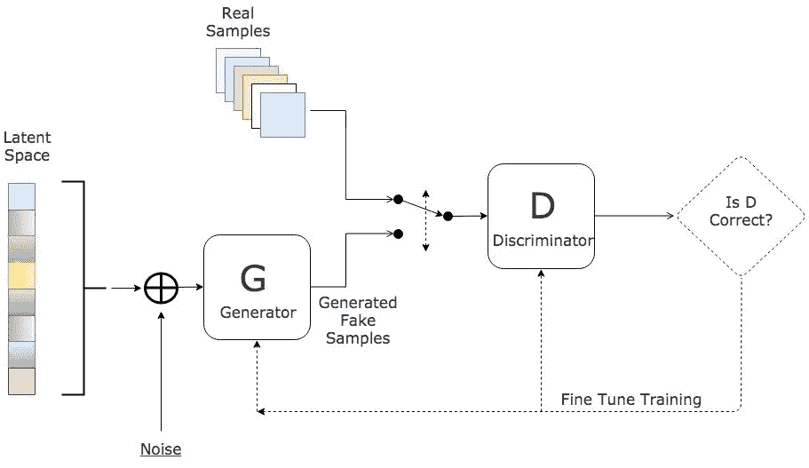**

**GAN 培训管道。什么是生成性敌对网络？【1】**

****发生器**的任务是产生样本，样本不会被**鉴别器**从真实样本中区分出来。我不会在这里给出太多细节，但如果你想深入研究它们，你可以阅读媒体[帖子](https://medium.com/@jonathan_hui/gan-whats-generative-adversarial-networks-and-its-application-f39ed278ef09)和[伊恩·j·古德费勒的原文](https://arxiv.org/abs/1406.2661)。**

**最近的架构，如 StyleGAN 2，可以产生出色的照片级逼真图像。**

****

**由 StyleGAN 2，S[source](https://arxiv.org/pdf/1912.04958.pdf)arXiv:1912 . 04958 v2[7]生成的人脸精选示例**

## **问题**

**虽然人脸生成似乎不再是一个问题，但我们仍有许多问题需要解决:**

*   ****训练速度**。对于训练 StyleGAN 2，您需要 1 周和 DGX-1 (8x NVIDIA Tesla V100)。**
*   ****特定领域的图像质量**。最先进的网络在其他任务上仍然失败。**

**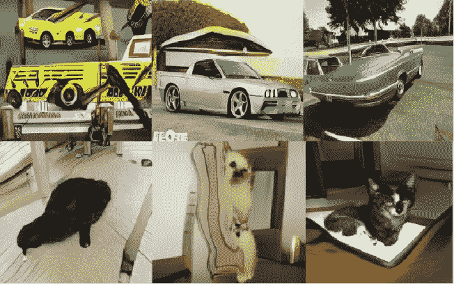**

**StyleGAN 2 生成的汽车和猫的精选示例，[来源](https://arxiv.org/pdf/1912.04958.pdf) arXiv:1912.04958v2 [7]**

# **表格甘斯**

**由于不平凡的数据分布和高度的对象类型多样性，对于 GANs 来说，即使是生成猫狗也是一项繁重的任务。除此之外，图像背景也变得很重要，这是 GANs 通常不能产生的。
因此，我一直在想 GANs 在表格数据上能达到什么样的效果。可惜文章不多。接下来的两篇文章似乎是最有希望的。**

## **[TGAN:使用生成对抗网络合成表格数据](https://arxiv.org/pdf/1811.11264.pdf) arXiv:1811.11264v1 [3]**

**首先，他们提出了几个问题，为什么生成表格数据有自己的挑战:**

*   **各种数据类型(整数、小数、类别、时间、文本)**
*   **不同形状的分布(多模态、长尾、非高斯……)**
*   **稀疏的一次性编码向量和高度不平衡的分类列。**

****任务形式化****

**假设表 **T** 包含 **n_c** 连续变量和 **n_d** 离散(分类)变量，每一行都是 **C** 向量。这些变量具有未知的联合分布**P。**每一行都是从 **P** 中独立采样的。目标是训练生成模型**M。M**应生成新的合成表 **T_synth** ，其分布类似于 **P.** 在 **T_synth** 上学习的机器学习模型应在真实测试台上 **T_test** 上达到类似的精度，在 **T.** 上训练的模型也是如此**

****预处理数值变量。"**使用*tanh*"*【3】，神经网络可以有效地生成以(1，1)为中心的分布值。然而，他们表明，网络不能产生多模态数据合适的数据。因此，他们通过使用和训练高斯混合模型( **GMM** )对每个 **C** 使用 **m** (m=5)个分量来聚类一个数值变量。***

***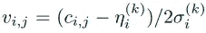***

***使用平均值和标准偏差的 GMM 归一化。[来源](https://arxiv.org/pdf/1811.11264.pdf) arXiv:1811.11264v1 [3]***

***最后，使用 GMM 归一化 **C** 得到 **V.** 此外，他们计算 **C** 来自每个 **m** 高斯分布的概率作为向量 **U.*****

*****预处理分类变量。**由于基数通常较低，他们发现可以使用 softmax 直接生成概率分布。但是必须将分类变量转换为带有噪声的一位热编码表示，将二进制变量转换为二进制变量***

***前置后，它们将带有 **n_c + n_d** 列的 **T** 转换为 **V，U，D** 向量。该矢量是发生器的输出，也是 GAN 中鉴别器的输入。“甘没有获得的参数”[3]。***

*****发电机*****

***他们分两步生成一个数字变量。首先，生成值标量 **V** ，然后生成聚类向量 **U** ，最后应用 **tanh** 。使用 **softmax 在所有可能标签上生成概率分布的分类特征。**使用注意机制生成所需的行 LSTM。为 LSTM 在每一步中输入的是随机变量 ***z、*加权上下文向量**与**先前隐藏的**和**嵌入向量。*****

*****鉴别器*****

***使用具有 LeakyReLU 和 BatchNorm 的多层感知机(MLP)。第一层使用中的级联向量 **(V，U，D)** ，具有来自 LSTM 的特征向量的小批量分集。损失函数是具有和序数对数损失函数的输入变量的 KL 散度项。***

***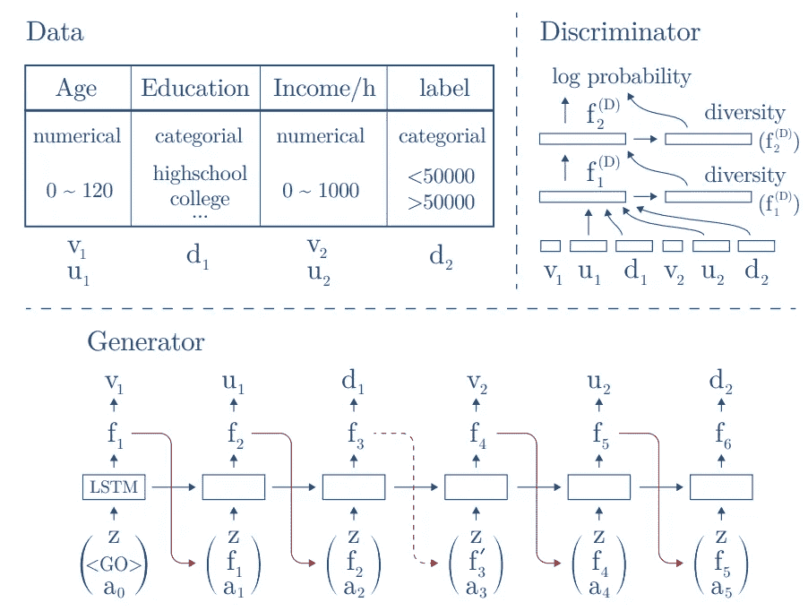***

***使用 TGAN 生成简单人口普查表的示例。生成器逐个生成 T 个特征。鉴别器将所有特征连接在一起。然后使用具有 LeakyReLU 的多层感知器(MLP)来区分真假数据。[来源](https://arxiv.org/pdf/1811.11264.pdf) arXiv:1811.11264v1 [3]***

*****结果*****

***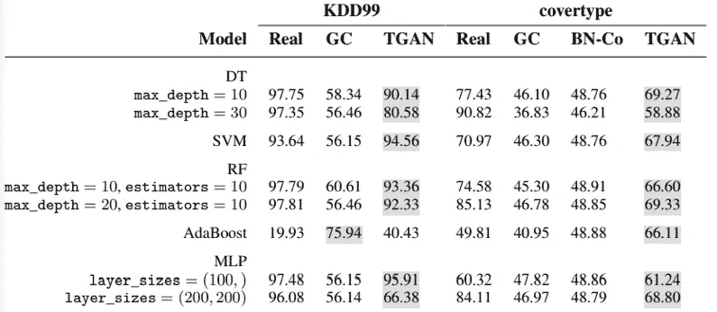***

***在真实和合成训练集上训练的机器学习模型的准确性。(贝叶斯网络，高斯连接函数)。[来源](https://arxiv.org/pdf/1811.11264.pdf) arXiv:1811.11264v1 [3]***

***他们在两个数据集 **KDD99** 和 **covertype 上评估模型。**出于某种原因，他们使用了没有 boosting 的弱模型(xgboost 等)。无论如何，TGAN 表现得相当好和稳健，胜过贝叶斯网络。真实数据和合成数据之间的平均性能差距为 5.7%。***

## ***[使用条件 GAN 对表格数据建模](https://arxiv.org/pdf/1907.00503.pdf)(CTGAN)arXiv:1907.00503 v2[4]***

***与以前的 TGAN 相比，主要的改进是应用模式特定的归一化来克服非高斯和多峰分布。然后使用条件生成器和抽样训练来处理不平衡的离散列。***

*****任务形式化*****

***最初的数据与在 TGAN 时一样。然而，它们解决不同的问题。***

*   *****健身的可能性**。 **T_syn** 中的列是否遵循与 **T_train** 相同的联合分布***
*   *****机器学习功效。**当训练模型使用其他列作为特征来预测一列时，从 **T_syn** 学习的这种模型在 **T_test** 上能否达到与在 **T_train** 上学习的模型相似的性能***

*****预处理*****

*****离散**列的预处理保持不变。***

***对于**连续**变量，使用变分高斯混合模型( **VGM** )。它首先估计模式的数量 **m** ，然后拟合高斯混合。在我们将初始向量 **C** 归一化后，它几乎和在 TGAN 时一样，但是它的值在每种模式下都是归一化的。模式表示为一热向量斗鱼([0，0，.., 1, 0]).Alpha 是 **C** 的归一化值。***

***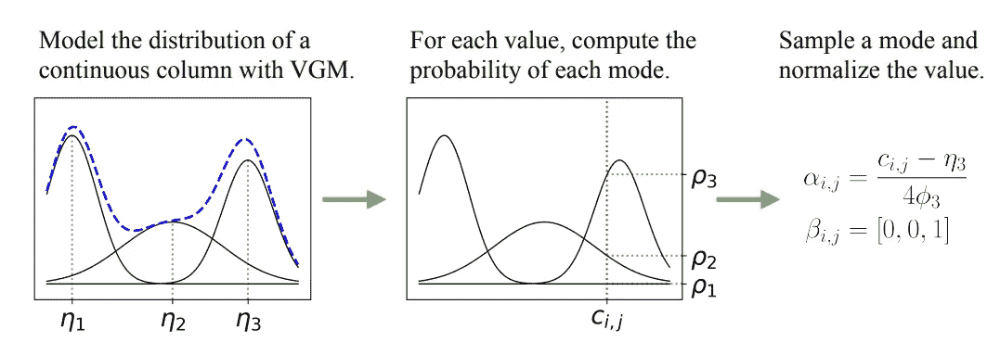***

***特定于模式的规范化示例。来源 arXiv:1907.00503v2 [4]***

***因此，我们将初始行表示为“一键”离散列的串联，并具有上面讨论的连续变量的表示:***

***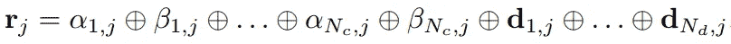***

***预处理行。[来源](https://arxiv.org/pdf/1907.00503.pdf) arXiv:1907.00503v2 [4]***

*****培训*****

***“最终解决方案由三个关键要素组成，即:条件向量、发电机损耗和采样训练法”[4]。***

***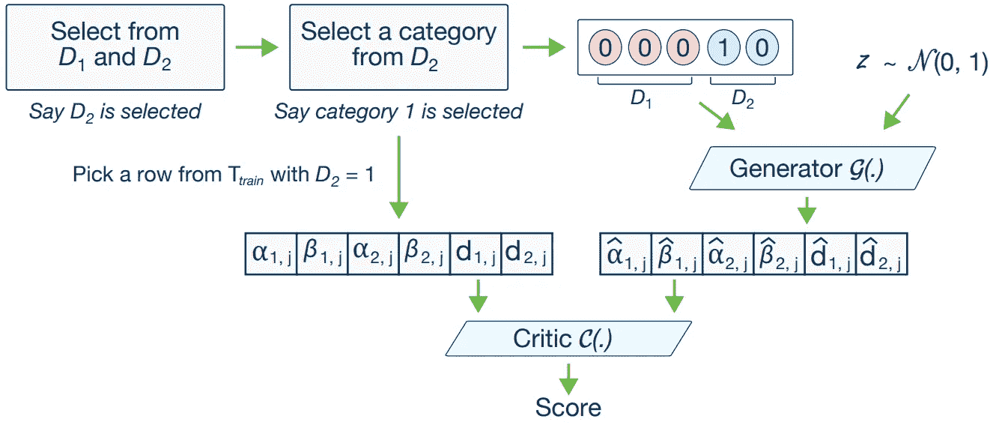***

***CTGAN 模型。条件生成器可以根据离散列之一生成合成行。通过采样训练，根据每个类别的对数频率对 **cond** 和训练数据进行采样，因此 CTGAN 可以均匀地探索所有可能的离散值。来源 arXiv:1907.00503v2 [4]***

*****条件向量*****

***表示所有离散列的串联“一键”向量，但仅指定了一个选定的类别。例如，对于两个离散的列，D1 = {1，2，3}和 D2 = {1，2}，条件(D2 = 1)由掩码向量 m1 = [0，0，0]和 m2 = [1，0]表示；所以 cond = [0，0，0，1，0]" [4]。***

*****发电机损耗*****

***“在训练期间，条件生成器可以自由产生任何一组独热离散向量”[4]。但是他们强制条件生成器产生 **d_i (** 生成的离散独热列) **= m_i** (掩码向量)是通过增加它们之间的交叉熵来惩罚它的损失，在批处理的所有实例上平均。***

*****抽样训练*****

***“具体来说，目标是以这样一种方式有效地进行重新采样，即在训练过程中对离散属性的所有类别进行均匀采样，从而在测试过程中获得真实的数据分布”[4]。***

***换句话说，条件生成器产生的输出必须由评价者评估，评价者估计学习的条件分布 **P_G(row|cond)** 和真实数据上的条件分布 **P(row|cond)** 之间的距离。“真实训练数据的采样和 **cond** vector 的构造应符合帮助评论家估计距离的要求”[4]。对 **cond** 向量和训练数据进行适当采样可以帮助模型均匀地探索离散列中所有可能的值。***

***模型结构如下，与 TGAN 相反，没有 LSTM 层。用梯度惩罚的 WGAN 损失训练。***

***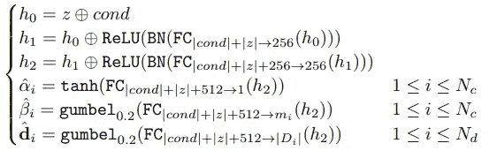***

***发电机。[来源](https://arxiv.org/pdf/1907.00503.pdf) arXiv:1907.00503v2 [4]***

***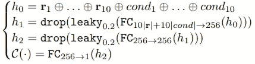***

***鉴别器。[来源](https://arxiv.org/pdf/1907.00503.pdf) arXiv:1907.00503v2 [4]***

***此外，他们提出了一个基于变分自动编码器(VAE)的模型，但这超出了本文的范围。***

*****结果*****

***提出的网络 CTGAN 和 TVAE 优于其他方法。正如他们所说，TVAE 在一些情况下优于 CTGAN，但 GAN 确实有几个有利的属性。与 TVAE 不同，GANs 中的生成器在整个训练过程中无法访问真实数据。***

***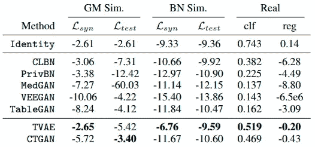***

***基准结果超过三组实验，即高斯混合模拟数据(GM Sim。)，贝叶斯网络模拟数据(BN Sim。)，以及真实数据。他们报告每个指标的平均值。对于真实数据集(f1 等)。来源 arXiv:1907.00503v2 [4]***

***此外，他们在 [*GitHub*](https://github.com/sdv-dev/CTGAN) 上公布了源代码，稍加修改后将在本文中进一步使用。***

# ***应用 CTGAN 生成用于增加列车(半监督)的数据***

***这对我来说是一种香草梦。在简单了解了 GAN 的最新发展后，我一直在思考如何将它应用到我日常工作中解决的一些问题上。这是我的想法。***

*****任务形式化*****

***假设我们有 **T_train** 和 **T_test** (分别为 train 和 test set)。我们需要在 **T_train** 上训练模型，在**T _ test**上进行预测。但是，我们将通过由 GAN 生成新数据来增加训练，在某种程度上类似于 **T_test** ，而不使用它的地面真实标签。***

*****实验设计*****

***假设我们有 **T_train** 和 **T_test** (分别为 train 和 test set)。 **T_train** 的尺寸较小，可能有不同的数据分布。首先我们在 **T_train** 上用地面真值标签 *step 1* 训练 CTGAN，然后生成附加数据**T _ synth**(*step 2*)**。**其次，我们在串联的 **T_train** 和 **T_synth** (目标设置为 0)与 **T_test** (目标设置为 1) ( *步骤 3 & 4* ) **上以对抗的方式训练 boosting。**目标是应用新训练的对抗性增强来获得更像 **T_test 的行。**注意——原始地面真相标签不用于对抗训练。因此，我们从 **T_train** 和 **T_synth** 中取出按照与 **T_test** 的对应关系排序的顶行(步骤 *5 & 6* )。最后**，**对它们进行新的增压，并在 **T_test 上检查结果。*****

***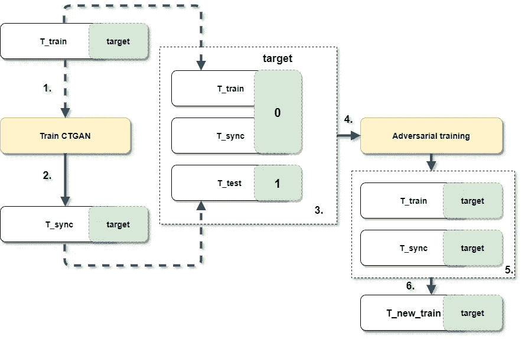***

***实验设计和工作流程***

***当然，出于基准测试的目的，我们将测试没有这些技巧和另一个原始管道但没有 CTGAN 的有序训练(在步骤 3 中，我们不会使用 **T_sync** )。***

*****代码*****

***实验代码和结果发布为 Github repo [此处](https://github.com/Diyago/GAN-for-tabular-data)。管道和数据准备基于[基准分类编码器的](/benchmarking-categorical-encoders-9c322bd77ee8)文章及其[报告](https://github.com/DenisVorotyntsev/CategoricalEncodingBenchmark)。我们将遵循几乎相同的流水线，但是为了速度，只选择了单一验证和 Catboost 编码器。由于 GPU 内存不足，一些数据集被跳过。***

*****数据集*****

***所有数据集来自不同的领域。他们有不同数量的观察，几个分类和数字特征。所有数据集的目标都是二元分类。数据集的预处理很简单:从数据集中删除所有基于时间的列。其余的列要么是分类的，要么是数字的。另外，在对训练结果进行采样的同时 **T_train — 5%、10%、25%、50%、75%*****

***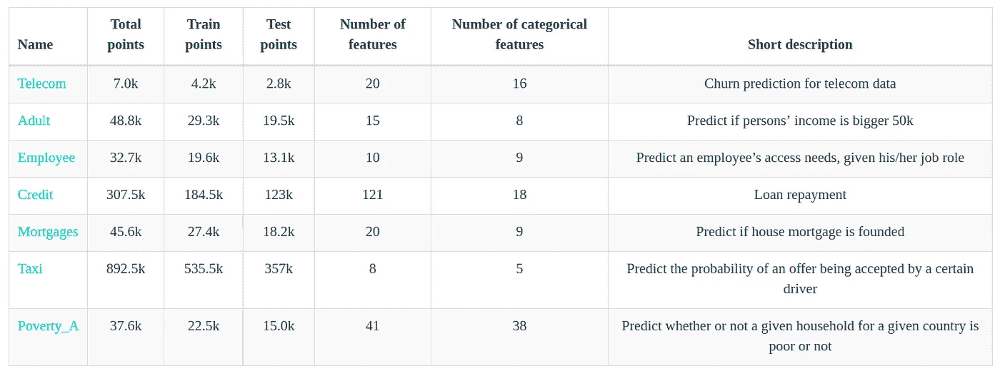***

***数据集属性***

## ***结果***

***从第一眼的角度来看，就度量和稳定性(std)而言，GAN 显示出最差的结果。然而，对初始训练进行采样，然后应用对抗训练，我们可以获得最佳的度量结果和稳定性( **sample_original** )。为了确定最佳采样策略，对每个数据集的 ROC AUC 评分进行了缩放(最小-最大缩放),然后在数据集之间进行平均。***

***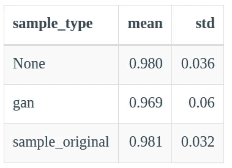***

***不同的采样结果，平均值越高越好(ROC AUC)，标准差越低越好(100% —每个数据集的最大 ROC AUC)***

***我们可以看到 GAN 在两个数据集上的表现优于其他采样类型。而在 7 个数据集的 3 个中，来自原始数据的采样优于其他方法。当然也没有太大区别。但是这些类型的取样可能是一种选择。当然也没有太大区别。但是这些类型的取样可能是一种选择。***

***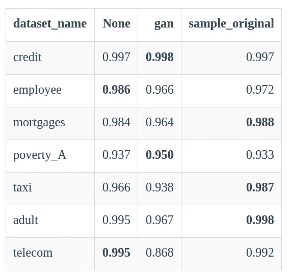***

***不同数据集的采样结果，越高越好(100% —每个数据集的最大 ROC AUC)***

***让我们定义 same_target_prop 等于 1，那么训练和测试的目标比率相差不超过 5%。因此，我们在培训和测试中有几乎相同的目标比率*无*和*样本 _ 原始*更好。然而，gan 的表现开始明显好于目标分布变化。***

***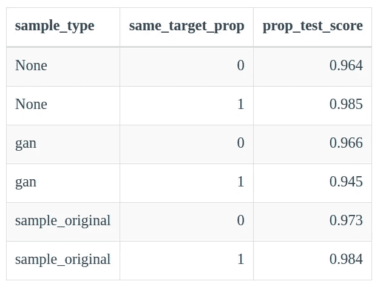***

***same_target_prop 等于 1，则训练和测试的目标比率仅相差 5%***

# ***参考***

***[1]乔纳森·惠。甘— [什么是生成性敌对网络甘？](https://medium.com/@jonathan_hui/gan-whats-generative-adversarial-networks-and-its-application-f39ed278ef09) (2018)，中条***

***[2]伊恩·古德菲勒、让·普热-阿巴迪、迈赫迪·米尔扎、徐炳、戴维·沃德-法利、谢尔吉尔·奥泽尔、亚伦·库维尔、约舒阿·本吉奥。生成性对抗网络(2014)。arXiv:1406.2661***

***[3]徐磊 LIDS，Kalyan Veeramachaneni。使用生成式对抗网络合成表格数据(2018)。arXiv:1811.11264v1 [cs。LG]***

***[4]徐磊、玛丽亚·斯科拉利杜、阿尔弗雷多·单面山-因方特、卡莉安·维拉马查涅尼。使用条件 GAN 对表格数据建模(2019)。arXiv:1907.00503v2 [cs。LG]***

***[5]丹尼斯·沃罗廷采夫。[基准分类编码器](/benchmarking-categorical-encoders-9c322bd77ee8) (2019)。中等职位***

***[6]英萨夫·阿什拉波夫。[甘换表](https://github.com/Diyago/GAN-for-tabular-data) (2020)。Github 仓库。***

***[7] Tero Karras、Samuli Laine、Miika Aittala、Janne Hellsten、Jaakko Lehtinen、Timo Aila。StyleGAN(2019)arXiv:1912.04958 v2[cs。简历]***

***[8] Insaf Ashrapov，机器与深度学习博客，【https://diyago.github.io/ ***